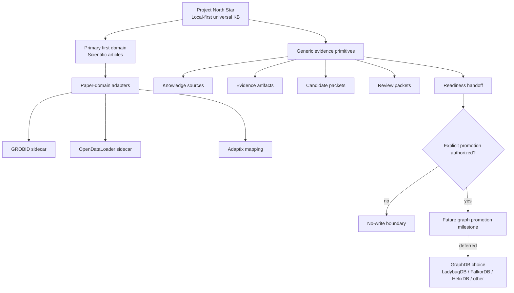
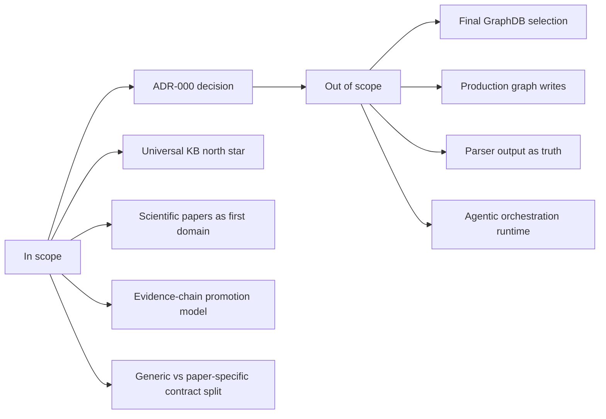
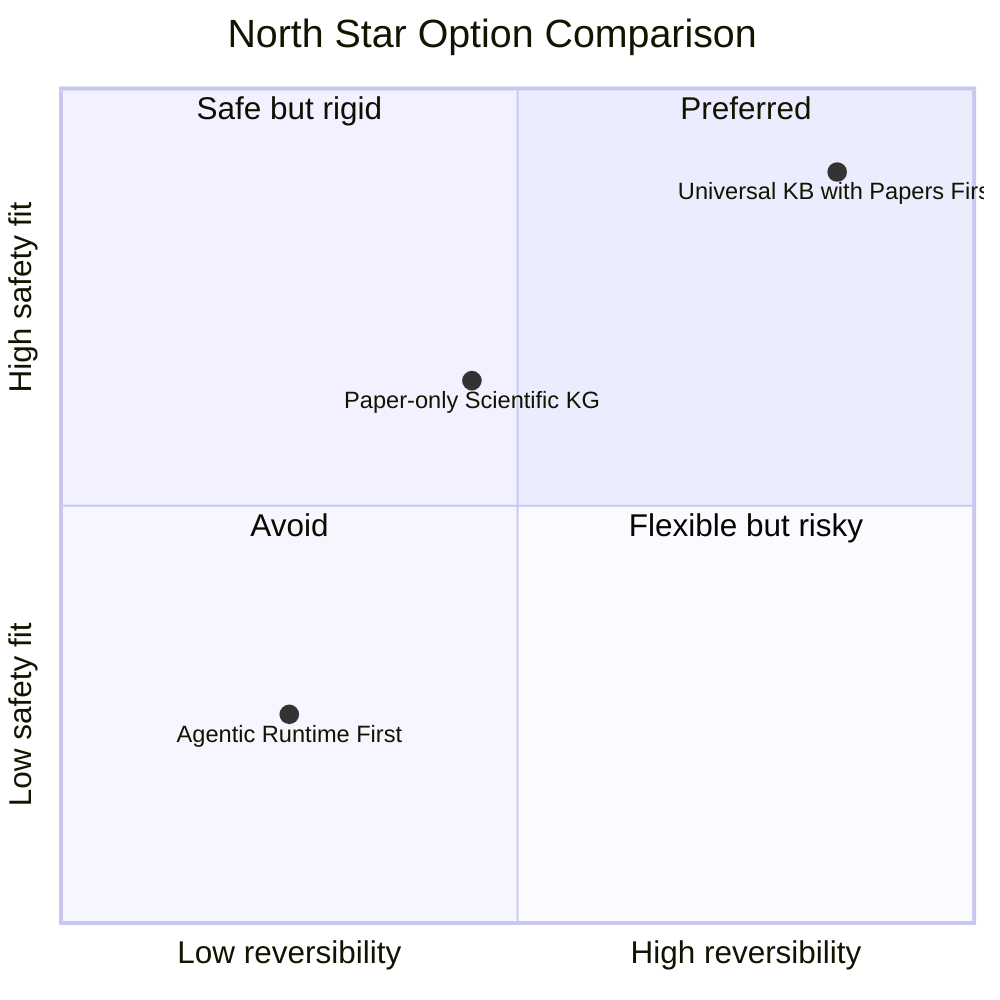
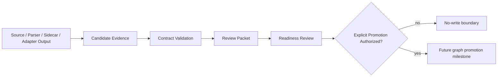
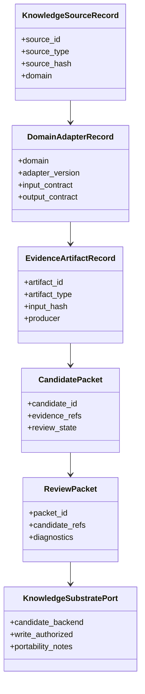

# ADR-000: Universal KB North Star

**Status:** Accepted  
**Date:** 2026-06-06  
**Deciders:** human  
**Milestone:** M034-kuei9y  
**Scope:** universal-kb / evidence-pipeline / safety / contracts  
**Binding Level:** binding  
**Revisable:** yes, if future requirements explicitly narrow the project back to scientific papers only or broaden it with validated non-paper domains.

## 0. One-line Decision

> We will frame daily-archive as a local-first universal knowledge base built from durable, traceable evidence chains, with scientific articles as the primary first domain and proving ground.  
> We will not frame the project as only a PDF parser, only a scientific-paper KG, only a RAG app, or a direct parser-to-GraphDB pipeline.

## 1. Context

daily-archive began with arXiv-oriented ingestion and has accumulated strong scientific-paper safety boundaries: catalog records, source acquisition, loader evidence, parser/conversion diagnostics, chunk/evidence packages, graph-readiness review packets, and no-write import boundaries. M033 added bounded research over GROBID, OpenDataLoader, Adaptix, and quant-mind, showing that external tools can provide useful sidecar evidence but also introduce latency, backend/cache dependencies, schema mismatch, parser quality uncertainty, and reliability risk.

The user clarified two architectural corrections before implementation continues:

- the future GraphDB is not yet selected; LadybugDB is an early/experimental local graph-vector substrate, not the final production choice;
- the broader direction is a universal knowledge base, with scientific articles remaining the primary current domain rather than the only intended content type.

S01 audited all current GSD requirements and decisions before this ADR. It classified 128 records: 35 consistent, 78 historical-scope-only, and 15 needing clarification. The clarifications mostly concern paper-domain scope, LadybugDB finality risk, and broad helper/agent wording. This ADR establishes the frame that later ADRs, PRD, contracts, and roadmap gates must use to resolve those clarifications.

### Context Map



## 2. Decision

We will treat daily-archive as a **local-first universal knowledge-base architecture** whose core capability is building traceable evidence chains from local or bounded sources before any knowledge substrate promotion. Scientific articles remain the primary first domain because they stress the system with citations, references, figures, tables, equations, sections, source spans, and review burden.

We will separate generic knowledge-base primitives from scientific-paper-specific adapters:

- generic primitives: `KnowledgeSourceRecord`, `DomainAdapterRecord`, `EvidenceArtifactRecord`, `ProcessingJob`, `DependencyRecord`, `FailureRecord`, `CandidatePacket`, `ReviewPacket`, `GraphReadinessHandoff`, `KnowledgeSubstratePort`, and `SafetyFlags`;
- scientific-paper specializations: `ArticleRecord`, `PaperSourceRecord`, `ArticleJob`, `SidecarJob`, GROBID/OpenDataLoader/Adaptix outputs, paper candidate packets, and paper graph-readiness review packets.

This decision authorizes documentation and prototype planning around generic evidence orchestration with paper-domain first adapters. It does **not** authorize production GraphDB selection, graph import, LadybugDB/FalkorDB/HelixDB writes, parser output as accepted truth, or agentic orchestration.

### Decision Boundary



## 3. Applies To

This decision applies to:

- generic knowledge-base architecture;
- scientific-paper first-domain implementation;
- sidecar/evidence pipeline planning;
- graph substrate decision planning;
- review/readiness gates;
- future agent/helper workers;
- M034 ADR, PRD, requirement, contract, and roadmap artifacts.

It does not erase historical scientific-paper decisions. Instead, it classifies them as either first-domain constraints, historical-scope evidence, or inputs to future generalized contracts.

## 4. Requirements and Decisions Impacted

### Requirements

| Requirement | Impact | Notes |
|---|---|---|
| R024 | constrains | Scientific KG staged validation remains the first-domain proving path, not the only future KB domain. |
| R027 | constrains | Paper conversion/chunk graph-readiness quality remains binding for scientific-paper adapters. |
| R029 | constrains | Import-ready chunk package remains paper-domain specific until generalized. |
| R040 | supports | New infrastructure still requires research/probe/safety-wrap before activation. |
| R050 | supports | Article-structure artifact CLI is a paper-domain adapter capability, not direct KG import. |
| R054 | supports | Durable lazy sidecar pipeline becomes one evidence-orchestration mechanism. |
| R055 | supports | Failure visibility is required for universal evidence orchestration. |
| R056 | constrains | Parser outputs remain candidate evidence only. |
| R057 | supports | Roadmap must include architecture gates before irreversible implementation. |
| R058 | supersedes/narrows | Reframe from scientific-paper evidence chains only to universal KB with scientific articles first. |
| R059 | constrains | GraphDB selection remains open. |
| R060 | supports | Directly states the universal KB with scientific articles as primary domain. |
| R061 | supports | Requires R/D consistency audit before closeout. |

### Decisions

| Decision | Impact | Notes |
|---|---|---|
| D061 | narrows | Vendor GROBID/OpenDataLoader remain bounded research inputs, not production parser adoption. |
| D062 | narrows | External parser research is paper-domain evidence within broader KB architecture. |
| D063 | supports | Durable lazy async sidecar pipeline before agents supports the evidence-chain architecture. |
| D064 | supports | Agent boundary preserves deterministic orchestration first. |
| D065 | constrains | GraphDB selection is explicitly deferred. |
| D066 | supports | User-directed universal KB direction is adopted here. |
| D067 | constrains | This ADR follows the Mermaid-assisted enhanced ADR template. |

## 5. Options Considered

### Option A — Paper-only Scientific KG

| Dimension | Assessment |
|---|---|
| Local-first fit | High |
| Safety fit | Medium |
| Complexity | Medium |
| Reversibility | Medium |
| GraphDB portability | Medium |
| Agent/tooling dependency | Low |
| Human review compatibility | High |

**Pros**
- Directly matches much historical work.
- Keeps contracts narrower.
- Reduces immediate abstraction burden.

**Cons**
- Overfits future architecture to arXiv/scientific-paper details.
- Hides the already-emerging generic evidence and knowledge-card/tree direction.
- Makes future non-paper domains harder to add cleanly.

### Option B — Universal KB with Scientific Papers as First Domain

| Dimension | Assessment |
|---|---|
| Local-first fit | High |
| Safety fit | High |
| Complexity | Medium |
| Reversibility | High |
| GraphDB portability | High |
| Agent/tooling dependency | Low |
| Human review compatibility | High |

**Pros**
- Preserves scientific papers as the main validation domain.
- Avoids paper-only overfitting.
- Aligns with quant-mind-inspired tree/card/provenance patterns without adopting quant-mind runtime.
- Makes GraphDB portability easier by introducing `KnowledgeSubstratePort`.

**Cons**
- Requires more careful contract layering.
- Future agents may over-generalize unless paper-domain gates remain explicit.

### Option C — Agentic Universal Parser / RAG Runtime First

| Dimension | Assessment |
|---|---|
| Local-first fit | Low |
| Safety fit | Low |
| Complexity | High |
| Reversibility | Low |
| GraphDB portability | Medium |
| Agent/tooling dependency | High |
| Human review compatibility | Medium |

**Pros**
- Looks closer to broad quant-mind-style workflows.
- Could eventually help summarization/review/triage.

**Cons**
- Introduces nondeterminism before durable queue/status/tool contracts exist.
- Risks parser/LLM output becoming truth.
- Adds API, cost, rate-limit, and reliability failure modes too early.

### Option Comparison Snapshot



## 6. Trade-off Analysis

| Trade-off | Chosen side | Why |
|---|---|---|
| Universal KB vs paper-only | Universal KB with papers first | Avoids overfitting while preserving the hardest current domain as proving ground. |
| Deterministic evidence chain vs agent runtime first | Deterministic evidence chain | Current risk is reliability, provenance, and reviewability, not lack of autonomy. |
| GraphDB now vs deferred | Deferred | License, locality, performance, and scalability tradeoffs are unresolved. |
| Generic contracts vs one-off scripts | Generic primitives plus paper adapters | Keeps future domains possible while allowing concrete paper-domain validation. |
| Parser output vs reviewed evidence | Reviewed evidence | Parser success is not semantic truth or graph readiness. |

The chosen option is slightly more complex than paper-only framing, but it is more reversible and better aligned with the user's clarified direction. It also prevents premature GraphDB lock-in and agentic drift.

## 7. Consequences

### Positive

- Future ADRs can distinguish generic KB primitives from scientific-paper adapters.
- GraphDB selection remains open and testable.
- Sidecar pipeline work becomes evidence infrastructure rather than parser adoption.
- Historical paper-domain requirements remain useful as first-domain validation constraints.

### Negative

- Contracts must be layered more carefully.
- Some older R/D wording needs clarification rather than direct reuse.
- Future implementation milestones must resist over-generalizing before paper-domain quality is proven.

### New obligations

- S03 must draft a deferred GraphDB selection ADR.
- S04/S05 must define generic contracts and paper-specific specializations.
- S06 must route remaining S01 audit clarifications.
- Future GraphDB work needs a comparison matrix before final selection.

### What becomes harder

- Simpler paper-only scripts may need adapter boundaries.
- Direct LadybugDB assumptions must be replaced by a substrate-port mindset.
- ADRs must explicitly state whether they are generic or paper-domain-specific.

## 8. Safety and Non-Authorization

This ADR does **not** authorize:

- production graph import;
- final GraphDB selection;
- LadybugDB/FalkorDB/HelixDB writes;
- parser output as graph-ready truth;
- agentic orchestration;
- bypassing validators or review packets.

Required safety defaults:

```text
graph_import_allowed=false
graphdb_written=false
ladybugdb_written=false
production_import_attempted=false
import_eligible=false
```

### Safety Gate



## 9. Contract Impact

Affected generic contracts:

- `KnowledgeSourceRecord`
- `DomainAdapterRecord`
- `EvidenceArtifactRecord`
- `ProcessingJob`
- `DependencyRecord`
- `FailureRecord`
- `CandidatePacket`
- `ReviewPacket`
- `GraphReadinessHandoff`
- `KnowledgeSubstratePort`
- `SafetyFlags`

Affected paper-domain specializations:

- `ArticleRecord`
- `PaperSourceRecord`
- `ArticleJob`
- `SidecarJob`
- `PaperCandidatePacket`
- `PaperReviewPacket`
- GROBID / OpenDataLoader / Adaptix sidecar output contracts

### Contract Relationship Map



## 10. Validation / Evidence Required

This ADR is accepted as a framing decision for M034. It must be validated by downstream documentation artifacts:

- S03 ADRs must reference this ADR when deferring GraphDB selection and defining sidecar/agent boundaries.
- S04 PRD must separate generic KB requirements from paper-domain first-adapter requirements.
- S05 contracts must include generic primitives and paper-specific specializations.
- S06 roadmap/conflict plan must route S01 clarification items against this ADR.
- S07 reader test must confirm a future human/LLM can identify the universal-KB north star and safety non-authorizations.

## 11. Open Questions

| Question | Owner | Needed by | Blocking? |
|---|---|---|---|
| Which GraphDB best fits license/locality/performance/scale? | future GraphDB ADR | before production graph substrate selection | yes for final graph choice, no for M034 docs |
| Which generic contracts should become code first? | future implementation milestone | before prototype | yes for implementation |
| Which non-paper domain should be second after scientific articles? | future planning | after paper-domain evidence pipeline stabilizes | no |
| How should optional LLM/agent helpers enter safely? | future agent-boundary ADR/prototype | after deterministic tools/contracts exist | no for M034, yes for agent runtime |

## 12. Follow-up Actions

- [ ] S03 must draft deferred GraphDB selection ADR.
- [ ] S03 must draft agent-boundary and sidecar-candidate ADRs under this north-star frame.
- [ ] S04 must separate generic and paper-specific requirements in the PRD.
- [ ] S05 must define `KnowledgeSubstratePort` and safety flags without hardcoding LadybugDB as final.
- [ ] S06 must route all S01 `needs-clarification` findings.

## 13. Supersedes / Superseded By

### Supersedes

- Narrows R058 wording from scientific-paper-only evidence chains to universal KB with scientific articles as first domain.
- Narrows any historical LadybugDB wording to early/experimental substrate unless a future GraphDB ADR selects it.

### Superseded By

- Empty until future ADR.

## 14. LLM Reading Notes

This section is intentionally explicit for future agents.

- Binding decision:
  - Treat daily-archive as a local-first universal knowledge base.
  - Treat scientific articles as the primary first domain and validation path.
  - Separate generic KB primitives from paper-specific adapters.
- Do not infer:
  - Do not infer final GraphDB selection.
  - Do not infer LadybugDB production adoption.
  - Do not infer parser output is graph-ready.
  - Do not infer agents may orchestrate the pipeline now.
- Safe next action:
  - Draft S03 ADRs using this frame and the S01 audit routes.
- Blocked until:
  - Production graph writes remain blocked until a future explicit graph promotion/import milestone.
  - Final GraphDB selection remains blocked until a dedicated comparison ADR/milestone.
