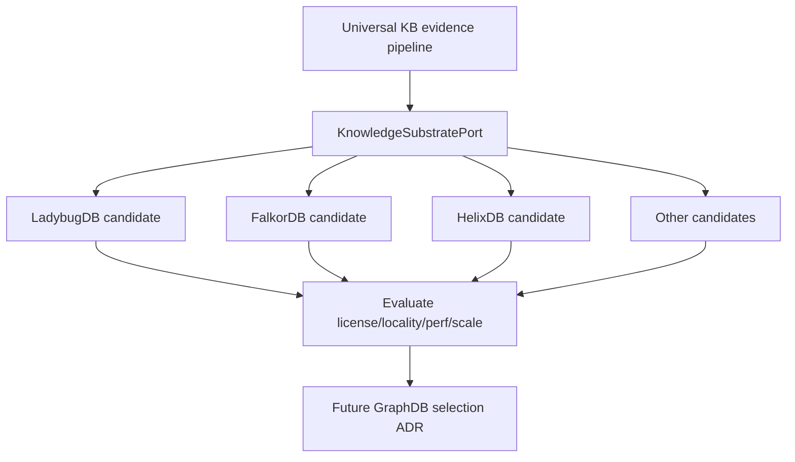
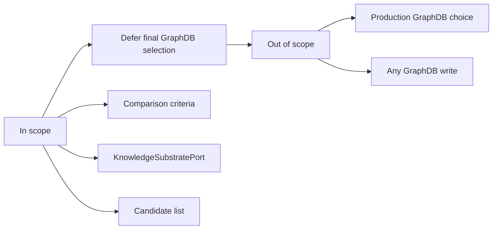

# ADR-002: Defer Final GraphDB Selection

**Status:** Deferred  
**Date:** 2026-06-06  
**Deciders:** human  
**Milestone:** M034-kuei9y  
**Scope:** graphdb / universal-kb / contracts  
**Binding Level:** binding non-lock-in  
**Revisable:** yes, only after a dedicated GraphDB comparison ADR or milestone evaluates candidates with evidence.

## 0. One-line Decision

> We will keep the final knowledge graph database choice open pending a dedicated comparison of LadybugDB, FalkorDB, HelixDB, and other viable local-first candidates.  
> We will not treat LadybugDB, FalkorDB, HelixDB, or any other GraphDB as the final production substrate in M034.

## 1. Context

Earlier daily-archive milestones used LadybugDB as an early local graph-vector foundation and no-write boundary target. The user clarified during M034 planning that the best GraphDB remains unclear across license, locality, performance, developer ergonomics, graph-vector support, and future scalability. S01 flagged LadybugDB references across existing requirements and decisions; those references are historical or candidate-substrate language unless a future GraphDB ADR selects one.

### Context Map



## 2. Decision

We will design M034 contracts around `KnowledgeSubstratePort` rather than a concrete GraphDB. LadybugDB remains a historical/experimental candidate and may remain useful for fixtures or no-write rehearsals, but M034 does not select it as the durable production substrate.

This decision authorizes a future comparison matrix and GraphDB evaluation milestone. It does not authorize GraphDB writes or final backend selection.

### Decision Boundary



## 3. Applies To

This decision applies to generic KB contracts, graph-readiness handoff, no-write import rehearsals, future GraphDB evaluation, and all ADRs that mention LadybugDB/FalkorDB/HelixDB.

## 4. Requirements and Decisions Impacted

### Requirements

| Requirement | Impact | Notes |
|---|---|---|
| R019 | constrains | Hybrid retrieval evidence remains valid but must not assume a final graph substrate. |
| R056 | constrains | Sidecar outputs remain candidates before any graph substrate. |
| R059 | supports | Directly requires not locking GraphDB to LadybugDB. |
| R061 | supports | S01 audit flagged graph-substrate wording for reconciliation. |

### Decisions

| Decision | Impact | Notes |
|---|---|---|
| D012 | narrows | Historical LadybugDB/KG import-model language is not final GraphDB selection. |
| D061 | narrows | External parser research does not imply LadybugDB adoption. |
| D065 | supports | Directly records GraphDB choice as open. |
| D066 | supports | Universal KB direction requires substrate portability. |

## 5. Options Considered

### Option A — Select LadybugDB now

| Dimension | Assessment |
|---|---|
| Local-first fit | High |
| Safety fit | Medium |
| Complexity | Low |
| Reversibility | Low |
| GraphDB portability | Low |
| Agent/tooling dependency | Low |
| Human review compatibility | Medium |

**Pros**
- Builds on prior experiments.
- Reduces immediate uncertainty.

**Cons**
- Prematurely locks licensing/performance/scale assumptions.
- May overfit contracts to one backend.

### Option B — Defer final GraphDB selection

| Dimension | Assessment |
|---|---|
| Local-first fit | High |
| Safety fit | High |
| Complexity | Medium |
| Reversibility | High |
| GraphDB portability | High |
| Agent/tooling dependency | Low |
| Human review compatibility | High |

**Pros**
- Preserves portability.
- Allows evidence-based comparison.
- Avoids coupling sidecar pipeline to storage choice.

**Cons**
- Requires an explicit port/adapter layer.
- Delays production substrate decision.

## 6. Trade-off Analysis

| Trade-off | Chosen side | Why |
|---|---|---|
| Certainty now vs portability | Portability | Current evidence is insufficient for final substrate selection. |
| One backend contracts vs substrate port | Substrate port | Universal KB should not hardcode one graph backend. |
| Prototype speed vs future scale | Future scale | License/locality/performance/scale remain unresolved. |

## 7. Consequences

### Positive

- Prevents premature LadybugDB finality.
- Forces explicit GraphDB evaluation criteria.
- Keeps contracts portable.

### Negative

- Adds `KnowledgeSubstratePort` design work.
- Future implementation cannot rely on backend-specific write semantics yet.

### New obligations

- Future GraphDB ADR must compare LadybugDB, FalkorDB, HelixDB, and other candidates.
- Contracts must distinguish `graphdb_written=false` from backend-specific flags such as `ladybugdb_written=false`.

### What becomes harder

- Direct use of backend-specific query/write APIs must be delayed or wrapped.

## 8. Safety and Non-Authorization

This ADR does **not** authorize:

- production graph import;
- final GraphDB selection;
- LadybugDB/FalkorDB/HelixDB writes;
- parser output as graph-ready truth;
- agentic orchestration;
- bypassing validators or review packets.

Required safety defaults:

```text
graph_import_allowed=false
graphdb_written=false
ladybugdb_written=false
production_import_attempted=false
import_eligible=false
```

## 9. Contract Impact

Affected contracts:

- `KnowledgeSubstratePort`
- `GraphReadinessHandoff`
- `SafetyFlags`
- `CandidatePacket`
- `ReviewPacket`

Required contract changes or drafts:

- Add backend-neutral `graphdb_written=false`.
- Preserve backend-specific historical compatibility flags such as `ladybugdb_written=false`.
- Avoid backend-specific write contracts until a GraphDB ADR selects a backend.

## 10. Validation / Evidence Required

A future GraphDB evaluation must provide:

- license comparison;
- local deployment/probe notes;
- graph-vector capability review;
- query/model ergonomics review;
- performance smoke benchmark;
- export/migration strategy;
- go/no-go ADR.

## 11. Open Questions

| Question | Owner | Needed by | Blocking? |
|---|---|---|---|
| Which GraphDB best fits universal KB requirements? | future GraphDB evaluation milestone | before production graph substrate | yes |
| Is graph-vector support required in the same DB or via composition? | future GraphDB ADR | before substrate selection | yes |
| What export format preserves portability? | future contracts milestone | before graph writes | yes |

## 12. Follow-up Actions

- [ ] S05 contracts must define `KnowledgeSubstratePort`.
- [ ] S06 roadmap must include GraphDB evaluation gate.
- [ ] Future milestone must compare LadybugDB, FalkorDB, HelixDB, and other candidates.

## 13. Supersedes / Superseded By

### Supersedes

- Narrows historical LadybugDB assumptions in earlier decisions to early/candidate substrate status.

### Superseded By

- Empty until future GraphDB selection ADR.

## 14. LLM Reading Notes

- Binding decision:
  - Do not lock GraphDB choice in M034.
  - Use backend-neutral `KnowledgeSubstratePort` language.
- Do not infer:
  - Do not infer LadybugDB is rejected.
  - Do not infer LadybugDB is selected.
  - Do not infer any GraphDB write is allowed.
- Safe next action:
  - Draft contracts that remain backend-portable.
- Blocked until:
  - Final GraphDB selection is blocked until a dedicated evaluation ADR/milestone.
