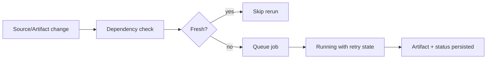

# ADR-003: Durable Lazy Async Evidence Pipeline

**Status:** Accepted  
**Date:** 2026-06-06  
**Deciders:** human  
**Milestone:** M034-kuei9y  
**Scope:** evidence-pipeline / operability / safety  
**Binding Level:** directional  
**Revisable:** yes, with explicit future ADR evidence.

## 0. One-line Decision

> We will build a durable lazy async evidence pipeline before implementation work scales sidecar processing.  
> We will not use in-memory batch execution or agent runtime as the reliability model.

## 1. Context

M033 showed heterogeneous sidecars with different latency, backend/cache needs, and failure modes. Quant-mind provides async flow and bounded batch ideas, but not durable queues, persistent job state, retry/recovery, or sidecar lifecycle management. S01 confirmed R054/R055/R057 as active architecture constraints.

### Context Map



## 2. Decision

Use persisted jobs, artifact records, dependency records, status transitions, retry state, stale detection, and sidecar-specific workers as the future orchestration direction. Lazy recomputation must be driven by input hashes, tool/config versions, and dependency readiness.

## 3. Applies To

Generic evidence processing, scientific-paper sidecar workers, future domain adapters, review packet generation, graph-readiness handoff, and failure observability.

## 4. Requirements and Decisions Impacted

### Requirements

| Requirement | Impact | Notes |
|---|---|---|
| R054 | supports | Durable lazy pipeline is the direct target. |
| R055 | supports | Lifecycle/retry/blocker visibility becomes required state. |
| R057 | supports | Pipeline implementation must wait for architecture gates. |
| R061 | constrains | S01 audit routes must inform later implementation. |

### Decisions

| Decision | Impact | Notes |
|---|---|---|
| D063 | supports | Deterministic orchestration before agents. |
| D064 | constrains | Agents are not current core orchestrator. |
| D067 | constrains | ADR follows Mermaid-assisted format. |

## 5. Options Considered

### Option A — In-memory batch only

Low complexity, but loses state on crash and lacks retry/lease/stale semantics.

### Option B — Durable lazy queue/status pipeline

More design work, but supports resume, retry, observability, and independent sidecar recomputation. Chosen.

### Option C — Agent-driven orchestration first

Rejected for now because tool-chain contracts and durable state are not ready.

## 6. Trade-off Analysis

| Trade-off | Chosen side | Why |
|---|---|---|
| Simplicity vs reliability | Reliability | Sidecar failures must survive process/network/backend interruption. |
| Eager rerun vs lazy recomputation | Lazy | Avoids recomputing fresh sidecars. |
| Agent autonomy vs deterministic state | Deterministic state | Current risk is operability, not autonomy. |

## 7. Consequences

### Positive
- Provides clear future implementation direction.
- Makes retries, blockers, and stale state first-class.

### Negative
- Requires state model and queue semantics before coding.

### New obligations
- S06 roadmap must include state-model and queue-semantics gates.

## 8. Safety and Non-Authorization

This ADR does **not** authorize:

- production graph import;
- final GraphDB selection;
- LadybugDB/FalkorDB/HelixDB writes;
- parser output as graph-ready truth;
- agentic orchestration unless this ADR explicitly scopes a future helper;
- bypassing validators or review packets.

Required safety defaults:

```text
graph_import_allowed=false
graphdb_written=false
ladybugdb_written=false
production_import_attempted=false
import_eligible=false
```

## 9. Contract Impact

Affected contracts: `ProcessingJob`, `DependencyRecord`, `FailureRecord`, `EvidenceArtifactRecord`, `SafetyFlags`. Future drafts must include statuses, `attempt_count`, `retry_after`, `input_hash`, `output_paths`, and terminal blocker reasons.

## 10. Validation / Evidence Required

Future prototype must verify persisted status transitions, retry/backoff, stale detection, crash/resume behavior, and no-write safety flags.

## 11. Open Questions

| Question | Owner | Needed by | Blocking? |
|---|---|---|---|
| Should queue be SQLite, filesystem manifest, or hybrid? | future pipeline milestone | before prototype | yes |
| Should workers be per-sidecar or generic stage workers? | future pipeline milestone | before worker implementation | yes |

## 12. Follow-up Actions

- [ ] S05 contracts must define job/artifact/dependency/failure records.
- [ ] S06 roadmap must include state/queue/stale/retry gates.

## 13. Supersedes / Superseded By

### Supersedes

- Narrows any historical wording that conflicts with ADR-000, ADR-002, or ADR-005.

### Superseded By

- Empty until future ADR.

## 14. LLM Reading Notes

- Binding decision:
  - Durable lazy queue/status orchestration comes before scale.
- Do not infer:
  - Do not infer agents orchestrate jobs now.
- Safe next action:
  - Design state and queue contracts.
- Blocked until:
  - Implementation waits for roadmap gates.
