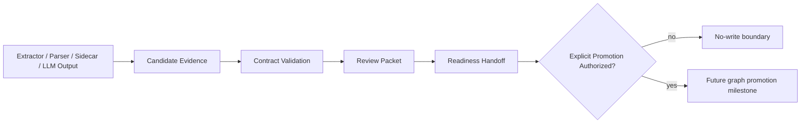
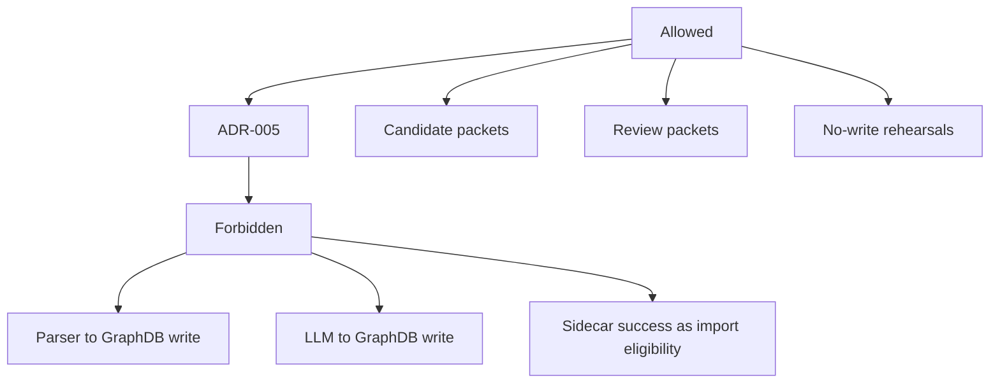

# ADR-005: No Direct Extractor to GraphDB Path

**Status:** Accepted  
**Date:** 2026-06-06  
**Deciders:** human  
**Milestone:** M034-kuei9y  
**Scope:** safety / graphdb / evidence-pipeline  
**Binding Level:** binding  
**Revisable:** yes, only through a future explicit graph-promotion ADR with completed review and import authorization evidence.

## 0. One-line Decision

> We will require every extractor, parser, sidecar, adapter, and LLM helper output to pass through candidate, validation, review, and readiness boundaries before any GraphDB promotion.  
> We will not allow direct parser/extractor/LLM/sidecar writes to LadybugDB, FalkorDB, HelixDB, or any other GraphDB.

## 1. Context

M031 and M033 reinforced the same safety rule: parsed output is not graph readiness. GROBID can produce TEI, OpenDataLoader can produce layout/OCR/table candidates, Adaptix can structurally load fixed JSON, and LLM/agent helpers may someday summarize or review. None of those outputs prove semantic correctness, source-span fidelity, citation correctness, table fidelity, or import eligibility.

S01 did not find blocking conflicts, but it did identify wording that must be clarified so historical graph/import work is not read as a direct parser-to-GraphDB authorization.

### Context Map



## 2. Decision

We will block direct writes from extractors, parsers, sidecars, adapters, or LLM helpers to any GraphDB. The only allowed path is candidate evidence → contract validation → review packet → readiness handoff → explicit future promotion/import authorization.

This decision authorizes no-write rehearsals, candidate packet generation, and review-boundary design. It does not authorize production graph import or direct writes to any knowledge substrate.

### Decision Boundary



## 3. Applies To

This applies to all domain adapters, paper sidecars, future non-paper extractors, optional LLM helpers, graph-readiness handoff, and future GraphDB substrate choices.

## 4. Requirements and Decisions Impacted

### Requirements

| Requirement | Impact | Notes |
|---|---|---|
| R027 | constrains | Graph-readiness quality must precede KG validation/scaling. |
| R029 | constrains | Import-ready chunk package requires stable provenance and independent review. |
| R040 | supports | New infrastructure must be safety-wrapped before main process activation. |
| R050 | supports | Artifact detection remains no-import. |
| R056 | supports | Parser sidecar outputs remain candidate evidence. |
| R059 | supports | No final GraphDB/write path before GraphDB evaluation. |

### Decisions

| Decision | Impact | Notes |
|---|---|---|
| D010 | supports | Paused downstream KG validation until graph-ready preparation quality improves. |
| D015 | supports | Deterministic CLI-first loop before MiniMax orchestration. |
| D063 | supports | Durable sidecar pipeline before agents. |
| D064 | supports | Agents do not own graph-readiness decisions. |
| D065 | constrains | GraphDB selection remains open. |

## 5. Options Considered

### Option A — Direct parser to GraphDB write after schema validation

| Dimension | Assessment |
|---|---|
| Local-first fit | Medium |
| Safety fit | Low |
| Complexity | Low |
| Reversibility | Low |
| GraphDB portability | Low |
| Agent/tooling dependency | Medium |
| Human review compatibility | Low |

**Pros**
- Fastest path to visible graph data.
- Simple implementation.

**Cons**
- Converts parser mistakes into persistent graph state.
- Bypasses independent review.
- Confuses structural parsing with semantic truth.

### Option B — Candidate/review/readiness boundary before GraphDB

| Dimension | Assessment |
|---|---|
| Local-first fit | High |
| Safety fit | High |
| Complexity | Medium |
| Reversibility | High |
| GraphDB portability | High |
| Agent/tooling dependency | Low |
| Human review compatibility | High |

**Pros**
- Preserves fail-closed safety.
- Keeps evidence auditable and reversible.
- Works across GraphDB candidates.

**Cons**
- More artifacts and gates.
- Slower path to positive graph writes.

## 6. Trade-off Analysis

| Trade-off | Chosen side | Why |
|---|---|---|
| Speed vs correctness | Correctness | Scientific/universal KB trust depends on reviewed evidence. |
| Direct writes vs no-write rehearsal | No-write rehearsal | Lets system test import shape without mutating graph state. |
| Parser schema validation vs semantic readiness | Semantic readiness gate | Shape correctness is not truth. |

## 7. Consequences

### Positive

- Prevents parser/LLM hallucination or layout errors from becoming graph facts.
- Keeps GraphDB choice portable.
- Makes review packets central to promotion.

### Negative

- Requires extra candidate/review/readiness artifacts.
- Positive graph writes remain deferred.

### New obligations

- Contracts must model candidate packets, review packets, readiness handoff, and safety flags.
- Verifiers must reject positive import/write flags unless a future milestone authorizes them.

### What becomes harder

- Quick graph demos based on parser output are intentionally blocked.

## 8. Safety and Non-Authorization

This ADR does **not** authorize:

- production graph import;
- final GraphDB selection;
- LadybugDB/FalkorDB/HelixDB writes;
- parser output as graph-ready truth;
- agentic orchestration;
- bypassing validators or review packets.

Required safety defaults:

```text
graph_import_allowed=false
graphdb_written=false
ladybugdb_written=false
production_import_attempted=false
import_eligible=false
```

## 9. Contract Impact

Affected contracts:

- `CandidatePacket`
- `ReviewPacket`
- `GraphReadinessHandoff`
- `SafetyFlags`
- `KnowledgeSubstratePort`

Required contract changes or drafts:

- Add explicit no-write safety defaults.
- Require candidate evidence references before review.
- Keep GraphDB promotion as future explicit authorization.

## 10. Validation / Evidence Required

Future implementation must prove:

- candidate packets can be generated without graph writes;
- review packets can be completed and post-checked;
- no-write import rehearsals preserve all safety flags;
- direct write paths are absent or guarded.

## 11. Open Questions

| Question | Owner | Needed by | Blocking? |
|---|---|---|---|
| What exact contract promotes readiness handoff to import authorization? | future graph-promotion milestone | before graph writes | yes |
| Should review be human, deterministic, LLM-assisted, or hybrid? | future review-boundary ADR | before positive readiness | yes |

## 12. Follow-up Actions

- [ ] S05 contracts must define candidate/review/readiness boundaries.
- [ ] S06 roadmap must include graph-readiness and import-authorization gates.
- [ ] Future verifiers must fail if graph/write flags are true before authorization.

## 13. Supersedes / Superseded By

### Supersedes

- Narrows any historical graph/import wording to no-write rehearsal or reviewed future promotion only.

### Superseded By

- Empty until future graph-promotion ADR.

## 14. LLM Reading Notes

- Binding decision:
  - No parser, extractor, sidecar, adapter, or LLM output may write directly to any GraphDB.
- Do not infer:
  - Do not infer candidate evidence is accepted knowledge.
  - Do not infer no-write rehearsal authorizes production import.
- Safe next action:
  - Design candidate/review/readiness contracts.
- Blocked until:
  - Positive graph promotion is blocked until a future explicit authorization milestone.
