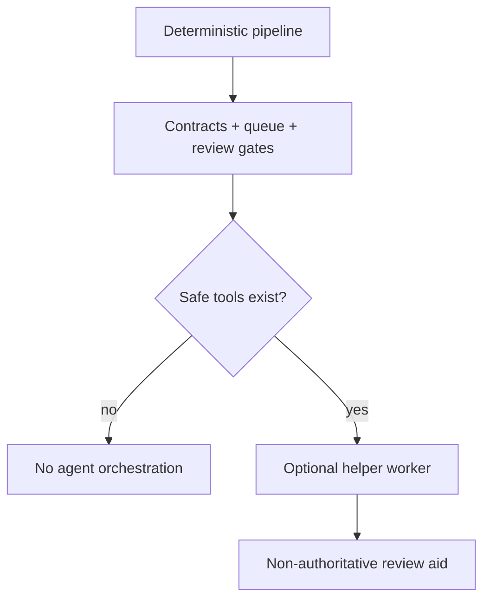

# ADR-006: Agent Boundary

**Status:** Accepted  
**Date:** 2026-06-06  
**Deciders:** human  
**Milestone:** M034-kuei9y  
**Scope:** agent-boundary / safety / evidence-pipeline  
**Binding Level:** binding  
**Revisable:** yes, with explicit future ADR evidence.

## 0. One-line Decision

> We will defer agentic orchestration until deterministic tools, queue state, contracts, and review gates exist.  
> We will not use LLM agents as current primary parser/sidecar orchestrators or graph-promotion authorities.

## 1. Context

The user explicitly wants tool-chain orchestration before agentic implementation. M033/quant-mind review showed agent runtime can provide typed extraction patterns but does not solve durable reliability. S01 flagged broad helper wording around MiniMax that needs narrowing.

### Context Map



## 2. Decision

Agents may become optional future helpers for review assistance, summarization, triage, question generation, or diagnostic explanation. They are not current core orchestrator infrastructure and must not currently own scheduling, sidecar orchestration, graph-readiness decisions, or graph writes.

## 3. Applies To

Future LLM helpers, MiniMax/DSPy/RLM patterns, quant-mind-inspired workflows, sidecar orchestration, review-boundary design.

## 4. Requirements and Decisions Impacted

### Requirements

| Requirement | Impact | Notes |
|---|---|---|
| R022 | constrains | RLM workflows remain read-only and deterministically validated. |
| R051 | constrains | MiniMax outputs are bounded, structured, redacted, and non-authoritative. |
| R052 | constrains | DSPy remains gated by fixtures/metrics. |
| R055 | supports | Agent failures would need durable lifecycle visibility later. |

### Decisions

| Decision | Impact | Notes |
|---|---|---|
| D036 | narrows | “MiniMax may be used wherever it helps” must remain bounded and non-authoritative. |
| D064 | supports | Agents are not primary orchestrator until tool-chain contracts exist. |
| D063 | supports | Deterministic orchestration first. |

## 5. Options Considered

### Option A — Agents orchestrate now

Rejected: queue/status/tools/review contracts are not ready.

### Option B — Deterministic orchestration now, optional agents later

Chosen: keeps reliability and safety first while preserving future helper value.

## 6. Trade-off Analysis

| Trade-off | Chosen side | Why |
|---|---|---|
| Autonomy vs reliability | Reliability | Current blockers are state/retry/contracts. |
| LLM flexibility vs authority risk | Bounded helper | LLM output must not become truth. |

## 7. Consequences

### Positive
- Prevents agentic drift.
- Keeps LLM use compatible with safety gates.

### Negative
- Delays agent-assisted automation.

### New obligations
- Future agent tools must be idempotent, typed, observable, and fail-closed.

## 8. Safety and Non-Authorization

This ADR does **not** authorize:

- production graph import;
- final GraphDB selection;
- LadybugDB/FalkorDB/HelixDB writes;
- parser output as graph-ready truth;
- agentic orchestration unless this ADR explicitly scopes a future helper;
- bypassing validators or review packets.

Required safety defaults:

```text
graph_import_allowed=false
graphdb_written=false
ladybugdb_written=false
production_import_attempted=false
import_eligible=false
```

## 9. Contract Impact

Affected contracts: future `AgentHelperJob`, `ToolInvocationRecord`, `ReviewAssistancePacket`, `SafetyFlags`; current `ProcessingJob` must not require agent runtime.

## 10. Validation / Evidence Required

Future agent milestone must prove safe tools, trace archive, cost/rate-limit visibility, schema validation, redaction, and non-authoritative output.

## 11. Open Questions

| Question | Owner | Needed by | Blocking? |
|---|---|---|---|
| Which helper roles are safe first? | future agent-boundary milestone | after deterministic pipeline | no |
| How are agent traces archived safely? | future observability design | before live agent use | yes for agents |

## 12. Follow-up Actions

- [ ] S06 roadmap must include explicit agent-boundary gate.
- [ ] Future agent helper ADR must define safe tools and non-authority rules.

## 13. Supersedes / Superseded By

### Supersedes

- Narrows any historical wording that conflicts with ADR-000, ADR-002, or ADR-005.

### Superseded By

- Empty until future ADR.

## 14. LLM Reading Notes

- Binding decision:
  - Agents are optional future helpers, not current orchestrators.
- Do not infer:
  - Do not infer MiniMax/DSPy/RLM can promote facts.
- Safe next action:
  - Build deterministic queue/contracts first.
- Blocked until:
  - Agent runtime waits for safe tool-chain and observability.
