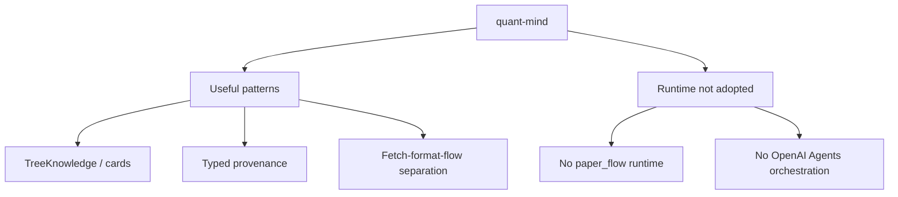

# ADR-007: Quant-mind Pattern Source Not Runtime Dependency

**Status:** Accepted  
**Date:** 2026-06-06  
**Deciders:** human  
**Milestone:** M034-kuei9y  
**Scope:** sidecar / agent-boundary / universal-kb  
**Binding Level:** directional  
**Revisable:** yes, with explicit future ADR evidence.

## 0. One-line Decision

> We will use quant-mind as an architecture pattern source for universal-KB ideas.  
> We will not adopt quant-mind paper_flow, OpenAI Agents runtime, GraphKnowledge, or in-memory batch as production dependency/model now.

## 1. Context

M033 S04 classified quant-mind as pattern-source-not-dependency. It is closer to the universal-KB direction through TreeKnowledge, PaperKnowledgeCard, typed provenance, fetch/format/flow separation, and bounded batch. But current runtime depends on OpenAI Agents/API/network, lacks durable queue/retry state, and has placeholder or missing GraphKnowledge/storage/retrieval reliability.

### Context Map



## 2. Decision

Borrow concepts, not runtime. Adapt useful patterns into daily-archive contracts after deterministic reliability and safety boundaries are defined.

## 3. Applies To

Universal KB contract design, paper-domain cards/trees, provenance modeling, future optional helper patterns, but not current runtime execution.

## 4. Requirements and Decisions Impacted

### Requirements

| Requirement | Impact | Notes |
|---|---|---|
| R054 | supports | Quant-mind batch inspires bounded concurrency but not durable queue. |
| R055 | constrains | Reliability gaps require explicit lifecycle state. |
| R060 | supports | Quant-mind-like trees/cards inform broader KB direction. |

### Decisions

| Decision | Impact | Notes |
|---|---|---|
| D062 | narrows | Study quant-mind with parser research. |
| D063 | supports | Durable pipeline before agent orchestration. |
| D064 | supports | Agent runtime not primary orchestrator. |

## 5. Options Considered

### Option A — Adopt quant-mind runtime

Rejected for now: runtime/API/reliability/storage gaps.

### Option B — Borrow patterns only

Chosen: gains useful architecture vocabulary without unsafe dependency adoption.

## 6. Trade-off Analysis

| Trade-off | Chosen side | Why |
|---|---|---|
| Fast reuse vs reliability | Reliability | Runtime lacks durable queue/recovery. |
| Pattern learning vs dependency lock-in | Pattern learning | Concepts can be adapted safely. |

## 7. Consequences

### Positive
- Keeps TreeKnowledge/card/provenance ideas.
- Avoids premature OpenAI Agents coupling.

### Negative
- More local design work required.

### New obligations
- Future contracts must decide which patterns to adapt precisely.

## 8. Safety and Non-Authorization

This ADR does **not** authorize:

- production graph import;
- final GraphDB selection;
- LadybugDB/FalkorDB/HelixDB writes;
- parser output as graph-ready truth;
- agentic orchestration unless this ADR explicitly scopes a future helper;
- bypassing validators or review packets.

Required safety defaults:

```text
graph_import_allowed=false
graphdb_written=false
ladybugdb_written=false
production_import_attempted=false
import_eligible=false
```

## 9. Contract Impact

Affected contracts: possible `KnowledgeTree`, `KnowledgeCard`, `SourceRef`, `CitationRef`, `ExtractionRef`, `DomainAdapterRecord`; no quant-mind runtime contract is adopted.

## 10. Validation / Evidence Required

Future work may evaluate pattern adaptation by implementing local contracts and deterministic tests, not by running quant-mind production flows.

## 11. Open Questions

| Question | Owner | Needed by | Blocking? |
|---|---|---|---|
| Which quant-mind patterns should become concrete contracts first? | S05/future contracts | before implementation | yes for pattern adoption |
| Could quant-mind runtime be revisited later? | future spike | after reliability/tool-chain evaluation | no |

## 12. Follow-up Actions

- [ ] S05 contracts may include tree/card/provenance concepts.
- [ ] Future spike can revisit runtime only after reliability criteria are met.

## 13. Supersedes / Superseded By

### Supersedes

- Narrows any historical wording that conflicts with ADR-000, ADR-002, or ADR-005.

### Superseded By

- Empty until future ADR.

## 14. LLM Reading Notes

- Binding decision:
  - quant-mind is pattern source, not runtime dependency.
- Do not infer:
  - Do not infer paper_flow should orchestrate daily-archive.
- Safe next action:
  - Translate useful concepts into local contracts.
- Blocked until:
  - Runtime adoption blocked until reliability and safety evaluation.
