# Mermaid-assisted Enhanced ADR Template

Use this template for M034 ADRs. It is designed for both human readers and future LLM agents.

Core rule: **prose and tables are authoritative**. Mermaid diagrams are optional aids for structure, flows, statuses, option comparison, and contract relationships. Diagrams must clarify the ADR, not replace explicit text.

## Readability Rules

- Use at most ~3–5 Mermaid diagrams in a single ADR.
- Prefer tables for precise requirement/decision impact and option comparison.
- Keep Mermaid diagrams small; if a relationship map has more than ~8 links, move the full graph to the R/D audit artifact and keep only a small summary diagram here.
- Do not use diagrams to hide ambiguity. State the decision, non-decision, and safety boundary in prose.
- Keep class diagrams conceptual unless the ADR is specifically about contracts.
- Every ADR must include `LLM Reading Notes` so future agents can identify binding decisions and non-authorizations quickly.

---

````markdown
# ADR-XXX: <Title>

**Status:** Proposed | Accepted | Deferred | Rejected | Superseded  
**Date:** YYYY-MM-DD  
**Deciders:** human | collaborative | agent  
**Milestone:** M034-kuei9y  
**Scope:** universal-kb | graphdb | evidence-pipeline | sidecar | agent-boundary | safety | contracts  
**Binding Level:** binding | directional | exploratory  
**Revisable:** yes/no, with condition

## 0. One-line Decision

> We will <decision>.  
> We will not <explicit non-decision>.

## 1. Context

Explain why this decision exists.

Include:
- project north star;
- relevant M033 findings;
- existing Rxxx / Dxxx constraints;
- current uncertainty;
- risk if undecided.

### Context Map

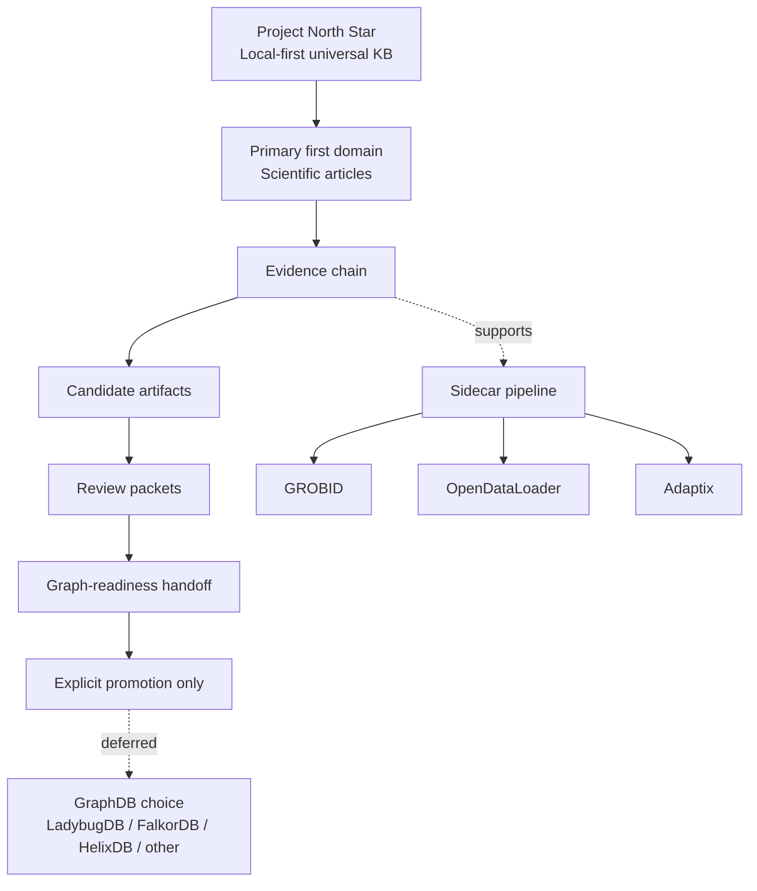

## 2. Decision

State the decision precisely.

Use explicit language:

```text
We will...
We will not...
This decision authorizes...
This decision does not authorize...
```

### Decision Boundary

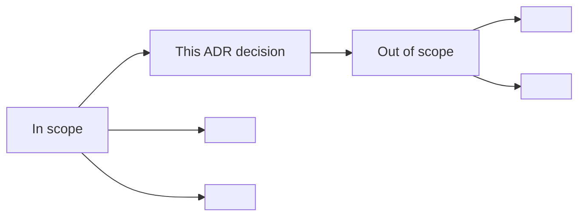

## 3. Applies To

This decision applies to:

- generic knowledge-base architecture;
- scientific-paper first-domain implementation;
- sidecar pipeline;
- graph substrate decision;
- review/readiness gates;
- future agent workers.

### Applicability Diagram

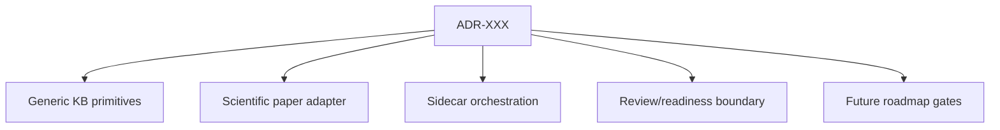

## 4. Requirements and Decisions Impacted

### Requirements

| Requirement | Impact | Notes |
|---|---|---|
| R0XX | supports / constrains / supersedes / needs update | ... |

### Decisions

| Decision | Impact | Notes |
|---|---|---|
| D0XX | consistent / superseded / narrowed / needs follow-up | ... |

### R/D Relationship Map

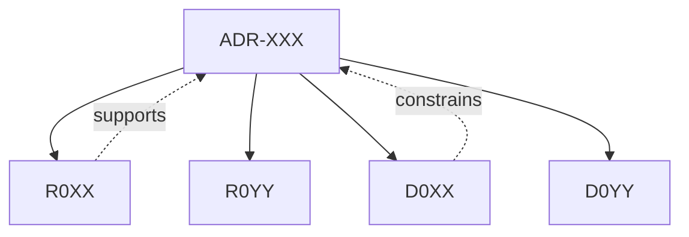

Keep this diagram small. If more than ~8 links, use tables only and move the full graph to the R/D audit artifact.

## 5. Options Considered

### Option A — <Name>

| Dimension | Assessment |
|---|---|
| Local-first fit | High / Medium / Low |
| Safety fit | High / Medium / Low |
| Complexity | High / Medium / Low |
| Reversibility | High / Medium / Low |
| GraphDB portability | High / Medium / Low |
| Agent/tooling dependency | High / Medium / Low |
| Human review compatibility | High / Medium / Low |

**Pros**
- ...

**Cons**
- ...

### Option B — <Name>

Same structure.

### Option Comparison Snapshot

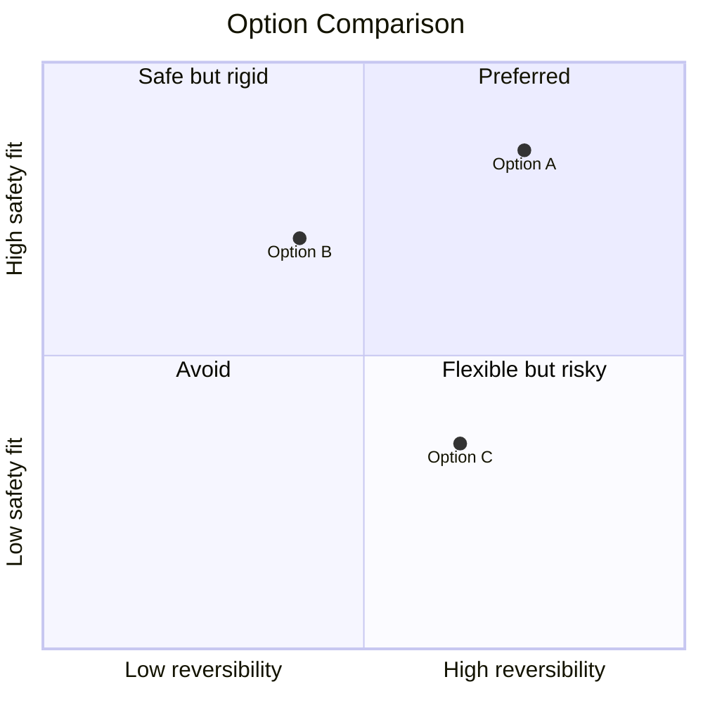

Use this only when it clarifies. If the chart feels forced, skip it.

## 6. Trade-off Analysis

Explain why the chosen option wins now.

Separate:

- short-term implementation value;
- long-term architecture value;
- safety impact;
- reversibility;
- cost/complexity;
- what remains uncertain.

### Trade-off Summary

| Trade-off | Chosen side | Why |
|---|---|---|
| Generic KB vs paper-only | Generic KB with paper first | Avoids overfitting while preserving current domain |
| Deterministic orchestration vs agents now | Deterministic first | Reliability risk is higher than autonomy need |
| GraphDB now vs deferred | Deferred | License/perf/locality/scaling unclear |

## 7. Consequences

### Positive

- ...

### Negative

- ...

### New obligations

- ...

### What becomes harder

- ...

### Consequence Flow

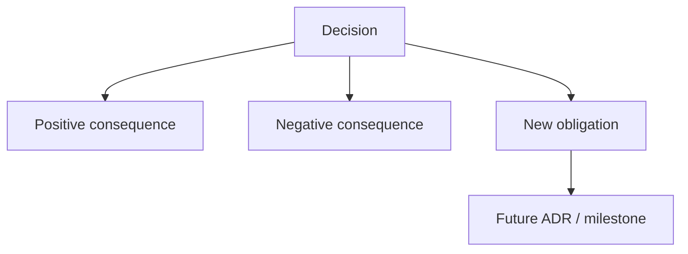

## 8. Safety and Non-Authorization

This ADR does **not** authorize:

- production graph import;
- final GraphDB selection, unless this ADR explicitly decides that;
- LadybugDB/FalkorDB/HelixDB writes;
- parser output as graph-ready truth;
- agentic orchestration;
- bypassing validators or review packets.

Required safety defaults:

```text
graph_import_allowed=false
graphdb_written=false
ladybugdb_written=false
production_import_attempted=false
import_eligible=false
```

### Safety Gate

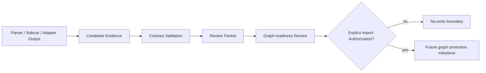

## 9. Contract Impact

Affected contracts:

- `KnowledgeSourceRecord`
- `DomainAdapterRecord`
- `EvidenceArtifactRecord`
- `ProcessingJob`
- `CandidatePacket`
- `ReviewPacket`
- `GraphReadinessHandoff`
- `KnowledgeSubstratePort`
- `SafetyFlags`

Required contract changes or drafts:

- ...

### Contract Relationship Map

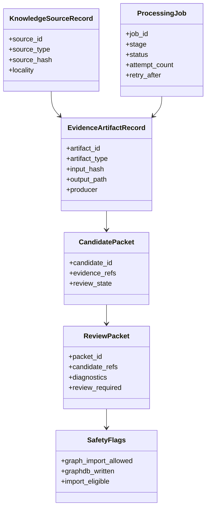

Keep classes conceptual. Do not over-specify implementation fields in ADR unless the ADR is specifically about contracts.

## 10. Validation / Evidence Required

What evidence is needed to accept or revisit this ADR?

Examples:

- document consistency audit;
- R/D consistency audit;
- future GraphDB comparison matrix;
- local prototype;
- failure-mode test;
- status transition verification;
- no-write rehearsal;
- reader test.

### Validation Path

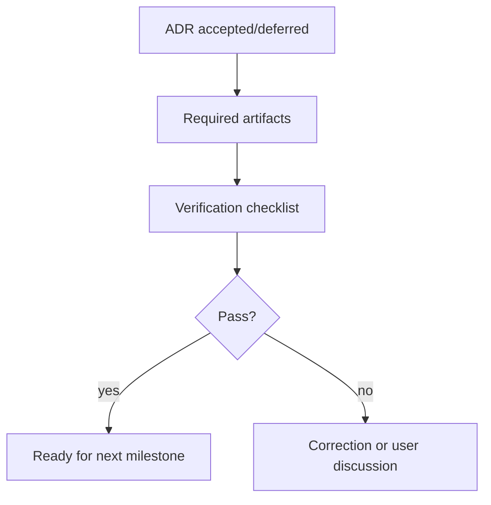

## 11. Open Questions

| Question | Owner | Needed by | Blocking? |
|---|---|---|---|
| ... | ... | ... | yes/no |

## 12. Follow-up Actions

- [ ] ...
- [ ] ...

## 13. Supersedes / Superseded By

### Supersedes

- D0XX, if applicable

### Superseded By

- empty until future ADR

## 14. LLM Reading Notes

This section is intentionally explicit for future agents.

- Binding decision:
  - ...
- Do not infer:
  - ...
- Safe next action:
  - ...
- Blocked until:
  - ...
````

---

## Special Mermaid Blocks by ADR Type

Use these only when they improve readability.

### GraphDB ADR

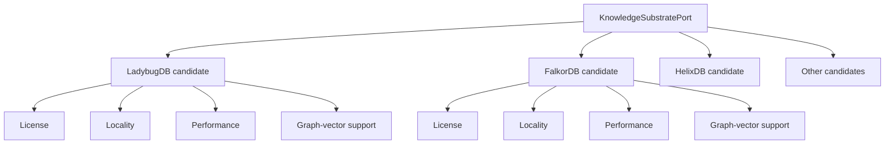

### Queue / Status ADR

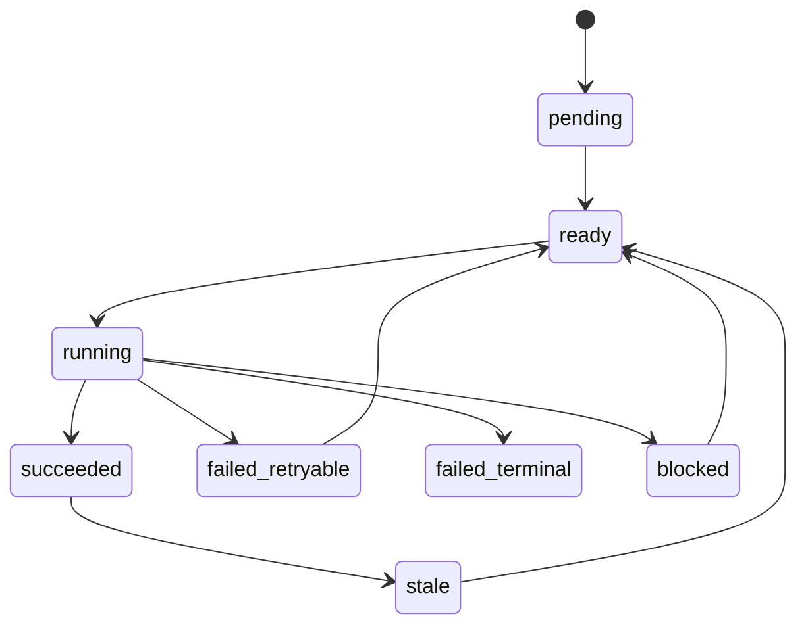

### Evidence-chain ADR

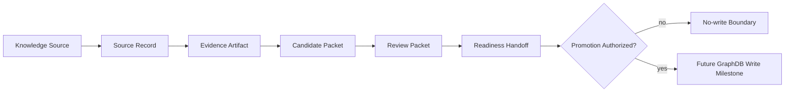

### Universal KB vs Paper Domain ADR

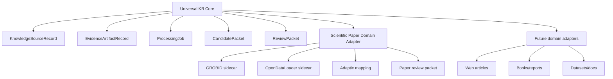

---

## Final Reminder

Use this template to preserve structure, not to create bureaucracy.

- Text is always primary.
- Tables carry exact R/D impact and option comparisons.
- Mermaid clarifies structure, flow, states, and contracts.
- `LLM Reading Notes` make the ADR safe for future agents to consume.
