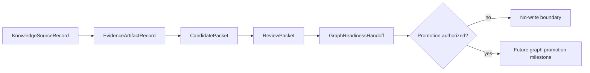

# M034 Artifact Dependency Model

## Generic Model



## Scientific-paper First-domain Model

```text
PaperSourceRecord
  -> GROBIDSidecarArtifact
       -> scholarly_candidates
  -> OpenDataLoaderSidecarArtifact
       -> layout_table_candidates
  -> AdaptixMappingArtifact
       -> typed_mapping_candidates

scholarly_candidates + layout_table_candidates + typed_mapping_candidates
  -> PaperReviewPacket
  -> GraphReadinessHandoff
  -> no-write boundary unless future promotion authorized
```

## Lazy Recompute Rules

- GROBID stale does not automatically make OpenDataLoader stale.
- OpenDataLoader stale does not automatically make GROBID stale.
- Source hash stale makes all dependent sidecars stale.
- Adapter version stale makes mapped candidate packets stale, not raw sidecar artifacts.
- Review contract stale makes review packets stale, not parser outputs.

## GraphDB Boundary

The dependency model stops at `GraphReadinessHandoff`. Any GraphDB write requires a future explicit graph-promotion milestone and selected/authorized substrate.
