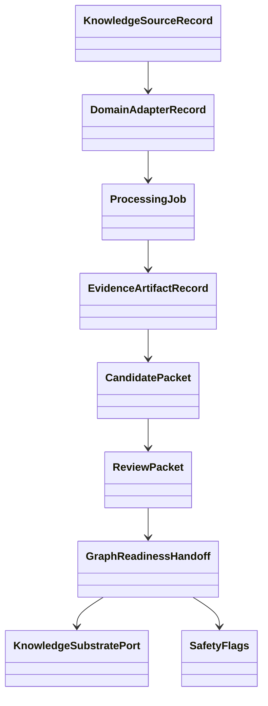

# M034 Contracts

## Generic Universal-KB Contracts

| Contract | Purpose | Required fields / notes |
|---|---|---|
| `KnowledgeSourceRecord` | Durable source identity. | `source_id`, `domain`, `source_type`, `locator_or_path`, `source_hash`, `locality`, `redaction_policy`. |
| `DomainAdapterRecord` | Declares adapter from source domain to generic evidence. | `domain`, `adapter_name`, `adapter_version`, `input_contract`, `output_contract`. |
| `EvidenceArtifactRecord` | Records generated evidence artifact. | `artifact_id`, `artifact_type`, `producer`, `input_hash`, `tool_version`, `output_path`, `diagnostic_refs`. |
| `ProcessingJob` | Persistent unit of work. | `job_id`, `stage`, `status`, `attempt_count`, `retry_after`, `last_error_code`, `input_refs`, `output_paths`. |
| `DependencyRecord` | Links jobs/artifacts and stale rules. | `dependency_id`, `upstream_ref`, `downstream_ref`, `required_state`, `stale_on_hash_change`. |
| `FailureRecord` | Typed failure diagnostics. | `failure_id`, `job_id`, `failure_class`, `error_code`, `retryable`, `redacted_message`, `occurred_at`. |
| `CandidatePacket` | Candidate evidence before review. | `candidate_id`, `evidence_refs`, `candidate_type`, `review_state`, `safety_flags`. |
| `ReviewPacket` | Review boundary artifact. | `packet_id`, `candidate_refs`, `diagnostics`, `review_required`, `review_state`, `reviewer_refs`. |
| `GraphReadinessHandoff` | No-write readiness handoff. | `handoff_id`, `review_packet_refs`, `readiness_state`, `import_recommendation`, `safety_flags`. |
| `KnowledgeSubstratePort` | Backend-neutral graph substrate boundary. | `candidate_backend`, `write_authorized`, `portability_notes`, `export_format`, `backend_specific_flags`. |
| `SafetyFlags` | Fail-closed write/import flags. | `graph_import_allowed=false`, `graphdb_written=false`, `ladybugdb_written=false`, `production_import_attempted=false`, `import_eligible=false`. |

## Scientific-paper Specializations

| Contract | Specializes | Notes |
|---|---|---|
| `ArticleRecord` | `KnowledgeSourceRecord` | arXiv/publisher/local article identity and catalog metadata. |
| `PaperSourceRecord` | `KnowledgeSourceRecord` | PDF/HTML/Markdown/TEI/source variants with hashes. |
| `ArticleJob` | `ProcessingJob` | Paper-domain acquisition, sidecar, mapping, review, readiness stages. |
| `SidecarJob` | `ProcessingJob` | GROBID/OpenDataLoader/Adaptix sidecar execution. |
| `GROBIDSidecarArtifact` | `EvidenceArtifactRecord` | TEI, metadata, bibliography, citation/ref marker candidates. |
| `OpenDataLoaderSidecarArtifact` | `EvidenceArtifactRecord` | Layout/OCR/table/coordinate candidates. |
| `AdaptixMappingArtifact` | `EvidenceArtifactRecord` | Typed structural mapping over fixed parser JSON. |
| `PaperReviewPacket` | `ReviewPacket` | Paper-specific graph-readiness review packet. |

## Contract Relationship

## Portability Rule

No contract may require final LadybugDB/FalkorDB/HelixDB write semantics until ADR-002 is superseded by a future GraphDB selection ADR.
