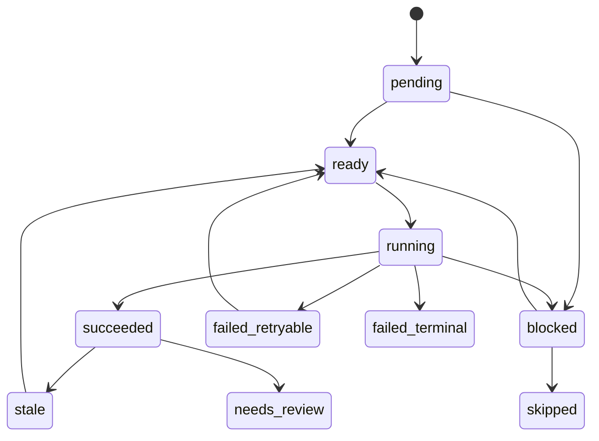

# M034 Status Matrix

## Status Vocabulary

| Status | Meaning | Allowed next states |
|---|---|---|
| `pending` | Job exists but dependencies not evaluated. | `ready`, `blocked`, `skipped` |
| `ready` | Dependencies satisfied; worker may claim. | `running`, `stale`, `blocked` |
| `running` | Worker has lease/ownership. | `succeeded`, `failed_retryable`, `failed_terminal`, `blocked` |
| `succeeded` | Outputs written and verified. | `stale`, `needs_review` |
| `failed_retryable` | Failure can retry after backoff. | `ready`, `failed_terminal`, `blocked` |
| `failed_terminal` | Failure exhausted or unrecoverable. | `blocked` |
| `blocked` | Requires missing dependency, user decision, or external repair. | `ready`, `skipped` |
| `stale` | Upstream hash/tool/config changed. | `ready`, `blocked` |
| `needs_review` | Candidate/review artifact awaits review. | `succeeded`, `blocked` |
| `skipped` | Explicitly bypassed with reason. | none |

## State Diagram

## Stale Detection

A downstream artifact becomes `stale` when upstream source hash, input artifact hash, tool version, config hash, adapter version, or review requirement changes.
