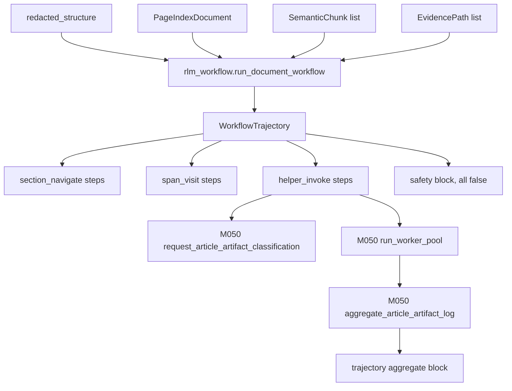

# M052-xifwu6: RLM S09 Document Workflow Harness on M050 Worker Pool

**Vision:** Build a deterministic RLM-style document/workflow harness (per M003 S09 / D003) on top of the M050 LLM helper v2 worker pool. The harness consumes a redacted article structure, navigates sections and evidence spans, and emits a typed trajectory. It is bounded, deterministic, fail-closed, and never writes to a graph. The M050 worker pool + reducer is the LLM helper layer; RLM S09 adds the document navigation + workflow harness on top.

## Slices

- [x] **S01: RLM navigation + workflow harness core** `risk:medium` `depends:[M050-l8os7p]`
  > After this: RLM harness navigates a real fixture (basic_article_structure.json) via M050 worker pool + emits typed trajectory events.

- [x] **S02: RLM harness end-to-end test + audit** `risk:low` `depends:[S01]`
  > After this: Full e2e: real fixture -> RLM harness -> M050 worker pool -> reducer -> audit report.

## Boundary Map

