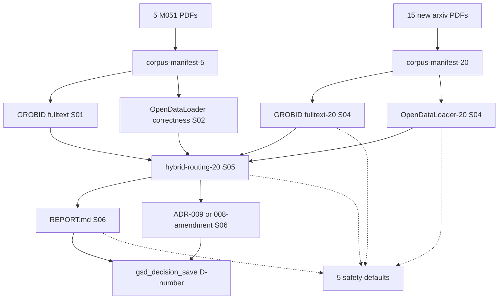

# M055-kyxuqm: Hybrid Parser Deep-Dive: GROBID Fulltext + OpenDataLoader Correctness + 20 PDFs

**Vision:** Deepen the M055 hybrid parser benchmark along 3 axes: (1) GROBID fulltext processing vs header-only to recover body content + citation F1, (2) OpenDataLoader correctness validation on table structure, figure captions, and chart extraction (currently only counted, not validated), (3) expand corpus from 5 to 20 PDFs to strengthen the 100% hybrid recommendation statistically. Update ADR-008 (or draft ADR-009) with fulltext-aware routing if evidence shows GROBID can extract body better than header-only mode. Surface remaining gaps for future slices (scanned PDFs, equations, citation F1 ground truth).

## Slices

- [x] **S01: GROBID fulltext re-benchmark on 5 PDFs** `risk:medium` `depends:[M051-aaw9j7,M033-732r1t]`
  > After this: GROBID /api/processFulltextDocument on 5 PDFs with body content + ref count + bibl count + section count.

- [x] **S02: OpenDataLoader correctness validation on 5 PDFs** `risk:medium` `depends:[M054-proc4f]`
  > After this: OpenDataLoader table and figure correctness metrics per PDF: rows and cols match, caption text extracted, chart structure detected.

- [x] **S03: Expand corpus from 5 to 20 PDFs** `risk:medium` `depends:[M051-aaw9j7]`
  > After this: 20-PDF corpus manifest with sha256, sources, categories.

- [x] **S04: GROBID fulltext plus OpenDataLoader benchmark on 20 PDFs** `risk:medium` `depends:[S01,S02,S03]`
  > After this: 20-PDF GROBID fulltext plus OpenDataLoader metrics with per-PDF comparison.

- [x] **S05: Hybrid routing on 20 PDFs with GROBID fulltext comparison** `risk:medium` `depends:[S04]`
  > After this: 20-PDF hybrid routing packets with per-dimension winners and fulltext-vs-header delta.

- [x] **S06: Comprehensive REPORT plus ADR-008 amendment or ADR-009** `risk:low` `depends:[S05]`
  > After this: Comprehensive REPORT.md (20-PDF benchmark) plus ADR amendment.

## Boundary Map

