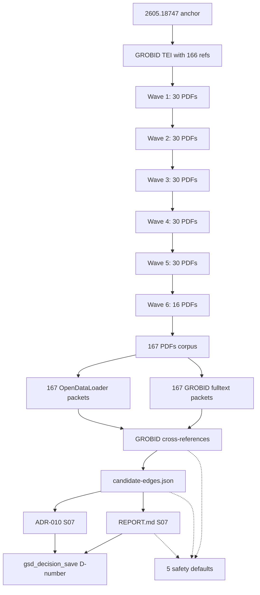

# M056-lchpnp: Hybrid Parser BFS Acquisition 2605.18747 1-Hop All 166 Refs in Waves

**Vision:** BFS 1-hop acquisition of all 166 arxiv references from GROBID TEI of 2605.18747 (Code as Agent Harness), in 6 waves of 25-30 PDFs each, with per-wave connectivity analysis. Goal: build a graph-ready scientific corpus of 167 PDFs (1 anchor + 166 refs) with empirical citation connectivity. After 1-hop completion, optionally expand to 2-hop from acquired 1-hop set. Per ADR-002/006/009: parser benchmark is diagnostic-only, no graph writes, no production import. Emit candidate-edges.json as M058 graph-readiness evidence.

## Slices

- [x] **S01: Wave 1: first 30 mostmentioned refs of 2605.18747** `risk:medium` `depends:[M051-aaw9j7,M033-732r1t]`
  > After this: 30 new PDFs acquired in corpus + GROBID fulltext + OpenDataLoader metrics + per-wave connectivity analysis.

- [x] **S02: Wave 2: refs 31-60** `risk:medium` `depends:[S01]`
  > After this: 30 more PDFs (cumulative 80) with per-wave analysis.

- [x] **S03: Wave 3: refs 61-90** `risk:medium` `depends:[S02]`
  > After this: 30 more PDFs (cumulative 110) with per-wave analysis.

- [x] **S04: Wave 4: refs 91-120** `risk:medium` `depends:[S03]`
  > After this: 30 more PDFs (cumulative 140) with per-wave analysis.

- [x] **S05: Wave 5: refs 121-150** `risk:medium` `depends:[S04]`
  > After this: 30 more PDFs (cumulative 170) with per-wave analysis.

- [x] **S06: Wave 6: remaining 16 refs (151-166)** `risk:medium` `depends:[S05]`
  > After this: 16 final PDFs (cumulative 167 = 1 anchor + 166 refs) with closing analysis.

- [x] **S07: Final REPORT + candidate-edges.json + ADR-010** `risk:low` `depends:[S06]`
  > After this: Comprehensive REPORT.md (167-PDF BFS), candidate-edges.json (citation graph), ADR-010 (BFS scale evidence for ADR-002).

## Boundary Map

