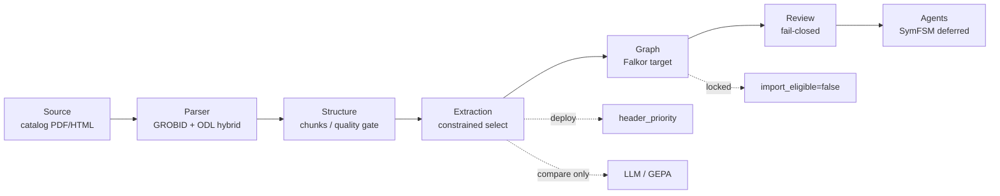
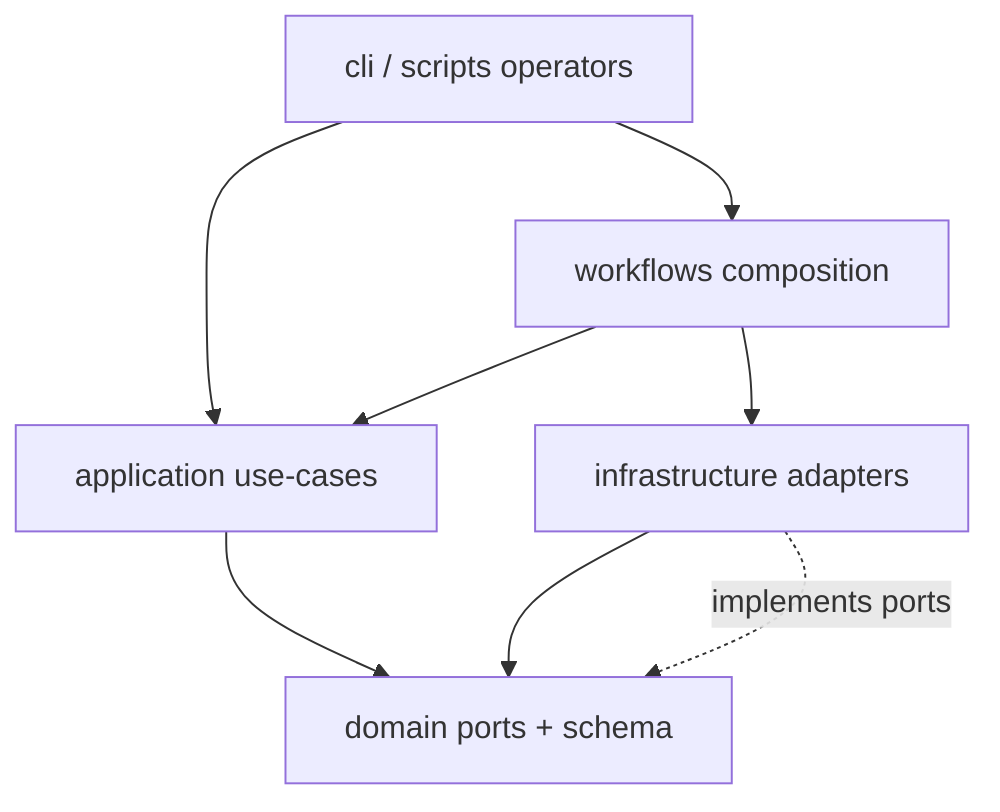
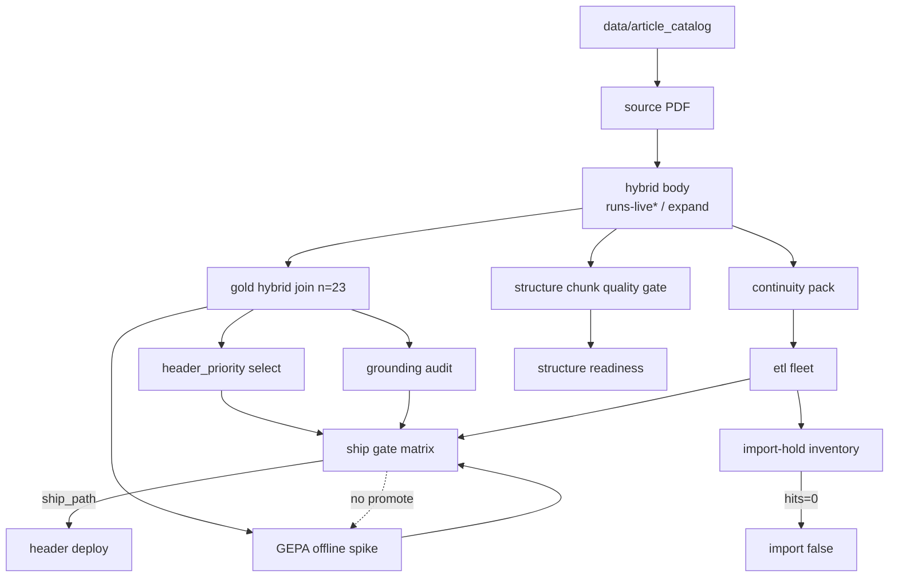
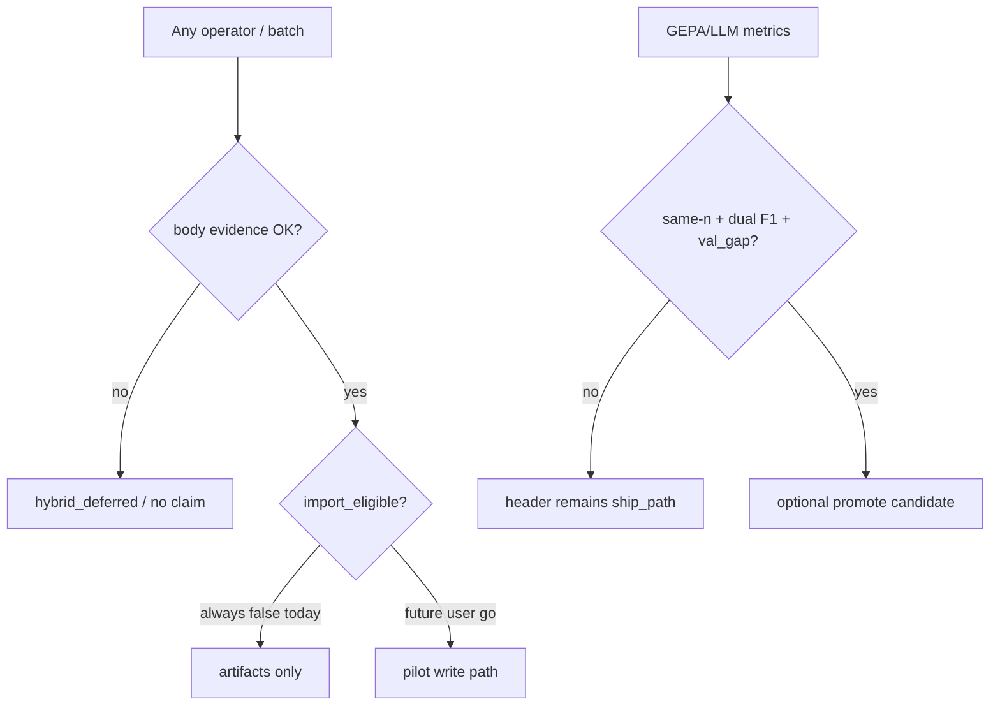
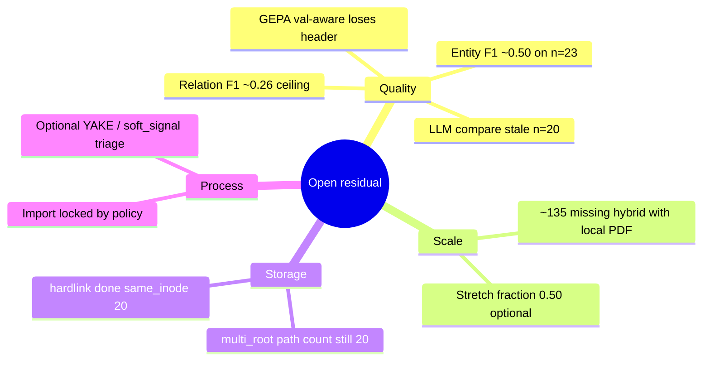

# daily-archive

Local-first **Universal Knowledge Base** for scientific papers (first domain): ingest PDFs → hybrid body → constrained extraction → review gates → graph **only with explicit authorization**.

Runtime package: **`research_graph`** (`src/research_graph/`).  
Legacy `arxiv_archive` is **not** on the import path (`archive/` = rename history only).

Agent lookup map: `AGENTS.md` (local; often gitignored). Hygiene: `doc/REPO-HYGIENE.md`.

---

## Current state (2026-07-24)

| Area | Status |
|------|--------|
| Hybrid bodies | **81 / 230 ≈ 35.2%** (residual ≥ 0.35 met) |
| Deploy extract | **`header_priority`** constrained select |
| GEPA / LLM | Compare / offline only — **not** promoted |
| Structure continuous gate | **pass** → `ready_for_structure_review` |
| Import / graph write | **locked** (`import_eligible=false`) |
| Import-hold hits | **0** |
| Multi-root identical | hardlinked; **same_inode = 20** |
| Fleet soft debt | stale LLM compare **n=20** vs live **n=23** |

Live evidence:

```text
artifacts/etl/ETL-READINESS-MATRIX-ROADMAP.md
artifacts/etl/EVIDENCE-TRACE-AND-VERIFICATION-ROADMAP.md  # evidence-trace + verification next wave
artifacts/etl/continuity-pack.json
artifacts/etl/fleet-report.json
artifacts/wave-b/ship-gate-matrix.json
```

---

## Architecture

### Knowledge pipeline (product layers)



### Hexagonal / onion package (code)



| Layer | Path | Rule |
|-------|------|------|
| Domain | `src/research_graph/domain/` | pure types / ports |
| Application | `src/research_graph/application/` | pure use-cases preferred |
| Infrastructure | `src/research_graph/infrastructure/` | IO: parsers, LLM, DB |
| Workflows | `src/research_graph/workflows/` | composition / sidecars |
| CLI / scripts | `cli/`, `scripts/verify_*.py` | thin operators |

Onion guard: `uv run python scripts/verify_onion_layering.py`.

### ETL / Wave B data plane (what runs day-to-day)



### Safety gates



Binding ADRs: `doc/adr/ADR-INDEX.md`  
(ADR-008/009 hybrid, ADR-023 layers, ADR-034 onion, ADR-035 write governance, ADR-036 preprocess).

---

## Problems (open residual)



| ID | Severity | Problem | Symptom | Next lever |
|----|----------|---------|---------|------------|
| **Q1** | high | Weak relations | relation F1 ~0.26 | better entity pick + relation candidates |
| **Q2** | high | Weak entities on full gold join | header entity ~0.50 n=23 | header heuristics / candidates |
| **Q3** | med | Metric n-mix residual | LLM artifact n=20 vs live 23 | same-n LLM rescore or drop from hard path |
| **Q4** | med | GEPA overfit vs underfit tradeoff | promote blocked | type priors, not paper-id TYPE_HINT flood |
| **X1** | low–med | Idle PDF queue | ~135 with PDF, no hybrid | gated expand batches |
| **S1** | low | Multi-root paths remain | path count 20 after hardlink | optional path prune flag |
| **L1** | policy | No graph import | import_eligible false | **explicit user go only** |

**Not import-ready** until: same-n quality contract clean for deploy claims, agreed dual-F1 floor, structure not red, **and** user yes.

---

## Daily operators

```bash
# Dashboards
uv run python scripts/verify_etl_continuity_pack.py
uv run python scripts/verify_etl_fleet.py
uv run python scripts/verify_etl_fleet.py --rescore-quality

# Hybrid expand (pack refresh default ON)
uv run python scripts/verify_hybrid_expand_batch.py --help

# Wave B quality
uv run python scripts/verify_wave_b_ship_gate_matrix.py
uv run python scripts/verify_wave_b_gepa_vs_header.py

# Structure
uv run python scripts/verify_structure_chunk_quality_gate.py
uv run python scripts/verify_structure_readiness_package.py

# Safety
uv run python scripts/verify_import_hold_inventory.py
uv run python scripts/verify_onion_layering.py
```

### Hybrid sidecars

```bash
docker compose -f .docker/docker-compose.yml --env-file .env up -d grobid
curl -sS http://127.0.0.1:8070/api/isalive
uv sync --extra hybrid

uv run python -m research_graph article run path/to/paper.pdf --mode hybrid \
  -o artifacts/single-article/demo
```

`hybrid_claimed_success` needs body evidence, not merely “container up”. Details: `.docker/README.md`.

---

## Development

```bash
uv sync
uv run pytest tests/ -q
uv run ruff check src/ tests/
uv run python scripts/verify_onion_layering.py
uv run python scripts/verify_import_hold_inventory.py
```

---

## Layout

```text
src/research_graph/     # runtime (domain/application/infrastructure/workflows/cli)
scripts/                # verify_* operators
tests/
doc/adr/                # binding ADRs
artifacts/etl/          # pack, fleet, structure, readiness matrix
artifacts/wave-b/       # ship matrix, GEPA, grounding, stamp
data/article_catalog/   # canonical PDFs + catalog
archive/                # rename shims only (not runtime)
.docker/                # GROBID / ODL compose
```

Local scratch (gitignored): `mutants/`, `tmp/`, `.gsd-backups/`, hybrid `runs-live*` workdirs.

---

## Intentionally deferred

| Item | Status |
|------|--------|
| Production Falkor / graph import | Locked without user go |
| GEPA/LLM as deploy select | Staged offline only |
| SymFSM production agents | ADR-026 directional |
| Hybrid stretch 0.50 / YAKE default-on | Optional |

---

## Further reading

| Doc | Purpose |
|-----|---------|
| `AGENTS.md` | Agent map: what/where (local) |
| `artifacts/etl/ETL-READINESS-MATRIX-ROADMAP.md` | Residual matrix + roadmap |
| `doc/REPO-HYGIENE.md` | Garbage policy + truth paths |
| `doc/adr/ADR-INDEX.md` | Binding ADRs |
| `doc/SPEC.md` | Spec |
| `CHANGELOG.md` | Recent changes |
