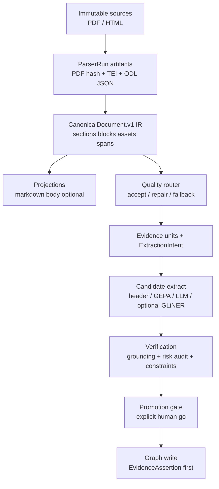

# Evidence-trace + verification roadmap

**As of:** 2026-07-24  
**Sources:** internal residual matrix + external analyses (GROBID/ODL evidence depth; ARS governance patterns from https://github.com/Imbad0202/academic-research-skills — **principles only**, CC BY-NC: do not copy prompts/scripts).  
**Import:** remains locked (D127) until evidence resolvability + precision gates + explicit user go.

---

## Verdict (plain)

`daily-archive` already has industrial ETL **shape**: onion, hybrid GROBID+ODL, stamps, same-n, constrained select, fail-closed import.  
**Do not rewrite the pipeline.** Do not bolt on Marker+MinerU+GLiNER+PageIndex package soup.

The binding gap is **reversible evidence**:

```text
node / claim / relation
  → EvidenceAssertion
  → SourceSpan (page + bbox + char_range + element_id)
  → immutable artifact (PDF + TEI + ODL JSON + parser run)
```

Live path today often stops at **markdown body + char offsets**. Layout JSON and raw TEI are under-retained. Structure gate proves text presence, not structure quality. Gold n=23 is TDD-sized, not import-decision-sized.

Secondary gap (ARS-style): **governance between candidates and graph write** — intent, negative constraints, risk-stratified audit, ground-truth isolation. Not more extractors.

---

## Confirmed in repo (evidence)

| Claim | Code / artifact |
|-------|-----------------|
| Import locked | operators + ship matrix `import_eligible=false` |
| ODL default markdown; bbox proxy = newlines | `live_sidecar_adapters.py` (`output_format="markdown"`, `bounding_box_count: text.count("\n")`) |
| GROBID TEI parsed but raw TEI not persisted | same file: “raw TEI is not persisted here” |
| Structure gate = heading OR ≥8 newlines | `structure_chunk_quality_gate.py` |
| Domain `EvidencePath` lacks page/bbox | `domain/semantic_chunks.py` |
| page_bbox / SourceSpan exist elsewhere | `infrastructure/papers/indexing/page_index.py`, `source_assets/registry.py`, readiness export |
| SPEC stale (Telegram/Graphify) | `doc/SPEC.md` vs README UKB |
| Metrics weak | header n=23 ~0.50 / 0.26; LLM n=20 stale; hybrid 81/230 |

---

## Target architecture (evolution, not rewrite)



**Markdown is a projection, not the canonical model.**

### CanonicalDocument.v1 (minimum)

- `Document`, `Section`, `Paragraph` / block  
- `Table`, `Figure`, `Equation`, `Caption`, `Reference`, `CitationCallout`  
- `SourceSpan{page, bbox, char_range, parser_element_id, artifact_hash}`  
- `ParserRun{parser, version, config, container_digest, teiCoordinates?}`  
- `Transformation{parent_hash → child_hash}`  
- Optional: `ArticlePassport` (hashes of PDF/TEI/ODL/ontology/prompt/model)

### Graph truth model (before bare triples)

```text
EvidenceAssertion
  subject / predicate / object (closed types)
  metric / conditions (optional)
  grounded_in → SourceSpan[]
  audit_status / epistemic_status (per assertion)
  intent_ref / constraints_hash
```

Materialized `Method-OUTPERFORMS-Method` only after promotion.

---

## What to take from ARS (principles → own schemas)

| ARS idea | daily-archive form | Priority |
|----------|-------------------|----------|
| Material Passport | `ArticlePassport.v1` | P0 |
| Claim Intent Manifest | `ExtractionIntentManifest.v1` per doc/section | P0 |
| Existence vs faithfulness | citation resolve ≠ claim support | P0 |
| Negative constraints | per relation type in domain validators | P0 |
| Risk-stratified verification | 100% high-impact + sample rest | P0 |
| Ground-truth isolation | freeze canary; no gold in GEPA/LLM context | P0 |
| Constraint-aware audit cache | hash(payload+span+constraints+judge) | P0–P1 |
| Epistemic status | on **EvidenceAssertion**, not global Claim | P1 |
| Temporal audit | chronology / silent upgrades | P1 |
| Corpus-first citations | local KB then Crossref/S2 | P1 |
| Blind cross-model judge | high-impact only | P2 |

**Do not transfer:** 13-agent writing workflow, human checkpoint every stage, prompt-only rules, 24h staleness, self-grade as final verdict.  
**License:** CC BY-NC — reimplement principles; do not vendor ARS prompts/scripts for commercial use.

---

## What not to do

1. Replace GROBID+ODL with full multi-parser stack before **own** canary benchmark.  
2. Treat PageIndex product as “RAG without LLM” or drop local metadata PageIndex — **fill it with real spans**.  
3. Promote GEPA/LLM on n=23 vanity.  
4. Open import because hybrid fraction ≥ 0.35 or structure gate pass_rate=1.0 (current gate is weak).  
5. Copy ARS wholesale as a dependency.

---

## Roadmap slices (dependency order)

### Wave E0 — Spec hygiene (1 thin slice)

| Slice | Deliverable |
|-------|-------------|
| E0.1 | Archive/supersede binding role of `doc/SPEC.md` → point to README + this roadmap + ADR-INDEX; mark Telegram digest as historical product surface |

### Wave E1 — Parser truth retention (P0)

| Slice | Deliverable | Closes |
|-------|-------------|--------|
| E1.1 | ODL live adapter: persist **JSON + markdown**; real element types/bbox counts (not newline proxy) | ODL-as-md debt |
| E1.2 | Persist raw GROBID TEI + hash + version/digest + optional teiCoordinates config | TEI drop |
| E1.3 | `ParserRun` manifest content-addressed under paper artifact root | lineage |
| E1.4 | `CanonicalDocument.v1` builder from TEI+ODL JSON (application pure) + tests | IR |
| E1.5 | Extend live `EvidencePath` / join path: `artifact_hash, page, bbox, element_id, char_range` wire domain↔page_index | page gap |
| E1.6 | Rule + test: importable assertion requires resolvable SourceSpan (still import false until user go) | resolvability |

### Wave E2 — Real structure quality (P1 metrics)

| Slice | Deliverable |
|-------|-------------|
| E2.1 | Replace/extend structure gate: reading-order / section tree / table-caption presence signals from CanonicalDocument (not “8 newlines”) |
| E2.2 | Stratified canary corpus design (≥60 papers): columns, OCR, tables, formulas, figures, appendices — **labels plan**, not full annotate in one slice |
| E2.3 | Metric pack: evidence-span resolvability %, section tree accuracy proxy, table/formula flags, entity/relation P/R on canary |

### Wave E3 — Verification layer (ARS-shaped, own code)

| Slice | Deliverable |
|-------|-------------|
| E3.1 | `ExtractionIntentManifest.v1` + negative constraints registry (domain) |
| E3.2 | Split checks: bibliographic existence vs claim-faithfulness to span |
| E3.3 | Risk strata: causal / OUTPERFORMS / numerical / abstract-conclusion / low-F1 types = 100% audit path |
| E3.4 | Constraint-aware audit cache key |
| E3.5 | Ground-truth isolation ratchet for GEPA/LLM (no gold leakage; frozen canary split) |

### Wave E4 — Evidence-centric graph projection (still fail-closed)

| Slice | Deliverable |
|-------|-------------|
| E4.1 | `EvidenceAssertion` model + staging only |
| E4.2 | Epistemic status + silent-upgrade detectors per assertion |
| E4.3 | Promotion boundary: precision-oriented thresholds (calibrate; e.g. relation P ≥ 0.85–0.90 aspirational) + user go |

### Wave E5 — Optional candidates (after E1–E3)

- GLiNER-Relex offline candidate generator  
- Docling/CPU fallback **only** for canary-failed pages  
- Blind second judge for high-impact disagreements  

---

## Success criteria (import still separate)

**Evidence-ready (engineering):**

- [x] Every hybrid run stores PDF hash + TEI + ODL JSON + ParserRun  *(M274–M276: TEI/ODL layout/ParserRun/canonical; PDF hash via source pipeline when present)*  
- [ ] ≥95% of gold entities/relations on canary resolve to SourceSpan with page **or** justified char-only fallback rate tracked  *(rule ready M276; canary metrics open)*  
- [x] Structure gate uses IR signals; old newline rule removed or demoted to soft  *(M277 structure-chunk-quality-gate.v2)*  
- [x] SPEC/README single binding story  *(M274 SPEC historical)*  

**Verification-ready:**

- [ ] ExtractionIntent + negative constraints enforced in validators  
- [ ] High-impact relations cannot promote without faithfulness check  
- [ ] GEPA/LLM cannot see held-out gold  

**Graph import:** only after evidence-ready + verification-ready + **explicit user yes**.

---

## Milestone sketch (GSD-friendly thin waves)

| Wave | Focus | Depends |
|------|-------|---------|
| **M274** | E0 SPEC hygiene | — |
| **M275** | E1.1–E1.3 ODL JSON + TEI + ParserRun | M274 optional |
| **M276** | E1.4–E1.6 CanonicalDocument + EvidencePath page/bbox **DONE c9cc851** | M275 |
| **M277** | E2 structure gate v2 + canary design **DONE** | M276 |
| **M278** | E3 verification (intent, constraints, risk audit, isolation) | M276 |
| **M279** | E4 EvidenceAssertion staging | M278 |
| **M280+** | E5 optional generators / fallbacks | M277–M279 |
| **Import** | user go only | M279+ |

Numbers are planning labels; use `gsd_milestone_generate_id` at execution time.

---

## Operator note

Until E1 ships, treat:

- structure `pass_rate=1.0` as **weak** continuous signal;  
- hybrid 0.35 as **coverage**, not quality;  
- header 0.50/0.26 as **honest ceiling** under markdown-only body.

Primary dashboards remain: pack, fleet, ship-gate matrix, this roadmap.
