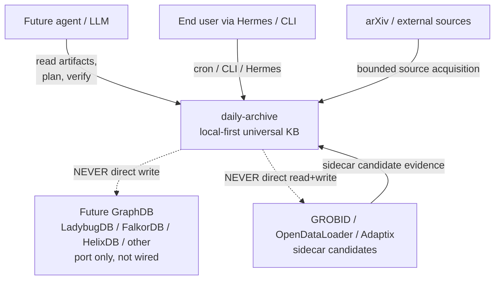
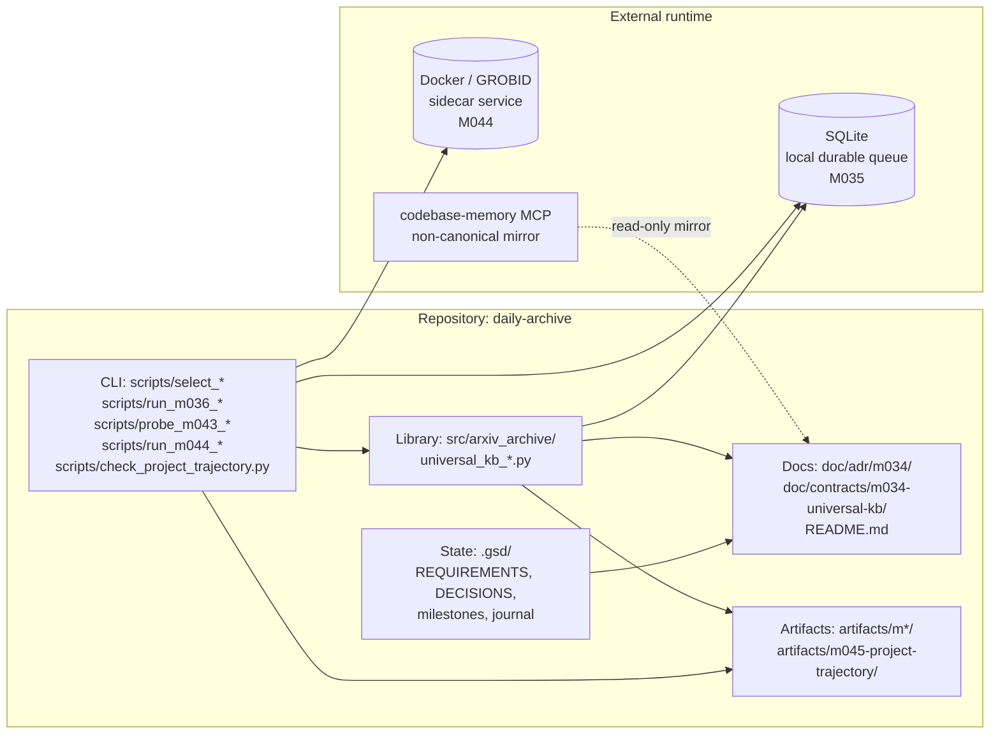
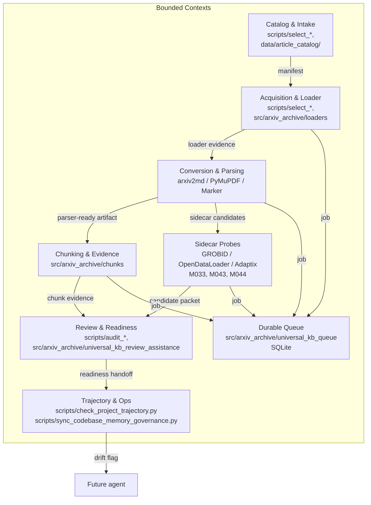
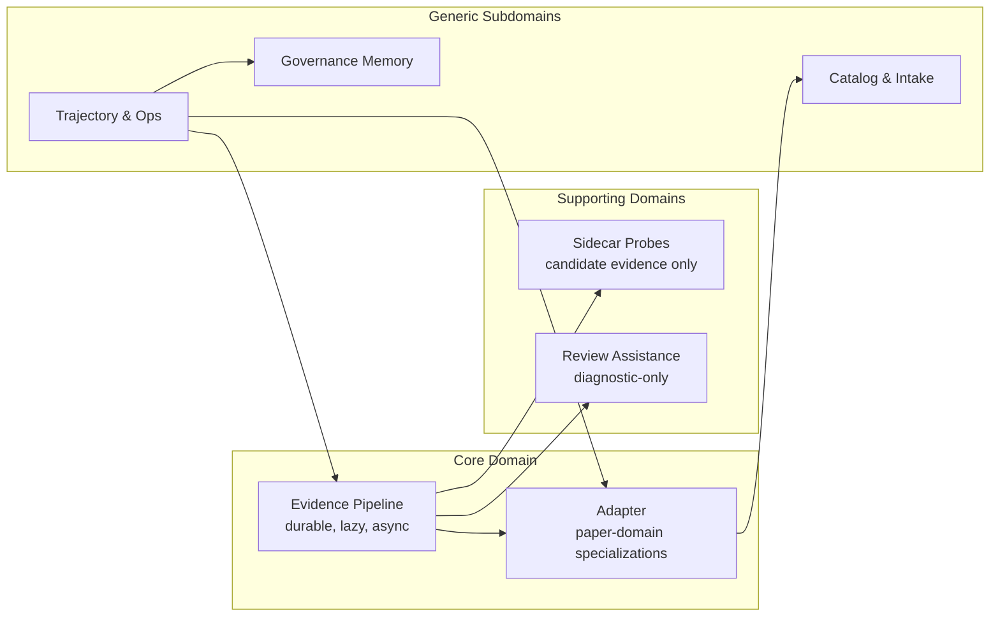
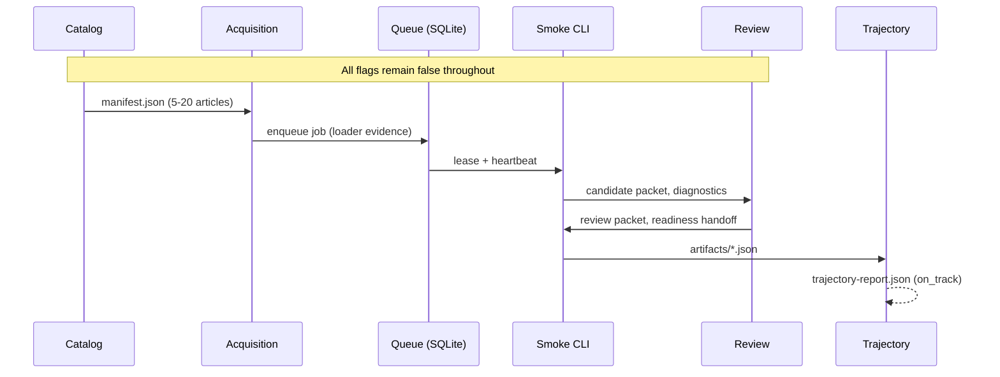
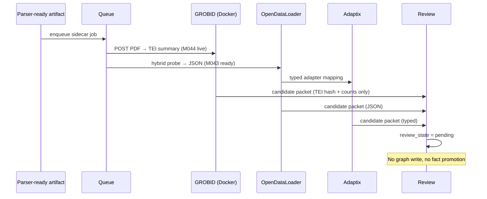

# 02 — Architecture Layers (C4-style with bounded contexts)

> **Source ADRs:** [ADR-000](../doc/adr/m034/ADR-000-universal-kb-north-star.md), [ADR-003](../doc/adr/m034/ADR-003-durable-lazy-async-evidence-pipeline.md), [ADR-004](../doc/adr/m034/ADR-004-sidecars-as-candidate-evidence-producers.md), [ADR-005](../doc/adr/m034/ADR-005-no-direct-extractor-to-graphdb-path.md)
> **Source milestones:** M033 (research), M035 (contracts/queue), M037 (control surface), M044 (guardrail), M045 (trajectory)
> **Synthesis layer:** 2 of 7

## 0. Layered View (C4 model)

The architecture is described at four levels, adapted from the C4 model:

| Level | Question | Audience |
|---|---|---|
| 1. System Context | what is daily-archive in its environment? | new agents, decision-makers |
| 2. Containers | what are the runtime / storage units? | engineers, ops |
| 3. Components | what are the bounded contexts and how do they talk? | module owners |
| 4. Code | where is the code? | contributors |

Safety boundaries (ADR-005) and north star (ADR-000) are cross-cutting at every level.

## 1. System Context (Level 1)

**Actors:**
- **Agent** (LLM, future runtime): reads artifacts, plans, verifies. Cannot write production state.
- **End user**: runs Hermes cron or CLI; reads `~/research/ops/sessions/...`.
- **arXiv / external sources**: bounded source acquisition, no network refresh unless explicitly authorized.
- **Future GraphDB**: port only, never wired today (ADR-002 deferred).
- **GROBID / OpenDataLoader / Adaptix**: sidecar candidates, not graph-ready parsers (ADR-004).

## 2. Containers (Level 2)

**Containers:**
- **CLI / scripts/** — entry points; all use `uv run python` (per R010 portability).
- **Library / src/arxiv_archive/** — frozen stdlib dataclasses (per D072), typed contracts, queue, smoke CLI.
- **Docs / doc/** — ADRs (Mermaid-assisted, LLM Reading Notes), contracts, status matrix.
- **Artifacts / artifacts/** — durable evidence per milestone.
- **State / .gsd/** — GSD requirements, decisions, milestone summaries, journal.
- **SQLite** — local durable queue (D073), not a distributed production queue.
- **Docker** — bounded GROBID service for live probes (M044, port 8070).
- **codebase-memory MCP** — non-canonical mirror, `canonical=false` (D075, D076).

## 3. Components (Level 3) — Bounded Contexts

The system has **eight bounded contexts**, each with explicit inputs, outputs, and fail-closed contracts.

### Bounded context contracts

| Context | Inputs | Outputs | Safety invariant |
|---|---|---|---|
| Catalog & Intake | user request, arXiv list | manifest.json, index.json | no raw text |
| Acquisition & Loader | manifest | source files, loader evidence | no network refresh unless authorized |
| Conversion & Parsing | source files | parser-ready artifacts + diagnostics | `graph_import_allowed=false` always |
| Chunking & Evidence | parser-ready artifacts | chunk packages with stable IDs | `import_eligible=false` until reviewed |
| Sidecar Probes | parser-ready artifacts | candidate packets (TEI summary, OpenDataLoader JSON, etc.) | candidates only, not graph truth |
| Review & Readiness | chunk evidence + sidecar candidates | review packets, readiness handoff | no promotion authority |
| Durable Queue | jobs from any context | durable job state, leases, heartbeats | no writes to GraphDB |
| Trajectory & Ops | all artifacts | drift flags, trajectory report, governance mirror | derived, non-canonical |

## 4. Code (Level 4)

### 4.1 Library: `src/arxiv_archive/`

Key files (full inventory in `04-module-map.md`):

| File | Role | ADR | R |
|---|---|---|---|
| `universal_kb_contracts.py` | frozen stdlib dataclasses, SafetyFlags | ADR-000, ADR-004 | R054, R055, R056 |
| `universal_kb_queue.py` | SQLite durable queue, leases, heartbeats | ADR-003 | R054, R055 |
| `universal_kb_sidecar_boundary.py` | Adaptix anti-corruption boundary | ADR-004 | R056 |
| `universal_kb_review_assistance.py` | diagnostic-only review packets, no LLM authority | ADR-006 | R038, R055 |
| `universal_kb_substrate_rehearsal.py` | substrate-port rehearsal, no real GraphDB | ADR-002, ADR-005 | R059 |
| `universal_kb_rehearsal.py` | integrated no-write rehearsal | ADR-005 | — |
| `universal_kb_smoke.py` | unified CLI: select/run/audit/verify/all | ADR-005, ADR-004 | R033, R037, R064 |
| `full_text.py` | local full-text ingestion boundary | — | R014 |

### 4.2 Scripts: `scripts/`

| Category | Examples | Milestone |
|---|---|---|
| Selection | `select_m036_*`, `select_m041_*` | M036, M041 |
| Smoke / Run | `run_m036_*`, `run_m044_*` | M036, M044 |
| Audit | `audit_m036_*`, `audit_m042_*` | M036, M042 |
| Probe | `probe_m033_*`, `probe_m043_*` | M033, M043 |
| Verifier | `verify_m033_*`, `verify_m034_*`, `verify_m035_*`, `verify_m036_*`, `verify_m044_*` | M033-M044 |
| Trajectory | `check_project_trajectory.py` | M045 |
| Governance | `sync_codebase_memory_governance.py` | M038, M039 |
| Repair | `repair_m042_linked_metadata.py` | M042 |

### 4.3 Docs: `doc/`

- `doc/adr/m034/ADR-{000,002,003,004,005,006,007}-*.md` — 7 of 8 ADRs (ADR-001 planned but not drafted)
- `doc/contracts/m034-universal-kb/STATUS-MATRIX.md` — status matrix
- `README.md` — primary entry doc, points to all verifiers

### 4.4 Artifacts: `artifacts/`

One directory per milestone: `m033-*`, `m034-*`, `m035-*`, `m036-*`, `m040-*`, `m041-*`, `m042-*`, `m043-*`, `m044-*`, `m045-*`. Plus the cross-cutting `m045-project-trajectory/`.

## 5. Bounded Contexts Map (DDD)

**Core domain**: Evidence Pipeline (durable, lazy, async — this is the project's differentiator).
**Supporting domains**: Sidecar Probes and Review Assistance.
**Generic subdomains**: Catalog, Trajectory, Governance Memory.

## 6. Data Flows

### 6.1 No-write smoke flow (M040+)

### 6.2 Sidecar probe flow (M043, M044)

## 7. Cross-Cutting Concerns

### 7.1 Safety (always-on)

- `graph_import_allowed=false` in every artifact
- `ladderdb_written=false` (or `graphdb_written=false` for substrate-port)
- `production_import_attempted=false`
- `import_eligible=false`
- `promotion_allowed=false`

These are checked by:
- M035 contracts (`SafetyFlags` source of truth)
- M035/M036/M037 verifiers
- M045 trajectory check (prohibited-claim scan with 4 regex + 11 counterterms)
- M044 architecture guardrail

### 7.2 Observability

- **Per-job events** in queue (M035)
- **Per-article continuity.json** (M040)
- **Aggregate summary.json** per batch
- **Audit JSON + Markdown** (M036, M041, M042)
- **Trajectory report** (M045, 7 dimensions)
- **Governance mirror** (`codebase-memory/adr.md`, M038)

### 7.3 Versioning

- Schema versions in artifact names: `m036-real-corpus-no-write-smoke.v1`, `m040-real-corpus-continuity.v1`
- Stale detection in queue (heartbeat-based)
- Verifiers check freshness before acceptance

## 8. Architecture Drift Watch (M044 guardrail)

The M044 architecture guardrail `scripts/verify_m044_sidecar_architecture_guardrail.py` enforces the following invariants and will fail if any drift:

- ADR-003 (durable lazy async evidence pipeline) is referenced
- ADR-004 (sidecars as candidate evidence) is referenced
- ADR-005 (no direct extractor to GraphDB) is referenced
- ADR-007 (quant-mind pattern source) is referenced
- D078 (candidate-only sidecar packets) is referenced
- D079 (architecture guardrail preflight) is referenced
- All artifacts have `graph_import_allowed=false`
- All artifacts have `import_eligible=false`

This guardrail must pass before any future sidecar / graph-readiness work.

## 9. LLM Reading Notes (binding)

- **Read this layer before any module-level work** to understand the system shape.
- **Do not assume** the bounded contexts are stable. The Trajectory & Ops context can refactor itself as new checks are added.
- **Safe next action** is to read `04-module-map.md` for the actual code, then `05-evidence-safety.md` for the safety contract.
- **Blocked** until the M045 trajectory check passes on the current state (re-run on demand).

## 10. Cross-References

- North star: `01-north-star.md`
- Decisions: `03-adr-decisions.md`
- Module map: `04-module-map.md`
- Safety: `05-evidence-safety.md`
- Trajectory: `06-trajectory-ops.md`
- Assessment: `07-2026-assessment.md`
