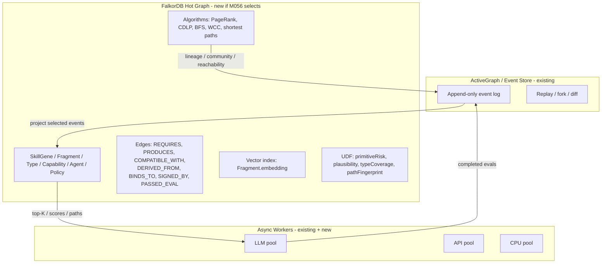

# 03 — FalkorDB Evaluation (M056 Candidate)

> **Source:** falkordb/falkordb on GitHub; docs.falkordb.com; ar5iv 1905.01294 (RedisGraph GraphBLAS)
> **Scope:** evaluation as candidate for M056 (GraphDB comparison matrix)
> **Verdict:** **serious candidate**; not pre-selected; M056 produces evidence, not selection

## 0. Reading Order

This file evaluates FalkorDB as a candidate for the daily-archive GraphDB selection (ADR-002 deferred). It does **not** pre-select FalkorDB. It provides the comparison criteria for M056.

Sections:

1. FalkorDB overview
2. What FalkorDB is good at (matches our needs)
3. What FalkorDB is not good at (limits and constraints)
4. Comparison criteria for M056
5. Architecture integration if selected
6. M056 matrix proposal

## 1. FalkorDB Overview

FalkorDB is a graph database with:

- **GraphBLAS under the hood** for sparse adjacency matrix representation
- **Cypher query language** (openCypher)
- **Vector index** with HNSW (1-4096 dimensions, cosine/euclidean)
- **UDFs (User-Defined Functions)** in JavaScript via `GRAPH.UDF LOAD` or client `udf_load`
- **Built-in algorithms**: BFS, PageRank, betweenness centrality, CDLP, label propagation, WCC, shortest paths, harmonic centrality, max flow
- **Redis module architecture** (in-memory, fast for read-heavy workloads)
- **Cluster mode** (Redis Cluster hash slots)

**Critical caveat:** FalkorDB UDFs are **JavaScript functions called from Cypher** that work with scalar, node, edge, path, collection. They have access to `graph` for traversal via `getNeighbors()`, `traverse()`, but **do NOT** expose raw GraphBLAS matrices or custom semiring kernels. UDFs are an "embeddable pure function layer," not a low-level GraphBLAS API.

**Source:** falkordb.com/blog/falkordb-udfs-javascript-graph-extension/, docs.falkordb.com/udfs/.

## 2. What FalkorDB is Good At (matches our needs)

| Daily-archive need | FalkorDB capability | Match |
|---|---|---|
| Vector index for semantic prefilter | HNSW vector index, 1-4096 dim | Yes |
| Graph traversal (BFS, multi-hop) | Native Cypher traversal, BFS algorithm | Yes |
| PageRank for trust/lineage | Built-in PageRank | Yes |
| Community detection for domain clusters | CDLP algorithm | Yes |
| Bounded candidate expansion | BFS with maxDepth | Yes |
| Filter by labels/relations/properties | Native Cypher WHERE | Yes |
| Cross-node similarity | Jaccard example in UDF docs | Yes (UDF) |
| Read-heavy workload | Optimized for RAM-resident | Yes (we have ~10-100 nodes in M043/M044 scope) |
| Concurrency for read queries | Multiple read queries in parallel | Yes |
| Simple scoring (risk, type coverage, plausibility) | UDFs as deterministic functions | Yes |

## 3. What FalkorDB is Not Good At (limits)

| Limit | Why it matters for us |
|---|---|
| **Single graph is one Redis key, lives on one shard** | Cluster distributes different graphs across shards, not one huge graph. Daily-archive will need to define graph boundaries: ontology, skill_registry, run_X, eval_batch_X. Cross-graph joins are hard. |
| **Write serialization per graph** | Multiple read-only queries parallel, but **one write at a time per graph**. Heavy write workloads bottleneck. We have bounded write load (audit + safety flags), so this is fine for us. |
| **UDFs are JavaScript only** | Cannot write custom GraphBLAS semiring in UDF. If we need that, we'd need a native procedure in C or external SuiteSparse worker. We don't have that need. |
| **UDFs cannot modify graph structure** | Writes happen via Cypher queries that call UDFs and then `SET`/`CREATE`. We need to structure writes as Cypher transactions, not UDF side effects. |
| **Vector index memory-intensive** | 1M vectors × 768 dim ≈ 3GB + HNSW overhead. We have ~100-1000 vectors, fine. |
| **Cluster hash slots mean single-graph not horizontally partitioned** | Daily-archive's corpus is small (10-20 articles per batch), so this is not a current concern. But if we grow to thousands of articles, we'd need graph boundary conventions. |
| **In-memory primary store** | All data lives in RAM. We have small data, fine. Production scale would need persistent backup. |
| **License: AGPL-3.0** | Most permissive copyleft. Compatible with our local-first project (we don't redistribute). For production, would need to check with deployment context. |
| **No native GraphBLAS API for UDFs** | For custom semiring, need C extension or external worker. We don't have this need. |

## 4. Comparison Criteria for M056

These criteria should be applied uniformly to **all three candidates** (LadybugDB, FalkorDB, HelixDB) in M056. FalkorDB's known answers are below; the other two are TBD in M056.

| Criterion | Weight | LadybugDB | FalkorDB | HelixDB | Notes |
|---|---:|---|---|---|---|
| **License** | high | Apache-2.0 (TBD) | AGPL-3.0 | BSD-3-Clause (TBD) | AGPL is copyleft but local-first compatible |
| **Locality** | high | Embedded Python | Redis module | Cloud (Cloudflare) | We need local-first; HelixDB ruled out unless self-hosted |
| **Local persistence** | high | Yes (file-based) | RAM + RDB/AOF | Cloud-only | File-based preferred |
| **Performance (insert, 1k nodes)** | medium | (TBD in M056) | (TBD in M056) | (TBD) | Same fixtures, same load |
| **Performance (query, multi-hop)** | medium | (TBD) | GraphBLAS-backed | (TBD) | PageRank, BFS |
| **Graph-vector support** | high | experimental | Yes (HNSW) | (TBD) | We need vector prefilter for hybrid retrieval |
| **Schema flexibility** | medium | Property-based | Property-based | (TBD) | Both flexible |
| **Write authorization** | critical | Substrate-port only (per ADR-002) | Single write per graph | (TBD) | Daily-archive never writes to GraphDB yet |
| **Read concurrency** | medium | (TBD) | Parallel | (TBD) | Multi-user read access |
| **Write serialization** | medium | (TBD) | Serialized per graph | (TBD) | Acceptable for our bounded write load |
| **Graph algorithms** | low | (TBD) | BFS, PageRank, CDLP, WCC, shortest paths, betweenness | (TBD) | Nice-to-have for M057+ |
| **UDF support** | low | (TBD) | JavaScript UDFs (limited GraphBLAS) | (TBD) | Useful for small deterministic scorers |
| **Cluster mode** | low | (TBD) | Redis Cluster (per-graph sharding) | Global | We don't need cluster today |
| **Operational complexity** | medium | Low (embedded) | Medium (Redis dependency) | Low (managed) | Local-first favors embedded |
| **Production readiness** | medium | M002 substrate | Mature | Production at Cloudflare | We have 5× false safety defaults; readiness = comparison only |
| **Document quality** | low | Adequate | Excellent | Good | Doc quality affects M056 effort |

**FalkorDB's strong scores:** GraphBLAS support, vector index, built-in algorithms, JavaScript UDFs, license compatibility (for local-first).

**FalkorDB's weak scores:** AGPL-3.0 (copyleft), Redis dependency, single-graph shard limit, write serialization per graph.

## 5. Architecture Integration if Selected

If M056 selects FalkorDB, the integration is:



**Graph boundary conventions (per FalkorDB's single-graph-per-shard model):**

- `graph: ontology_core` — types, primitive ontology, policy ontology
- `graph: skill_registry` — certified genes/fragments/capabilities
- `graph: run_<id>` — materialized run/fork projection
- `graph: eval_batch_<id>` — temporary per-eval graph

For M056 evaluation, we test on a bounded subset of these patterns.

## 6. M056 Matrix Proposal

For M056, the comparison should produce:

1. **Performance matrix** — same fixtures, same load, measure each GraphDB
   - Insert 1k nodes, measure throughput
   - Multi-hop query (depth 3), measure latency
   - Vector index query (top-100 from 10k vectors), measure recall and latency
   - PageRank on 1k node graph, measure time
2. **Feature matrix** — what each GraphDB supports
3. **Operational matrix** — local install, persistence, backup, monitoring
4. **License matrix** — copyleft implications, redistribution
5. **Decision matrix** — M056 produces this as evidence, NOT a decision

**Output:** `artifacts/m056-graphdb-comparison/matrix.{json,md}` with all four matrices.

**Decision:** ADR-002 stays Deferred. A **future** ADR-008 stub documents "future GraphDB selection awaits M056 evidence + production use case + safety review."

## 7. UDF Library Sketch (if FalkorDB selected)

```text
SkillGenomeUDF v0.1
  primitiveRisk(primitive, external, irreversible, generative) → int [1..10]
  chainRisk(primitives[]) → int [max of primitiveRisk + 1 for chain length > 3]
  plausibleChain(primitives[]) → bool
  typeCoverage(requiredTypes[], availableTypes[]) → float [0..1]
  pathFingerprint(primitives[], types[]) → sha256
  candidateScore(fragmentId, goalType, riskLimit) → float
```

**Important:** UDF code is **trusted infrastructure code**, not generated from external skills. Versioned explicitly (`SkillGenomeUDF_v0_1`, `v0_2`).

## 8. Cypher Examples (if FalkorDB selected)

```cypher
// Goal embedding → vector prefilter
CALL db.idx.vector.queryNodes('Fragment', 'embedding', 200, vecf32($goal_embedding))
YIELD node, score
WITH node AS f, score
WHERE f.status = 'active'
RETURN f.id, score
LIMIT 200

// Type/risk filter
MATCH (f:Fragment)-[:PRODUCES]->(out:Type)
MATCH (out)-[:COMPATIBLE_WITH*0..2]->(:Type {name: $target_type})
WITH f, SkillGenome.primitiveRisk(f.primitive, f.external, f.irreversible, f.generative) AS risk
WHERE risk <= $risk_limit
RETURN f.id, risk
ORDER BY risk ASC
LIMIT 100

// Lineage/trust rerank
MATCH (f:Fragment)
WHERE f.id IN $candidate_ids
OPTIONAL MATCH (f)<-[:DERIVED_FROM*0..3]-(desc:Fragment)
OPTIONAL MATCH (f)<-[:HAS_FRAGMENT]-(g:SkillGene)-[:SIGNED_BY]->(a:Agent)
WITH f,
     count(DISTINCT desc) AS descendants,
     avg(a.trust_score) AS signer_trust
RETURN
  f.id,
  descendants,
  signer_trust,
  f.lineage_rank,
  0.40 * coalesce(f.lineage_rank, 0.0)
  + 0.40 * coalesce(signer_trust, 0.0)
  + 0.20 * log(1 + descendants) AS graph_score
ORDER BY graph_score DESC
LIMIT 30

// PageRank
CALL algo.pageRank('Fragment', 'DERIVED_FROM')
YIELD node, score
SET node.lineage_rank = score
```

## 9. Risks if Selected

| Risk | Mitigation |
|---|---|
| AGPL-3.0 license compatibility issues | Local-first compatible; check deployment context |
| Redis dependency (operational) | M056 measures operational complexity; document |
| Single-graph shard limit (future scale) | Document graph boundary conventions in M058 ADR-008 stub |
| Write serialization per graph (write-heavy future) | If we ever write to GraphDB, batch writes; cache lineage in event log |
| UDF is JavaScript only (no raw GraphBLAS) | If we need custom semiring, post-M056 evaluation |
| Vector index memory | We have ~100-1000 vectors, fine; estimate at 768 dim |

## 10. LLM Reading Notes

- **FalkorDB is a serious candidate** for M056, not a pre-selection.
- **M056 produces evidence, not decision.** Decision comes in a future ADR-008 after M056 + production use case + safety review.
- **ADR-002 stays Deferred** regardless of M056 outcome. M056 is a **comparison**, not a **selection**.
- **UDFs are not write-runtime.** Writes happen via Cypher queries around UDF results.
- **Cluster mode is per-graph, not per-node.** This affects how we design graph boundaries in M058.

## 11. Cross-References

- ActiveGraph patterns: `01-activegraph-patterns.md`
- SkillGenome patterns: `02-skillgenome-patterns.md`
- Applicability matrix: `04-applicability-matrix.md`
- ADR-002: `doc/adr/m034/ADR-002-defer-final-graphdb-selection.md`
- M056 in roadmap: M046-3b7gp0 summary
