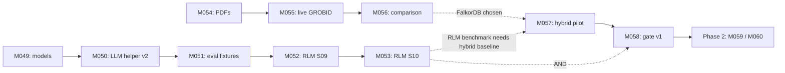

# 04 — Applicability Matrix and Non-Applicable Patterns

> **Scope:** pattern × milestone × track matrix; explicit "what we adopt" and "what we don't" with rationale
> **Verdict:** single source of truth for "where does each pattern apply" in daily-archive's roadmap

## 0. Reading Order

This file is the **single source of truth** for the patterns review. It maps every pattern (ActiveGraph, SkillGenome, FalkorDB) to:

- which milestone (M049-M058) consumes it
- which track (A or B) it lives in
- what tier (1 = immediate, 2 = after M056, 3 = deferred)
- effort estimate
- status (planned, applied, N/A)

Sections:

1. Master pattern × milestone matrix
2. Tier 1 patterns (immediate)
3. Tier 2 patterns (after M056)
4. Tier 3 patterns (non-applicable, with rationale)
5. Track A summary
6. Track B summary
7. Cross-track dependencies
8. Implementation priority

## 1. Master Pattern × Milestone Matrix

| Pattern | Source | Tier | Track | M049 | M050 | M051 | M052 | M053 | M054 | M055 | M056 | M057 | M058 | Phase 2 |
|---|---|---|---|---|---|---|---|---|---|---|---|---|---|---|
| **Serial audit + parallel workers** | ActiveGraph 3.1 | 1 | A |  | ✓ |  |  |  |  |  |  |  |  |  |
| **Cascaded gates** | SG-A / ActiveGraph 3.2 | 1 | A+B |  |  | ✓ |  | ✓ |  |  |  |  | ✓ | ✓ |
| **Plausibility gate** | SG-B | 1 | A |  |  | ✓ |  |  |  |  |  |  |  |  |
| **Deterministic work_id** | ActiveGraph 3.5 / SG-E | 1 | A | ✓ | ✓ |  | ✓ | ✓ |  |  |  |  |  |  |
| **Fingerprint dedupe** | SG-E | 1 | A | ✓ | ✓ |  |  |  |  |  |  |  |  |  |
| **Risk scoring (primitive-level)** | SG-F | 1 | A |  | ✓ |  |  |  |  |  |  |  |  |  |
| **Race / successive halving (methodology)** | SG-D | 1 | A |  |  | ✓ |  | ✓ |  |  |  |  | ✓ |  |
| **Deterministic merge** | ActiveGraph 3.6 | 1 | A |  | ✓ |  |  |  |  |  |  |  |  |  |
| **Mini event log (SQLite, M035)** | ActiveGraph 3.7 | already | A |  |  |  |  |  |  |  |  |  |  |  |
| **Content-addressed artifacts** | ActiveGraph 3.4 | already | A+B |  |  |  |  |  |  |  |  |  |  |  |
| **Vector index** | FalkorDB 5 / ActiveGraph 3.7 | 2 | B |  |  |  |  |  |  |  | △ | ✓ | △ |  |
| **Graph algorithms (PageRank, CDLP, BFS)** | FalkorDB 5 | 2 | B |  |  |  |  |  |  |  | △ | △ | △ |  |
| **UDFs (JavaScript, small deterministic)** | FalkorDB 5 | 2 | B |  |  |  |  |  |  |  | △ | △ | △ |  |
| **Graph sharding (per graph boundary)** | FalkorDB 10 | 2 | B |  |  |  |  |  |  |  | △ |  | ✓ |  |
| **DAG backward build** | SG-C | 3 (N/A) | — |  |  |  |  |  |  |  |  |  |  |  |
| **Linear permutation recombination** | SG-C | 3 (N/A) | — |  |  |  |  |  |  |  |  |  |  |  |
| **Canalization (n_runs=5)** | SG-D | 3 (N/A) | — |  |  |  |  |  |  |  |  |  |  |  |
| **Full ActiveGraph runtime (Postgres event store)** | ActiveGraph 1 | 3 (N/A) | — |  |  |  |  |  |  |  |  |  |  |  |
| **Distributed runtime** | ActiveGraph 1 | 3 (N/A) | — |  |  |  |  |  |  |  |  |  |  |  |
| **Custom GraphBLAS semiring in UDF** | FalkorDB 5 | 3 (N/A) | — |  |  |  |  |  |  |  |  |  |  |  |
| **Native C extensions for FalkorDB** | FalkorDB 15 | 3 (N/A) | — |  |  |  |  |  |  |  |  |  |  |  |

Legend: ✓ = applied, △ = depends on M056 outcome, blank = not applicable, "already" = existing pattern.

## 2. Tier 1 Patterns (Immediate)

These patterns are **already in the M049-M053 plan** via the original Track A roadmap. The patterns-review adds the architectural vocabulary, not new milestones.

### Pattern: Serial audit + parallel workers (M050)

**Source:** ActiveGraph 3.1
**Track:** A
**Milestone:** M050 (LLM helper v2)
**Effort:** small (1-2 days, already in M050 plan)
**Status:** planned
**Implementation:** `article_artifact_worker.py` with bounded ProcessPoolExecutor, `article_artifact_reducer.py` for deterministic merge
**Safety contract:** outputs diagnostic, no graph writes, no promotion authority (ADR-006)
**Anchor:** R051, R052, ADR-006

### Pattern: Cascaded gates (M051, M053, M058)

**Source:** SkillGenome SG-A / ActiveGraph 3.2
**Tracks:** A (M051, M053), B (M058)
**Effort:** medium (each milestone already planned, adds ~1 day for tier structure)
**Status:** planned
**Implementation:**
- M051: Tier 1 (fixture validity) → Tier 2 (M052 produces Classification) → Tier 3 (score against expected) → Tier 4 (debug if fail)
- M053: Tier 1 (all baselines × all fixtures) → Tier 2 (top 30% full suite) → Tier 3 (top 10% canalization) → Tier 4 (finalist)
- M058: Tier 1 (cheap, sync, safety flags + audit) → Tier 2 (R024/R027/R029 evidence) → Tier 3 (M057 hybrid + M053 RLM) → Tier 4 (structural diff for top-3-5)
**Anchor:** R020, R027, R029, R031, R032

### Pattern: Plausibility gate (M051)

**Source:** SkillGenome SG-B
**Track:** A
**Milestone:** M051 (eval fixtures)
**Effort:** small (1 day, included in M051 plan)
**Status:** planned
**Implementation:** `tests/fixtures/rlm/v0.1/plausibility.py` — small Python function for fixture chains; rejected fixtures explicitly marked
**Anchor:** R020, M051 contract

### Pattern: Deterministic work_id + fingerprint (M049, M050, M052, M053)

**Source:** ActiveGraph 3.5 / SkillGenome SG-E
**Track:** A
**Milestones:** M049, M050, M052, M053
**Effort:** small (1-2 days, distributed)
**Status:** planned
**Implementation:**
- M049: `models.yaml` schema includes `tool_version, policy_version`
- M050: helper computes `fingerprint = sha256(model_id + prompt_hash + input_hash + binding_id + tool_version + policy_version)`, checks cache, calls MiniMax, persists result
- M052/M053: trajectory capture with work_ids
**Anchor:** D074, R045, R020

### Pattern: Risk scoring (M050)

**Source:** SkillGenome SG-F
**Track:** A
**Milestone:** M050 (LLM helper v2)
**Effort:** small (included in M050 plan)
**Status:** planned
**Implementation:** `article_artifact_minimax.py` output Classification includes `risk_level` field via primitive-level scale
**Anchor:** ADR-006 (diagnostic only), M046 reverse_adr_audit

### Pattern: Race / successive halving (M051, M053, M058)

**Source:** SkillGenome SG-D
**Tracks:** A (M051, M053), B (M058)
**Effort:** methodology, not runtime
**Status:** planned
**Implementation:** explicit Tier 1 → Tier 2 → Tier 3 cascade in scripts
**Anchor:** R020 (eval), M053 (benchmark), M058 (gate)

### Pattern: Deterministic merge (M050)

**Source:** ActiveGraph 3.6
**Track:** A
**Milestone:** M050 (LLM helper v2)
**Effort:** small
**Status:** planned
**Implementation:** `article_artifact_reducer.py` — sorted by (work_id, primitive_index), first work.completed with expected work_id wins, duplicates are no-op
**Anchor:** idempotency contract

## 3. Tier 2 Patterns (After M056)

These patterns are **conditional on FalkorDB being selected** in M056. If LadybugDB is selected, vector index and graph algorithms are out of scope; if HelixDB is selected, similar limitations.

### Pattern: Vector index (M057)

**Source:** FalkorDB 5 / ActiveGraph 3.7
**Track:** B
**Milestone:** M057 (hybrid retrieval production-corpus pilot)
**Effort:** medium (1-2 days, M057 plan)
**Status:** conditional on M056 (FalkorDB)
**Implementation:** if FalkorDB, use HNSW vector index in M057 hybrid pilot; if LadybugDB, use external vector store (FAISS, Qdrant)
**Anchor:** R019, M057 plan

### Pattern: Graph algorithms (M057+)

**Source:** FalkorDB 5
**Track:** B
**Milestone:** M057+ (after M056)
**Effort:** TBD in M057
**Status:** conditional on M056 + corpus size
**Implementation:** if FalkorDB + we have graph with edges, use PageRank (lineage), CDLP (community), BFS (reachability)
**Anchor:** M057 plan, R019 (hybrid retrieval)

### Pattern: UDFs (M057+)

**Source:** FalkorDB 5
**Track:** B
**Milestone:** M057+ (after M056)
**Effort:** TBD in M057
**Status:** conditional on M056
**Implementation:** if FalkorDB, UDFs for small deterministic scorers (risk, plausibility, type coverage, path fingerprint)
**Anchor:** M058 (graph-readiness gate)

### Pattern: Graph sharding (M058)

**Source:** FalkorDB 10
**Track:** B
**Milestone:** M058 (graph-readiness gate v1)
**Effort:** small (documentation + conventions)
**Status:** conditional on M056
**Implementation:** if FalkorDB, document graph boundary conventions in M058 ADR-008 stub: `ontology_core`, `skill_registry`, `run_<id>`, `eval_batch_<id>`
**Anchor:** M058 plan, ADR-008 stub

## 4. Tier 3 Patterns (Non-Applicable, with Rationale)

| Pattern | Source | Why not adopted | What we use instead |
|---|---|---|---|
| **DAG backward build** | SkillGenome SG-C | Factorially expensive search; we have bounded candidate count (10-20 articles, dozens of fixtures) | Linear prefilter + linear benchmark |
| **Linear permutation recombination** | SkillGenome SG-C | O(n!) growth; overkill for our scale | M051/M053 linear eval |
| **Canalization (n_runs=5)** | SkillGenome SG-D | Bounded fixtures (5-10 articles); single-run + post-hoc variance analysis is sufficient | M053 single-run methodology |
| **Full ActiveGraph runtime (Postgres event store)** | ActiveGraph 1 | Overkill for bounded scope; daily-archive is not long-running-agent | M035 SQLite queue + events |
| **Distributed runtime** | ActiveGraph 1 | Single-assistant / single-machine scope | Local ProcessPoolExecutor (1-2 workers) |
| **Custom GraphBLAS semiring in UDF** | FalkorDB 5 | Not exposed via JS UDFs; we don't have this need anyway | N/A |
| **Native C extensions for FalkorDB** | FalkorDB 15 | We don't have this need at our scale | N/A |
| **Genome model (genes, fragments, types)** | SkillGenome | daily-archive has scientific articles, not skills to recombine | M035 contracts (no genome needed) |
| **LLM encoding of SKILL.md** | SkillGenome | We don't encode skills; we call MiniMax for specific tasks | M050 direct MiniMax calls |
| **Eval harness as full gate stack** | SkillGenome | We have M035 contracts + M044 guardrail | Extend with Plausibility (M051) |
| **`Body-Hash → chain` cache** | SkillGenome | We use fingerprint per call, smaller scope | M050 fingerprint cache |
| **`MAX_BODY_CHARS = 8000`** | SkillGenome | SkillGenome-specific; we have our own input limits | M050 input validation |

**Key principle:** patterns we don't adopt are **not failures** — they are correct decisions for our bounded scope. Documenting this is the value of the patterns-review.

## 5. Track A Summary

```
QW (done) → M049 (1-2d) → M050 (1-2d) → M051 (1d) → M052 (1-2d) → M053 (1-2d)
                ↓            ↓            ↓            ↓            ↓
              models      worker pool  plausibility  RLM tests   benchmark
              registry    + work_id    + fixtures    + capture   + race
              + scope     + cache      + R020 gate   + work_id
```

**Patterns applied:** serial audit + parallel workers, deterministic work_id, fingerprint dedupe, risk scoring, cascaded gates, plausibility gate, race/successive halving (methodology), deterministic merge, mini event log, content-addressed artifacts.

**Total effort:** 5-9 days sequential; 4-6 days if M049+M051 done in parallel with M050 prep.

## 6. Track B Summary

```
QW (done) → M054 (2-3d) → M055 (2-3d) → M056 (3-4d) → M057 (2-3d) → M058 (2-3d)
                ↓             ↓             ↓             ↓             ↓
              PDFs          live GROBID   comparison    hybrid        gate
              + bounded     + sidecar     matrix        pilot         v1
              retry                      (FalkorDB    (conditional)  + cascaded
                                         as candidate)               gates
```

**Patterns applied (M054-M055):** content-addressed artifacts, mini event log (M035).

**Patterns applied (M056):** none (M056 produces evidence, not patterns).

**Patterns applied (M057+ conditional on M056):** vector index, graph algorithms, UDFs, graph sharding.

**Total effort:** 12-18 days sequential; 8-12 days with M055/M056 parallel and M057+ conditional.

## 7. Cross-Track Dependencies



**Critical touchpoints:**

- A2 (M050) needs A1 (M049) for fingerprint inputs
- A3 (M051) needs A2 (M050) for tool inventory
- A4 (M052) needs A3 (M051) for eval gate (R020)
- A5 (M053) needs B4 (M057) for one-hop graph baseline; falls back to M003 S06 fixture-level if M057 delayed
- B4 (M057) needs B2 (M055) for parser evidence + B3 (M056) for GraphDB choice
- B5 (M058) needs B4 (M057) for graph evidence

**No cross-track dependency** between A1-A4 and B1-B3, allowing parallel work.

## 8. Implementation Priority

**Order of implementation (priority × effort × safety):**

1. **M049 (1-2d)** — foundation, low risk, no behavioral change. Start here.
2. **M054 (2-3d)** — independent Track B foundation, network-bound. Can run parallel with M049.
3. **M050 (1-2d)** — Track A foundation, depends on M049. Critical for Track A.
4. **M055 (2-3d)** — Track B extension, depends on M054. Important for parser evidence.
5. **M051 (1d)** — Track A eval gate, depends on M050. Quick win.
6. **M056 (3-4d)** — Track B comparison, can start in parallel with M051 (different surface). Critical for M057+ Tier 2 patterns.
7. **M052 (1-2d)** — Track A RLM tests, depends on M051.
8. **M057 (2-3d, conditional)** — Track B hybrid pilot, depends on M055+M056.
9. **M053 (1-2d)** — Track A RLM benchmark, depends on M052+M057 (or fallback).
10. **M058 (2-3d)** — Track B gate v1, depends on M057. Last milestone in Phase 1.
11. **Phase 2: M059 or M060** — convergence.

**Total Phase 1:** 5-9 days (Track A) + 12-18 days (Track B) = 17-27 days sequential. With parallelism: 10-15 days.

## 9. LLM Reading Notes

- **This matrix is the single source of truth.** If a pattern is not in the matrix, it's not applied.
- **Tier 1 patterns are immediate** and integrated into existing M049-M053 plans.
- **Tier 2 patterns are conditional** on M056 outcome. If LadybugDB wins, they don't apply.
- **Tier 3 patterns are explicitly non-applicable** with rationale. Future scale may revisit.
- **Cross-track parallel work is real** for M049-M054 (no dependency between A and B until M053/M057).

## 10. Cross-References

- INDEX: `00-INDEX.md`
- ActiveGraph patterns: `01-activegraph-patterns.md`
- SkillGenome patterns: `02-skillgenome-patterns.md`
- FalkorDB evaluation: `03-falkordb-evaluation.md`
- M046 synthesis: `artifacts/m046-synthesis/`
- Roadmap: M049-M058 in M046-3b7gp0 summary
- ADRs: `doc/adr/m034/`
