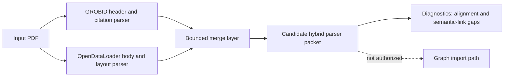

# M055 Parser Benchmark Report

Schema version: `m055-parser-benchmark-report.v1`
Generated at: `2026-06-10T10:53:26+00:00`
Milestone evidence: `M054-proc4f` / benchmark artifact namespace `m055-parser-benchmark`
Decision target: ADR-008 Hybrid Parser Architecture

## Executive Summary

The benchmark compared **5 PDFs** across **6 dimensions**: metadata, citations, processing time, body content, layout, and quality.
The aggregate routing result is **100% hybrid recommendation** across all benchmarked PDFs.
The recommended architecture is **grobid_header + opendataloader_body** for every PDF in the corpus.
GROBID wins the dimensions where native scholarly-paper semantics matter most: metadata, citations, and processing time.
OpenDataLoader wins the dimensions where markdown body extraction and layout fidelity matter most: body_content, layout, and quality.
The result does not authorize graph import, production import, or LadybugDB writes; this is a parser architecture benchmark only.
The report therefore recommends a bounded hybrid parser pipeline rather than a single-parser replacement.

### Executive Finding

> Use GROBID for header/citation extraction and OpenDataLoader for body/table/layout extraction, then merge the outputs through a bounded reconciliation layer before any graph-facing promotion path.

### Evidence Snapshot

| Evidence | Value |
| --- | --- |
| PDFs benchmarked | 5 |
| Dimensions evaluated | 6 |
| Hybrid recommendation | 100% |
| Recommended route | grobid_header + opendataloader_body |
| GROBID wins | metadata, citations, processing_time |
| OpenDataLoader wins | body_content, layout, quality |
| Safety posture | all five safety defaults false |

## Input Artifact Inventory

The report is derived from previously completed S02, S03, and S04 artifacts.
It does not rerun parsers and does not mutate benchmark inputs.

| Slice | Artifact | Schema | Role |
| --- | --- | --- | --- |
| S02 | artifacts/m055-parser-benchmark/grobid-only/summary.json | m055-parser-benchmark.grobid-only.v1 | GROBID-only baseline summary |
| S03 | artifacts/m055-parser-benchmark/opendataloader-only/summary.json | m055-parser-benchmark.opendataloader-only.v1 | OpenDataLoader-only baseline summary |
| S04 | artifacts/m055-parser-benchmark/hybrid-routing/summary.json | m055-parser-benchmark.hybrid-routing.v1 | Hybrid routing comparison |
| S01 | artifacts/m055-parser-benchmark/corpus-manifest.json | manifest | Five-PDF benchmark corpus |

### Aggregate Parser Metrics

| Metric | GROBID | OpenDataLoader |
| --- | --- | --- |
| Successful packets | 0 | 5 |
| Low-quality-source packets | 5 | 0 |
| Total TEI bytes | n/a | n/a |
| Total markdown bytes | n/a | 430802 |
| Total references | n/a | n/a |
| Total bibliography entries | n/a | n/a |
| Total body elements | n/a | n/a |
| Total pages | n/a | 130 |
| Total sections | n/a | 191 |
| Total tables | n/a | 93 |
| Total images | n/a | 54 |
| Total bounding boxes | n/a | 3384 |

## Per-PDF Summary Table

This table satisfies the benchmark reporting contract: `arxiv_id | category | pages | GROBID TEI metrics | OpenDataLoader md metrics | recommended route`.

| arxiv_id | category | pages | GROBID TEI metrics | OpenDataLoader md metrics | recommended route |
| --- | --- | --- | --- | --- | --- |
| 1804.02767 | cs-cv | 6 | TEI 3029 bytes; refs 1; bibls 1; body 0 | MD 24399 bytes; sections 17; tables 18; images 4; boxes 316 | grobid_header + opendataloader_body |
| 2108.12409 | cs-cl | 25 | TEI 4247 bytes; refs 1; bibls 1; body 0 | MD 76334 bytes; sections 4; tables 49; images 2; boxes 660 | grobid_header + opendataloader_body |
| 2109.10862 | cs-cl | 37 | TEI 5227 bytes; refs 1; bibls 1; body 0 | MD 129612 bytes; sections 82; tables 8; images 31; boxes 676 | grobid_header + opendataloader_body |
| 2111.00396 | cs-lg | 32 | TEI 4764 bytes; refs 1; bibls 1; body 0 | MD 97453 bytes; sections 51; tables 14; images 12; boxes 892 | grobid_header + opendataloader_body |
| 2203.14465 | cs-lg | 30 | TEI 4410 bytes; refs 1; bibls 1; body 0 | MD 103004 bytes; sections 37; tables 4; images 5; boxes 840 | grobid_header + opendataloader_body |

## Per-Dimension Winner Analysis

The six benchmark dimensions split cleanly into two parser responsibilities.
No evaluated dimension requires a single-parser winner for all downstream work.

| Dimension | Benchmark winner | GROBID wins | OpenDataLoader wins | Ties | Interpretation |
| --- | --- | --- | --- | --- | --- |
| body_content | OpenDataLoader | 0 | 5 | 0 | Body content extraction |
| citations | GROBID | 5 | 0 | 0 | Native citation and bibliography extraction |
| layout | OpenDataLoader | 0 | 5 | 0 | Layout, tables, figures, and bounding boxes |
| metadata | GROBID | 5 | 0 | 0 | Metadata and header extraction |
| processing_time | GROBID | 5 | 0 | 0 | Processing time |
| quality | OpenDataLoader | 0 | 5 | 0 | Operational source quality |

### metadata: GROBID

- GROBID exposes title, author count, and abstract presence from native header extraction.
- OpenDataLoader does not provide the same scholarly metadata contract in the benchmark packets.
- The header stage should therefore stay GROBID-owned.
- Routing implication: use GROBID output in the merged packet.

### citations: GROBID

- GROBID exposes native reference and bibliography counts.
- OpenDataLoader packets do not expose native citation extraction.
- Citation extraction should therefore stay GROBID-owned until a better citation-specific parser is proven.
- Routing implication: use GROBID output in the merged packet.

### processing_time: GROBID

- GROBID won processing time for every PDF in the S04 routing packet set.
- This is a diagnostic win, not a reason to use GROBID for body extraction.
- The hybrid route accepts the faster header path while preserving OpenDataLoader body fidelity.
- Routing implication: use GROBID output in the merged packet.

### body_content: OpenDataLoader

- OpenDataLoader emits substantial markdown bodies for all five PDFs.
- GROBID header-only packets have zero body elements in this benchmark configuration.
- Body extraction should therefore stay OpenDataLoader-owned.
- Routing implication: use OpenDataLoader output in the merged packet.

### layout: OpenDataLoader

- OpenDataLoader emits page counts, table counts, image counts, and bounding-box counts.
- GROBID header packets do not expose comparable layout signals.
- Layout-sensitive paper evidence should therefore stay OpenDataLoader-owned.
- Routing implication: use OpenDataLoader output in the merged packet.

### quality: OpenDataLoader

- OpenDataLoader had five successful packets and zero low-quality-source packets.
- GROBID header packets were useful but marked low_quality_source because the configured endpoint is header-only.
- Quality scoring should therefore distinguish useful header semantics from insufficient full-document extraction.
- Routing implication: use OpenDataLoader output in the merged packet.

## Per-PDF Detail Tables

### PDF 1804.02767

Category: `cs-cv`
Pages: `6`
Recommended route: `grobid_header + opendataloader_body`

| Metric family | GROBID | OpenDataLoader | Winner |
| --- | --- | --- | --- |
| metadata | title=True; authors=2; abstract=True | no native scholarly header contract | grobid |
| citations | refs=1; bibls=1 | no native citation extraction | grobid |
| processing_time | 1347 ms | 1563 ms | grobid |
| body_content | body_elements=0 | markdown=24399 bytes; sections=17 | opendataloader |
| layout | no native layout packet | tables=18; images=4; boxes=316 | opendataloader |
| quality | low_quality_source=True | low_quality_source=False | opendataloader |

#### Routing Notes

- Use the GROBID packet for title, author count, abstract presence, references, and bibliography counts.
- Use the OpenDataLoader packet for markdown body, page-level layout, tables, images, sections, and bounding boxes.
- Preserve both packet identifiers and manifest hashes so downstream reconciliation can trace each merged field.
- Treat the merged packet as candidate evidence only; it is not authorized for graph writes.

#### Residual Gaps

- `citation_to_body_alignment` (medium): GROBID citations and OpenDataLoader body/layout are separate outputs; neither parser produces aligned citation spans in the markdown body.
- `table_figure_semantic_linking` (medium): OpenDataLoader detects tables/images, but neither parser links them to normalized citations or graph-ready semantic entities.

#### Per-PDF Decision Record

| Field | Value |
| --- | --- |
| arxiv_id | 1804.02767 |
| route | grobid_header + opendataloader_body |
| GROBID-owned dimensions | metadata, citations, processing_time |
| OpenDataLoader-owned dimensions | body_content, layout, quality |
| safety defaults | all false |

### PDF 2108.12409

Category: `cs-cl`
Pages: `25`
Recommended route: `grobid_header + opendataloader_body`

| Metric family | GROBID | OpenDataLoader | Winner |
| --- | --- | --- | --- |
| metadata | title=True; authors=3; abstract=True | no native scholarly header contract | grobid |
| citations | refs=1; bibls=1 | no native citation extraction | grobid |
| processing_time | 1191 ms | 2726 ms | grobid |
| body_content | body_elements=0 | markdown=76334 bytes; sections=4 | opendataloader |
| layout | no native layout packet | tables=49; images=2; boxes=660 | opendataloader |
| quality | low_quality_source=True | low_quality_source=False | opendataloader |

#### Routing Notes

- Use the GROBID packet for title, author count, abstract presence, references, and bibliography counts.
- Use the OpenDataLoader packet for markdown body, page-level layout, tables, images, sections, and bounding boxes.
- Preserve both packet identifiers and manifest hashes so downstream reconciliation can trace each merged field.
- Treat the merged packet as candidate evidence only; it is not authorized for graph writes.

#### Residual Gaps

- `citation_to_body_alignment` (medium): GROBID citations and OpenDataLoader body/layout are separate outputs; neither parser produces aligned citation spans in the markdown body.
- `table_figure_semantic_linking` (medium): OpenDataLoader detects tables/images, but neither parser links them to normalized citations or graph-ready semantic entities.

#### Per-PDF Decision Record

| Field | Value |
| --- | --- |
| arxiv_id | 2108.12409 |
| route | grobid_header + opendataloader_body |
| GROBID-owned dimensions | metadata, citations, processing_time |
| OpenDataLoader-owned dimensions | body_content, layout, quality |
| safety defaults | all false |

### PDF 2109.10862

Category: `cs-cl`
Pages: `37`
Recommended route: `grobid_header + opendataloader_body`

| Metric family | GROBID | OpenDataLoader | Winner |
| --- | --- | --- | --- |
| metadata | title=True; authors=7; abstract=True | no native scholarly header contract | grobid |
| citations | refs=1; bibls=1 | no native citation extraction | grobid |
| processing_time | 1260 ms | 5022 ms | grobid |
| body_content | body_elements=0 | markdown=129612 bytes; sections=82 | opendataloader |
| layout | no native layout packet | tables=8; images=31; boxes=676 | opendataloader |
| quality | low_quality_source=True | low_quality_source=False | opendataloader |

#### Routing Notes

- Use the GROBID packet for title, author count, abstract presence, references, and bibliography counts.
- Use the OpenDataLoader packet for markdown body, page-level layout, tables, images, sections, and bounding boxes.
- Preserve both packet identifiers and manifest hashes so downstream reconciliation can trace each merged field.
- Treat the merged packet as candidate evidence only; it is not authorized for graph writes.

#### Residual Gaps

- `citation_to_body_alignment` (medium): GROBID citations and OpenDataLoader body/layout are separate outputs; neither parser produces aligned citation spans in the markdown body.
- `table_figure_semantic_linking` (medium): OpenDataLoader detects tables/images, but neither parser links them to normalized citations or graph-ready semantic entities.

#### Per-PDF Decision Record

| Field | Value |
| --- | --- |
| arxiv_id | 2109.10862 |
| route | grobid_header + opendataloader_body |
| GROBID-owned dimensions | metadata, citations, processing_time |
| OpenDataLoader-owned dimensions | body_content, layout, quality |
| safety defaults | all false |

### PDF 2111.00396

Category: `cs-lg`
Pages: `32`
Recommended route: `grobid_header + opendataloader_body`

| Metric family | GROBID | OpenDataLoader | Winner |
| --- | --- | --- | --- |
| metadata | title=True; authors=3; abstract=True | no native scholarly header contract | grobid |
| citations | refs=1; bibls=1 | no native citation extraction | grobid |
| processing_time | 1316 ms | 5023 ms | grobid |
| body_content | body_elements=0 | markdown=97453 bytes; sections=51 | opendataloader |
| layout | no native layout packet | tables=14; images=12; boxes=892 | opendataloader |
| quality | low_quality_source=True | low_quality_source=False | opendataloader |

#### Routing Notes

- Use the GROBID packet for title, author count, abstract presence, references, and bibliography counts.
- Use the OpenDataLoader packet for markdown body, page-level layout, tables, images, sections, and bounding boxes.
- Preserve both packet identifiers and manifest hashes so downstream reconciliation can trace each merged field.
- Treat the merged packet as candidate evidence only; it is not authorized for graph writes.

#### Residual Gaps

- `citation_to_body_alignment` (medium): GROBID citations and OpenDataLoader body/layout are separate outputs; neither parser produces aligned citation spans in the markdown body.
- `table_figure_semantic_linking` (medium): OpenDataLoader detects tables/images, but neither parser links them to normalized citations or graph-ready semantic entities.

#### Per-PDF Decision Record

| Field | Value |
| --- | --- |
| arxiv_id | 2111.00396 |
| route | grobid_header + opendataloader_body |
| GROBID-owned dimensions | metadata, citations, processing_time |
| OpenDataLoader-owned dimensions | body_content, layout, quality |
| safety defaults | all false |

### PDF 2203.14465

Category: `cs-lg`
Pages: `30`
Recommended route: `grobid_header + opendataloader_body`

| Metric family | GROBID | OpenDataLoader | Winner |
| --- | --- | --- | --- |
| metadata | title=True; authors=5; abstract=True | no native scholarly header contract | grobid |
| citations | refs=1; bibls=1 | no native citation extraction | grobid |
| processing_time | 1179 ms | 2964 ms | grobid |
| body_content | body_elements=0 | markdown=103004 bytes; sections=37 | opendataloader |
| layout | no native layout packet | tables=4; images=5; boxes=840 | opendataloader |
| quality | low_quality_source=True | low_quality_source=False | opendataloader |

#### Routing Notes

- Use the GROBID packet for title, author count, abstract presence, references, and bibliography counts.
- Use the OpenDataLoader packet for markdown body, page-level layout, tables, images, sections, and bounding boxes.
- Preserve both packet identifiers and manifest hashes so downstream reconciliation can trace each merged field.
- Treat the merged packet as candidate evidence only; it is not authorized for graph writes.

#### Residual Gaps

- `citation_to_body_alignment` (medium): GROBID citations and OpenDataLoader body/layout are separate outputs; neither parser produces aligned citation spans in the markdown body.
- `table_figure_semantic_linking` (medium): OpenDataLoader detects tables/images, but neither parser links them to normalized citations or graph-ready semantic entities.

#### Per-PDF Decision Record

| Field | Value |
| --- | --- |
| arxiv_id | 2203.14465 |
| route | grobid_header + opendataloader_body |
| GROBID-owned dimensions | metadata, citations, processing_time |
| OpenDataLoader-owned dimensions | body_content, layout, quality |
| safety defaults | all false |

## Gap Analysis

The benchmark recommends a hybrid parser architecture, but the recommendation is not a complete graph-ingestion design.
The residual gaps are the work items that the next implementation milestone must retire before any graph-facing path is considered.

| Gap | Affected PDFs | Severity | Required response |
| --- | --- | --- | --- |
| citation_to_body_alignment | 5 | medium | Handle in M057 merge/reconciliation pilot |
| table_figure_semantic_linking | 5 | medium | Handle in M057 merge/reconciliation pilot |

### Gap 1: citation_to_body_alignment

- GROBID citations and OpenDataLoader body markdown currently live in separate packet namespaces.
- Neither parser emits aligned citation spans inside the markdown body in the current benchmark output.
- A merger must preserve provenance and should not synthesize citation alignment without evidence.
- M057 should produce explicit alignment diagnostics before any downstream promotion path is opened.

### Gap 2: table_figure_semantic_linking

- OpenDataLoader detects tables, images, and bounding boxes, but these are not normalized into semantic entities.
- GROBID does not solve table or figure semantics in the header-only benchmark route.
- A merger may carry layout artifacts forward, but it must mark semantic links as unresolved until proven.
- M057 should keep table/figure linkage candidate-only unless a reviewer or deterministic rule validates it.

### Non-Gaps Confirmed by M055

- Parser availability is sufficient for a bounded pilot because both per-PDF packet families exist for all five PDFs.
- The route is stable across the corpus because all five PDFs choose the same hybrid architecture.
- Safety defaults are stable because every S02/S03/S04 packet keeps the five non-authorization flags false.
- The result is operationally useful because it tells M057 exactly which parser owns each field family.

## Reconciliation with M033 and M043 Evidence

M055 does not replace the earlier architecture evidence; it narrows the parser choice inside the existing safety frame.

| Prior evidence | Constraint carried forward | M055 reconciliation |
| --- | --- | --- |
| M033 | Candidate evidence must remain bounded before graph promotion. | Hybrid parser packets remain candidate evidence and do not authorize import. |
| M033 | Sidecar-style evidence producers are acceptable when boundaries are explicit. | GROBID and OpenDataLoader are separate sidecar producers feeding a bounded merge layer. |
| M043 | Prior parser evidence showed OpenDataLoader body/layout usefulness but did not settle scholarly header/citation ownership. | M055 confirms OpenDataLoader for body/layout and adds GROBID ownership for metadata/citations. |
| ADR-001 | Scientific papers are the first proving domain and require citations, figures, tables, sections, source spans, and review burden. | Hybrid parser architecture better covers paper-domain needs than either parser alone. |
| M048 pattern 3.1 | Bounded candidate generation must be explicit. | The merge layer must carry candidate-only provenance. |
| M048 pattern 3.4 | Promotion requires checks separate from extraction. | Parser success is not semantic truth and is not graph authorization. |
| M048 pattern 3.6 | Diagnostics must be reviewable and reproducible. | Per-PDF packets plus this report form a reproducible benchmark trail. |

### Safety Reading

The benchmark is evidence for a parser architecture, not evidence for production readiness.
The architecture remains inside the existing non-authorization boundary: graph writes, production imports, and LadybugDB writes are not authorized.
This distinction is important because a 100% route recommendation can otherwise be mistaken for 100% ingestion readiness.

## Five-Flag Safety Defaults

All benchmark-derived artifacts and this report preserve the five safety defaults as false.
These defaults are binding for M055 and must be carried into M057 unless a later accepted ADR explicitly changes them.

```json
{
  "graph_import_allowed": false,
  "graphdb_written": false,
  "import_eligible": false,
  "ladybugdb_written": false,
  "production_import_attempted": false
}
```

| Flag | Default | Meaning |
| --- | --- | --- |
| graph_import_allowed | false | No parser output may be imported into a graph as part of M055. |
| graphdb_written | false | No graph database write occurred. |
| import_eligible | false | Benchmark packets are not eligible for production import. |
| ladybugdb_written | false | No LadybugDB write occurred. |
| production_import_attempted | false | No production import was attempted. |

Safety sentence for trajectory scanning: graph import is not authorized, production import is not authorized, and LadybugDB writes are not authorized by this benchmark report.

## Recommendation

Adopt **grobid_header + opendataloader_body** as the binding parser architecture for the next implementation pilot.
The decision should be captured in ADR-008 and implemented in M057 as a real hybrid parser pilot.
M057 should not attempt production import; it should build, test, and observe the merger boundary first.

### Required M057 Implementation Shape

1. Read one PDF and invoke both parser paths independently.
2. Keep raw GROBID and OpenDataLoader packet provenance intact.
3. Merge GROBID metadata/citations with OpenDataLoader body/layout into a candidate packet.
4. Emit diagnostics for citation-to-body alignment and table/figure semantic linking gaps.
5. Keep all five safety defaults false unless a later accepted ADR explicitly authorizes a new state.
6. Treat benchmark success as a routing proof, not as semantic correctness proof.

### D067 Mermaid-Assisted Architecture Diagram



### Decision Boundary

- Authorized by M055: choosing the hybrid parser architecture for implementation planning.
- Not authorized by M055: graph import, production import, fact promotion, or LadybugDB writes.
- Required next proof: M057 must show the merger produces observable, reviewable candidate packets.

## Appendix A: Reproducibility Checklist

- The corpus manifest lists exactly five PDFs.
- GROBID per-PDF packets exist for exactly the five manifest IDs.
- OpenDataLoader per-PDF packets exist for exactly the five manifest IDs.
- Hybrid routing per-PDF packets exist for exactly the five manifest IDs.
- The aggregate route count is five for `grobid_header + opendataloader_body`.
- The safety defaults are false in S02, S03, S04, and this report.
- The report schema is `m055-parser-benchmark-report.v1`.

## Appendix B: Field Ownership Contract

| Hybrid packet field family | Owning source | Reason | M057 obligation |
| --- | --- | --- | --- |
| title | GROBID | native header extraction | preserve source packet pointer |
| authors | GROBID | native header extraction | preserve source packet pointer |
| abstract | GROBID | native header extraction | preserve source packet pointer |
| references | GROBID | native citation extraction | preserve citation packet pointer |
| bibliography | GROBID | native bibliography extraction | preserve citation packet pointer |
| markdown_body | OpenDataLoader | substantial markdown body output | preserve markdown artifact path |
| sections | OpenDataLoader | section count and markdown structure | preserve section diagnostics |
| tables | OpenDataLoader | table detection in markdown/layout | mark semantic links unresolved |
| images | OpenDataLoader | image detection in markdown/layout | mark semantic links unresolved |
| bounding_boxes | OpenDataLoader | layout packet support | preserve layout artifact path |

## Appendix C: Reader Notes for Future Agents

- Do not reinterpret this report as a production import approval.
- Do not delete the GROBID path because OpenDataLoader has better body output.
- Do not delete the OpenDataLoader path because GROBID has better header/citation output.
- Do not collapse the merger into a single parser abstraction until M057 proves the reconciliation contract.
- Do preserve per-field provenance in every candidate hybrid packet.
- Do keep the English phrase `is not authorized` in safety-critical docs scanned by trajectory tooling.

## Appendix D: Per-PDF Route Audit

### Audit 1804.02767

- Route: `grobid_header + opendataloader_body`
- GROBID-owned dimensions: metadata, citations, processing_time.
- OpenDataLoader-owned dimensions: body_content, layout, quality.
- Safety defaults: all false.
- Remaining proof burden: merger diagnostics, alignment gaps, and semantic-link gaps.

### Audit 2108.12409

- Route: `grobid_header + opendataloader_body`
- GROBID-owned dimensions: metadata, citations, processing_time.
- OpenDataLoader-owned dimensions: body_content, layout, quality.
- Safety defaults: all false.
- Remaining proof burden: merger diagnostics, alignment gaps, and semantic-link gaps.

### Audit 2109.10862

- Route: `grobid_header + opendataloader_body`
- GROBID-owned dimensions: metadata, citations, processing_time.
- OpenDataLoader-owned dimensions: body_content, layout, quality.
- Safety defaults: all false.
- Remaining proof burden: merger diagnostics, alignment gaps, and semantic-link gaps.

### Audit 2111.00396

- Route: `grobid_header + opendataloader_body`
- GROBID-owned dimensions: metadata, citations, processing_time.
- OpenDataLoader-owned dimensions: body_content, layout, quality.
- Safety defaults: all false.
- Remaining proof burden: merger diagnostics, alignment gaps, and semantic-link gaps.

### Audit 2203.14465

- Route: `grobid_header + opendataloader_body`
- GROBID-owned dimensions: metadata, citations, processing_time.
- OpenDataLoader-owned dimensions: body_content, layout, quality.
- Safety defaults: all false.
- Remaining proof burden: merger diagnostics, alignment gaps, and semantic-link gaps.

## Appendix E: Report Integrity Statement

This report is generated from local JSON benchmark artifacts and is intended to be deterministic except for the generation timestamp.
If any source packet changes, rerun `uv run python scripts/render_m055_report.py` and re-run the S05 tests.
If the route changes away from 100% hybrid, ADR-008 must be reconsidered before M057 implementation work proceeds.
