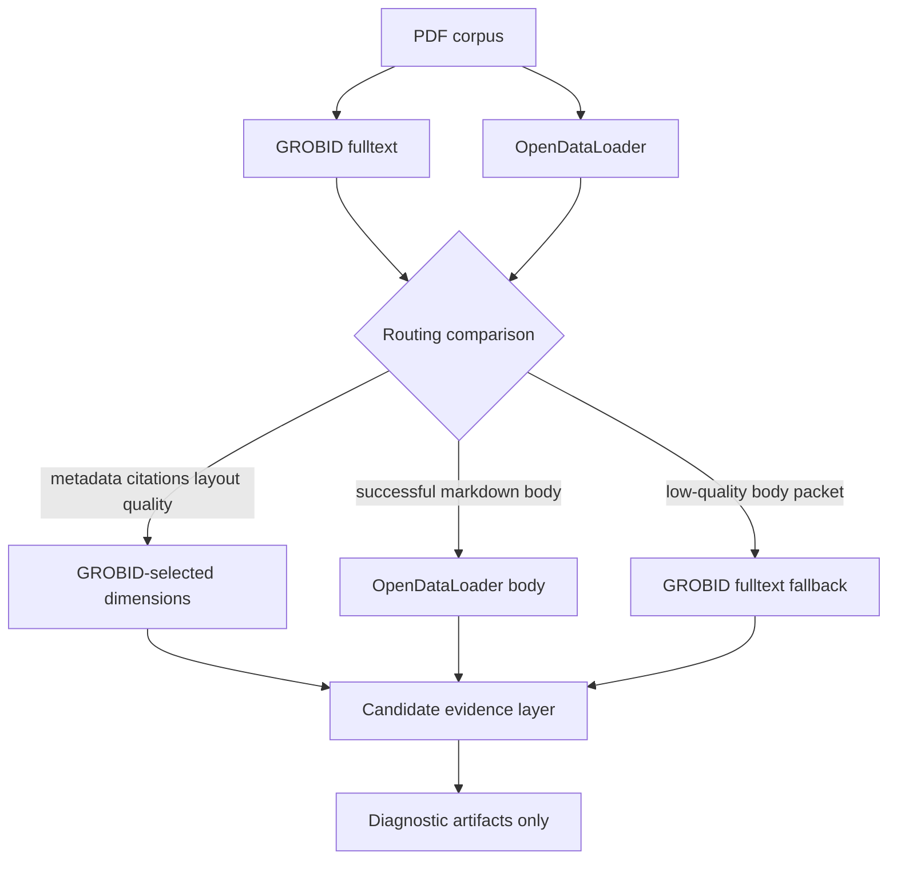

# M055deep Parser Benchmark Report

## Executive Summary

M055deep extends the M055 parser benchmark from a 5-PDF, header-oriented routing decision to a 20-PDF fulltext comparison.
GROBID fulltext dominates five dimensions in aggregate: metadata, citations, native TEI layout, processing-time plurality, and quality.
OpenDataLoader remains the aggregate body-content winner when its markdown extraction succeeds and is not low-quality.
The resulting route is hybrid for 19/20 PDFs (95.00%) and GROBID-fulltext-only for one OpenDataLoader low-quality medium-length PDF.
This amends the operational interpretation of ADR-008: hybrid remains the default, but fulltext-aware per-PDF fallback is required.
Production import is not authorized by this evidence package.

## Mermaid Architecture Diagram



## Five Evidence Axes

### Axis 1: GROBID header-only vs fulltext delta on 5 PDFs

- S01 fulltext succeeded on 5/5 PDFs.
- Fulltext body elements increased from header-only absence to 3,617 total TEI body elements.
- The 5-PDF route stayed at 100.0% hybrid, but fulltext shifted layout and quality evidence toward GROBID.

### Axis 2: OpenDataLoader correctness on 5 PDFs

- S02 correctness packets confirmed OpenDataLoader markdown/body usefulness across 5 PDFs.
- OpenDataLoader remains the body-content winner where markdown is successful and not low-quality.
- The evidence still does not authorize graph writes or fact promotion.

### Axis 3: 20-PDF GROBID fulltext metrics

- S04 GROBID fulltext succeeded on 20/20 PDFs.
- Totals: refs=2,226, body=15,474, equations=686, figures=385, bibliography=1,105.
- This proves GROBID fulltext is no longer merely a header/citation source for this corpus.

### Axis 4: 20-PDF OpenDataLoader metrics

- S04 OpenDataLoader succeeded on 19/20 PDFs with 1 low-quality source.
- Totals: markdown bytes=2,139,759, tables=350, images=420.
- OpenDataLoader remains the best body renderer when the packet is successful, but it now needs a per-PDF quality gate.

### Axis 5: 20-PDF hybrid routing

- S05 recommends hybrid routing for 19/20 PDFs (95.00%).
- Route counts: {'grobid_fulltext + opendataloader_body': 19, 'grobid_fulltext_only': 1}.
- Per-dimension winners are GROBID for metadata, citations, layout, processing-time plurality, and quality; OpenDataLoader wins body_content in aggregate.

## Per-PDF Routing Table

| # | arXiv ID | Bucket | Pages | GROBID refs | GROBID body | GROBID eq | GROBID fig | ODL status | ODL markdown bytes | ODL tables | ODL images | Route |
| ---: | --- | --- | ---: | ---: | ---: | ---: | ---: | --- | ---: | ---: | ---: | --- |
| 1 | 1804.02767 | short | 6 | 30 | 114 | 3 | 3 | success | 24,399 | 18 | 4 | grobid_fulltext + opendataloader_body |
| 2 | 2108.12409 | medium | 25 | 134 | 1,353 | 0 | 25 | success | 76,334 | 49 | 2 | grobid_fulltext + opendataloader_body |
| 3 | 2109.10862 | long | 37 | 219 | 564 | 1 | 9 | success | 129,612 | 8 | 31 | grobid_fulltext + opendataloader_body |
| 4 | 2111.00396 | long | 32 | 178 | 1,129 | 55 | 17 | success | 97,453 | 14 | 12 | grobid_fulltext + opendataloader_body |
| 5 | 2203.14465 | medium | 30 | 108 | 457 | 5 | 15 | success | 103,004 | 4 | 5 | grobid_fulltext + opendataloader_body |
| 6 | 2512.24601 | long | 43 | 139 | 731 | 2 | 31 | success | 139,621 | 0 | 30 | grobid_fulltext + opendataloader_body |
| 7 | 2605.28617v1 | medium | 19 | 82 | 319 | 2 | 4 | low_quality_source | 82,491 | 0 | 0 | grobid_fulltext_only |
| 8 | 2507.19457 | long | 96 | 156 | 1,407 | 24 | 25 | success | 280,486 | 58 | 16 | grobid_fulltext + opendataloader_body |
| 9 | 2605.26525v1 | long | 63 | 201 | 1,358 | 12 | 58 | success | 184,834 | 17 | 84 | grobid_fulltext + opendataloader_body |
| 10 | 2603.04448 | medium | 18 | 82 | 466 | 0 | 7 | success | 69,994 | 6 | 61 | grobid_fulltext + opendataloader_body |
| 11 | 2604.18478 | medium | 16 | 30 | 371 | 12 | 3 | success | 41,044 | 1 | 0 | grobid_fulltext + opendataloader_body |
| 12 | 2605.20897 | long | 168 | 73 | 1,911 | 431 | 50 | success | 364,931 | 70 | 20 | grobid_fulltext + opendataloader_body |
| 13 | 2605.21401 | medium | 28 | 48 | 1,124 | 5 | 36 | success | 63,273 | 0 | 16 | grobid_fulltext + opendataloader_body |
| 14 | 2605.25522 | medium | 13 | 158 | 355 | 7 | 16 | success | 78,438 | 67 | 2 | grobid_fulltext + opendataloader_body |
| 15 | 2606.11169v1 | medium | 15 | 135 | 387 | 0 | 10 | success | 85,529 | 27 | 3 | grobid_fulltext + opendataloader_body |
| 16 | 2606.11173v1 | long | 31 | 74 | 562 | 21 | 26 | success | 65,833 | 0 | 11 | grobid_fulltext + opendataloader_body |
| 17 | 2606.11182v1 | medium | 19 | 80 | 445 | 4 | 11 | success | 53,486 | 10 | 4 | grobid_fulltext + opendataloader_body |
| 18 | 2606.11188v1 | medium | 18 | 103 | 949 | 8 | 11 | success | 65,369 | 0 | 95 | grobid_fulltext + opendataloader_body |
| 19 | 2606.11189v1 | medium | 24 | 135 | 1,201 | 61 | 16 | success | 68,838 | 0 | 11 | grobid_fulltext + opendataloader_body |
| 20 | 2606.11190v1 | medium | 21 | 61 | 271 | 33 | 12 | success | 64,790 | 1 | 13 | grobid_fulltext + opendataloader_body |

## Per-Dimension Winner Analysis

| Dimension | Aggregate winner | GROBID wins | OpenDataLoader wins | Ties | None | Interpretation |
| --- | --- | ---: | ---: | ---: | ---: | --- |
| metadata | grobid | 20 | 0 | 0 | 0 | GROBID fulltext preserves native header extraction. |
| citations | grobid | 20 | 0 | 0 | 0 | GROBID exposes native reference and bibliography counts. |
| body_content | opendataloader | 1 | 19 | 0 | 0 | OpenDataLoader usually provides richer markdown body/table/image evidence, except one low-quality fallback. |
| layout | grobid | 20 | 0 | 0 | 0 | GROBID fulltext now contributes TEI sections, figures, and equations; ODL packets do not expose native bounding boxes. |
| processing_time | grobid | 10 | 6 | 4 | 0 | GROBID is the plurality winner, though latency varies by PDF. |
| quality | grobid | 20 | 0 | 0 | 0 | GROBID has 20/20 successful fulltext packets; OpenDataLoader has one low-quality source. |

## Length-Bucket Patterns

| Bucket | PDF count | Hybrid count | Hybrid percent | Routes | arXiv IDs |
| --- | ---: | ---: | ---: | --- | --- |
| short | 1 | 1 | 100.00% | grobid_fulltext + opendataloader_body: 1 | 1804.02767 |
| medium | 12 | 11 | 91.67% | grobid_fulltext + opendataloader_body: 11, grobid_fulltext_only: 1 | 2108.12409, 2203.14465, 2603.04448, 2604.18478, 2605.21401, 2605.25522, 2605.28617v1, 2606.11169v1, 2606.11182v1, 2606.11188v1, 2606.11189v1, 2606.11190v1 |
| long | 7 | 7 | 100.00% | grobid_fulltext + opendataloader_body: 7 | 2109.10862, 2111.00396, 2507.19457, 2512.24601, 2605.20897, 2605.26525v1, 2606.11173v1 |

Observed pattern: short and long PDFs stayed 100% hybrid, while the medium bucket had one OpenDataLoader low-quality source and therefore one GROBID-fulltext-only fallback.
The result argues for fulltext-aware fallback rather than a blanket 100% hybrid assumption.

## Safety Defaults

The benchmark and report are diagnostic only. Production import is not authorized.

| Flag | Value |
| --- | --- |
| `graph_import_allowed` | `false` |
| `graphdb_written` | `false` |
| `import_eligible` | `false` |
| `ladybugdb_written` | `false` |
| `production_import_attempted` | `false` |

These defaults are repeated in the S05 routing summary and per-PDF packets.
Graph writes, LadybugDB writes, fact promotion, and production import are not authorized by this report.

## Reconciliation With Prior Evidence

### M055 five-PDF benchmark

M055 S04 recommended 100% hybrid routing on five PDFs using GROBID header/citation evidence and OpenDataLoader body/layout evidence.
M055deep preserves the 5-PDF hybrid decision on the overlapping PDFs but changes the reason: GROBID fulltext now wins layout and quality while OpenDataLoader remains the body renderer.
This means ADR-008 remains directionally correct, but its implementation rule must become fulltext-aware.

### M033 prior evidence

M033 established that scientific-paper ingestion needs conservative evidence gates before promotion.
M055deep is consistent with that posture: the benchmark emits diagnostic packets only and production import is not authorized.
The new evidence improves parser selection but does not relax validation, provenance, or fact-promotion requirements.

### M043 prior evidence

M043 emphasized operational guardrails and bounded side effects for parser-adjacent workflows.
M055deep follows the same boundary: parser metrics are artifacts, not writes to graph stores or downstream serving layers.
The fulltext-aware fallback should be implemented as a bounded routing rule with observable reasons and failure states.

## Recommendation

Adopt ADR-009 as an amendment to ADR-008.
Keep hybrid routing as the default path for successful OpenDataLoader markdown packets.
Use GROBID fulltext as the fallback body parser when OpenDataLoader is low-quality, unavailable, or below the markdown evidence threshold.
Continue using GROBID fulltext for metadata, citations, TEI structural layout, and parser-quality diagnostics.
Do not authorize graph writes, LadybugDB writes, production import, or fact promotion from this benchmark report.

## Machine-Readable Summary

```json
{
  "hybrid_percent": 95.0,
  "length_bucket_patterns": {
    "long": {
      "arxiv_ids": [
        "2109.10862",
        "2111.00396",
        "2507.19457",
        "2512.24601",
        "2605.20897",
        "2605.26525v1",
        "2606.11173v1"
      ],
      "hybrid_pdf_count": 7,
      "hybrid_percent": 100.0,
      "pdf_count": 7,
      "route_counts": {
        "grobid_fulltext + opendataloader_body": 7
      }
    },
    "medium": {
      "arxiv_ids": [
        "2108.12409",
        "2203.14465",
        "2603.04448",
        "2604.18478",
        "2605.21401",
        "2605.25522",
        "2605.28617v1",
        "2606.11169v1",
        "2606.11182v1",
        "2606.11188v1",
        "2606.11189v1",
        "2606.11190v1"
      ],
      "hybrid_pdf_count": 11,
      "hybrid_percent": 91.67,
      "pdf_count": 12,
      "route_counts": {
        "grobid_fulltext + opendataloader_body": 11,
        "grobid_fulltext_only": 1
      }
    },
    "short": {
      "arxiv_ids": [
        "1804.02767"
      ],
      "hybrid_pdf_count": 1,
      "hybrid_percent": 100.0,
      "pdf_count": 1,
      "route_counts": {
        "grobid_fulltext + opendataloader_body": 1
      }
    }
  },
  "per_dimension_winner": {
    "body_content": "opendataloader",
    "citations": "grobid",
    "layout": "grobid",
    "metadata": "grobid",
    "processing_time": "grobid",
    "quality": "grobid"
  },
  "route_counts": {
    "grobid_fulltext + opendataloader_body": 19,
    "grobid_fulltext_only": 1
  },
  "safety_defaults": {
    "graph_import_allowed": false,
    "graphdb_written": false,
    "import_eligible": false,
    "ladybugdb_written": false,
    "production_import_attempted": false
  },
  "schema_version": "m055deep-parser-benchmark-report.v1",
  "total_pdfs": 20
}
```

## Per-PDF Detail Notes

### 1. 1804.02767

- Length bucket: `short` (6 pages estimated).
- Recommended route: `grobid_fulltext + opendataloader_body` with `high` confidence.
- Route rationale: Measured winners split across parsers, so route each dimension to the parser that won it.
- Use GROBID for: metadata, citations, layout.
- Use OpenDataLoader for: body_content.
- GROBID fulltext metrics: refs=30, bibliography=22, body=114, equations=3, figures=3, sections=11.
- OpenDataLoader metrics: status=`success`, markdown_bytes=24,399, tables=18, images=4, sections=17.
- Dimension winners: metadata=grobid, citations=grobid, body_content=opendataloader, layout=grobid, processing_time=opendataloader, quality=grobid.
- Metadata rationale: GROBID fulltext preserves native header metadata; OpenDataLoader packets do not expose native metadata fields.
- Body rationale: OpenDataLoader exposes successful non-low-quality markdown body evidence above the routing threshold, with table/image/section adjuncts.
- Layout rationale: GROBID fulltext exposes semantic TEI layout cues; OpenDataLoader bounding boxes remain residual geometry rather than the primary fulltext routing target.
- Residual gaps: citation_to_body_alignment, table_figure_semantic_linking, latency_variance.
- Safety note: graph writes and production import are not authorized for this PDF.

### 2. 2108.12409

- Length bucket: `medium` (25 pages estimated).
- Recommended route: `grobid_fulltext + opendataloader_body` with `high` confidence.
- Route rationale: Measured winners split across parsers, so route each dimension to the parser that won it.
- Use GROBID for: metadata, citations, layout.
- Use OpenDataLoader for: body_content.
- GROBID fulltext metrics: refs=134, bibliography=45, body=1,353, equations=0, figures=25, sections=16.
- OpenDataLoader metrics: status=`success`, markdown_bytes=76,334, tables=49, images=2, sections=4.
- Dimension winners: metadata=grobid, citations=grobid, body_content=opendataloader, layout=grobid, processing_time=opendataloader, quality=grobid.
- Metadata rationale: GROBID fulltext preserves native header metadata; OpenDataLoader packets do not expose native metadata fields.
- Body rationale: OpenDataLoader exposes successful non-low-quality markdown body evidence above the routing threshold, with table/image/section adjuncts.
- Layout rationale: GROBID fulltext exposes semantic TEI layout cues; OpenDataLoader bounding boxes remain residual geometry rather than the primary fulltext routing target.
- Residual gaps: citation_to_body_alignment, table_figure_semantic_linking, latency_variance.
- Safety note: graph writes and production import are not authorized for this PDF.

### 3. 2109.10862

- Length bucket: `long` (37 pages estimated).
- Recommended route: `grobid_fulltext + opendataloader_body` with `high` confidence.
- Route rationale: Measured winners split across parsers, so route each dimension to the parser that won it.
- Use GROBID for: metadata, citations, layout.
- Use OpenDataLoader for: body_content.
- GROBID fulltext metrics: refs=219, bibliography=86, body=564, equations=1, figures=9, sections=55.
- OpenDataLoader metrics: status=`success`, markdown_bytes=129,612, tables=8, images=31, sections=82.
- Dimension winners: metadata=grobid, citations=grobid, body_content=opendataloader, layout=grobid, processing_time=grobid, quality=grobid.
- Metadata rationale: GROBID fulltext preserves native header metadata; OpenDataLoader packets do not expose native metadata fields.
- Body rationale: OpenDataLoader exposes successful non-low-quality markdown body evidence above the routing threshold, with table/image/section adjuncts.
- Layout rationale: GROBID fulltext exposes semantic TEI layout cues; OpenDataLoader bounding boxes remain residual geometry rather than the primary fulltext routing target.
- Residual gaps: citation_to_body_alignment, table_figure_semantic_linking.
- Safety note: graph writes and production import are not authorized for this PDF.

### 4. 2111.00396

- Length bucket: `long` (32 pages estimated).
- Recommended route: `grobid_fulltext + opendataloader_body` with `high` confidence.
- Route rationale: Measured winners split across parsers, so route each dimension to the parser that won it.
- Use GROBID for: metadata, citations, layout.
- Use OpenDataLoader for: body_content.
- GROBID fulltext metrics: refs=178, bibliography=51, body=1,129, equations=55, figures=17, sections=56.
- OpenDataLoader metrics: status=`success`, markdown_bytes=97,453, tables=14, images=12, sections=51.
- Dimension winners: metadata=grobid, citations=grobid, body_content=opendataloader, layout=grobid, processing_time=grobid, quality=grobid.
- Metadata rationale: GROBID fulltext preserves native header metadata; OpenDataLoader packets do not expose native metadata fields.
- Body rationale: OpenDataLoader exposes successful non-low-quality markdown body evidence above the routing threshold, with table/image/section adjuncts.
- Layout rationale: GROBID fulltext exposes semantic TEI layout cues; OpenDataLoader bounding boxes remain residual geometry rather than the primary fulltext routing target.
- Residual gaps: citation_to_body_alignment, table_figure_semantic_linking.
- Safety note: graph writes and production import are not authorized for this PDF.

### 5. 2203.14465

- Length bucket: `medium` (30 pages estimated).
- Recommended route: `grobid_fulltext + opendataloader_body` with `high` confidence.
- Route rationale: Measured winners split across parsers, so route each dimension to the parser that won it.
- Use GROBID for: metadata, citations, layout.
- Use OpenDataLoader for: body_content.
- GROBID fulltext metrics: refs=108, bibliography=39, body=457, equations=5, figures=15, sections=38.
- OpenDataLoader metrics: status=`success`, markdown_bytes=103,004, tables=4, images=5, sections=37.
- Dimension winners: metadata=grobid, citations=grobid, body_content=opendataloader, layout=grobid, processing_time=tie, quality=grobid.
- Metadata rationale: GROBID fulltext preserves native header metadata; OpenDataLoader packets do not expose native metadata fields.
- Body rationale: OpenDataLoader exposes successful non-low-quality markdown body evidence above the routing threshold, with table/image/section adjuncts.
- Layout rationale: GROBID fulltext exposes semantic TEI layout cues; OpenDataLoader bounding boxes remain residual geometry rather than the primary fulltext routing target.
- Residual gaps: citation_to_body_alignment, table_figure_semantic_linking, latency_variance.
- Safety note: graph writes and production import are not authorized for this PDF.

### 6. 2512.24601

- Length bucket: `long` (43 pages estimated).
- Recommended route: `grobid_fulltext + opendataloader_body` with `high` confidence.
- Route rationale: Measured winners split across parsers, so route each dimension to the parser that won it.
- Use GROBID for: metadata, citations, layout.
- Use OpenDataLoader for: body_content.
- GROBID fulltext metrics: refs=139, bibliography=50, body=731, equations=2, figures=31, sections=51.
- OpenDataLoader metrics: status=`success`, markdown_bytes=139,621, tables=0, images=30, sections=64.
- Dimension winners: metadata=grobid, citations=grobid, body_content=opendataloader, layout=grobid, processing_time=grobid, quality=grobid.
- Metadata rationale: GROBID fulltext preserves native header metadata; OpenDataLoader packets do not expose native metadata fields.
- Body rationale: OpenDataLoader exposes successful non-low-quality markdown body evidence above the routing threshold, with table/image/section adjuncts.
- Layout rationale: GROBID fulltext exposes semantic TEI layout cues; OpenDataLoader bounding boxes remain residual geometry rather than the primary fulltext routing target.
- Residual gaps: citation_to_body_alignment, table_figure_semantic_linking.
- Safety note: graph writes and production import are not authorized for this PDF.

### 7. 2605.28617v1

- Length bucket: `medium` (19 pages estimated).
- Recommended route: `grobid_fulltext_only` with `medium` confidence.
- Route rationale: All routing dimensions with decisive winners favor GROBID fulltext for this PDF.
- Use GROBID for: metadata, citations, body_content, layout.
- Use OpenDataLoader for: none.
- GROBID fulltext metrics: refs=82, bibliography=51, body=319, equations=2, figures=4, sections=41.
- OpenDataLoader metrics: status=`low_quality_source`, markdown_bytes=82,491, tables=0, images=0, sections=40.
- Dimension winners: metadata=grobid, citations=grobid, body_content=grobid, layout=grobid, processing_time=opendataloader, quality=grobid.
- Metadata rationale: GROBID fulltext preserves native header metadata; OpenDataLoader packets do not expose native metadata fields.
- Body rationale: OpenDataLoader body evidence is unavailable, below threshold, or low-quality for this PDF; GROBID fulltext still exposes body structure.
- Layout rationale: GROBID fulltext exposes semantic TEI layout cues; OpenDataLoader bounding boxes remain residual geometry rather than the primary fulltext routing target.
- Residual gaps: opendataloader_low_quality_body, latency_variance.
- Safety note: graph writes and production import are not authorized for this PDF.

### 8. 2507.19457

- Length bucket: `long` (96 pages estimated).
- Recommended route: `grobid_fulltext + opendataloader_body` with `high` confidence.
- Route rationale: Measured winners split across parsers, so route each dimension to the parser that won it.
- Use GROBID for: metadata, citations, layout.
- Use OpenDataLoader for: body_content.
- GROBID fulltext metrics: refs=156, bibliography=81, body=1,407, equations=24, figures=25, sections=69.
- OpenDataLoader metrics: status=`success`, markdown_bytes=280,486, tables=58, images=16, sections=69.
- Dimension winners: metadata=grobid, citations=grobid, body_content=opendataloader, layout=grobid, processing_time=opendataloader, quality=grobid.
- Metadata rationale: GROBID fulltext preserves native header metadata; OpenDataLoader packets do not expose native metadata fields.
- Body rationale: OpenDataLoader exposes successful non-low-quality markdown body evidence above the routing threshold, with table/image/section adjuncts.
- Layout rationale: GROBID fulltext exposes semantic TEI layout cues; OpenDataLoader bounding boxes remain residual geometry rather than the primary fulltext routing target.
- Residual gaps: citation_to_body_alignment, table_figure_semantic_linking, latency_variance.
- Safety note: graph writes and production import are not authorized for this PDF.

### 9. 2605.26525v1

- Length bucket: `long` (63 pages estimated).
- Recommended route: `grobid_fulltext + opendataloader_body` with `high` confidence.
- Route rationale: Measured winners split across parsers, so route each dimension to the parser that won it.
- Use GROBID for: metadata, citations, layout.
- Use OpenDataLoader for: body_content.
- GROBID fulltext metrics: refs=201, bibliography=79, body=1,358, equations=12, figures=58, sections=63.
- OpenDataLoader metrics: status=`success`, markdown_bytes=184,834, tables=17, images=84, sections=31.
- Dimension winners: metadata=grobid, citations=grobid, body_content=opendataloader, layout=grobid, processing_time=grobid, quality=grobid.
- Metadata rationale: GROBID fulltext preserves native header metadata; OpenDataLoader packets do not expose native metadata fields.
- Body rationale: OpenDataLoader exposes successful non-low-quality markdown body evidence above the routing threshold, with table/image/section adjuncts.
- Layout rationale: GROBID fulltext exposes semantic TEI layout cues; OpenDataLoader bounding boxes remain residual geometry rather than the primary fulltext routing target.
- Residual gaps: citation_to_body_alignment, table_figure_semantic_linking.
- Safety note: graph writes and production import are not authorized for this PDF.

### 10. 2603.04448

- Length bucket: `medium` (18 pages estimated).
- Recommended route: `grobid_fulltext + opendataloader_body` with `high` confidence.
- Route rationale: Measured winners split across parsers, so route each dimension to the parser that won it.
- Use GROBID for: metadata, citations, layout.
- Use OpenDataLoader for: body_content.
- GROBID fulltext metrics: refs=82, bibliography=54, body=466, equations=0, figures=7, sections=34.
- OpenDataLoader metrics: status=`success`, markdown_bytes=69,994, tables=6, images=61, sections=31.
- Dimension winners: metadata=grobid, citations=grobid, body_content=opendataloader, layout=grobid, processing_time=grobid, quality=grobid.
- Metadata rationale: GROBID fulltext preserves native header metadata; OpenDataLoader packets do not expose native metadata fields.
- Body rationale: OpenDataLoader exposes successful non-low-quality markdown body evidence above the routing threshold, with table/image/section adjuncts.
- Layout rationale: GROBID fulltext exposes semantic TEI layout cues; OpenDataLoader bounding boxes remain residual geometry rather than the primary fulltext routing target.
- Residual gaps: citation_to_body_alignment, table_figure_semantic_linking.
- Safety note: graph writes and production import are not authorized for this PDF.

### 11. 2604.18478

- Length bucket: `medium` (16 pages estimated).
- Recommended route: `grobid_fulltext + opendataloader_body` with `high` confidence.
- Route rationale: Measured winners split across parsers, so route each dimension to the parser that won it.
- Use GROBID for: metadata, citations, layout.
- Use OpenDataLoader for: body_content.
- GROBID fulltext metrics: refs=30, bibliography=17, body=371, equations=12, figures=3, sections=37.
- OpenDataLoader metrics: status=`success`, markdown_bytes=41,044, tables=1, images=0, sections=32.
- Dimension winners: metadata=grobid, citations=grobid, body_content=opendataloader, layout=grobid, processing_time=opendataloader, quality=grobid.
- Metadata rationale: GROBID fulltext preserves native header metadata; OpenDataLoader packets do not expose native metadata fields.
- Body rationale: OpenDataLoader exposes successful non-low-quality markdown body evidence above the routing threshold, with table/image/section adjuncts.
- Layout rationale: GROBID fulltext exposes semantic TEI layout cues; OpenDataLoader bounding boxes remain residual geometry rather than the primary fulltext routing target.
- Residual gaps: citation_to_body_alignment, table_figure_semantic_linking, latency_variance.
- Safety note: graph writes and production import are not authorized for this PDF.

### 12. 2605.20897

- Length bucket: `long` (168 pages estimated).
- Recommended route: `grobid_fulltext + opendataloader_body` with `high` confidence.
- Route rationale: Measured winners split across parsers, so route each dimension to the parser that won it.
- Use GROBID for: metadata, citations, layout.
- Use OpenDataLoader for: body_content.
- GROBID fulltext metrics: refs=73, bibliography=84, body=1,911, equations=431, figures=50, sections=96.
- OpenDataLoader metrics: status=`success`, markdown_bytes=364,931, tables=70, images=20, sections=184.
- Dimension winners: metadata=grobid, citations=grobid, body_content=opendataloader, layout=grobid, processing_time=opendataloader, quality=grobid.
- Metadata rationale: GROBID fulltext preserves native header metadata; OpenDataLoader packets do not expose native metadata fields.
- Body rationale: OpenDataLoader exposes successful non-low-quality markdown body evidence above the routing threshold, with table/image/section adjuncts.
- Layout rationale: GROBID fulltext exposes semantic TEI layout cues; OpenDataLoader bounding boxes remain residual geometry rather than the primary fulltext routing target.
- Residual gaps: citation_to_body_alignment, table_figure_semantic_linking, latency_variance.
- Safety note: graph writes and production import are not authorized for this PDF.

### 13. 2605.21401

- Length bucket: `medium` (28 pages estimated).
- Recommended route: `grobid_fulltext + opendataloader_body` with `high` confidence.
- Route rationale: Measured winners split across parsers, so route each dimension to the parser that won it.
- Use GROBID for: metadata, citations, layout.
- Use OpenDataLoader for: body_content.
- GROBID fulltext metrics: refs=48, bibliography=56, body=1,124, equations=5, figures=36, sections=33.
- OpenDataLoader metrics: status=`success`, markdown_bytes=63,273, tables=0, images=16, sections=44.
- Dimension winners: metadata=grobid, citations=grobid, body_content=opendataloader, layout=grobid, processing_time=tie, quality=grobid.
- Metadata rationale: GROBID fulltext preserves native header metadata; OpenDataLoader packets do not expose native metadata fields.
- Body rationale: OpenDataLoader exposes successful non-low-quality markdown body evidence above the routing threshold, with table/image/section adjuncts.
- Layout rationale: GROBID fulltext exposes semantic TEI layout cues; OpenDataLoader bounding boxes remain residual geometry rather than the primary fulltext routing target.
- Residual gaps: citation_to_body_alignment, table_figure_semantic_linking, latency_variance.
- Safety note: graph writes and production import are not authorized for this PDF.

### 14. 2605.25522

- Length bucket: `medium` (13 pages estimated).
- Recommended route: `grobid_fulltext + opendataloader_body` with `high` confidence.
- Route rationale: Measured winners split across parsers, so route each dimension to the parser that won it.
- Use GROBID for: metadata, citations, layout.
- Use OpenDataLoader for: body_content.
- GROBID fulltext metrics: refs=158, bibliography=65, body=355, equations=7, figures=16, sections=24.
- OpenDataLoader metrics: status=`success`, markdown_bytes=78,438, tables=67, images=2, sections=21.
- Dimension winners: metadata=grobid, citations=grobid, body_content=opendataloader, layout=grobid, processing_time=tie, quality=grobid.
- Metadata rationale: GROBID fulltext preserves native header metadata; OpenDataLoader packets do not expose native metadata fields.
- Body rationale: OpenDataLoader exposes successful non-low-quality markdown body evidence above the routing threshold, with table/image/section adjuncts.
- Layout rationale: GROBID fulltext exposes semantic TEI layout cues; OpenDataLoader bounding boxes remain residual geometry rather than the primary fulltext routing target.
- Residual gaps: citation_to_body_alignment, table_figure_semantic_linking, latency_variance.
- Safety note: graph writes and production import are not authorized for this PDF.

### 15. 2606.11169v1

- Length bucket: `medium` (15 pages estimated).
- Recommended route: `grobid_fulltext + opendataloader_body` with `high` confidence.
- Route rationale: Measured winners split across parsers, so route each dimension to the parser that won it.
- Use GROBID for: metadata, citations, layout.
- Use OpenDataLoader for: body_content.
- GROBID fulltext metrics: refs=135, bibliography=58, body=387, equations=0, figures=10, sections=31.
- OpenDataLoader metrics: status=`success`, markdown_bytes=85,529, tables=27, images=3, sections=18.
- Dimension winners: metadata=grobid, citations=grobid, body_content=opendataloader, layout=grobid, processing_time=tie, quality=grobid.
- Metadata rationale: GROBID fulltext preserves native header metadata; OpenDataLoader packets do not expose native metadata fields.
- Body rationale: OpenDataLoader exposes successful non-low-quality markdown body evidence above the routing threshold, with table/image/section adjuncts.
- Layout rationale: GROBID fulltext exposes semantic TEI layout cues; OpenDataLoader bounding boxes remain residual geometry rather than the primary fulltext routing target.
- Residual gaps: citation_to_body_alignment, table_figure_semantic_linking, latency_variance.
- Safety note: graph writes and production import are not authorized for this PDF.

### 16. 2606.11173v1

- Length bucket: `long` (31 pages estimated).
- Recommended route: `grobid_fulltext + opendataloader_body` with `high` confidence.
- Route rationale: Measured winners split across parsers, so route each dimension to the parser that won it.
- Use GROBID for: metadata, citations, layout.
- Use OpenDataLoader for: body_content.
- GROBID fulltext metrics: refs=74, bibliography=36, body=562, equations=21, figures=26, sections=33.
- OpenDataLoader metrics: status=`success`, markdown_bytes=65,833, tables=0, images=11, sections=40.
- Dimension winners: metadata=grobid, citations=grobid, body_content=opendataloader, layout=grobid, processing_time=grobid, quality=grobid.
- Metadata rationale: GROBID fulltext preserves native header metadata; OpenDataLoader packets do not expose native metadata fields.
- Body rationale: OpenDataLoader exposes successful non-low-quality markdown body evidence above the routing threshold, with table/image/section adjuncts.
- Layout rationale: GROBID fulltext exposes semantic TEI layout cues; OpenDataLoader bounding boxes remain residual geometry rather than the primary fulltext routing target.
- Residual gaps: citation_to_body_alignment, table_figure_semantic_linking.
- Safety note: graph writes and production import are not authorized for this PDF.

### 17. 2606.11182v1

- Length bucket: `medium` (19 pages estimated).
- Recommended route: `grobid_fulltext + opendataloader_body` with `high` confidence.
- Route rationale: Measured winners split across parsers, so route each dimension to the parser that won it.
- Use GROBID for: metadata, citations, layout.
- Use OpenDataLoader for: body_content.
- GROBID fulltext metrics: refs=80, bibliography=37, body=445, equations=4, figures=11, sections=54.
- OpenDataLoader metrics: status=`success`, markdown_bytes=53,486, tables=10, images=4, sections=32.
- Dimension winners: metadata=grobid, citations=grobid, body_content=opendataloader, layout=grobid, processing_time=grobid, quality=grobid.
- Metadata rationale: GROBID fulltext preserves native header metadata; OpenDataLoader packets do not expose native metadata fields.
- Body rationale: OpenDataLoader exposes successful non-low-quality markdown body evidence above the routing threshold, with table/image/section adjuncts.
- Layout rationale: GROBID fulltext exposes semantic TEI layout cues; OpenDataLoader bounding boxes remain residual geometry rather than the primary fulltext routing target.
- Residual gaps: citation_to_body_alignment, table_figure_semantic_linking.
- Safety note: graph writes and production import are not authorized for this PDF.

### 18. 2606.11188v1

- Length bucket: `medium` (18 pages estimated).
- Recommended route: `grobid_fulltext + opendataloader_body` with `high` confidence.
- Route rationale: Measured winners split across parsers, so route each dimension to the parser that won it.
- Use GROBID for: metadata, citations, layout.
- Use OpenDataLoader for: body_content.
- GROBID fulltext metrics: refs=103, bibliography=104, body=949, equations=8, figures=11, sections=20.
- OpenDataLoader metrics: status=`success`, markdown_bytes=65,369, tables=0, images=95, sections=19.
- Dimension winners: metadata=grobid, citations=grobid, body_content=opendataloader, layout=grobid, processing_time=grobid, quality=grobid.
- Metadata rationale: GROBID fulltext preserves native header metadata; OpenDataLoader packets do not expose native metadata fields.
- Body rationale: OpenDataLoader exposes successful non-low-quality markdown body evidence above the routing threshold, with table/image/section adjuncts.
- Layout rationale: GROBID fulltext exposes semantic TEI layout cues; OpenDataLoader bounding boxes remain residual geometry rather than the primary fulltext routing target.
- Residual gaps: citation_to_body_alignment, table_figure_semantic_linking.
- Safety note: graph writes and production import are not authorized for this PDF.

### 19. 2606.11189v1

- Length bucket: `medium` (24 pages estimated).
- Recommended route: `grobid_fulltext + opendataloader_body` with `high` confidence.
- Route rationale: Measured winners split across parsers, so route each dimension to the parser that won it.
- Use GROBID for: metadata, citations, layout.
- Use OpenDataLoader for: body_content.
- GROBID fulltext metrics: refs=135, bibliography=48, body=1,201, equations=61, figures=16, sections=28.
- OpenDataLoader metrics: status=`success`, markdown_bytes=68,838, tables=0, images=11, sections=41.
- Dimension winners: metadata=grobid, citations=grobid, body_content=opendataloader, layout=grobid, processing_time=grobid, quality=grobid.
- Metadata rationale: GROBID fulltext preserves native header metadata; OpenDataLoader packets do not expose native metadata fields.
- Body rationale: OpenDataLoader exposes successful non-low-quality markdown body evidence above the routing threshold, with table/image/section adjuncts.
- Layout rationale: GROBID fulltext exposes semantic TEI layout cues; OpenDataLoader bounding boxes remain residual geometry rather than the primary fulltext routing target.
- Residual gaps: citation_to_body_alignment, table_figure_semantic_linking.
- Safety note: graph writes and production import are not authorized for this PDF.

### 20. 2606.11190v1

- Length bucket: `medium` (21 pages estimated).
- Recommended route: `grobid_fulltext + opendataloader_body` with `high` confidence.
- Route rationale: Measured winners split across parsers, so route each dimension to the parser that won it.
- Use GROBID for: metadata, citations, layout.
- Use OpenDataLoader for: body_content.
- GROBID fulltext metrics: refs=61, bibliography=42, body=271, equations=33, figures=12, sections=25.
- OpenDataLoader metrics: status=`success`, markdown_bytes=64,790, tables=1, images=13, sections=24.
- Dimension winners: metadata=grobid, citations=grobid, body_content=opendataloader, layout=grobid, processing_time=grobid, quality=grobid.
- Metadata rationale: GROBID fulltext preserves native header metadata; OpenDataLoader packets do not expose native metadata fields.
- Body rationale: OpenDataLoader exposes successful non-low-quality markdown body evidence above the routing threshold, with table/image/section adjuncts.
- Layout rationale: GROBID fulltext exposes semantic TEI layout cues; OpenDataLoader bounding boxes remain residual geometry rather than the primary fulltext routing target.
- Residual gaps: citation_to_body_alignment, table_figure_semantic_linking.
- Safety note: graph writes and production import are not authorized for this PDF.
