# daily-archive — Архитектурный обзор v2 (adr-v2)

> **Назначение документа.** Это сводный архитектурный синтез для **внешней оценки**: текущее состояние, целевая архитектура, потоки данных, roadmap и — главное — **явные точки расширения (extension points)**, в которые заранее заложена возможность добавления новых решений. Цель — избежать крупных корректировок (rework) на поздних фазах.
>
> **Статус:** живой документ (living), синхронизирован с M101 (Architecture Crystallization) и M103 (typed schema + pipeline). Источник истины — binding ADR'ы в `doc/adr/`; этот документ — их **навигационная карта и синтез**, не замена.
>
> **Как читать:** §1 — что это; §2 — стек; §3 — слои и модули; §4 — потоки данных; §5 — что уже обрабатывается; §6 — целевая архитектура и extension points; §7 — roadmap; §8 — глоссарий; §9 — открытые вопросы для внешнего ревью.

---

## 1. Что это и зачем (one-liner)

`daily-archive` — **local-first Universal Knowledge Base** с **7-слойным типизированным конвейером знаний** (Source → Parser → Structure → **Extraction** → Graph → Review → Agents). Первый домен — научные статьи (arXiv); дальше — учебники, код, датасеты, тех-док (ADR-032).

**Ключевая идея:** строим **детерминированные доказательные цепочки** до любого импорта в граф. Парсеры, sidecar'ы, LLM-выходы — это **кандидат-доказательства (candidate evidence)**, а не истина. В граф пишется только после fail-closed ревью-гейта.

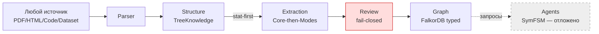

> 🔴 Красным — **нельзя обойти**: Review-слой блокирует запись без явной авторизации. Серым пунктиром — отложено (Phase 6).

---

## 2. Стек технологий

| Слой стека | Технология | Зачем | ADR |
|---|---|---|---|
| **Язык** | Python 3.13 | единая кодовая база | — |
| **Пакет-менеджер** | `uv` + `pyproject.toml` | быстрый resolvelock | — |
| **Граф (production)** | **FalkorDB** (Redis-based, Cypher) | self-hosted, векторы встроены, Cypher | ADR-022 |
| **Граф (промежуточный)** | **NetworkX** (in-process) | read-only алгоритмы, валидация, миграция | ADR-015/016 |
| **Граф (выводится из эксплуатации)** | **LadybugDB** (DuckDB-based) | fixture KG из M002/M003 | ADR-030 §2.5 |
| **LLM primary** | **MiniMax M3-512k** | извлечение + multimodal judge | ADR-014/025 |
| **LLM fallback** | **GLM/Z.ai 5.2** | при rate-limit MiniMax | ADR-025, M076 |
| **LLM-провайдеры** | `provider_config.py` (hot-pluggable) | новые модели через конфиг, без кода | ADR-025, R066 |
| **Embeddings** | **BGE-M3 1024d** через локальный **fd/TEI** | детерминированные векторы | ADR-019 |
| **Парсеры (papers)** | **Marker** + **GROBID** + **arxiv2md** + **OpenDataLoader** | гибридный роутинг | ADR-008/009 |
| **Оптимизация промптов** | **DSPy** (BootstrapFewShot → MIPRO) | без GPU (нет GRPO) | ADR-029 |
| **JSON→dataclass на LLM-границе** | **Adaptix** | только на границе LLM, не внутри | ADR-033 §2.3 |
| **Внутренние типы** | stdlib `@dataclass(frozen=True)` | без Pydantic для pipeline-типов | ADR-033 §2.4 |
| **Очередь (durable)** | SQLite (`UniversalKBQueue`) | lease-based claiming, DAG-зависимости | ADR-017, M070 |
| **Метрики качества** | `riskratchet` | статический анализ | — |
| **Тесты** | pytest, 2199+ тестов | контрактное покрытие | R013 |
| **CLI** | `typer` + `rich` | пользовательский интерфейс | R001 |

> **Зависимости — без GPU:** GRPO-обучение (как в Agents-K1) **не применяется** — вместо него DSPy + API (ADR-023 §1).

---

## 3. Архитектура: слои и модули

### 3.1 Семь слоёв (ADR-023, R067)

| Слой | Название | Что делает | Пакет в `research_graph/` | Статус |
|---|---|---|---|---|
| **0** | **Source** | Регистрация и загрузка любого источника | `corpus/sources/`, `corpus/ingestion/` | ✅ paper; ⬜ textbook/code/dataset |
| **1** | **Parser** | Сырой источник → `ParsedArticle` | `corpus/parsing/`, `papers/source_assets/` | ✅ гибрид (ADR-008) |
| **2** | **Structure** | TreeKnowledge (PageIndex) + SemanticChunk + KnowledgeCard | `papers/indexing/`, `papers/chunking/` | ✅ базовый; ⬜ KnowledgeCard full |
| **3** | **Extraction** | Типизированные сущности + отношения (Core-then-Modes) | `evaluation/` (+ новый `pipeline/` в M103) | 🔄 **M103 в работе** |
| **4** | **Graph** | FalkorDB typed-схема + операторы O1-O6 | `graph/` (LadybugDB → FalkorDB) | ⬜ миграция Phase 3 |
| **5** | **Review** | Fail-closed safety gates | `workflows/validation/`, `workflows/universal_kb/` | ✅ базовый; ⬜ upgrade под typed |
| **6** | **Agents** | SymFSM-controlled reasoning | `workflows/rlm/` (прототип) | ⚠️ **отложено** (Phase 6) |

### 3.2 Карта пакетов `research_graph/` (26 пакетов, ~110 модулей)

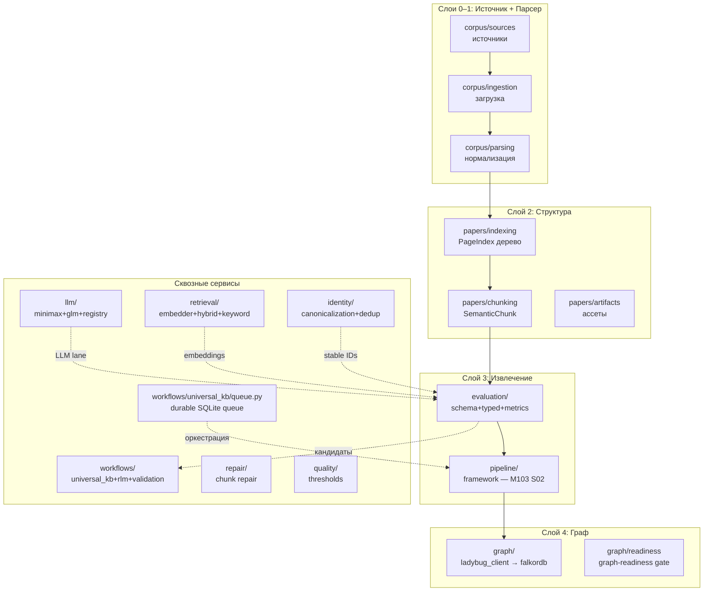

> **Подсчёт модулей по пакетам:** papers=24, workflows=19, corpus=15, graph=10, evaluation=9, repair=7, quality=6, llm=6, cli=5, retrieval=4, identity=3, staging=3, ops=3.

### 3.3 Распределение ответственности (по GitNexus, 1060 clusters / 300 flows)

GitNexus-индекс (51,959 узлов, 74,158 рёбер) подтверждает **5 функциональных кластеров**:
1. **Acquisition+Parse** — `corpus/ingestion` → `papers/source_assets`
2. **Structure+Chunking** — `papers/indexing` → `papers/chunking`
3. **Extraction+Metrics** — `evaluation/scientific_extraction` ↔ `evaluation/metrics`
4. **Graph Readiness** — `graph/readiness` (роутинг узлов, warning/severity коды)
5. **Persistence** — `graph/ladybug_client.upsert_scientific_kg` (6-шаговый flow: validate → merge paper → merge nodes → merge chunks → merge evidence → merge patch)

---

## 4. Потоки данных

### 4.1 Главный конвейер (end-to-end, paper domain)

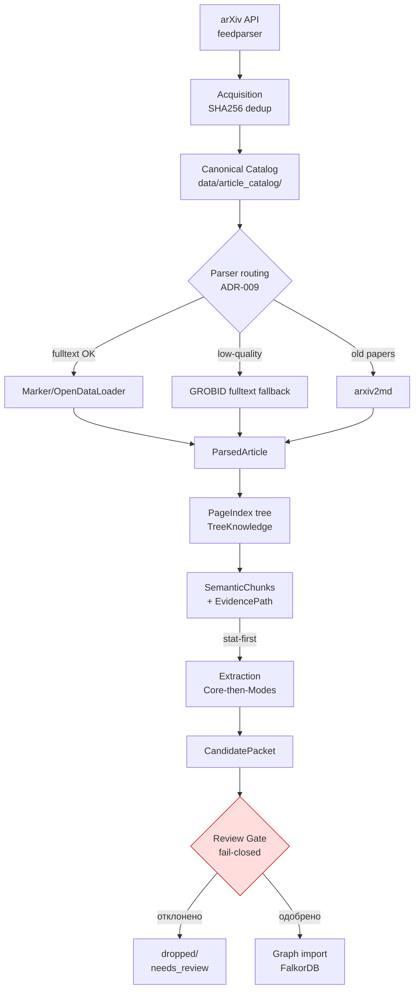

### 4.2 Поток извлечения (Core-then-Modes, ADR-029) — ~$0.07/статья, ~36 LLM-вызовов

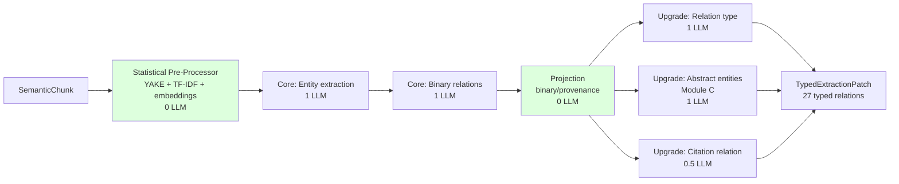

> 🟢 Зелёным — **детерминированные** стадии (0 LLM). Это и есть **statistical-first** (ADR-024, R068): перед каждым LLM-вызовом сначала статистика.

### 4.3 Поток очереди/планировщика (ADR-017 + ADR-027 + D085)

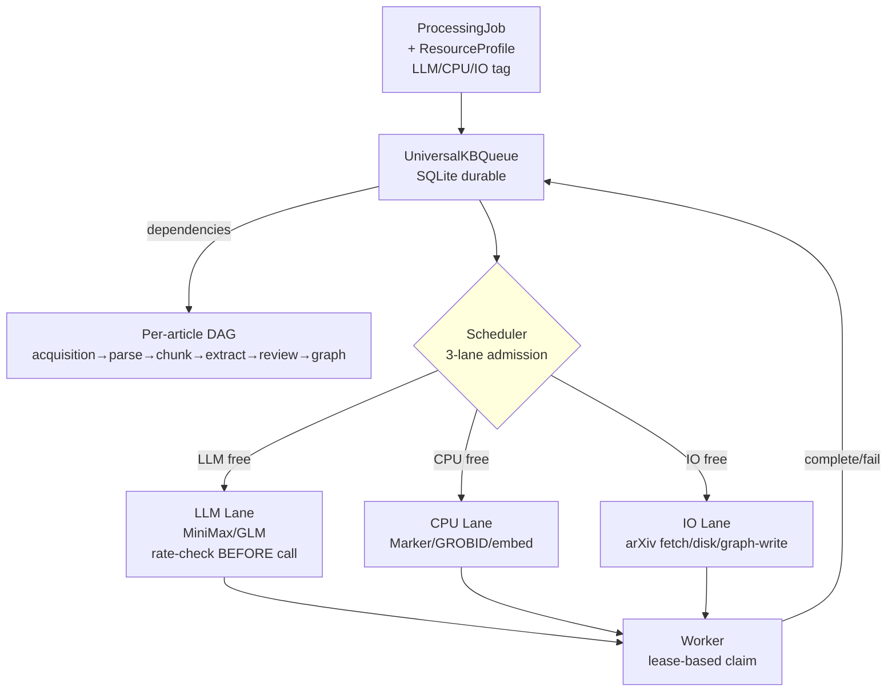

> ⚠️ **Статус:** queue **построена** (M070), но **scheduler активируется по фазам** (ADR-027 §5). Phase 2 = только simple LLM-lane check. Полный 3-lane scheduler — Phase 4.

### 4.4 Поток безопасности (fail-closed, M034)

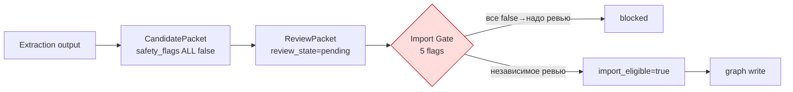

**5 fail-closed флагов (R-контракт):**
```
graph_import_allowed = false
graphdb_written       = false
ladybugdb_written     = false
production_import_attempted = false
import_eligible       = false
```

---

## 5. Что уже обрабатывается (текущие данные)

### 5.1 Корпус

| Что | Объём | Где | Статус |
|---|---|---|---|
| **PDF в canonical catalog** | **218 файлов** | `data/article_catalog/article_catalog/arxiv/<category>/<id>/source/` | ✅ SHA256-dedup, idempotent |
| **Категории arXiv** | cs-cl, cs-cv, cs-ai, cs-lg, cs-ne, cs-ro, cs-se, cs-sd, cond-mat, math-oc, mixed-source | `data/article_catalog/` | ✅ |
| **Вне-arXiv источники** | nature, stanford/cs224n, company_blog | `data/article_catalog/` | ✅ mixed-source (M027) |
| **Обработанные артефакты** | 20+ milestone-директорий | `artifacts/m027..m061` | evidence/replay только |

### 5.2 Что делают с данными сейчас (runtime, первый домен)

Текущий CLI (`research_graph/cli`) делает **детерминированный дневной дайджест** — это **domain/runtime surface**, не Universal KB truth:

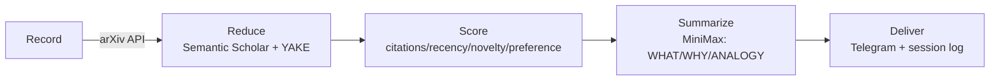

> ⚠️ Эти интеграции **не авторизуют** считать внешние сервисы/парсер-выход истиной Universal KB.

### 5.3 Что НЕ делается (явные границы)

- ❌ **Нет** production graph-записей (5 флагов false)
- ❌ **Нет** реального typed-извлечения (пока только contracts/fixtures — M103 S01 только что заложил schema)
- ❌ **Нет** LadybugDB→FalkorDB миграции (Phase 3)
- ❌ **Нет** agents (Phase 6)
- ❌ **Нет** GPU/GRPO-обучения

---

## 6. Целевая архитектура и extension points ⭐

> Это **главная секция для внешнего ревью**. Здесь сознательно заложены **швы (seams)** — места, куда добавляются новые решения без переписывания.

### 6.1 Целевая схема данных (typed, ADR-028)

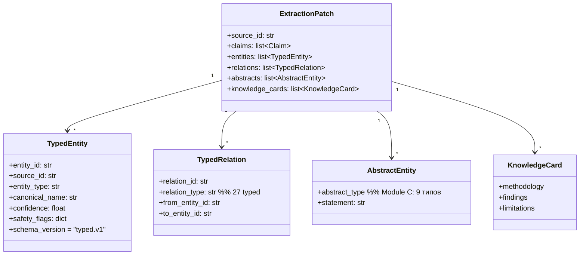

**27 typed отношений (5 групп):**

| Группа | Кол-во | Примеры |
|---|---|---|
| Controlled | 6 | BUILDS_ON, SOLVES, TARGETS |
| Causal | 5 | CAUSES, ENABLES, INHIBITS |
| Composition | 5 | CONSISTS_OF, IMPLEMENTS, REQUIRES |
| Comparison | 7 | DERIVED_FROM, HAS_LIMITATION, SUBSET_OF |
| Citation | 4 | CITES, SUPPORTS, CONTRASTS, EXTENDS |

> ✅ **M103 S01 готово** (commit `9472682`): `evaluation/relation_types.py` + `evaluation/schema.py`.

### 6.2 Extension points — где добавляются решения без rework

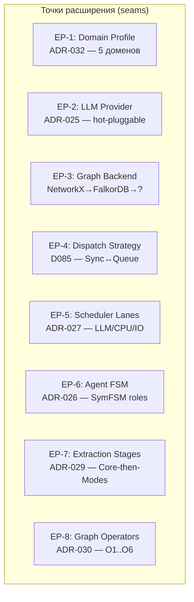

| EP | Что подключается | Интерфейс/seam | Фаза активации |
|---|---|---|---|
| **EP-1 Domain** | paper/textbook/code/dataset/tech_doc | `build_<domain>_pipeline()` → `Pipeline` (ADR-032) | Phase 5 |
| **EP-2 LLM** | MiniMax/GLM/future (Headroom?) | `provider_config.py` + `can_make_request(provider)` (ADR-025) | теперь + Phase 4 |
| **EP-3 Graph** | LadybugDB→FalkorDB→(Neo4j?) | `graph/` client + 4-phase additive migration (ADR-030 §2.5) | Phase 3 |
| **EP-4 Dispatch** | Sync ↔ Queue-backed | `DispatchProtocol` (SyncDispatch/QueueDispatch over `UniversalKBQueue`) — **D085** | Phase 4 |
| **EP-5 Scheduler** | LLM lane → +CPU lane → +IO lane | `ResourceProfile` + `can_dispatch()` (ADR-027 §5) | Phase 2→4 |
| **EP-6 Agent** | 6 SymFSM roles | typed graph operators + safety gates (ADR-026/031) | Phase 6 |
| **EP-7 Extraction** | Core + Upgrade-modes | `PipelineStage` per mode (ADR-029, M103 S02) | Phase 2 |
| **EP-8 Operators** | O1-O6 Cypher | operator registry в `graph/` (ADR-030 §2.4) | Phase 3 |

### 6.3 Архитектурные инварианты (что нельзя нарушать)

1. **Statistical-first** — каждый LLM-вызов предваряется детерминированной статистикой (R068, ADR-024)
2. **Fail-closed** — 5 флагов false по умолчанию; нет ревью → нет импорта (M034)
3. **Stable IDs** — SHA256-based, домен-агностичны (ADR-028 §2.3)
4. **No direct extractor→graph write** — только через Review Gate
5. **Staged validation** — никаких scale-заявлений до 10→20→week (R024)
6. **Schema evolution, not duplication** — типы эволюционируют через `schema_version`, без параллельных иерархий (ADR-033 §2.2)
7. **Adaptix только на LLM-границе** — внутри конвейера stdlib dataclasses (ADR-033 §2.3-2.4)

---

## 7. Roadmap (фазирование)

> **Архитектурный overlay (D086, 2026-06-21):** Поверх фаз ниже действует гексагональная/onion архитектура (Ports/Adapters + domain/application/infrastructure границы) и кодовая дисциплина Ponytail. Ports вводятся только при ≥2 реализациях или запланированной миграции (правило в `AGENTS.md`). Это НЕ отдельная фаза — это структурный overlay, кристаллизуемый в **M104** и применяемый ко всем последующим.

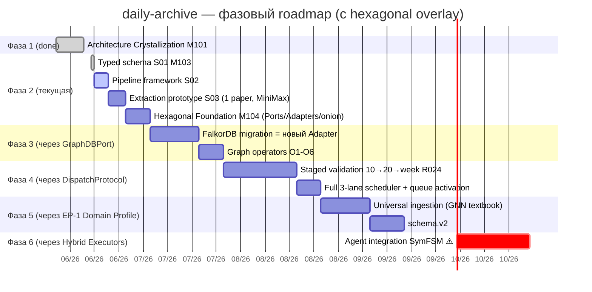

| Фаза | Фокус | Milestone | Статус | Ключевой gate | Hexagonal seam |
|---|---|---|---|---|---|
| 1 | Кристаллизация архитектуры | M101 ✅ | готово | 32 binding ADR | — |
| 2 | Typed schema + extraction prototype | M103 🔄 | S01 ✅, S02/S03 ⬜ | F1 ≥ 0.6 на 1 статье | concrete-first (пока) |
| 2+ | **Hexagonal Foundation** | **M104 🔄** | S01/S02/S03 ⬜ | import-guard + Fake-тесты | **Ports/Adapters кристаллизация** |
| 3 | FalkorDB миграция + операторы | (не начат) | ⬜ | dual-write equivalence | **GraphDBPort → FalkorDBAdapter** |
| 4 | Staged validation + scheduler | (не начат) | ⬜ | R024: 10→20→week | **DispatchProtocol → QueueDispatch** |
| 5 | Universal ingestion + schema.v2 | (не начат) | ⬜ | GNN textbook; schema_version bump | **EP-1 Domain Profile; typed.v2** |
| 6 | Agents (SymFSM) ⚠️ | (не начат) | ⬜ | требует idea development | **Hybrid Executors в flows** |

> **M104 (текущий архитектурный overlay):** 3 slice — S01 (LLM/Graph Ports + LadybugAdapter), S02 (Parser Port + 4 Adapter'а), S03 (onion import-guard + composition root). Подробно — `.gsd/milestones/M104-q9tft1/M104-q9tft1-ROADMAP.md`. D087: Prefect отвергнут, EP-4 DispatchProtocol seam сохранён.
>
> **Принцип overlay:** архитектурные решения (D086 hexagonal, D087 без-Prefect, Ponytail) не блокируют фазы — они задают КАК код пишется внутри каждой фазы. M104 кристаллизует seams для Phase 3 (graph migration как новый Adapter, не rewrite) и Phase 4 (queue через существующий seam).

---

## 8. Глоссарий (расшифровка терминов)

| Термин | Расшифровка |
|---|---|
| **Universal KB** | Универсальная база знаний — целевой продукт: любой источник → типизированный граф с доказательствами |
| **TreeKnowledge** | Иерархия навигации (PageIndex) — дерево секций документа с summary на каждом узле (паттерн quant-mind) |
| **KnowledgeCard** | Дистиллированная карточка источника: methodology / findings / limitations (паттерн PaperKnowledgeCard) |
| **Core-then-Modes** | Факторизация извлечения: сначала ядро (сущности + бинарные отношения), потом "modes" (апгрейд до typed/causal/abstract). Экономит ~50% LLM-вызовов (из Agents-K1) |
| **Statistical-first** | Перед каждым LLM-вызовом — детерминированная статистика (YAKE ключевые слова, TF-IDF, embeddings, co-occurrence). LLM получает текст + статистический контекст |
| **Typed schema** | Схема с 27 типизированными отношениями в 5 группах + 5 модулями сущностей (A-E), адаптирована из Agents-K1 |
| **Module C** | Неявные/абстрактные сущности (problem, motivation, gap, contribution, hypothesis, finding, mechanism, limitation, future_work) — ключевое отличие от плоской схемы |
| **SymFSM** | Symbolic Finite State Machine — агентское управление через FSM, где LLM = интерпретатор внутри предсобранной модели рассуждений, а не "мозг" (паттерн) |
| **Cognitive map** | Подграф FalkorDB, релевантный запросу агента (для reasoning) |
| **Fail-closed** | По умолчанию всё заблокировано; разрешение требует явного действия. 5 флагов = false |
| **CandidatePacket → ReviewPacket** | Поток доказательств: извлечение даёт кандидата → ревью-пакет → import gate |
| **EvidencePath** | Прослеживаемость от Paper → PageIndexNode → SemanticChunk (детерминированная) |
| **BGE-M3 / fd / TEI** | Модель эмбеддингов (1024d) / локальный сервис эмбеддингов / Text Embeddings Inference |
| **GROBID / Marker / arxiv2md / OpenDataLoader** | Парсеры PDF: GROBID (header/citations), Marker (body/layout), arxiv2md (REST), OpenDataLoader (body/tables) |
| **DSPy** | Фреймворк декларативной оптимизации промптов (BootstrapFewShot → MIPRO) — заменяет GRPO без GPU |
| **Adaptix** | Библиотека JSON→dataclass маппинга; используется ТОЛЬКО на границе LLM-выхода |
| **ResourceProfile** | Декларация ресурсов стадии: LLM (required/provider/tokens), CPU (intensity), IO (type) |
| **3-lane scheduler** | Планировщик очереди по 3 ресурсам: LLM / CPU / IO (ADR-027) |
| **Graph-readiness gate** | Контракт готовности чанков к графу: conversion fidelity, normalization, chunk semantics, provenance (R027) |
| **Stable IDs** | SHA256-based, домен-агностичные: `source:{kind}:{sha256}`, `entity:{source}:{type}:{slug}`, `rel:{from}:{TYPE}:{to}` |

---

## 9. Как я понял задачу + что предлагаю дополнительно

> Эта секция — мой (agent) ответ на запрос «как понял и что можно добавить в план».

### 9.1 Что я понял как задачу документа

1. **Синтез** рассеянной архитектурной информации (33 ADR + 103 milestone + PROJECT/ROADMAP) в **единую навигационную карту** для внешнего оценщика.
2. **Заложить extension points** явно — чтобы будущие решения (новый LLM, новый домен, новый graph backend, agents) подключались как **стратегии/плагины**, а не через rework.
3. **Показать текущее состояние честно**: что работает (218 PDF, fixture-contracts), что отложено (agents, full scheduler), что в работе (M103 typed extraction).

### 9.2 Что я предлагаю ДОБАВИТЬ в план (на основе анализа)

| # | Предложение | Обоснование | Куда |
|---|---|---|---|
| **A1** | **Эталонная "happy-path" статья-фикстура** (arXiv:2605.18747) с golden typed-extraction | Сейчас типизированное извлечение — contracts/fixtures без end-to-end проверки. Golden-фикстура даст измеримый baseline для F1/precision на каждой фазе. ADR-029 §2.2 уже требует 10 labeled chunks для DSPy | M103 S03 → отдельная slice |
| **A2** | **Observability-слой раньше Phase 4** — структурированный events.jsonl на каждое состояние стадии | ADR-017 §2.4 и ADR-027 §2.6 описывают observability, но привязаны к queue-активации. Даже в sync-режиме лог переходов стадии (stage_started/succeeded/failed + ResourceProfile) даст trajectory-checker'у данные и упростит дебаг extraction-prototype | M103 S02 orchestrator |
| **A3** | **Явный контракт "контракт-версий"** (`contract_version` на стадию) в pipeline types | `UniversalKBQueue` уже делает stale-detection по input/tool/contract version. PipelineStage должен нести `contract_version` → при эволюции схемы старые ExtractionPatch не станут тихо невалидными. Это и есть EP-7 seam | M103 S02 T01 (StageManifest) |
| **A4** | **Cost/latency budget-типы на ResourceProfile** | ADR-029 §2.4 задаёт budget ($0.07/article), но нет машинно-читаемого поля. Добавить `estimated_cost_usd` + `estimated_latency_sec` в ResourceProfile → scheduler сможет делать capacity-based фильтрацию (ADR-017 §2.2) | M103 S02 T01 |
| **A5** | **Документировать границу LadybugDB→FalkorDB как отдельный milestone** с dual-write acceptance-критериями | ADR-030 §2.5 описывает 4 фазы, но в roadmap это "Phase 3" без milestone. Риск: миграция начнётся без явных equivalence-тестов → тихая потеря данных | queue → новый M-milestone в Phase 3 |
| **A6** | **"Decision-log" для ADR-031 (agents) — что именно требует idea development** | ADR-026/031 помечены ⚠️ "requires further idea development". Для внешнего ревью нужен явный список открытых вопросов (FSM-состояния? experience-store формат? agent↔operator маппинг?) | §9.3 ниже |
| **A7** | **Cross-domain linking контракт раньше** (papers ↔ code ↔ datasets) | ADR-032 §2.2 упоминает CITES/HAS_RESOURCE/IMPLEMENTS/USES_DATASET, но без контракта. Заложить stable-ID схему для cross-domain сейчас → иначе Phase 5 столкнётся с миграцией ID | типы в schema.py (EP-1 seam) |
| **A8** | **Architecture Decision Linter** — автопроверка, что код не нарушает инварианты §6.3 | Сейчас trajectory-checker (M045) мониторит 13 измерений. Добавить статические проверки: "LLM-стадия без stat-preprocessor", "graph write без review". Guardrail уже есть (M044/M047) — расширить | quality/ пакет |

### 9.3 Открытые вопросы для внешнего ревью (что хочу обсудить)

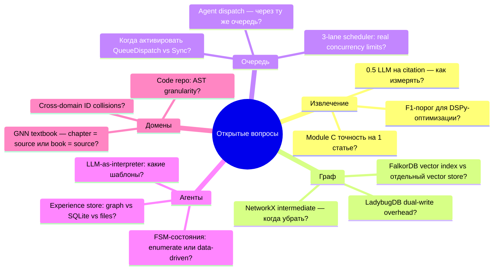

1. **Извлечение:** реалистичен ли F1 ≥ 0.6 порог (ADR-029 §2.2)? Как валидировать "0.5 LLM на citation"?
2. **Граф:** FalkorDB встроенные векторы против отдельного vector store (kv/etc.) — когда одного HNSW мало? NetworkX — permanently intermediate или выводится после миграции?
3. **Очередь:** триггер перехода Sync→Queue (ADR-017 привязан к M061+M062+M063 — все готовы!) — активировать ли queue сейчас?
4. **Агенты (⚠️ critical для плана):** формат experience-store? Перечислять ли FSM-состояния или делать data-driven? Какой минимальный набор agent-ролей для MVP?
5. **Домены:** коллизии stable-IDs между paper-методом и textbook-концептом? Гранулярность code-repo AST (файл/класс/функция)?

### 9.4 Рекомендация по процессу ревью

Для **внешнего оценщика** предлагаю структуру фидбека:
- **§6 extension points** — главная зона оценки: достаточно ли швов? нет ли преждевременной фиксации?
- **§9.3 открытые вопросы** — нужна экспертиза по агентам/графу/извлечению
- **§7 roadmap** — валидация последовательности фаз (особенно FalkorDB migration перед staged validation)

---

## 10. Связанные артефакты

| Артефакт | Где | Назначение |
|---|---|---|
| ADR-INDEX | `doc/adr/ADR-INDEX.md` | 33 ADR с навигацией |
| Канонический ADR-шаблон | `.gsd/milestones/M034-kuei9y/decision-package/ADR-TEMPLATE.md` | формат новых ADR |
| ROADMAP (GSD) | `.gsd/ROADMAP.md` | 103 milestone |
| REQUIREMENTS | `.gsd/REQUIREMENTS.md` | R001-R072 активные контракты |
| PROJECT | `.gsd/PROJECT.md` | living current-state |
| M103 (текущий) | `.gsd/milestones/M103-6tip5z/` | typed schema + pipeline |
| Decision D085 | `.gsd/DECISIONS.md` | queue/scheduler seams |
| GitNexus | `gitnexus://repo/daily-archive/*` | 51,959 узлов, 300 flows, code intelligence |

---

### Источники (на чём основан документ)

- ADR-023 (архитектурное видение), ADR-028 (typed schema), ADR-029 (extraction), ADR-030 (FalkorDB), ADR-031 (agents), ADR-032 (universal ingestion), ADR-033 (modular pipeline)
- ADR-017/027 (queue/scheduler), ADR-024/025 (stat-first/multi-LLM), ADR-008/009 (hybrid parser), ADR-022 (FalkorDB)
- Decision D085 (queue/scheduler seams, collaborative)
- GitNexus-анализ кодовой базы (переиндексировано 2026-06-20: 51,959 nodes / 74,158 edges / 300 flows)
- GSD PROJECT/ROADMAP/REQUIREMENTS (актуальны на M103 S01)

*Сгенерировано agent'ом 2026-06-20 для внешнего архитектурного ревью. Living document — обновлять при смене фазы.*
