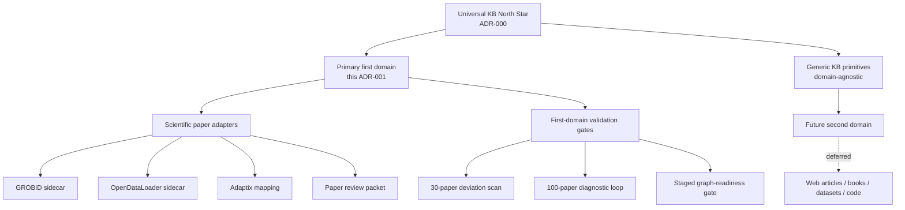
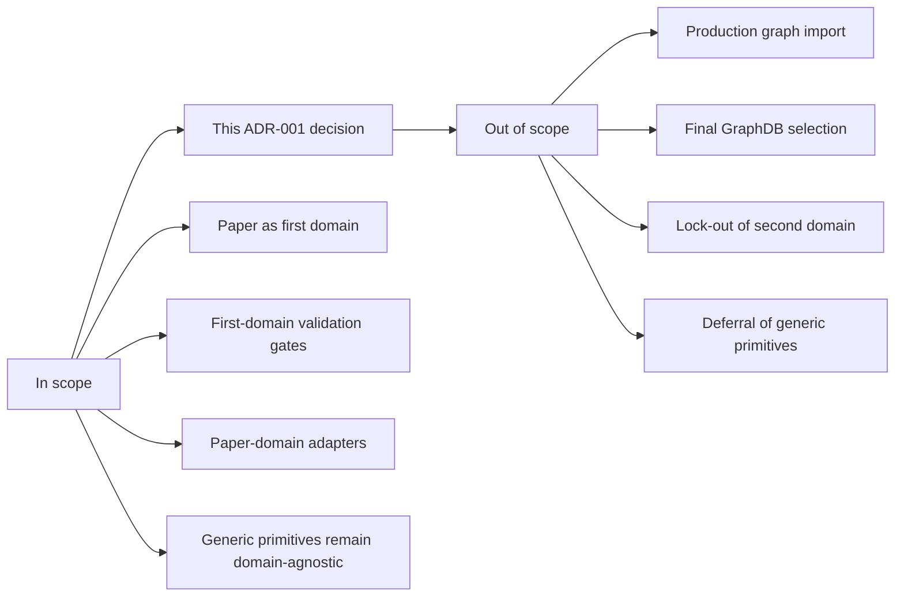
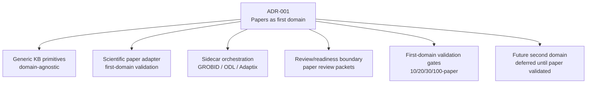
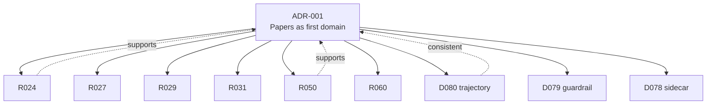
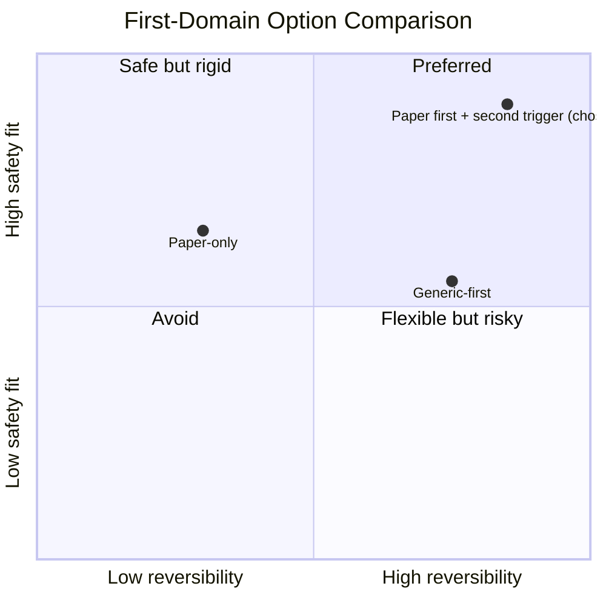
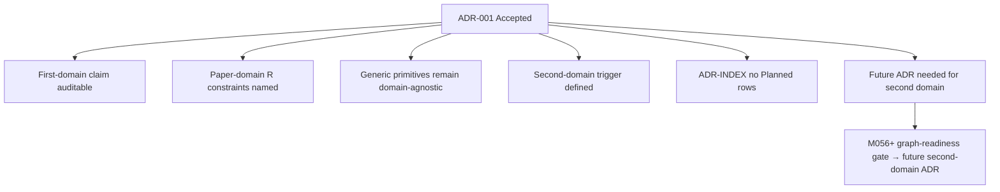
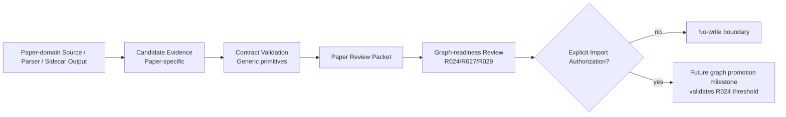
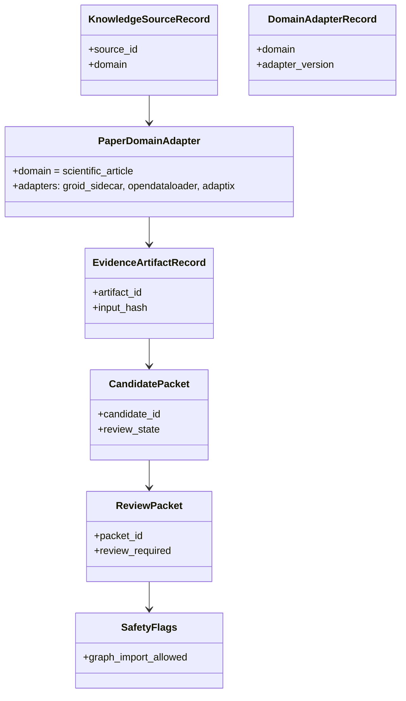
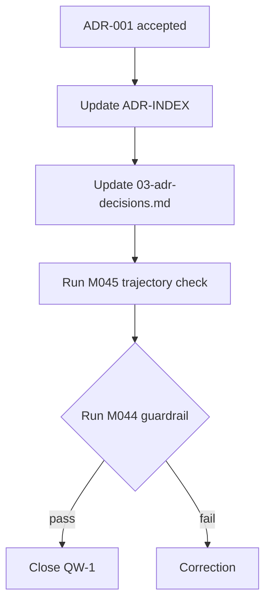

# ADR-001: Scientific Papers as First Domain

**Status:** Accepted
**Date:** 2026-06-09
**Deciders:** human
**Milestone:** M046-3b7gp0 (QW-1 follow-up)
**Scope:** universal-kb / paper-domain / evidence-pipeline / safety / contracts
**Binding Level:** binding
**Revisable:** yes, when a second domain is selected and first-domain requirements can be relaxed without violating ADR-000

## 0. One-line Decision

> We will treat scientific articles as the **primary first domain and proving ground** for the local-first universal KB, applying paper-domain requirements (citations, figures, tables, sections, source spans, review burden) as first-domain validation constraints, while keeping generic KB primitives domain-agnostic.
> We will not lock the architecture to scientific papers only, exclude future non-paper domains from the same primitives, or use paper-first framing to defer generic primitive quality.

## 1. Context

ADR-000 (Universal KB North Star) established the project's frame: a local-first universal KB with scientific articles as the primary first domain. ADR-000 explicitly named "scientific articles as first domain" but did not isolate that claim into its own decision. This left three practical gaps:

1. **Supersedes chain weakness:** the claim that "scientific articles remain the primary first domain" sits in ADR-000's body text. A reader could not trace the claim back to a single, scoped decision.
2. **First-domain validation requirements are scattered:** R024, R027, R029, R031, R032, R033, R050, R058, R060 are all paper-domain validation constraints, but no single document explains why they are paper-domain or what would change if a second domain were added.
3. **No explicit second-domain trigger:** the project lacks a defined decision point for "when does scientific papers stop being the only validated domain?" This makes it hard to plan a future non-paper adapter without re-debating first-domain scope.

This ADR closes the three gaps by isolating the first-domain decision, naming the paper-domain requirements that follow from it, and defining a forward decision point for second-domain selection.

### Context Map



## 2. Decision

We will treat **scientific articles as the primary first domain and proving ground** for the daily-archive local-first universal KB. The first-domain status means:

- Scientific-paper requirements are the **first-domain validation constraints** for generic KB primitives.
- Paper-domain specializations (ArticleRecord, PaperSourceRecord, ArticleJob, SidecarJob, GROBID/OpenDataLoader/Adaptix outputs, PaperCandidatePacket, PaperReviewPacket) are **adapters**, not the core.
- Generic KB primitives (KnowledgeSourceRecord, DomainAdapterRecord, EvidenceArtifactRecord, ProcessingJob, DependencyRecord, FailureRecord, CandidatePacket, ReviewPacket, GraphReadinessHandoff, KnowledgeSubstratePort, SafetyFlags) remain **domain-agnostic** and must work for any future domain.
- The first-domain status is **not exclusive**: future non-paper domains are not excluded; they are sequenced behind paper-domain validation.

This decision authorizes:

- Continued investment in paper-domain adapters (GROBID, OpenDataLoader, Adaptix, paper review packets).
- First-domain validation gates (10-paper, 20-paper, one-week corpus, 30-paper deviation scan, 100-paper diagnostic loop) as the proving path.
- Paper-domain requirements (R024, R027, R029, R031, R032, R033, R050, R058, R060) as binding constraints on the first-domain phase.

This decision does **not** authorize:

- Production graph import based on paper-domain evidence alone.
- Final GraphDB selection (ADR-002 remains deferred).
- Lock-out of future non-paper domains.
- Deferral of generic KB primitive quality in favor of paper-domain features.

### Decision Boundary



## 3. Applies To

This decision applies to:

- Generic knowledge-base architecture and primitives.
- Scientific-paper first-domain implementation (adapters, validation, gates).
- Sidecar / evidence pipeline planning for paper-domain.
- Graph substrate decision planning (paper-domain evidence informs, does not select).
- Review / readiness gates for paper-domain artifacts.
- Future agent / helper workers (must respect first-domain as primary validation context).
- Future non-paper domain adapters (sequenced behind paper-domain validation).

### Applicability Diagram



## 4. Requirements and Decisions Impacted

### Requirements

| Requirement | Impact | Notes |
|---|---|---|
| R024 | supports | Staged validation (10/20/one-week) is the first-domain proving path. |
| R027 | supports | Paper conversion/chunk graph-readiness quality is a first-domain constraint. |
| R029 | supports | Import-ready chunk package is paper-domain specific until generalized. |
| R031 | supports | 30-paper deviation scan validates first-domain quality before broader claims. |
| R032 | supports | 100-paper diagnostic loop scales first-domain evidence. |
| R033 | supports | Deterministic +10 CLI is the operational vehicle for first-domain scaling. |
| R050 | supports | Article structure CLI is a paper-domain adapter capability. |
| R058 | constrains | Local-first scientific paper evidence chains remain the first-domain mission. |
| R060 | supports | Universal KB frame with scientific articles as primary domain. |
| R019 | constrains | Hybrid retrieval (vector+graph+fusion) advances within first-domain scope, not as global capability. |
| R022 | constrains | RLM document/workflow remains a first-domain validation context. |
| R023 | constrains | RLM graph traversal benchmark uses first-domain evidence. |
| R048-R050 | supports | Candidate locators and chunk-span provenance are first-domain validation tools. |

### Decisions

| Decision | Impact | Notes |
|---|---|---|
| D075 (governance memory) | consistent | Hybrid model supports first-domain evidence in mirror. |
| D076 (typed graph projection) | consistent | Typed graph includes first-domain milestone nodes. |
| D077 (mixed corpus) | supports | Mixed batch tests first-domain stability, freshness, connectivity. |
| D078 (candidate-only sidecar) | consistent | Sidecar packets preserve paper-domain candidate status. |
| D079 (architecture guardrail) | consistent | Guardrail covers first-domain sidecar / graph-readiness work. |
| D080 (trajectory check) | consistent | Trajectory check reports first-domain validation state. |

### R/D Relationship Map



## 5. Options Considered

### Option A — Paper-only (no first-domain framing)

| Dimension | Assessment |
|---|---|
| Local-first fit | High |
| Safety fit | Medium |
| Complexity | Low |
| Reversibility | Low |
| GraphDB portability | Medium |
| Agent/tooling dependency | Low |
| Human review compatibility | High |

**Pros:** simpler architecture; no need to maintain domain-agnostic primitives.
**Cons:** rejects the universal-KB direction; harder to add a second domain later.

### Option B — Paper as first domain with explicit second-domain trigger (CHOSEN)

| Dimension | Assessment |
|---|---|
| Local-first fit | High |
| Safety fit | High |
| Complexity | Medium |
| Reversibility | High |
| GraphDB portability | High |
| Agent/tooling dependency | Low |
| Human review compatibility | High |

**Pros:** preserves ADR-000's universal-KB frame; isolates paper-domain requirements; defines forward decision point for second domain; keeps generic primitives clean.
**Cons:** more careful contract layering required; some R/D wording still needs clarification.

### Option C — Generic-first (no paper priority)

| Dimension | Assessment |
|---|---|
| Local-first fit | Medium |
| Safety fit | Medium |
| Complexity | High |
| Reversibility | High |
| GraphDB portability | High |
| Agent/tooling dependency | High |
| Human review compatibility | Medium |

**Pros:** cleaner long-term abstraction; no paper-domain overfitting.
**Cons:** defers validation against the hardest current domain; loses existing paper-domain evidence advantage.

### Option Comparison Snapshot



## 6. Trade-off Analysis

| Trade-off | Chosen side | Why |
|---|---|---|
| Universal KB vs paper-only | Paper first with second trigger | Aligns with ADR-000; isolates paper scope; enables future domains. |
| Generic primitives first vs paper-specific | Generic primitives first, paper adapters second | Keeps future domains possible; avoids paper overfitting. |
| Validation gates: 10/20/30/100-paper progression | Sequential, no skipping | Each step reveals new failure modes; skipping risks scaling poor patterns. |
| Open question: when second domain? | When paper-domain evidence reaches graph-readiness threshold (R024 satisfied) | Avoids adding second domain before first is solid. |
| Future agent / helper workers | Diagnostic-only, never orchestrate (per ADR-006) | Agents may assist paper-domain evidence; cannot promote or import. |

### Trade-off Summary

- **Short-term value:** closes the first-domain supersedes gap, names paper-domain validation constraints, defines second-domain trigger.
- **Long-term value:** enables a second-domain decision without re-debating scope; keeps generic primitives reusable.
- **Safety impact:** unchanged from ADR-000; the first-domain framing adds no new authorization.
- **Reversibility:** high; if a future ADR chooses a different first domain, this ADR is supersedable.
- **Cost / complexity:** low; this is a documentation ADR, no code change required.
- **What remains uncertain:** the precise threshold for "graph-readiness" (R024) that will trigger second-domain selection. That is a future ADR.

## 7. Consequences

### Positive

- First-domain claim is auditable; supersedes chain from ADR-000 is explicit.
- Paper-domain validation requirements (R024, R027, R029, R031-R033, R050) are explicitly named as first-domain constraints.
- Generic KB primitives remain domain-agnostic; future non-paper domains are not locked out.
- Second-domain decision point is defined (graph-readiness threshold), reducing future ambiguity.
- ADR-001 row in ADR-INDEX no longer reads "Planned"; the architecture framework is complete (8 ADRs all Accepted or Deferred, none Planned).

### Negative

- Some historical R/D wording (R058) was paper-only and is now narrowed; clarification rather than direct reuse.
- Future paper-domain work must reference this ADR alongside ADR-000; two-step supersedes chain.
- Generic primitive quality may be deprioritized if paper-domain work dominates.

### New obligations

- S03 / M046 03-adr-decisions.md must be updated: ADR-001 status Planned → Accepted.
- M046 01-north-star.md and 02-architecture-layers.md cross-references remain valid (no change required).
- Future first-domain validation milestones (M056 graph-readiness gate) must reference this ADR.

### What becomes harder

- A future decision to abandon paper-first would require an explicit superseding ADR.
- Adding a second domain before R024 graph-readiness threshold is satisfied is implicitly blocked.

### Consequence Flow



## 8. Safety and Non-Authorization

This ADR does **not** authorize:

- production graph import;
- final GraphDB selection;
- LadybugDB / FalkorDB / HelixDB writes;
- parser output as graph-ready truth;
- agentic orchestration;
- bypassing validators, review packets, or the trajectory check;
- locking out future non-paper domains;
- treating paper-domain evidence as sufficient for global KG claims.

Required safety defaults remain:

```text
graph_import_allowed=false
graphdb_written=false
ladybugdb_written=false
production_import_attempted=false
import_eligible=false
```

### Safety Gate



## 9. Contract Impact

Affected generic contracts (no change required, this ADR is documentation only):

- `KnowledgeSourceRecord` — paper domain uses this with `domain = "scientific_article"`
- `DomainAdapterRecord` — paper adapter wraps generic primitives
- `EvidenceArtifactRecord` — paper candidates use this shape
- `ProcessingJob` — paper `ArticleJob` and `SidecarJob` are specializations
- `CandidatePacket` — paper `PaperCandidatePacket` is a specialization
- `ReviewPacket` — paper `PaperReviewPacket` is a specialization
- `GraphReadinessHandoff` — paper handoff uses this shape
- `KnowledgeSubstratePort` — paper domain uses this; substrate is still deferred
- `SafetyFlags` — paper-domain artifacts carry all 5 false defaults

Affected paper-domain specializations (no change required, this ADR clarifies scope only):

- `ArticleRecord`
- `PaperSourceRecord`
- `ArticleJob`
- `SidecarJob`
- GROBID / OpenDataLoader / Adaptix sidecar output contracts (paper-specific)
- `PaperCandidatePacket`
- `PaperReviewPacket`

### Contract Relationship Map



## 10. Validation / Evidence Required

This ADR is documentation only. Validation is via existing verification surface:

- ADR-INDEX updated: ADR-001 status `Planned` → `Accepted`.
- M046 S03 (03-adr-decisions.md) updated: ADR-001 row reflects new status and binding level.
- M045 trajectory check rerun: no new high-severity drift introduced.
- M044 architecture guardrail: ADR-001 does not change safety contract, must still pass.

### Validation Path



## 11. Open Questions

| Question | Owner | Needed by | Blocking? |
|---|---|---|---|
| What is the precise graph-readiness threshold for second-domain selection? | future second-domain ADR | before second-domain adapter | yes for second domain, no for first |
| Which non-paper domain is the natural second? (web, books, datasets, code) | future planning | after R024 graph-readiness gate | no |
| Should paper-domain validation gates be re-templated to a generic validation gate? | future refactor | after first-domain gates proven | no |
| Does quant-mind's PaperKnowledgeCard pattern survive generalization? | future ADR | before second domain | no |

## 12. Follow-up Actions

- [ ] Update `doc/adr/m034/ADR-INDEX.md` to reflect ADR-001 status `Planned` → `Accepted`.
- [ ] Update `artifacts/m046-synthesis/03-adr-decisions.md` ADR-001 row to reflect new status, binding level, and supersedes chain.
- [ ] Update M045 trajectory report to reflect ADR-001 acceptance.
- [ ] GSD decision: D081 records this ADR acceptance.
- [ ] Future ADR drafted when R024 graph-readiness threshold is met (M056+).

## 13. Supersedes / Superseded By

### Supersedes

- ADR-INDEX `Planned` row for ADR-001 (now Accepted).
- Implicit first-domain claim previously in ADR-000 body text; this ADR isolates it.

### Superseded By

- Empty until a future ADR. Likely future supersedure path:
  1. M056 graph-readiness gate validates R024.
  2. Future ADR selects second domain.
  3. Future ADR may narrow ADR-001's first-domain framing if a second domain is added.

## 14. LLM Reading Notes

This section is intentionally explicit for future agents.

- **Binding decision:**
  - Scientific articles are the primary first domain and proving ground.
  - Paper-domain requirements (R024, R027, R029, R031-R033, R050, R058, R060) are first-domain validation constraints.
  - Generic KB primitives remain domain-agnostic.
  - Second domain is sequenced behind first-domain validation.
- **Do not infer:**
  - Do not infer that paper-first excludes non-paper domains.
  - Do not infer that first-domain evidence is sufficient for global KG claims.
  - Do not infer that paper-domain adapters are the core (they are adapters).
  - Do not infer that this ADR authorizes graph import, GraphDB selection, or agentic orchestration.
- **Safe next action:**
  - Reference this ADR when planning first-domain validation milestones.
  - Reference this ADR when adding paper-domain adapters (GROBID, OpenDataLoader, Adaptix).
  - Reference this ADR when designing first-domain validation gates (R024, R031, R032).
- **Blocked until:**
  - Production graph import remains blocked until a future explicit graph promotion milestone validates R024.
  - Second-domain adapter is blocked until a future ADR selects it and first-domain evidence is sufficient.
  - Final GraphDB selection remains blocked per ADR-002.

---

**End of ADR-001.**
