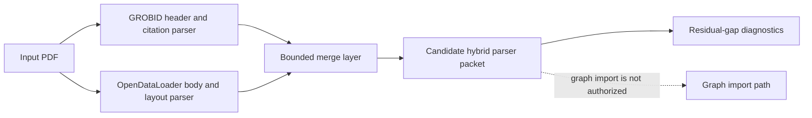

# ADR-008: Hybrid Parser Architecture

**Status:** Accepted (binding)
**Date:** 2026-06-10
**Deciders:** collaborative
**Milestone:** M055 / M054-proc4f
**Scope:** parser-benchmark / scientific-papers / evidence-pipeline / safety / hybrid-architecture
**Binding Level:** binding
**Revisable:** no, unless a later accepted ADR supersedes this decision with equal or stronger benchmark evidence

## 0. One-line Decision

> We will implement a **hybrid parser architecture** for scientific-paper PDFs: use **GROBID** for metadata, header, references, and bibliography extraction; use **OpenDataLoader** for markdown body, sections, tables, figures, images, and layout evidence; then merge the two outputs through a bounded candidate-evidence layer.
> We will not treat either parser as a complete replacement for the other, and we will not authorize graph writes, LadybugDB writes, fact promotion, or production import from this benchmark decision.

## 1. Context

ADR-001 established scientific papers as the first proving domain.
That domain requires more than plain text extraction.
It needs title, authors, abstract, references, bibliography, body sections, tables, figures, source spans, and reviewable provenance.
A single parser must therefore be judged against several distinct evidence families.
M033 and M043 already showed that parser outputs must remain bounded candidate evidence.
They also showed that an extractor path must not become a direct graph-write path.
M055 was created to decide the parser architecture with a five-PDF benchmark.
The benchmark compared GROBID-only, OpenDataLoader-only, and hybrid-routing evidence.
The benchmark did not attempt production import.
The benchmark did not write to LadybugDB.
The benchmark did not write to a graph database.
The benchmark did not mark parser output as import eligible.
The benchmark kept all five safety defaults false.

### 1.1 Evidence Inputs

| Evidence | Path | Meaning |
| --- | --- | --- |
| S02 GROBID-only summary | `artifacts/m055-parser-benchmark/grobid-only/summary.json` | Header/citation baseline. |
| S03 OpenDataLoader-only summary | `artifacts/m055-parser-benchmark/opendataloader-only/summary.json` | Body/layout baseline. |
| S04 hybrid routing summary | `artifacts/m055-parser-benchmark/hybrid-routing/summary.json` | Per-dimension routing comparison. |
| S05 benchmark report | `artifacts/m055-parser-benchmark/REPORT.md` | Human-readable synthesis. |
| ADR-001 | `doc/adr/ADR-001-scientific-papers-as-first-domain.md` | Scientific papers are the first domain. |

### 1.2 Benchmark Corpus

| arxiv_id | category | pages | Notes |
| --- | --- | --- | --- |
| 1804.02767 | cs-cv | 6 | Short vision paper with tables/images. |
| 2108.12409 | cs-cl | 25 | NLP paper with substantial body text. |
| 2109.10862 | cs-cl | 37 | Long NLP paper with many sections/images. |
| 2111.00396 | cs-lg | 32 | Machine-learning paper with substantial layout evidence. |
| 2203.14465 | cs-lg | 30 | Machine-learning paper with markdown/table evidence. |

### 1.3 Benchmark Result

M055 produced a 100% hybrid recommendation.
All five PDFs recommended the route `grobid_header + opendataloader_body`.
GROBID won metadata for 5/5 PDFs.
GROBID won citations for 5/5 PDFs.
GROBID won processing_time for 5/5 PDFs.
OpenDataLoader won body_content for 5/5 PDFs.
OpenDataLoader won layout for 5/5 PDFs.
OpenDataLoader won quality for 5/5 PDFs.
The benchmark therefore does not support a single-parser architecture.
It supports a per-field hybrid architecture.

### 1.4 Why This Matters

Scientific-paper ingestion can fail quietly if a parser gives good body text but weak citations.
Scientific-paper ingestion can also fail if a parser gives good citations but no reliable body/layout evidence.
A graph-facing pipeline needs both families.
A reviewable evidence pipeline needs provenance for each field.
The hybrid decision preserves parser strengths without pretending either parser is complete.
The merger boundary makes field ownership explicit.
That boundary is also the place where candidate-only safety constraints are enforced.

## 2. Decision

Use a hybrid parser architecture.
The input PDF is processed by both parser paths.
The GROBID path owns metadata and citation-family fields.
The OpenDataLoader path owns body and layout-family fields.
A bounded merge layer produces a candidate hybrid parser packet.
The candidate packet carries source provenance for every merged field family.
The candidate packet remains non-authoritative until later review or promotion checks.
The candidate packet is not authorized for direct graph import.
The candidate packet is not authorized for production import.
The candidate packet is not authorized for LadybugDB writes.

### 2.1 Field Ownership

| Field family | Owner | Evidence basis | Merge rule |
| --- | --- | --- | --- |
| title | GROBID | Native header extraction. | Copy with GROBID provenance. |
| authors | GROBID | Native header extraction. | Copy with GROBID provenance. |
| abstract | GROBID | Native header extraction. | Copy with GROBID provenance. |
| references | GROBID | Native citation extraction. | Copy with GROBID provenance. |
| bibliography | GROBID | Native bibliography extraction. | Copy with GROBID provenance. |
| processing diagnostics | GROBID | Faster header/citation route in benchmark. | Retain as diagnostics, not as body-quality proof. |
| markdown body | OpenDataLoader | Substantial markdown output for all five PDFs. | Copy with OpenDataLoader provenance. |
| sections | OpenDataLoader | Section counts and markdown structure. | Copy with OpenDataLoader provenance. |
| tables | OpenDataLoader | Table detection in markdown/layout output. | Copy as candidate evidence; semantic links unresolved. |
| figures/images | OpenDataLoader | Image detection in markdown/layout output. | Copy as candidate evidence; semantic links unresolved. |
| bounding boxes | OpenDataLoader | Layout packet support. | Copy with OpenDataLoader provenance. |

### 2.2 Per-PDF Routing

Per-PDF routing is required even though the benchmark result is currently uniform.
The architecture must evaluate each PDF independently.
The current default route is `grobid_header + opendataloader_body`.
If a future PDF lacks one parser output, the route must fail closed or emit a degraded diagnostic packet.
A degraded diagnostic packet must not silently fill missing fields with fabricated values.
A degraded diagnostic packet must preserve which parser failed.
A degraded diagnostic packet must keep safety defaults false.
A degraded diagnostic packet must not become import eligible.

### 2.3 Bounded Merge Layer

The merge layer is a boundary, not a convenience helper.
It is the place where parser outputs become a single candidate packet.
It must be deterministic.
It must preserve raw packet pointers.
It must preserve manifest hashes.
It must preserve per-field source ownership.
It must expose residual gaps.
It must expose parser failure states.
It must expose safety flags.
It must not hide uncertainty.
It must not infer semantic links that neither parser emitted.

### 2.4 Mermaid Architecture Diagram



The diagram is illustrative.
The prose and tables in this ADR are authoritative.
The dotted edge is a non-authorization marker, not an implementation edge.

## 3. Bounded Safety Defaults

The following five flags are binding defaults.
They are false in M055 artifacts.
They must remain false in M057 unless a later accepted ADR explicitly changes the authorization state.

```json
{
  "graph_import_allowed": false,
  "graphdb_written": false,
  "import_eligible": false,
  "ladybugdb_written": false,
  "production_import_attempted": false
}
```

| Flag | Binding default | Meaning |
| --- | --- | --- |
| `graph_import_allowed` | false | Parser benchmark output is not authorized for graph import. |
| `graphdb_written` | false | No graph database write is authorized by this ADR. |
| `import_eligible` | false | Hybrid parser packets are not production-import eligible by default. |
| `ladybugdb_written` | false | No LadybugDB write is authorized by this ADR. |
| `production_import_attempted` | false | No production import attempt is authorized by this ADR. |

Safety sentence for trajectory scanning: graph import is not authorized, production import is not authorized, and LadybugDB writes are not authorized by ADR-008.

## 4. M048 Pattern Boundaries

This ADR follows M048 patterns 3.1, 3.4, and 3.6.
These patterns bound the implementation shape.
They are not optional styling preferences.
They are safety constraints for the next implementation milestone.

### 4.1 Pattern 3.1: Bounded Candidate Generation

The hybrid packet is candidate evidence.
It is not semantic truth.
It is not a graph entity.
It is not a production import record.
The merger must keep candidate status visible.
The merger must keep source provenance visible.
The merger must keep unresolved gaps visible.

### 4.2 Pattern 3.4: Promotion Separate from Extraction

Parser extraction does not imply promotion.
Parser success does not imply semantic correctness.
Parser success does not imply graph-write eligibility.
Promotion checks must remain separate from parser execution.
Promotion checks must have explicit criteria.
Promotion checks must not be bypassed by a successful parse.

### 4.3 Pattern 3.6: Reproducible Diagnostics

Every hybrid packet must be diagnosable after the run.
The packet should record parser versions or runner identifiers when available.
The packet should record source file identity.
The packet should record source artifact paths.
The packet should record route selection.
The packet should record residual gaps.
The packet should record safety flags.
The packet should be reproducible from local artifacts.

## 5. Rationale

The rationale is empirical.
M055 compared five PDFs across six dimensions.
The result was not mixed at the route level.
It was 100% hybrid.
The result was mixed at the field-family level.
That is exactly the shape that calls for a hybrid architecture.
GROBID is the better owner for scholarly header and citation semantics.
OpenDataLoader is the better owner for body, layout, tables, figures, and quality.
Choosing either parser alone would discard evidence that the other parser wins.
Choosing both without a merge boundary would create ambiguous downstream contracts.
A hybrid architecture with explicit field ownership avoids both failures.

### 5.1 GROBID Strengths Confirmed

GROBID exposes header title presence.
GROBID exposes header author counts.
GROBID exposes abstract presence.
GROBID exposes reference counts.
GROBID exposes bibliography counts.
GROBID is faster for the benchmarked header/citation path.
GROBID is therefore valuable even when the benchmark marks its header-only packets as low_quality_source for full-document extraction.

### 5.2 OpenDataLoader Strengths Confirmed

OpenDataLoader emits substantial markdown body content.
OpenDataLoader emits section counts.
OpenDataLoader emits table counts.
OpenDataLoader emits image counts.
OpenDataLoader emits bounding-box counts.
OpenDataLoader produced five successful packets.
OpenDataLoader produced zero low-quality-source packets in the benchmark.
OpenDataLoader is therefore valuable even though it does not provide native citation extraction.

### 5.3 Why Header-Only GROBID Is Still Useful

The benchmarked GROBID route used `processHeaderDocument`.
That route is not sufficient for full-document body extraction.
It is sufficient to prove header and citation-family value.
A low_quality_source flag on a header-only full-document benchmark does not mean the header evidence is useless.
It means the evidence must be scoped correctly.
This ADR scopes it to metadata and citation-family ownership.

### 5.4 Why OpenDataLoader Is Not Enough Alone

OpenDataLoader gives the body and layout evidence required by ADR-001.
It does not give native citation extraction in the benchmark packets.
A scientific-paper pipeline without native references and bibliography is incomplete.
Using OpenDataLoader alone would force citation reconstruction elsewhere.
That reconstruction would be speculative unless another citation parser is introduced.
This ADR avoids that risk by preserving GROBID citation ownership.

## 6. Alternatives Considered

### 6.1 Alternative A: GROBID-only

GROBID-only would simplify the parser count.
GROBID-only would preserve header and citation extraction.
GROBID-only would align well with scholarly metadata.
GROBID-only would lose the benchmarked markdown body advantage.
GROBID-only would lose table/image/layout signals from OpenDataLoader.
GROBID-only would fail the body_content dimension for all five PDFs.
GROBID-only would fail the layout dimension for all five PDFs.
GROBID-only is rejected.

### 6.2 Alternative B: OpenDataLoader-only

OpenDataLoader-only would simplify the parser count.
OpenDataLoader-only would preserve markdown body and layout evidence.
OpenDataLoader-only would preserve table, image, section, and bounding-box evidence.
OpenDataLoader-only would lose native header/citation ownership.
OpenDataLoader-only would fail the metadata dimension for all five PDFs.
OpenDataLoader-only would fail the citations dimension for all five PDFs.
OpenDataLoader-only is rejected.

### 6.3 Alternative C: Single Abstract Parser Interface

A single abstract parser interface sounds cleaner.
It would hide parser-specific details from downstream consumers.
It would also hide the reason the benchmark produced a hybrid recommendation.
It could collapse metadata, citations, body, and layout into one ambiguous success status.
That abstraction would be premature before M057 proves the merger contract.
A single abstract parser interface is deferred.

### 6.4 Alternative D: Hybrid Without Field Ownership

Running both parsers without field ownership would preserve all raw outputs.
It would not tell downstream code which parser owns which field.
It would invite ad hoc field selection.
It would make failures harder to diagnose.
It would make review burden higher.
It is rejected.

## 7. Consequences

### 7.1 Positive Consequences

M057 has a clear implementation target.
Parser field ownership is explicit.
The architecture preserves GROBID's scholarly strengths.
The architecture preserves OpenDataLoader's body/layout strengths.
The merge boundary gives future agents a concrete place to add diagnostics.
The safety boundary remains explicit.
The report and ADR can be used as a regression target.

### 7.2 Negative Consequences

The architecture is more complex than a single-parser path.
The architecture requires both parser outputs for the normal route.
The architecture requires merge logic.
The architecture requires provenance tracking.
The architecture leaves citation-to-body alignment unresolved.
The architecture leaves table/figure semantic linking unresolved.
The architecture adds a new class of partial-failure states.

### 7.3 Operational Consequences

M057 must build a real hybrid pilot.
M057 must not be a paper-only report milestone.
M057 must produce candidate packets.
M057 must produce diagnostics.
M057 must test failure and degraded-parser paths.
M057 must keep all five safety defaults false.
M057 must not authorize graph import.
M057 must not authorize production import.
M057 must not authorize LadybugDB writes.

## 8. Implementation Contract for M057

M057 should implement the smallest real hybrid parser pilot that exercises this ADR.
The pilot should process local PDFs from the benchmark-style corpus.
The pilot should run GROBID for header/citation extraction.
The pilot should run OpenDataLoader for body/layout extraction.
The pilot should create a merged candidate packet.
The pilot should include per-field provenance.
The pilot should include route selection.
The pilot should include residual gaps.
The pilot should include safety defaults.
The pilot should include observability for parser availability and parser failure.
The pilot should include regression tests for the five safety defaults.

### 8.1 Required Candidate Packet Fields

| Packet area | Required content |
| --- | --- |
| Identity | `schema_version`, `arxiv_id`, `article_key`, `manifest_sha256`, `pdf_path`. |
| Route | `recommended_route`, parser ownership map, route confidence. |
| GROBID source | source packet path, title, authors, abstract, references, bibliography. |
| OpenDataLoader source | source packet path, markdown body path, layout path, sections, tables, images, bounding boxes. |
| Merge diagnostics | citation alignment gap, table/figure semantic-link gap, parser warning states. |
| Safety | five safety defaults, all false. |

### 8.2 Failure Handling

If GROBID is unavailable, the route must not silently promote OpenDataLoader-only output.
If OpenDataLoader is unavailable, the route must not silently promote GROBID-only output.
If either parser fails, the candidate packet must record the failure.
If either parser fails, import eligibility must remain false.
If either parser fails, downstream graph-facing code must not run.
If a parser emits partial output, the packet must identify which field families are missing.

### 8.3 Observability Requirements

The pilot should log parser start and parser completion events.
The pilot should log parser failures with non-secret context.
The pilot should persist the last parser error in the candidate packet or sidecar diagnostics.
The pilot should record route decision inputs.
The pilot should record route decision outputs.
The pilot should record residual gaps.
The pilot should expose a compact summary for future agents.

## 9. Non-Decisions

This ADR does not choose a graph database.
This ADR does not authorize direct extractor-to-graph paths.
This ADR does not define final fact-promotion semantics.
This ADR does not define final citation-to-body alignment rules.
This ADR does not define final table/figure semantic-linking rules.
This ADR does not remove existing parser safety gates.
This ADR does not make OpenDataLoader a runtime dependency outside the bounded pilot unless M057 implements it.
This ADR does not make GROBID a production service dependency outside the bounded pilot unless M057 implements it.

## 10. Impacted Records

| Record | Impact |
| --- | --- |
| ADR-001 | Reinforces scientific papers as the first domain by satisfying paper-specific parser needs. |
| M033 | Preserves bounded candidate evidence and no direct graph path. |
| M043 | Reconciles earlier parser evidence with a concrete hybrid routing result. |
| M048 pattern 3.1 | Carries bounded candidate generation into parser architecture. |
| M048 pattern 3.4 | Keeps promotion separate from parser extraction. |
| M048 pattern 3.6 | Requires reproducible diagnostics and reviewable packets. |
| M055 S05 report | Supplies the benchmark synthesis and operational evidence. |
| M057 | Becomes the real hybrid implementation pilot. |

## 11. LLM Reading Notes

Future agents should treat this ADR as binding.
The parser architecture is hybrid.
GROBID owns header, metadata, references, and bibliography.
OpenDataLoader owns body, sections, tables, figures, images, and layout.
The merge layer is required.
Per-field provenance is required.
Per-PDF routing is required.
The benchmark route is currently 100% `grobid_header + opendataloader_body`.
The safety defaults remain false.
Graph import is not authorized.
Production import is not authorized.
LadybugDB writes are not authorized.
M057 should implement the pilot; it should not reopen the parser architecture unless new benchmark evidence supersedes M055.

## 12. Review Checklist

- [x] Status is Accepted (binding).
- [x] M033, M043, M055, and ADR-001 context is included.
- [x] Hybrid parser architecture is explicitly decided.
- [x] Per-PDF routing is required.
- [x] M048 patterns 3.1, 3.4, and 3.6 are carried forward.
- [x] Five safety defaults are explicit and false.
- [x] Rationale cites 100% benchmark recommendation.
- [x] GROBID-only alternative is rejected.
- [x] OpenDataLoader-only alternative is rejected.
- [x] Single parser abstraction is deferred.
- [x] M057 hybrid pilot is the implementation consequence.
- [x] Mermaid diagram is included as an aid, not as the authority.
