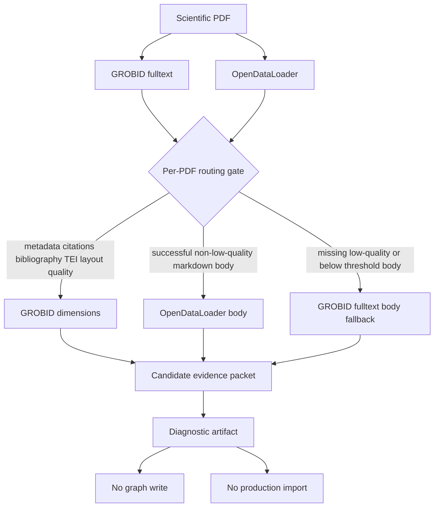

# ADR-009: Fulltext-Aware Hybrid Parser Routing

**Status:** Accepted (binding)
**Date:** 2026-06-10
**Deciders:** collaborative
**Milestone:** M055-kyxuqm
**Scope:** parser-benchmark / scientific-papers / evidence-pipeline / hybrid-architecture / fulltext-routing
**Binding Level:** binding
**Revisable:** no, unless a later accepted ADR supersedes this decision with equal or stronger benchmark evidence
**Amends:** ADR-008 Hybrid Parser Architecture

## 0. One-line Decision

> ADR-008 remains binding: scientific-paper PDF parsing uses a hybrid parser architecture. M055deep amends its operational routing rule: use **GROBID fulltext** for metadata, citations, native TEI structure/layout, quality diagnostics, and fallback body extraction; use **OpenDataLoader** for body markdown only when its packet is successful, non-low-quality, and above the markdown evidence threshold.

Production import is not authorized by this ADR. Graph writes, LadybugDB writes, fact promotion, and production import remain outside the benchmark authorization boundary.

## 1. Context

ADR-008 was accepted after the M055 5-PDF benchmark recommended 100% hybrid routing with GROBID header/citations plus OpenDataLoader body/layout.

M055deep expanded that evidence base to 20 PDFs and replaced header-only GROBID evidence with GROBID fulltext evidence:

- GROBID fulltext succeeded on 20/20 PDFs.
- OpenDataLoader succeeded on 19/20 PDFs and marked 1/20 as low-quality source.
- S05 routing produced 20 per-PDF comparison packets.
- Aggregate routing is 19/20 hybrid PDFs, or 95.0% hybrid.
- One medium-length PDF, `2605.28617v1`, routes to `grobid_fulltext_only` because OpenDataLoader body evidence is low-quality.
- Per-dimension aggregate winners:
  - metadata: GROBID
  - citations: GROBID
  - body_content: OpenDataLoader
  - layout: GROBID
  - processing_time: GROBID plurality
  - quality: GROBID

The 5-PDF overlap with M055 stayed hybrid, but the reason changed: fulltext GROBID now wins layout and quality dimensions that were previously attributed to OpenDataLoader or header-era quality signals.

## 2. Decision

Adopt a fulltext-aware hybrid routing rule:

1. **Default route:** `grobid_fulltext + opendataloader_body`.
2. **Use GROBID fulltext for:** metadata, citations, bibliography, TEI structural layout, parser quality diagnostics, and body fallback.
3. **Use OpenDataLoader for:** body markdown, tables, images, and section body evidence when the OpenDataLoader packet is successful and not low-quality.
4. **Fallback route:** `grobid_fulltext_only` when OpenDataLoader is unavailable, marked low-quality, below the markdown evidence threshold, or otherwise fails the body-quality gate.
5. **Do not use a blanket 100% hybrid assumption.** Routing must be per-PDF and data-driven.
6. **Do not authorize writes.** Benchmark routing artifacts are diagnostic only.

## 3. Mermaid Diagram

## 4. Safety Defaults

| Flag | Value |
| --- | --- |
| `graph_import_allowed` | `false` |
| `graphdb_written` | `false` |
| `import_eligible` | `false` |
| `ladybugdb_written` | `false` |
| `production_import_attempted` | `false` |

Production import is not authorized. The benchmark may produce routing packets, reports, and ADR evidence only.

## 5. Rationale

The 20-PDF evidence does not invalidate ADR-008; it strengthens the hybrid architecture while narrowing the routing rule.

The old 5-PDF result was 100% hybrid because GROBID was evaluated mainly as header/citation extraction and OpenDataLoader was the only parser with substantial body/layout evidence. M055deep changes the comparison: GROBID fulltext contributes body, equations, figures, sections, TEI structure, and consistent quality signals.

OpenDataLoader still wins aggregate body_content because successful markdown extraction is the best body surface for downstream reading, table extraction, image capture, and section-level body reconstruction. However, a low-quality OpenDataLoader packet must not be routed as body truth. The fallback rule prevents a single-parser failure from contaminating the candidate evidence layer.

This decision keeps the implementation conservative: it improves parser selection without authorizing production ingestion.

## 6. Alternatives Considered

### Alternative A: Keep ADR-008 exactly as written with 100% hybrid routing

Rejected. M055deep found one low-quality OpenDataLoader packet, so a blanket hybrid rule would route body extraction through a known weak packet.

### Alternative B: Switch to GROBID fulltext only

Rejected. OpenDataLoader remains the aggregate body-content winner on 19/20 PDFs and provides useful markdown, table, image, and section body evidence.

### Alternative C: Switch to OpenDataLoader only

Rejected. OpenDataLoader does not provide native citation/bibliography extraction and had one low-quality source in the 20-PDF corpus. It also does not replace GROBID metadata or fulltext TEI quality evidence.

### Alternative D: Manual review for every PDF

Rejected. The routing evidence is strong enough for deterministic diagnostic routing, provided the safety defaults remain false and the fallback rule is enforced.

## 7. Consequences

### Positive

- Keeps ADR-008's hybrid architecture while incorporating stronger fulltext evidence.
- Prevents low-quality OpenDataLoader body packets from being treated as authoritative.
- Makes routing observable: every per-PDF packet records dimension winners, route rationale, length bucket, and residual gaps.
- Gives downstream implementation a concrete fallback rule.

### Negative

- Routing is slightly more complex than a fixed two-parser merge.
- Tests and future import code must preserve body-quality gates.
- A GROBID fallback body may be less markdown-friendly than OpenDataLoader body output.

### Neutral

- This ADR does not authorize graph writes, LadybugDB writes, fact promotion, or production import.
- Future larger-corpus evidence may adjust thresholds or add parser-specific body-quality dimensions.

## 8. Implementation Guidance

- Read both parser packets before selecting a route.
- Require all five safety defaults to remain false in benchmark mode.
- Treat OpenDataLoader body as eligible only when `status == success`, `low_quality_source == false`, and markdown bytes exceed the configured threshold.
- Emit residual gaps such as `citation_to_body_alignment`, `table_figure_semantic_linking`, and `opendataloader_low_quality_body`.
- Use `127.0.0.1` in local service documentation and source references when a loopback host is required.
- Keep parser routing deterministic and idempotent for the same input packets.

## 9. Evidence

- `artifacts/m055deep-parser-benchmark/hybrid-routing-20/summary.json`
- `artifacts/m055deep-parser-benchmark/hybrid-routing-20/per-pdf/*.json`
- `artifacts/m055deep-parser-benchmark/REPORT.md`
- `tests/test_m055deep_hybrid_routing_20.py`
- `tests/test_m055deep_report_s06.py`

## 10. Binding Rule

Any future production parser import path must implement the fulltext-aware fallback gate before it can claim conformance with ADR-008 and ADR-009.

Any future benchmark, report, or test that claims this evidence authorizes writes is wrong: production import is not authorized by this decision.
