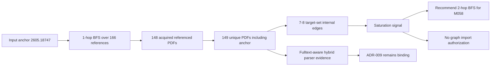

# ADR-010: BFS Scale Evidence from 167-PDF 1-hop Run

**Status:** Accepted (binding)
**Date:** 2026-06-10
**Deciders:** agent
**Milestone:** M056-lchpnp
**Scope:** parser-benchmark / graph-readiness / scientific-papers / BFS-scale-evidence
**Binding Level:** binding supplement to ADR-009
**Revisable:** yes, after M058 produces stronger 2-hop or alternative-anchor evidence
**Supplements:** ADR-009 Fulltext-Aware Hybrid Parser Routing

## 0. One-line Decision

> M056 demonstrates that a 1-hop BFS expansion from anchor `2605.18747` is sufficient parser-scale evidence but insufficient graph-readiness evidence: 149 unique PDFs yielded only 7-8 target-set internal edges, so M058 should require 2-hop BFS expansion or a materially different anchor strategy before graph-readiness evaluation.

Production import is not authorized by this ADR. Graph writes, LadybugDB writes, fact promotion, and production import remain false.

## 1. Context

ADR-008 established the hybrid parser architecture for scientific-paper PDFs. ADR-009 amended that architecture with fulltext-aware routing after M055deep showed that GROBID fulltext plus OpenDataLoader body markdown was the most reliable parser path at 20-PDF scale.

M056 extended the evidence base with a 1-hop BFS crawl from anchor `2605.18747`:

- M055 provided the original 5-PDF parser benchmark.
- M055deep expanded parser evidence to a 20-PDF corpus and supported ADR-009.
- M056 expanded from one anchor across 166 extracted references.
- M056 acquired 148 referenced PDFs.
- M056 produced 149 unique PDFs including the anchor.
- M056 maintained a 0% self-citation cluster around the anchor first author.
- M056 kept all five safety defaults false throughout the run.

The key graph-readiness question was not whether parsers could extract citation evidence. They could. The key question was whether a 1-hop expansion produced enough connected internal structure to support graph-readiness gate M058.

## 2. Decision

M056's 1-hop BFS result is accepted as scale evidence for parser routing and as negative evidence for immediate graph-readiness.

The accepted decision is:

1. Treat the M056 1-hop corpus as diagnostic parser-scale evidence.
2. Do not treat the M056 1-hop corpus as graph-ready.
3. Carry ADR-009 forward as the parser routing default.
4. Recommend 2-hop BFS expansion for M058 graph-readiness, unless M058 deliberately selects a different anchor strategy with an explicit rationale.
5. Keep candidate citation edges diagnostic-only until a later accepted ADR or gate authorizes import.

## 3. Mermaid Evidence Flow

## 4. Safety Defaults

This ADR preserves the same safety boundary used by ADR-008, ADR-009, and the M056 wave artifacts.

| Safety default | Value |
| --- | --- |
| `graph_import_allowed` | `false` |
| `graphdb_written` | `false` |
| `import_eligible` | `false` |
| `ladybugdb_written` | `false` |
| `production_import_attempted` | `false` |

Human-readable safety flags also remain false:

| Safety flag | Value |
| --- | --- |
| `graph_writes` | `false` |
| `production_import_attempted` | `false` |
| `promotion_allowed` | `false` |
| `facts_promoted` | `false` |
| `external_mutation_allowed` | `false` |

This evidence is not authorized for graph import or fact promotion.

## 5. Rationale

The decisive empirical observation is saturation. Across six waves, target-set connectivity added only 7-8 cumulative directed edges from 149 unique PDFs. Wave 5 added zero new target-set edges, and Wave 6 also added zero. That pattern indicates that the 1-hop anchor neighborhood did not densify the known target set enough for meaningful graph traversal or promotion decisions.

The 0% self-citation cluster matters because it rules out a narrow self-citation bubble as the obvious explanation. The corpus is diverse, but diversity alone did not produce graph-ready connectivity at depth one.

The parser result is still useful. GROBID fulltext TEI exposed references and biblStruct evidence at scale, while OpenDataLoader remained useful for body markdown when its packets were successful and non-low-quality. That supports ADR-009, but it does not authorize a graph import path.

## 6. Alternatives Considered

### 6.1 Keep the 1-hop anchor corpus as graph-ready

Rejected for M058. The edge density is too low under the target-set metric. Treating this corpus as graph-ready would confuse parser extraction success with graph connectivity.

### 6.2 Choose a different anchor paper

Allowed as a future M058 design option. A different anchor may produce a denser local citation neighborhood. If chosen, M058 should state why the new anchor is more likely to retire graph-readiness risk than 2-hop expansion from `2605.18747`.

### 6.3 Expand to 2-hop BFS

Recommended. A 2-hop expansion directly tests whether the sparse 1-hop shell becomes connected through cited and co-cited neighbors. It is the most direct next experiment for graph-readiness.

### 6.4 Add self-citation-aware sampling rules

Deferred. M056's 0% self-citation cluster means self-citation filtering is not the first-order issue for this anchor. It may still be useful for future anchors or domains.

## 7. Consequences

- M058 should not use the M056 1-hop corpus as an import-ready graph.
- M058 should choose between 2-hop BFS expansion and a deliberate alternative-anchor strategy.
- Parser routing remains governed by ADR-009.
- Candidate edges from M056 remain diagnostic artifacts only.
- Any graph-write, LadybugDB-write, production-import, or fact-promotion path still requires a later explicit authorization gate.

## 8. Evidence References

- `artifacts/m056-bfs-graph/REPORT.md`
- `artifacts/m056-bfs-graph/candidate-edges.json`
- `artifacts/m056-bfs-graph/wave-1/analysis.md`
- `artifacts/m056-bfs-graph/wave-2/analysis.md`
- `artifacts/m056-bfs-graph/wave-3/analysis.md`
- `artifacts/m056-bfs-graph/wave-4/analysis.md`
- `artifacts/m056-bfs-graph/wave-5/analysis.md`
- `artifacts/m056-bfs-graph/wave-6/analysis.md`
- `doc/adr/ADR-008-hybrid-parser-architecture.md`
- `doc/adr/ADR-009-amend-hybrid-parser.md`

## 9. Revisit Trigger

Revisit this ADR after M058 if either:

1. A 2-hop BFS expansion produces a materially denser graph-readiness candidate set, or
2. An alternative anchor produces stronger connectivity without unsafe promotion or graph writes.

Until then, the binding interpretation is conservative: 1-hop BFS from `2605.18747` saturated and should not be promoted into graph-readiness.
