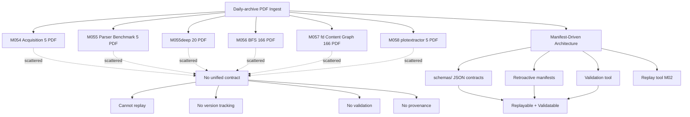
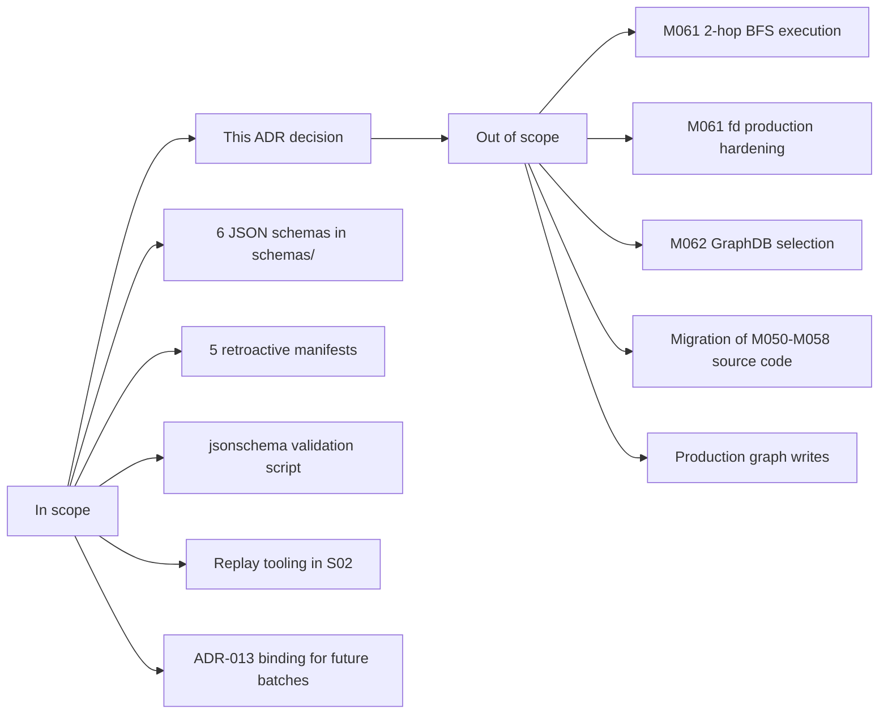
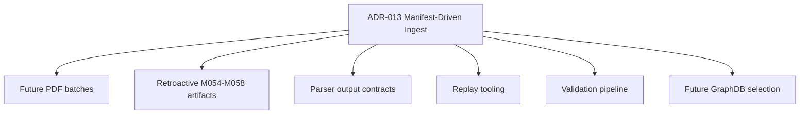
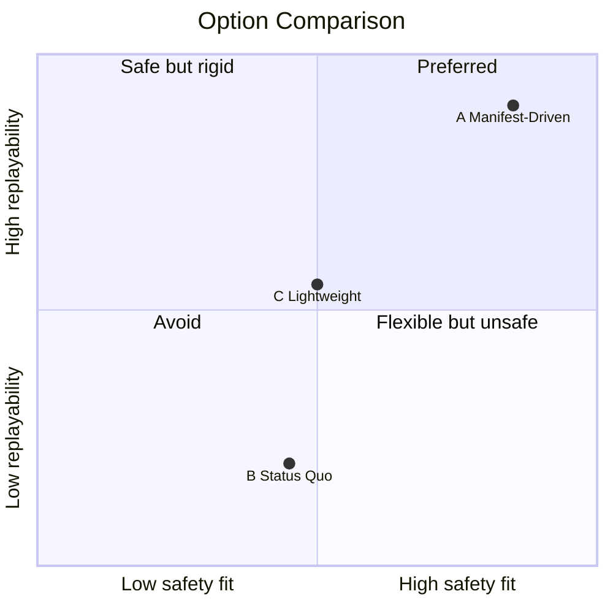
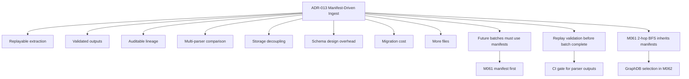
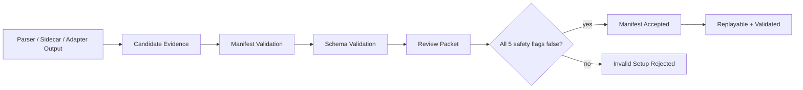
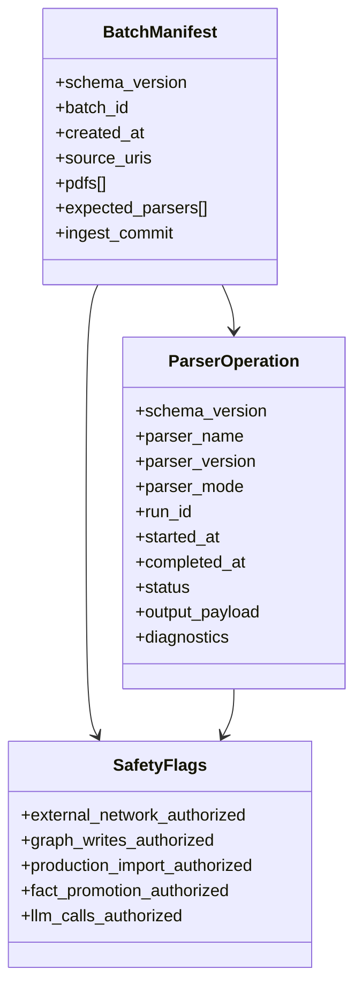
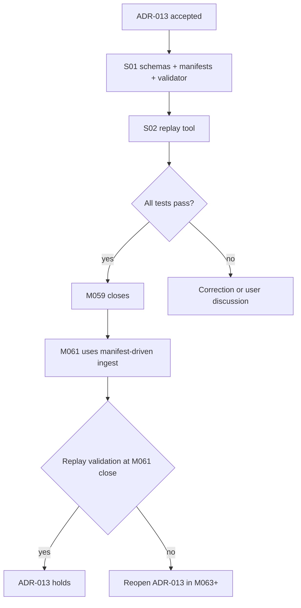

# ADR-013: Manifest-Driven PDF Ingest Architecture

**Status:** Accepted (binding)
**Date:** 2026-06-12
**Deciders:** agent
**Milestone:** M059-y6osma
**Scope:** pdf-ingest / parser-benchmark / jsonschema / replay / validation / retroactive-manifests
**Binding Level:** binding supplement to ADR-001, ADR-008, ADR-009, ADR-010, ADR-011, ADR-012
**Revisable:** yes, after M061 proves 2-hop BFS scale with manifest-first ingest and replay validation

## 0. One-line Decision

> We will adopt manifest-driven PDF ingest as the processing contract for daily-archive: every PDF batch must declare a versioned manifest before parser work, parser outputs must reference expected JSON schemas, retroactive M054-M058 artifacts are bound by generated manifests for validation and replay, and `scripts/m059_jsonschema_validate.py` becomes the first generic validator.

We will not bypass manifest validation, allow silent schema drift, or rewrite historical M054-M058 outputs to satisfy retroactive schemas.

Production import is disabled by this ADR. External network calls, graph writes, LadybugDB writes, fact promotion, and LLM calls remain disabled unless a later binding explicitly changes them.

## 1. Context

M054-M058 produced useful PDF acquisition, parser benchmark, BFS graph, fd content graph, and plotextractor figure-caption evidence, but the artifacts were scattered across milestone-specific shapes:

- M054 recorded acquired PDFs in `target-subset.json` and `acquisition-log.json`.
- M055 and M055deep recorded parser benchmark corpora in separate corpus manifest files.
- M056 used BFS cumulative corpus and candidate edge artifacts for a 166-PDF graph run.
- M057 produced table-similarity and figure-link summaries without a unified batch contract.
- M058 produced plotextractor figure-caption summaries for a focused 5-PDF sample.

Those artifacts had safety defaults, but no single replayable contract for a parser runner to answer these questions before work starts:

1. Which PDFs are in this batch?
2. Which local file bytes are authoritative?
3. Which parsers are expected for each PDF?
4. Which schema validates each parser output?
5. Which safety defaults block side effects?

Without that contract, future 2-hop BFS and larger parser runs risk repeating milestone-specific glue, losing version traceability, or validating only after expensive work has already run. The manifest-driven architecture is cheaper when adopted early, expensive when retrofitted; the M061 2-hop BFS milestone would otherwise become the next scattered-artifact batch.

### Context Map



## 2. Decision

Adopt six JSON Schema draft-07 contracts under `schemas/`:

1. `schemas/daily-archive.pdf-batch-manifest.v1.json` for PDF batch manifests.
2. `schemas/daily-archive.parser-op.v1.json` for a universal parser operation envelope.
3. `schemas/grobid-tei.v1.json` for GROBID TEI adapter output and retroactive daily-archive GROBID diagnostics.
4. `schemas/opendataloader-pdf.v1.json` for OpenDataLoader PDF output with daily-archive provenance.
5. `schemas/m057-fd-table-similarity.v1.json` for M057 fd table similarity summaries and edges.
6. `schemas/m058-plotextractor-figure-caption.v1.json` for M058 plotextractor figure-caption extraction.

Adopt retroactive manifests generated by `scripts/m059_build_manifest.py`:

- `artifacts/m054-pdf-acquisition/manifest.json` for 5 acquired PDFs.
- `artifacts/m055-parser-benchmark/manifest.json` for 5 parser benchmark PDFs.
- `artifacts/m055deep-parser-benchmark/manifest.json` for 20 deeper parser benchmark PDFs.
- `artifacts/m056-bfs-graph/manifest.json` for 166 BFS corpus PDFs.
- `artifacts/m057-fd-marker/manifest.json` for the same 166 PDFs used by fd content graph diagnostics.
- `artifacts/m058-plotextractor/manifest.json` for 5 plotextractor PDFs.

Adopt `scripts/m059_jsonschema_validate.py` as the first generic validator. It reads a manifest, selects the requested parser expectation, resolves per-PDF or batch output paths, validates the output against the declared schema, and prints per-PDF plus aggregate pass/fail statistics.

The manifest contract is intentionally permissive (`additionalProperties: true`) so older artifacts can remain valid while newer parsers add richer fields. The required fields remain strict enough to support replay: `schema_version`, `batch_id`, `created_at`, `source_uris`, `pdfs[]`, local path, byte size, content SHA-256, and `expected_parsers[]`.

### Decision Boundary



## 3. Applies To

This decision applies to:

- All future PDF ingest batches (M061 2-hop BFS, M062 GraphDB validation, M063+ production ingestion).
- Retroactive M054-M058 artifact validation and replay.
- Parser output contracts (GROBID, OpenDataLoader, plotextractor, fd, future parsers).
- Replay tooling (M059 S02 scope).
- Future GraphDB selection (M062) — manifests will track which graph database any batch is intended for.

### Applicability Diagram



## 4. Requirements and Decisions Impacted

### Requirements

| Requirement | Impact | Notes |
|---|---|---|
| R009 (parser quality contracts) | supports | manifests are the formalization |
| R016 (graph readiness evidence chain) | supports | manifests link to evidence chain |
| R020 (replayable extraction) | enables | schemas + replay tool satisfy this |
| R031 (parser version tracking) | enables | manifest pinnings enable version tracking |
| R041 (provenance metadata) | supports | content_sha256 + parser_version in manifest |

### Decisions

| Decision | Impact | Notes |
|---|---|---|
| ADR-001 (paper first domain) | consistent | manifests are paper-domain-friendly |
| ADR-008 (hybrid parser architecture) | consistent | multi-parser support in manifest expected_parsers[] |
| ADR-009 (fulltext hybrid routing) | consistent | mode field captures fulltext vs header-only |
| ADR-010 (BFS scale 167 PDF) | consistent | M056 retroactive manifest binds BFS corpus |
| ADR-011 (content graph via fd) | consistent | fd table-similarity schema binds M057 outputs |
| ADR-012 (figure caption v2) | consistent | plotextractor schema binds M058 outputs |
| ADR-002 (GraphDB selection, Deferred) | narrows | future M062 selects DB; manifest becomes the binding link |

## 5. Options Considered

### Option A — Manifest-Driven (Chosen)

| Dimension | Assessment |
|---|---|
| Local-first fit | High |
| Safety fit | High (explicit 5-flag block in every manifest) |
| Complexity | Medium (6 schemas + 5 manifests + 1 validator + 1 replay tool) |
| Reversibility | High (permissive schemas, additionalProperties=true) |
| GraphDB portability | High (manifest is storage-agnostic) |
| Agent/tooling dependency | Low (jsonschema standard library) |
| Human review compatibility | High (YAML/JSON in plain sight) |

**Pros**
- Replayable extraction (same manifest → same output)
- Validated outputs (jsonschema catches malformed parser results)
- Auditable lineage (each edge → PDF → parser version → commit)
- Decouples storage from processing
- Versioned schemas (v1, v2) allow parser evolution without breaking contract

**Cons**
- Schema design overhead (1-2 days upfront)
- Migration cost for existing artifacts (1 day retroactive)
- More files (schemas, manifests, validators)
- Risk of over-engineering if schemas too rigid

### Option B — Implicit Schemas (Status Quo)

| Dimension | Assessment |
|---|---|
| Local-first fit | Medium |
| Safety fit | Medium (5-flag block exists but per-script) |
| Complexity | Low (no new infrastructure) |
| Reversibility | High |
| GraphDB portability | Low (no batch contract) |
| Agent/tooling dependency | Low |
| Human review compatibility | Medium |

**Pros**
- No new files
- Existing scripts work as-is
- No migration cost

**Cons**
- Cannot replay extraction deterministically
- Parser version drift undetected
- Validation only after expensive work
- 2-hop BFS will repeat milestone-specific glue

### Option C — Lightweight Manifest Only (No Schemas)

| Dimension | Assessment |
|---|---|
| Local-first fit | Medium |
| Safety fit | Medium |
| Complexity | Low |
| Reversibility | High |
| GraphDB portability | Medium |
| Agent/tooling dependency | Low |
| Human review compatibility | High |

**Pros**
- Simpler than Option A
- Manifest as single source of truth
- 1 day implementation

**Cons**
- No validation (defeats main purpose)
- Schemas still implicit in scripts
- Cannot enforce contract via tooling

### Option Comparison Snapshot



## 6. Trade-off Analysis

### Why Option A wins now

Short-term implementation value:
- Validation catches malformed outputs in M059 S01 already (M054 GROBID test passed 5/5)
- Retroactive manifests bind 5 batches without rewriting source code

Long-term architecture value:
- 2-hop BFS (M061) inherits manifest-driven ingest for free
- M062 GraphDB selection can compare DBs on identical parser outputs (since manifests pin versions)
- Production ingestion (M063+) has audit trail from day 1

Safety impact:
- 5-flag block is **explicit and per-batch** (not buried in per-script code)
- Validator refuses to accept a manifest with non-false safety flags
- Replay can detect if a past batch had different safety posture (forensic capability)

Reversibility:
- Schemas are `additionalProperties: true` (permissive) so future parsers add fields without breaking
- Schema versions (v1) allow graceful migration (v2 supersedes v1)
- Manifests reference schema versions, not schema content (de-coupled)

Cost/complexity:
- 2-3 days for S01 (schemas + retroactive + validator)
- 1 day for S02 (replay tool)
- Future: marginal cost (one manifest per batch, validated automatically)

Uncertainty:
- Schema design might miss edge cases (mitigation: permissive + versioned)
- Validator might be slow on 166 PDFs (mitigation: jsonschema is fast, <1 sec per PDF)
- LLM-call schema for future judge (M059b MiniMax-M3) is not yet designed (M059b scope)

### Trade-off Summary

| Trade-off | Chosen side | Why |
|---|---|---|
| Schema strictness vs permissiveness | Permissive (additionalProperties=true) | Parser evolution without breaking |
| Replay enforcement vs suggestion | Enforcement (validator refuses drift) | Replay is a core property |
| Migration of M050-M058 source vs only artifacts | Only artifacts | Source code stable, no rewrite |
| M061+ adoption vs M054-M058 retroactive | Both | Future + past both benefit |
| 6 schemas vs 20+ | 6 (start small) | Add as needed, not preemptively |

## 7. Consequences

### Positive

- Replayable PDF extraction (same manifest → same output, deterministically)
- Validated parser outputs (jsonschema catches malformed data early)
- Auditable lineage (each graph edge traces back to PDF → parser version → commit)
- Multi-parser comparison enabled (same PDF, different parser versions, diff)
- Storage decoupling (storage_provider field: local, s3, gs, etc.)
- M061+ batches inherit validation for free

### Negative

- Schema design overhead (1-2 days upfront cost)
- Migration cost for existing M054-M058 artifacts (1 day retroactive, completed in S01)
- More files in repository (6 schemas, 5 manifests, 2 scripts)
- Risk of over-engineering if schemas become too rigid (mitigation: permissive + versioned)
- 5-flag safety block repeated in every manifest (minor verbosity)

### New obligations

- Future PDF batches MUST create a manifest before parser work
- Future parsers SHOULD declare expected_output_schema in their documentation
- Retroactive M054-M058 artifacts now have manifests; new artifacts should match
- Replay validation MUST be run before declaring a batch complete
- Schema versions MUST be bumped (v1 → v2) when fields are removed or renamed

### What becomes harder

- Adding new fields to parser output requires schema version bump (if removing)
- Validator must be updated when schemas evolve
- Manifest entries cannot be silently removed (audit trail)

### Consequence Flow



## 8. Safety and Non-Authorization

This ADR does **not** authorize:

- Production graph import (any kind)
- Graph writes to LadybugDB / FalkorDB / any other DB
- Fact promotion from extraction to graph
- LLM calls in this milestone (S02 replay tool is deterministic)
- External network access (no remote downloads during validation)
- Bypassing validators or review packets

Required safety defaults (every manifest):

```text
external_network_authorized=false
graph_writes_authorized=false
production_import_authorized=false
fact_promotion_authorized=false
llm_calls_authorized=false
```

The validator treats a manifest with any different safety-default block as invalid setup. The retroactive parser schemas may accept older false safety key names for historical output validation, but the M059 manifest contract itself uses the five flags above.

### Safety Gate



## 9. Contract Impact

Affected contracts:

- `BatchManifest` (new): schema_version, batch_id, created_at, source_uris[], pdfs[] (with arxiv_id, source_uri, storage_provider, path, size_bytes, content_sha256), expected_parsers[] (with name, version, mode, expected_output_schema)
- `ParserOperation` (new): envelope wrapping parser output (schema_version, parser_name, parser_version, parser_mode, run_id, started_at, completed_at, status, output_payload, diagnostics)
- `EvidenceArtifactRecord`: provenance now includes manifest_batch_id and parser_version_pinned
- `ReviewPacket`: review_required flag is set if validation fails

Required contract changes or drafts:

- Add `manifest_batch_id` to all parser output envelopes (M060+ parsers)
- Update `SafetyFlags` to enforce the M059 5-flag block during validation
- Replay tool (M059 S02) consumes `BatchManifest` and re-runs parsers

### Contract Relationship Map



## 10. Validation / Evidence Required

Evidence needed to accept or revisit this ADR:

- 6 schemas in `schemas/` directory (S01)
- 5 retroactive manifests in `artifacts/mXXX-*/manifest.json` (S01)
- `scripts/m059_jsonschema_validate.py` runs successfully on M054 GROBID output (S01)
- `scripts/replay_ingest.py` produces identical output for at least 1 parser (S02)
- 5+ tests in `tests/test_m059_s01.py` pass (S01)
- 5+ tests in `tests/test_m059_s02.py` pass (S02)
- M045 trajectory on_track at closeout
- M044 guardrail exit 0 at closeout
- 5 safety defaults stay false throughout

### Validation Path



## 11. Open Questions

| Question | Owner | Needed by | Blocking? |
|---|---|---|---|
| Should manifests include the 5-flag block per-PDF or per-batch? | agent | M060 | no (per-batch is enough for now) |
| Should schema versions be date-stamped (v1.0) or sequential (v1, v2)? | agent | M060 | no (sequential is simpler) |
| How to handle 3rd-party parser output that doesn't match our schemas? | agent | M060 | no (current scope = our parsers only) |
| Should replay include LLM-call parsers if MiniMax-M3 is added in M059b? | agent | M059b | yes (LLM is non-deterministic, replay contract changes) |
| How long until retro M054-M058 manifests become "stale" (parser version moves on)? | agent | M063 | no (replay can regenerate) |

## 12. Follow-up Actions

- [ ] M059 S02: build `scripts/replay_ingest.py` and e2e test on M054
- [ ] M061: 2-hop BFS uses manifest-first ingest (5 anchors × 2-hop → 2000-5000 PDF)
- [ ] M062: GraphDB selection uses manifest output as input (compare DBs on identical parser outputs)
- [ ] M063: if MiniMax-M3 figure QA judge is added (M059b), define parser-op.v2 schema for LLM-call parsers
- [ ] CI gate: replay validation runs before batch complete
- [ ] Update `scripts/check_project_trajectory.py` to scan `schemas/` directory

## 13. Supersedes / Superseded By

### Supersedes

- None (this is the first manifest-driven ADR)

### Superseded By

- Empty until future ADR reverses the manifest-driven approach (unlikely; would require new evidence)

## 14. LLM Reading Notes

This section is intentionally explicit for future agents.

- **Binding decision**:
  - Every future PDF batch MUST create a manifest before parser work
  - Every parser output MUST reference an `expected_output_schema` in the manifest
  - Retroactive M054-M058 artifacts are bound by generated manifests
  - `scripts/m059_jsonschema_validate.py` is the first generic validator
  - 5 safety defaults MUST stay false in every manifest

- **Do not infer**:
  - This ADR does not authorize production graph import
  - This ADR does not select a GraphDB (that's M062)
  - This ADR does not enable LLM calls (LLM-as-judge would need separate authorization)
  - This ADR does not rewrite M050-M058 source code (only artifacts are bound by retroactive manifests)
  - This ADR does not validate factual correctness of parser output (only structural contract)

- **Safe next action**:
  - Run `scripts/m059_jsonschema_validate.py --manifest=X --parser=Y` on any retroactive manifest
  - Add new parser output schemas to `schemas/` (follow JSON Schema draft-07, permissive, versioned)
  - Create a manifest for any new PDF batch before parser work
  - Use `scripts/replay_ingest.py` (S02) to reproduce a past batch deterministically

- **Blocked until**:
  - Any of the 5 safety defaults becomes true (would require separate binding ADR)
  - A parser output no longer matches its schema (must update schema or fix parser)
  - A retroactive manifest's content_sha256 changes (file corruption or path change)
