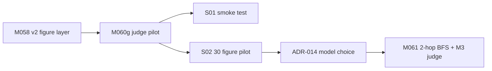
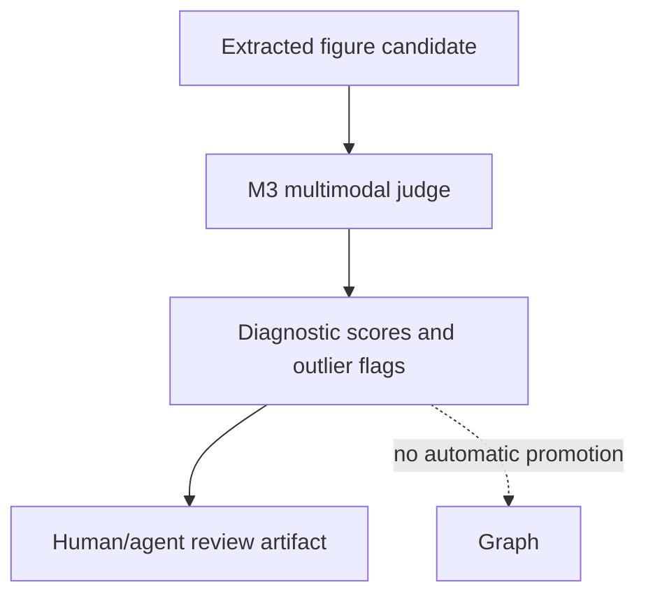
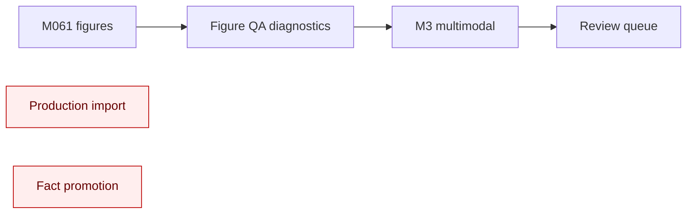
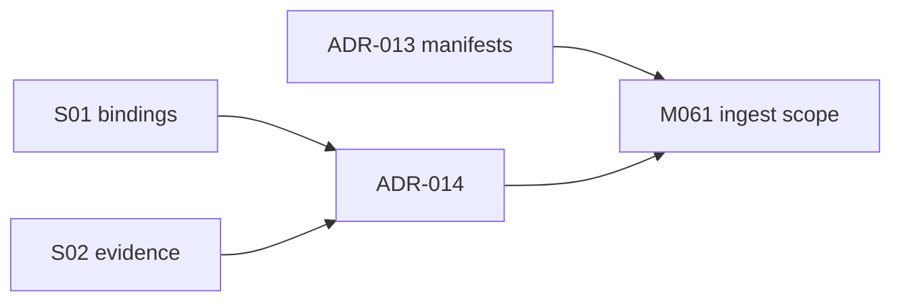
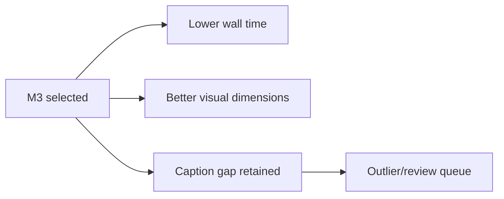
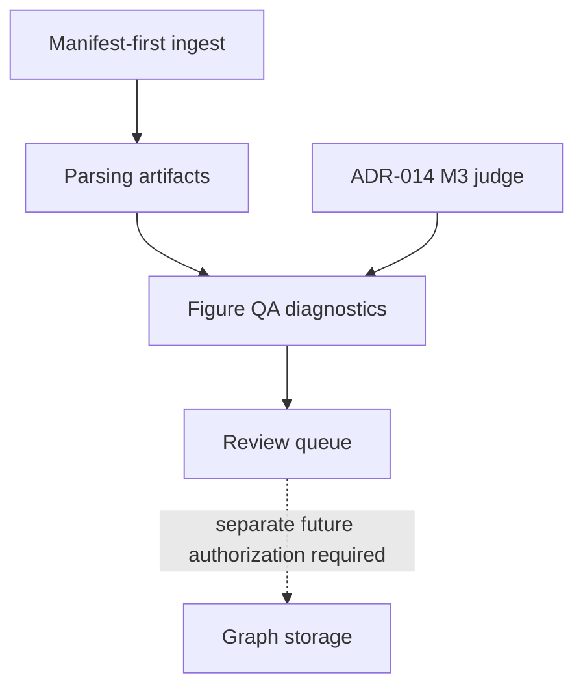

# ADR-014: MiniMax M3 Multimodal as Figure QA Judge

**Status:** Accepted (binding)
**Date:** 2026-06-12
**Deciders:** agent
**Milestone:** M060-gakmo0
**Scope:** figure-qa / minimax / multimodal-judge / M061-2-hop-bfs / diagnostic-llm
**Binding Level:** binding supplement to ADR-013 for figure QA diagnostics
**Revisable:** yes, after M061 and M062 produce larger-corpus judge calibration evidence

## 0. One-line Decision

> We will use MiniMax M3 multimodal, through the `minimax-m3-multimodal-anthropic` model and `figure-qa-judge-quality` binding, as the production figure QA judge for M061+ diagnostics.

This accepts M3 multimodal as the model choice for diagnostic judging only. Graph writes are not authorized, production import is not authorized, fact promotion is not authorized, external network default is disabled, and LLM calls default is disabled outside explicitly scoped diagnostics.

## 1. Context

M058 v2 introduced a figure layer that needs quality review before broader 2-hop BFS ingestion work. M059b/M060g tested whether MiniMax models can judge figure quality across caption accuracy, visual completeness, structural fidelity, and operational latency.

S01 established smoke-test viability for M2.7-highspeed and M3. S02 compared both judge candidates on 30 figures: 15 data plots and 15 schema diagrams. Both models completed 30/30 evaluations, so the decision is based on quality, latency, and failure profile rather than basic availability.

Safety context remains unchanged: judge outputs are diagnostic evidence. They are not source-of-truth facts and do not authorize writes to the knowledge graph.

### Context Map

## 2. Decision

Select `figure-qa-judge-quality` as the primary figure QA judge binding for M061+ diagnostics. This binding resolves to `minimax-m3-multimodal-anthropic` and should be used when the task requires image-aware assessment of extracted figures.

M2.7-highspeed remains available as a comparative baseline and possible caption-specific audit helper. It is not the primary judge for M061.

### Decision Boundary

The dashed edge is intentionally non-authorized: judge output does not write to graph storage.

## 3. Applies To

This ADR applies to M061+ figure QA diagnostics, especially 2-hop BFS acquisition and parsing runs that need automated triage of extracted figures.

It applies to:

- `models.yaml` binding `figure-qa-judge-quality`.
- M061 judge integration plans and scripts.
- Future figure QA reports that compare extracted figure images, captions, and structural metadata.

It does not apply to production graph import, fact promotion, general text extraction quality, or non-figure entity resolution.

### Applicability Diagram

## 4. Requirements and Decisions Impacted

### Requirements

| Requirement area | Impact |
|---|---|
| Figure QA diagnostics | M3 multimodal becomes the default judge for visual figure quality. |
| Safety defaults | No authorization boundary changes; diagnostic-only override remains scoped. |
| M061 runtime planning | Wall-time estimates should use roughly 8.5 seconds per figure from S02 evidence. |
| Outlier handling | M061 must preserve outlier queues as review artifacts. |

### Decisions

| Decision | Relationship |
|---|---|
| ADR-013 manifest-driven PDF ingest | Complementary; ADR-014 adds figure QA model selection after manifest-first ingest. |
| M060g S01 model bindings | Consumed; `figure-qa-judge-quality` is the selected binding. |
| M060g S02 comparison | Primary evidence for this ADR. |

### R/D Relationship Map

## 5. Options Considered

### Option A — M3 multimodal (chosen)

Use `minimax-m3-multimodal-anthropic` through `figure-qa-judge-quality` for primary figure QA diagnostics. This option won 23 of 30 side-by-side comparisons, improved visual completeness and structural fidelity, and reduced average latency to 8549 ms.

### Option B — M2.7-highspeed

Use `minimax-m27-highspeed-anthropic` through `figure-qa-judge-fast` as the primary judge. This option had better caption accuracy in the pilot, fewer outliers, and successful 30/30 runs, but was slower and weaker on visual dimensions.

### Option C — Ensemble

Run both M3 multimodal and M2.7-highspeed, then combine scores. This could improve caption-specific confidence but doubles operational complexity, cost, and wall time. It is premature before M061 scale evidence.

### Option Comparison Snapshot

| Option | Decision | Caption accuracy | Completeness | Structural fidelity | Avg latency | Operational note |
|---|---|---:|---:|---:|---:|---|
| A: M3 multimodal | Chosen | 0.6907 | 0.8757 | 0.8603 | 8549 ms | Best overall fit for visual QA. |
| B: M2.7-highspeed | Rejected as primary | 0.7477 | 0.7823 | 0.7467 | 23846 ms | Better captions, weaker visual QA. |
| C: Ensemble | Deferred | TBD | TBD | TBD | Higher than either | Consider only after M061/M062. |

## 6. Trade-off Analysis

M3 multimodal is roughly 3x faster than M2.7-highspeed on the S02 30-figure pilot: 8549 ms average versus 23846 ms average. It is also better on two of three measured quality dimensions: figure completeness and structural fidelity.

The trade-off is caption accuracy. M2.7-highspeed scored 0.7477 on caption accuracy, compared with M3 multimodal at 0.6907. For M061 this is acceptable because the primary risk in the figure layer is visual completeness and structural correspondence. Caption-specific disagreements should be retained as review signals rather than used to choose the slower primary model.

### Trade-off Summary

- Choose speed and visual fidelity for primary diagnostics.
- Preserve caption-heavy disagreements for audit/review.
- Do not introduce ensemble complexity until larger-corpus evidence justifies it.

## 7. Consequences

### Positive

- M061 has a clear default judge binding.
- Large pilot runs are more feasible because M3 is about 3x faster.
- Visual completeness and structural fidelity improve versus M2.7.
- S02 evidence remains reproducible through `artifacts/m060g-judge/comparison.json` and `judge-summary.json`.

### Negative

- Caption accuracy is lower than M2.7 in the pilot.
- M3 produced more outliers: 7 versus 3.
- Larger runs must budget live diagnostic LLM time carefully.

### New obligations

- Persist per-figure raw response, parsed scores, latency, prompt version, binding id, and outlier flags.
- Keep the diagnostic-only override explicit in every run artifact.
- Use `127.0.0.1` for local diagnostic host references.

### What becomes harder

- Pure caption-quality triage may require a secondary review path.
- Any later ensemble decision must explain why added wall time and cost are justified.

### Consequence Flow

## 8. Safety and Non-Authorization

### Safety Gate

The five safety defaults remain explicit:

1. Graph writes are not authorized.
2. Production import is not authorized.
3. Fact promotion is not authorized.
4. External network default is disabled.
5. LLM calls default is disabled.

The only permitted override is diagnostic-only: `llm_calls_authorized` may be `true` for a named M060g/M061 figure QA diagnostic run when the artifact records reason, scope, generated timestamp, binding id, and non-authorization statements. This override does not authorize graph writes, production import, or fact promotion.

Local host references must use `127.0.0.1`, not the loopback hostname.

## 9. Contract Impact

ADR-014 narrows the model-selection contract for figure QA diagnostics. It does not change ADR-013's manifest-driven ingest contract and does not change graph-write authorization.

### Contract Relationship Map

## 10. Validation / Evidence Required

S02 validation evidence:

- 30 figures judged.
- 15 data plots and 15 schema diagrams.
- M2.7-highspeed: 30/30 passed, 23846 ms average latency, mean scores 0.7477 / 0.7823 / 0.7467, 3 outliers.
- M3 multimodal: 30/30 passed, 8549 ms average latency, mean scores 0.6907 / 0.8757 / 0.8603, 7 outliers.
- Side-by-side winners: M3 23, M2.7 6, tie 1.

### Validation Path

M061 must validate this decision at larger scale by recording:

- Figure count and category mix.
- Per-model or selected-model latency distribution.
- Outlier rate and examples.
- Diagnostic-only override audit.
- Confirmation that graph writes, production import, and fact promotion remained disabled.

## 11. Open Questions

- What outlier threshold should trigger human review in M061?
- Should M062 add a caption-specific audit pass with M2.7 for disagreement cases?
- What sample size is sufficient before discussing any production import authorization boundary?

## 12. Follow-up Actions

- M061: integrate M3 judge into 2-hop BFS acquisition/parsing diagnostics.
- M061: estimate and record wall time for 2000–5000 figures and optional 10% sample mode.
- M062: calibrate thresholds and outlier handling using M061 evidence.
- M063: revisit production-readiness only after M061/M062 evidence, not before.

## 13. Supersedes / Superseded By

### Supersedes

None. ADR-014 supplements ADR-013 and the M060g S01/S02 evidence trail.

### Superseded By

None at creation time. A future ADR may revise the model choice after M061/M062 larger-corpus calibration.

## 14. LLM Reading Notes

- Binding decision: use `figure-qa-judge-quality` / `minimax-m3-multimodal-anthropic` as the primary figure QA judge for M061+ diagnostics.
- Non-authorization is binding: graph writes are not authorized, production import is not authorized, fact promotion is not authorized, external network default is disabled, and LLM calls default is disabled unless a scoped diagnostic override is explicitly recorded.
- M2.7-highspeed is not removed; it remains a baseline or caption-specific audit option.
- M3 was selected because it was about 3x faster and better on figure completeness and structural fidelity in S02.
- Local diagnostic host references must use `127.0.0.1`.
