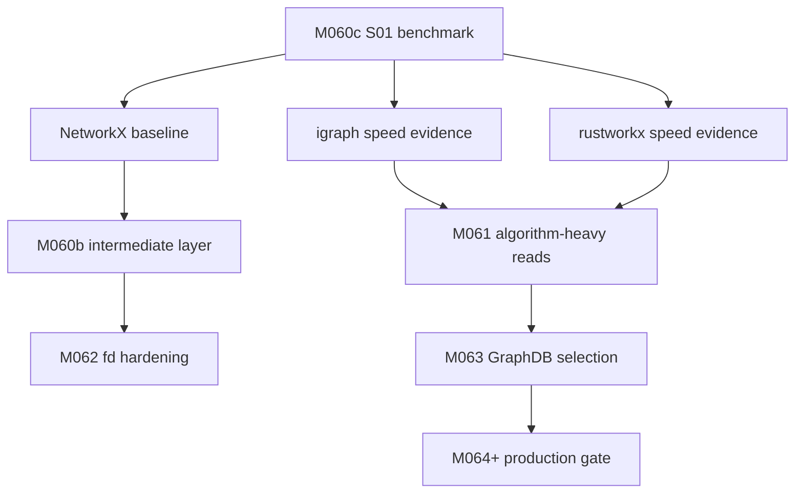
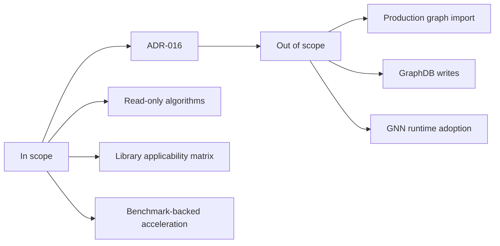
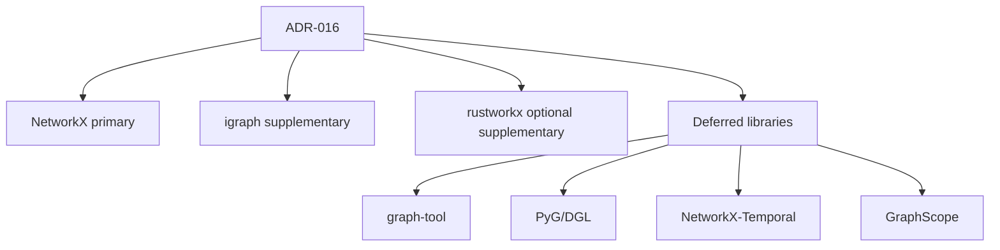
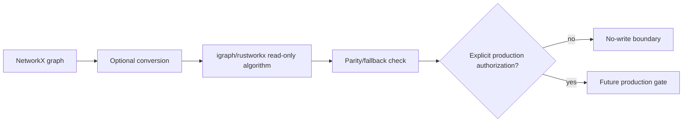
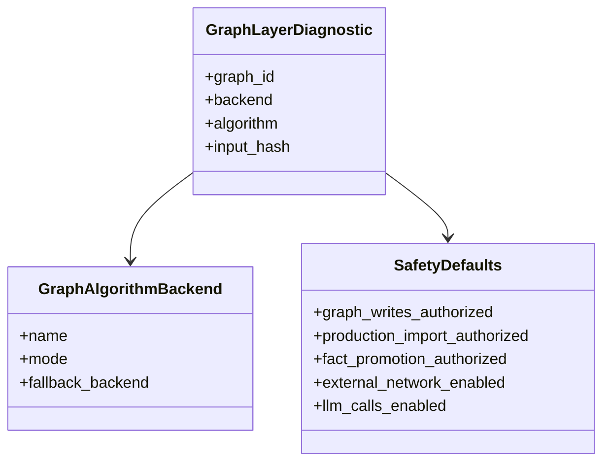
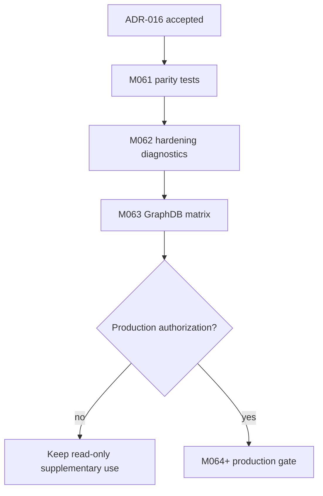

# ADR-016: Graph Library Selection for M060b-M064+

**Status:** Accepted (binding)  
**Date:** 2026-06-13  
**Deciders:** agent  
**Milestone:** M061-0fib2i  
**Scope:** graph-layer / algorithm-backend / benchmark / diagnostics / graphdb-selection  
**Binding Level:** binding supplement to ADR-010, ADR-011, ADR-013  
**Revisable:** yes, after M061 2-hop BFS and M063 GraphDB-selection evidence show a different scale or substrate requirement

## 0. One-line Decision

> We will keep NetworkX as the primary graph representation and correctness baseline, adopt igraph as the supplementary read-only accelerator for algorithm-heavy graph operations, and adopt rustworkx when available for traversal/path hot spots with parity checks.

We will not replace NetworkX as the canonical graph layer in M060b-M062, adopt graph-tool/PyG/DGL/NetworkX-Temporal for runtime integration now, or treat GraphScope as authorized outside a future M063 GraphDB-selection evaluation.

## 1. Context

The project has a manifest-first graph layer for diagnostics and algorithms, not a production graph import path. M060c S01 benchmarked NetworkX, igraph, and rustworkx across BFS, PageRank, shortest path, and connected components using the M058 4-layer graph and synthetic graphs. The benchmark showed igraph and rustworkx can be materially faster than NetworkX on heavy operations, with representative 5-10x-class gains and larger gains for some workloads.

The next milestones need a safe answer to two questions:

- which library should author and validate the graph representation;
- which library may accelerate read-only algorithm workloads without authorizing writes or production import.

The safety posture remains unchanged: Graph writes are not authorized. Production import is not authorized. Fact promotion is not authorized. External network default is disabled. LLM calls default is disabled.

### Context Map



## 2. Decision

We will keep NetworkX as the primary graph representation, fixture surface, and correctness baseline.

We will adopt igraph as a supplementary read-only accelerator for algorithm-heavy operations where conversion cost is justified by benchmark evidence. M060b and M061 may use igraph for heavy diagnostic/algorithm paths while preserving NetworkX parity checks.

We will adopt rustworkx as an optional supplementary read-only accelerator when available for traversal and path workloads, especially 2-hop BFS and shortest-path hot spots.

This decision authorizes:

- deterministic conversion from the canonical NetworkX/control graph into igraph or rustworkx for read-only analysis;
- benchmark-backed use of igraph in M060b and M061;
- benchmark-backed use of rustworkx for traversal/path hot spots when installed;
- NetworkX as the default library for read-only control-plane operations.

This decision does not authorize:

- graph writes;
- production graph import;
- fact promotion;
- GraphDB selection;
- adoption of graph-tool, PyG, DGL, NetworkX-Temporal, or GraphScope as runtime dependencies for M060b-M062.

### Decision Boundary



## 3. Applies To

This decision applies to:

- M060b intermediate graph layer work;
- M061 2-hop BFS and algorithm-heavy graph diagnostics;
- M062 fd hardening where graph operations remain deterministic and read-only;
- M063 GraphDB-selection comparison methodology;
- M064+ production gating for graph acceleration;
- future agents choosing graph libraries for read-only operations.

### Applicability Diagram



## 4. Requirements and Decisions Impacted

### Requirements

| Requirement | Impact | Notes |
|---|---|---|
| M060c benchmark evidence | supports | S01 produced benchmark and research evidence; S02 binds library applicability. |
| M061 2-hop BFS proof | constrains | Must keep NetworkX parity while allowing igraph/rustworkx acceleration. |
| M062 fd hardening | supports | Defaults to NetworkX for clear read-only diagnostics; accelerators only for measured hot paths. |
| M063 GraphDB selection | constrains | igraph/rustworkx are comparators, not GraphDB substitutes. |
| M064+ production | constrains | Production use requires explicit gate approval and packaging proof. |

### Decisions

| Decision | Impact | Notes |
|---|---|---|
| ADR-010 | consistent | Preserves BFS scale concerns while adding measured accelerator choices. |
| ADR-011 | consistent | Keeps graph construction manifest/control-plane first. |
| ADR-013 | consistent | Maintains manifest-driven ingest and no-write safety boundaries. |
| ADR-016 | binding | Selects graph-library defaults for M060b-M064+. |

## 5. Options Considered

### Option A — NetworkX only

| Dimension | Assessment |
|---|---|
| Local-first fit | High |
| Safety fit | High |
| Complexity | Low |
| Reversibility | High |
| GraphDB portability | Medium |
| Agent/tooling dependency | Low |
| Human review compatibility | High |

**Pros**

- Already present and readable.
- Lowest conversion risk.
- Best correctness baseline.

**Cons**

- Benchmark evidence shows slower heavy algorithms.
- Risks making M061+ scale work artificially slow.

### Option B — NetworkX primary with igraph/rustworkx supplementary

| Dimension | Assessment |
|---|---|
| Local-first fit | High |
| Safety fit | High |
| Complexity | Medium |
| Reversibility | High |
| GraphDB portability | High |
| Agent/tooling dependency | Medium |
| Human review compatibility | High |

**Pros**

- Keeps the readable NetworkX baseline.
- Uses S01 benchmark evidence for heavy operations.
- Preserves fallback and parity checks.
- Avoids premature GraphDB or distributed-system adoption.

**Cons**

- Requires conversion boundaries.
- Requires library availability checks.
- Adds another parity-test obligation.

### Option C — Replace NetworkX with a faster library

| Dimension | Assessment |
|---|---|
| Local-first fit | Medium |
| Safety fit | Medium |
| Complexity | High |
| Reversibility | Medium |
| GraphDB portability | Medium |
| Agent/tooling dependency | High |
| Human review compatibility | Medium |

**Pros**

- Maximizes speed on some graph operations.
- Simplifies hot-path selection if one backend dominates.

**Cons**

- Discards the clearest correctness surface.
- Forces conversion of existing diagnostics and tests.
- Premature before M061 and M063 evidence.

### Option D — Adopt graph-tool / PyG / DGL / NetworkX-Temporal / GraphScope now

| Dimension | Assessment |
|---|---|
| Local-first fit | Low to Medium |
| Safety fit | Low to Medium |
| Complexity | High |
| Reversibility | Low to Medium |
| GraphDB portability | Varies |
| Agent/tooling dependency | High |
| Human review compatibility | Medium |

**Pros**

- Some options may matter for future high-scale, temporal, distributed, or ML graph work.

**Cons**

- Current use case is deterministic read-only graph analytics.
- Packaging and operational cost are not justified now.
- PyG/DGL are GNN-focused, not primary graph diagnostics layers.
- GraphScope is too heavy except as a future GraphDB-selection candidate.

## 6. Trade-off Analysis

| Trade-off | Chosen side | Why |
|---|---|---|
| Correctness baseline vs speed | NetworkX baseline plus accelerators | Keeps reviewability while using benchmark evidence for hot paths. |
| One library vs multiple backends | Multiple read-only backends with fallback | The heavy algorithms benefit, but writes remain unauthorized. |
| Immediate replacement vs reversible supplement | Reversible supplement | M061 and M063 can revisit with better evidence. |
| Local simple runtime vs distributed graph system | Local simple runtime | Current scale does not justify GraphScope-style operational footprint. |
| Graph analytics vs GNN frameworks | Graph analytics | PyG/DGL do not match current deterministic diagnostic requirements. |

The chosen option wins now because it moves algorithm-heavy work forward without weakening safety defaults or making the GraphDB decision prematurely.

## 7. Consequences

### Positive

- Future agents have a binding default: NetworkX first, igraph/rustworkx only for read-only acceleration.
- M061 can optimize hot algorithms without changing graph semantics.
- M063 can compare GraphDB candidates against a stable in-process baseline.

### Negative

- Conversion/parity tests are now required when using igraph or rustworkx.
- Binary-package availability can affect optional accelerator behavior.
- The project must avoid treating speed benchmarks as authorization for writes.

### New obligations

- Any igraph/rustworkx path must keep a NetworkX parity or fallback check.
- Any production use must prove packaging, fallback, and diagnostic behavior first.
- Applicability decisions must remain in artifacts before runtime adoption.

### What becomes harder

- A single-library mental model is no longer sufficient for hot paths.
- Agents must distinguish graph library selection from GraphDB selection.

## 8. Safety and Non-Authorization

This ADR does **not** authorize:

- production graph import;
- graph writes;
- LadybugDB, FalkorDB, HelixDB, or other GraphDB writes;
- fact promotion;
- parser output as graph-ready truth;
- external network calls;
- LLM calls;
- adoption of graph-tool, PyG, DGL, NetworkX-Temporal, or GraphScope for M060b-M062 runtime work.

Required safety defaults:

```text
graph_writes_authorized=false
production_import_authorized=false
fact_promotion_authorized=false
external_network_enabled=false
llm_calls_enabled=false
```

Safety statements:

- Graph writes are not authorized.
- Production import is not authorized.
- Fact promotion is not authorized.
- External network default is disabled.
- LLM calls default is disabled.

Any local-only check must bind to `127.0.0.1`.

### Safety Gate



## 9. Contract Impact

Affected contracts:

- `BenchmarkResult`
- `GraphLayerDiagnostic`
- `GraphAlgorithmBackend`
- `SafetyDefaults`
- `GraphReadinessHandoff`

Required contract changes or drafts:

- Add an explicit backend label when algorithm outputs come from igraph or rustworkx.
- Preserve NetworkX fallback metadata for accelerated outputs.
- Preserve safety defaults in every decision artifact that cites this ADR.

### Contract Relationship Map



## 10. Validation / Evidence Required

Evidence already produced:

- `artifacts/m060c-benchmark/benchmark.json`
- `artifacts/m060c-benchmark/benchmark.md`
- `artifacts/m060c-benchmark/library-research/*.md`
- `artifacts/m060c-benchmark/applicability-matrix.json`
- `artifacts/m060c-benchmark/applicability-matrix.md`

Future validation required:

- M061 parity tests for NetworkX vs igraph/rustworkx where accelerators are used;
- M062 diagnostic checks that keep safety defaults false;
- M063 GraphDB-selection matrix that does not confuse algorithm libraries with databases;
- M064+ production proof before any accelerator becomes a production dependency.

### Validation Path



## 11. Open Questions

| Question | Owner | Needed by | Blocking? |
|---|---|---|---|
| Does M061 2-hop BFS need rustworkx for traversal latency, or is igraph sufficient? | agent | M061 | no |
| Does M063 require a separate GraphDB benchmark suite? | agent | M063 | yes |
| What package constraints apply before M064+ production use? | agent | M064+ | yes |

## 12. Follow-up Actions

- [ ] In M061, add parity tests for any accelerated 2-hop BFS path.
- [ ] In M062, keep NetworkX as the default for fd hardening diagnostics unless a measured hot spot appears.
- [ ] In M063, evaluate GraphDB candidates separately from in-process graph algorithm libraries.
- [ ] Before M064+ production, require explicit authorization and packaging/fallback proof.

## 13. Supersedes / Superseded By

### Supersedes

- None.

### Superseded By

- Empty until future ADR.

## 14. LLM Reading Notes

This section is intentionally explicit for future agents.

- Binding decision:
  - NetworkX remains the primary graph representation and correctness baseline.
  - igraph is adopted as the supplementary read-only accelerator for algorithm-heavy M060b and M061 work.
  - rustworkx is adopted when available for traversal/path hot spots with parity checks.
- Do not infer:
  - This ADR does not authorize graph writes, production graph import, fact promotion, GraphDB selection, external network calls, or LLM calls.
  - This ADR does not authorize graph-tool, PyG, DGL, NetworkX-Temporal, or GraphScope runtime integration for M060b-M062.
  - GraphScope may be considered in M063 only as a GraphDB-selection candidate.
- Safe next action:
  - Use NetworkX for read-only control operations and add igraph/rustworkx only behind benchmark-backed parity checks.
- Blocked until:
  - Any production adoption is blocked until M064+ has explicit authorization, packaging proof, fallback proof, and safety-default verification.
