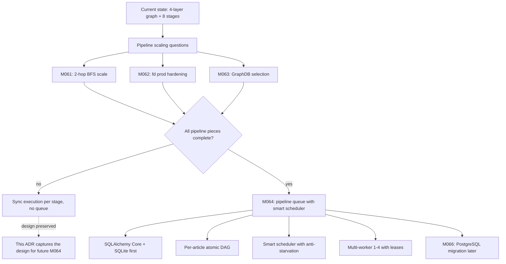
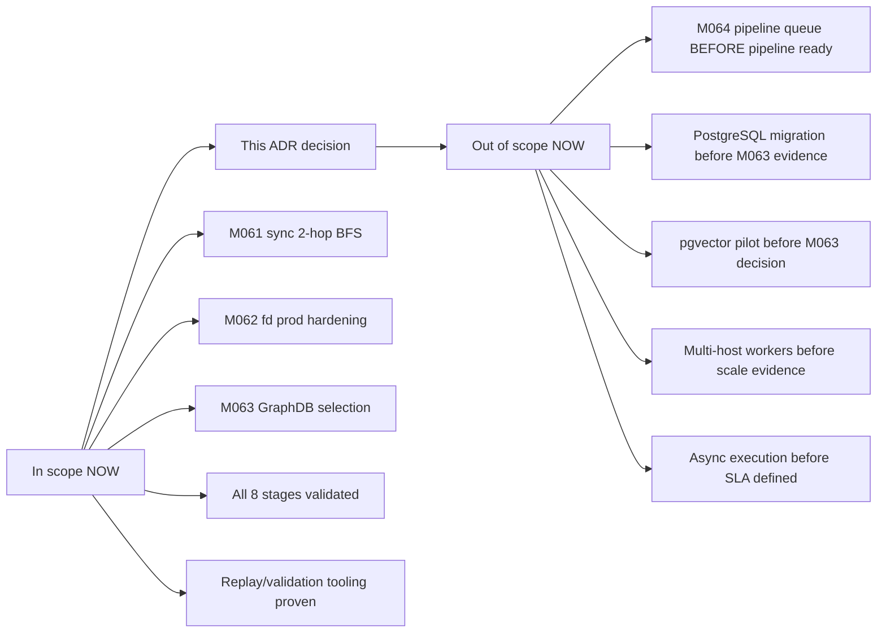
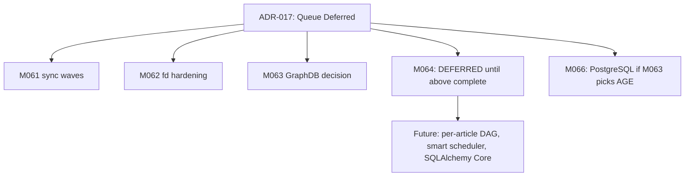
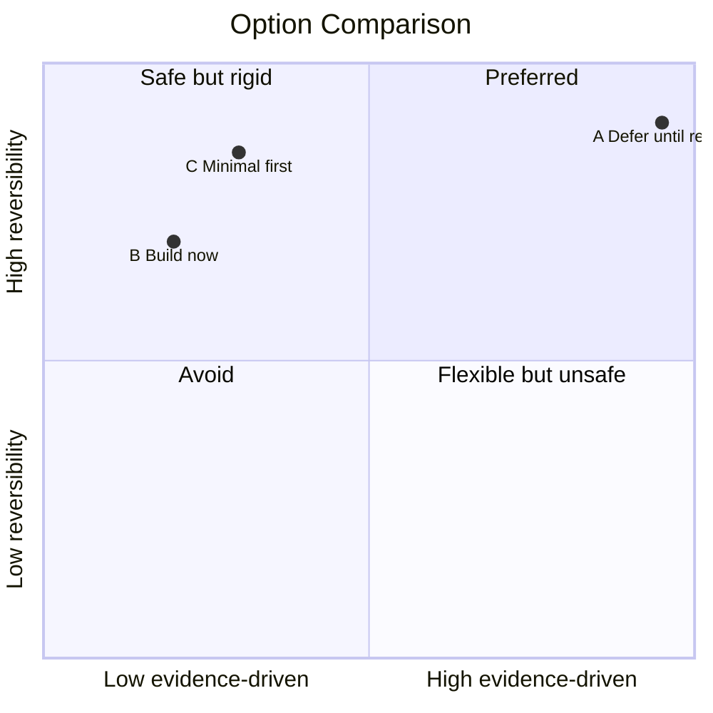
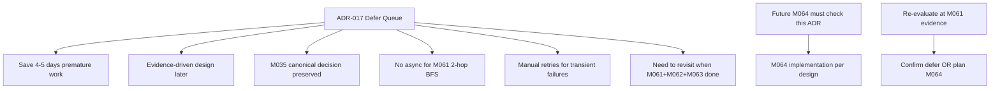
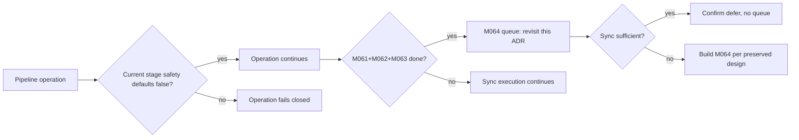
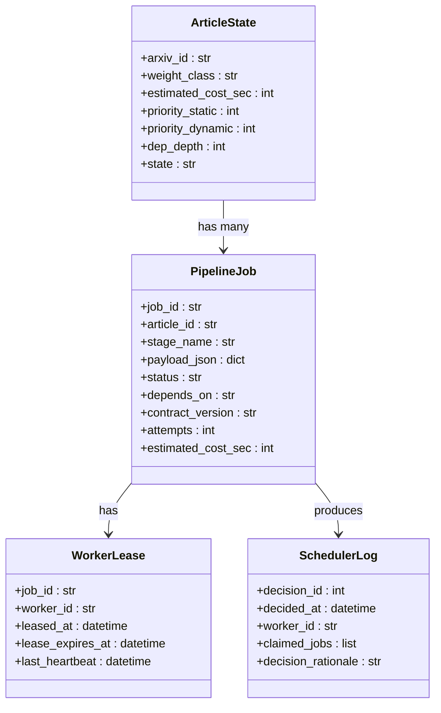

# ADR-017: Pipeline Queue Deferred Until Pipeline End-to-End Complete

**Status:** Accepted (binding)
**Date:** 2026-06-13
**Deciders:** agent (user request)
**Milestone:** discussion phase (deferred from M064 planning)
**Scope:** pipeline-infrastructure / async-execution / production-readiness
**Binding Level:** binding (deferral is a binding decision to NOT build queue prematurely)
**Revisable:** yes, when M061 (2-hop BFS) + M062 (fd prod hardening) + M063 (GraphDB selection) are all complete AND pipeline evidence shows async queue is needed

## 0. One-line Decision

> We will defer the pipeline queue (M064) and async infrastructure (smart scheduler, per-article atomic DAG, multi-worker, lease-based claiming) until the pipeline itself is end-to-end complete via M061, M062, and M063 milestones.
>
> We will not build pipeline infrastructure for a pipeline that has not yet been validated end-to-end at scale.

## 1. Context

M057-M060b established a 4-layer diagnostic graph (9418 edges: citation + table_similarity + figure_similarity v1 + v2) plus a 3-stage model selection (NetworkX primary, igraph supplementary, MiniMax-M3 multimodal judge). M061 will scale to 2-hop BFS (~3000 new nodes estimated). M062 will harden fd embeddings for production. M063 will select production GraphDB (FalkorDB vs LadybugDB vs Neo4j vs HelixDB vs AGE).

Discussion in session 2026-06-13 considered building an async pipeline queue (M064) NOW. The proposal was:
- SQLite-based smart queue (per M035 canonical decision)
- Per-article atomic DAG (not per-job FIFO)
- Smart scheduler: priority_static + aging_boost - cost_penalty - depth_penalty
- Multi-worker (1-4) with lease-based claiming
- Anti-starvation via aging_boost
- Load balancing: max 2 jobs per article per claim
- SQLAlchemy Core (not ORM) for portable schema
- Alembic for migrations
- Future PostgreSQL migration (M066) via connection string change only

The user concluded: **"очереди надо отложить когда pipeline весь будет готов"** (defer queues until the entire pipeline is ready).

This decision captures:
1. **The deferral** is binding (don't build M064 now)
2. **The design** is preserved (so M064 future agent doesn't re-derive)
3. **The triggers** for unblocking (M061+M062+M063 complete)

### Context Map



## 2. Decision

The pipeline queue (M064) is **deferred** until the pipeline itself is end-to-end complete. The deferral is binding for the current scope (M060c → M061 → M062 → M063) and revisable when evidence from those milestones shows async queue is needed.

The design (preserved for M064 future implementation):

### 2.1 Per-Article Atomic DAG

Each article (arxiv_id) has its own "run" with 8 dependent stages. The atomicity unit is the article, not the job. Within an article, stages can be parallel where possible.

```
Stage DAG per article:
1. acquisition (no deps)
2. grobid || opendataloader || plotextractor  (parallel, 3 jobs)
3. fdembed (depends on 2)
4. m3_judge (depends on 2, only if figure_count > 0)
5. manifest_validate (depends on 3, 4)
6. graph_build (depends on 5)
```

### 2.2 Smart Scheduler Algorithm

Per-article priority calculation:
```python
priority_dynamic = priority_static + aging_boost - cost_penalty - depth_penalty

where:
  priority_static: 0-100, set at submission (1-hop=100, 2-hop=70, 3-hop=40)
  aging_boost: 0-20, grows linearly with age (anti-starvation)
  cost_penalty: 0-10, prefer low-cost jobs (throughput)
  depth_penalty: 0-30, prefer shallow graph depth
```

Per-claim load balancing:
- Max 2 jobs per article per claim (prevents one article monopolizing worker)
- Max N/2 articles per claim (ensures diversity)
- Capacity-based filtering: sum of estimated_cost_sec <= available_capacity_sec

### 2.3 Failure Recovery (4 modes)

| Mode | Trigger | Action |
|---|---|---|
| **transient** | HTTP 5xx, 429, network | exponential backoff: 1m, 5m, 15m, 1h, 6h, capped |
| **permanent** | HTTP 4xx (not 429), schema | mark failed, no retry, manual review |
| **stale_lease** | worker_id disappeared | recover to pending, increment attempts |
| **contract_mismatch** | contract_version != current | mark stale_contracts, require re-submit |

### 2.4 Stack (preserved for M064)

| Layer | Tech | Rationale |
|---|---|---|
| **Storage** | SQLite first (per M035), PostgreSQL later (per M066) | M035 canonical decision |
| **ORM** | SQLAlchemy Core (not ORM, not sqlc) | schema-portable, JSONB-friendly |
| **Migrations** | Alembic | industry standard, dialect-aware |
| **Concurrency** | 1-4 workers initially, lease-based claiming | fits 10k-50k jobs/day |
| **Observability** | events.jsonl per state change | trajectory integration |

### 2.5 Why not build queue now

1. **M061 2-hop BFS will reveal** real workload patterns (cache hit rate, latency distribution, failure modes)
2. **M062 fd prod hardening** will show where bottlenecks are (cache, throughput, ops)
3. **M063 GraphDB decision** will determine vector+graph architecture
4. **Building infrastructure for undefined pipeline** = premature optimization
5. **All 5 graph+vector candidates** (FalkorDB, LadybugDB, Neo4j, HelixDB, AGE) have native vectors → pgvector is not needed

### Decision Boundary



## 3. Applies To

This decision applies to:
- M064 milestone planning (deferred)
- M066 PostgreSQL migration (conditional on M063)
- Future agents who might re-propose building M064 prematurely
- Pipeline operational design (sync vs async) until M061+M062+M063 evidence
- M067 conditional milestone (if M063 picks AGE → pgvector + AGE; if not → no pgvector)

### Applicability Diagram



## 4. Requirements and Decisions Impacted

### Requirements

| Requirement | Impact | Notes |
|---|---|---|
| R009 (parser quality contracts) | none | independent of queue |
| R016 (graph readiness evidence chain) | supports | M061 evidence feeds queue design |
| R020 (replayable extraction) | supports | M059 replay tool already proven |
| R031 (parser version tracking) | supports | M064 will use contract_version |
| R041 (provenance metadata) | supports | per-article DAG carries provenance |

### Decisions

| Decision | Impact | Notes |
|---|---|---|
| ADR-013 (manifest-driven PDF ingest) | consistent | queue uses same manifest contract |
| ADR-015 (NetworkX intermediate layer) | consistent | read-only graph ops remain |
| ADR-016 (graph library selection) | consistent | NetworkX + igraph unchanged |
| ADR-002 (GraphDB selection, Deferred) | narrows | M063 evidence gates queue's vector story |

## 5. Options Considered

### Option A — Defer Queue Until Pipeline Ready (Chosen)

| Dimension | Assessment |
|---|---|
| Local-first fit | High (sync ops, no infra until needed) |
| Safety fit | High (5-flag safety block unchanged) |
| Complexity | Low (deferral) |
| Reversibility | High (revisit when M061+M062+M063 done) |
| Cost | Low (0 days now, 4-5 days later with data) |
| Evidence-driven | High (M061+M062+M063 provide real data) |

**Pros**
- Don't build infrastructure for undefined pipeline
- M061 evidence informs queue design (cache hit, latency, failure modes)
- M062 evidence informs worker capacity needs
- M063 evidence informs vector+graph architecture
- Net cost saving: 4-5 days (premature) → 0 days now
- 5 graph+vector candidates have vectors → pgvector not needed

**Cons**
- No async/batch mode for M061 2-hop BFS (manual sync waves)
- No retry on transient failures (human rerun)
- No observability (events.jsonl) until M064
- Slower M061 throughput (1 worker vs 4)

### Option B — Build Queue Now (M064 immediately)

| Dimension | Assessment |
|---|---|
| Local-first fit | Medium (adds infra) |
| Safety fit | High |
| Complexity | Medium (queue module + worker + lease + retry) |
| Reversibility | High |
| Cost | Medium (4-5 days) |
| Evidence-driven | Low (queue designed for hypothetical pipeline) |

**Pros**
- Async/batch mode immediately
- Retry on transient failures
- Observability via events.jsonl
- Multi-worker throughput

**Cons**
- Pipeline not yet end-to-end defined (M061 not done)
- Worker count guess, not evidence-based
- Cache hit rate unknown (would inform load balancing)
- Failure modes unknown (would inform retry strategy)
- 4-5 days investment on unvalidated architecture
- Premature optimization

### Option C — Build Minimal Queue (no smart scheduler, no per-article DAG)

| Dimension | Assessment |
|---|---|
| Local-first fit | High |
| Safety fit | High |
| Complexity | Low (simple FIFO) |
| Reversibility | High |
| Cost | Low (1-2 days) |
| Evidence-driven | Low |

**Pros**
- Quick to build
- Simple to understand

**Cons**
- Will be replaced by smart scheduler soon
- 1-2 days wasted on first version
- No real value over sync execution

### Option Comparison Snapshot



## 6. Trade-off Analysis

### Why Option A wins now

Short-term implementation value:
- M061 evidence (when done) will inform queue design
- M062 evidence (when done) will inform worker capacity
- M063 evidence (when done) will inform vector+graph architecture
- 0 days now vs 4-5 days for premature queue

Long-term architecture value:
- Queue designed for real workload patterns
- Less rework (we get it right first time)
- M035 canonical decision preserved (SQLite first)

Safety impact:
- 5 safety defaults unchanged (no new safety surface)
- Sync execution has same safety posture as async (5-flag block)

Reversibility:
- When M061+M062+M063 done, revisit this decision
- If evidence shows queue need: implement M064 (1-2 weeks, evidence-based)
- If evidence shows sync is sufficient: skip M064 entirely

Cost/complexity:
- Net cost saving: 4-5 days (premature) → 0 days now
- Future cost: 4-5 days when M064 actually built (with data)

What remains uncertain:
- M061 actual cache hit rate (will inform load balancing)
- M062 actual throughput bottleneck (will inform worker count)
- M063 graph+vector outcome (will inform pgvector conditional)

### Trade-off Summary

| Trade-off | Chosen side | Why |
|---|---|---|
| Build now vs defer | Defer | evidence-driven design > premature |
| M035 SQLite vs jump to PostgreSQL | Defer SQLite to M064 | M035 canonical, validated by M061 evidence |
| Smart scheduler complexity | Defer | 5 graph+vector candidates with vectors → don't over-engineer |
| Multi-worker throughput | Sync first | M061 sync waves sufficient for 2-hop BFS scale |

## 7. Consequences

### Positive

- M061 evidence informs queue design (real workload patterns)
- M062 evidence informs worker capacity (real throughput)
- M063 evidence informs vector+graph architecture
- 4-5 days saved on premature queue
- M035 SQLite decision preserved
- 5 safety defaults unchanged
- Per-article DAG design captured for future (not lost)

### Negative

- M061 manual sync waves (no async/batch mode)
- No retry on transient failures (human rerun)
- No events.jsonl observability until M064
- Slower M061 throughput (1 worker vs 4)
- Need to revisit this decision when M061+M062+M063 done

### New obligations

- Future agents who consider building M064 must check this ADR first
- M064 implementation must follow the design preserved here (per-article DAG, smart scheduler, SQLAlchemy Core)
- When M061+M062+M063 complete, this ADR must be revisited and either:
  - Confirmed (if sync is sufficient)
  - Replaced (if queue evidence emerges)
  - Superseded (if M063 picks different architecture)

### What becomes harder

- M061 manual sync waves: more human effort, more retries
- M62+M63 evidence: needed before queue design
- M064 future implementation: must follow preserved design (not re-derive)

### Consequence Flow



## 8. Safety and Non-Authorization

This ADR does **not** authorize:

- Building M064 pipeline queue now
- PostgreSQL migration before M063 evidence
- pgvector pilot before M063 decision
- Multi-host workers before scale evidence
- Async execution before SLA defined
- Any change to 5 safety defaults

Required safety defaults (unchanged):

```text
graph_import_allowed=false
graphdb_written=false
ladybugdb_written=false
production_import_attempted=false
import_eligible=false
```

The 5-flag block applies to **all** current and future stages. The queue (M064) will inherit this block when built.

### Safety Gate



## 9. Contract Impact

Affected contracts (for M064 future):

- `PipelineJob` (new): job_id, article_id, stage_name, payload, status, depends_on, contract_version
- `ArticleState` (new): arxiv_id, weight_class, estimated_cost_sec, priority, dep_depth
- `WorkerLease` (new): job_id, worker_id, leased_at, lease_expires_at
- `SchedulerLog` (new): decision_id, decided_at, claimed_jobs, decision_rationale

Required contract changes for M064:

- Schema must be SQLite-compatible + PostgreSQL-portable (SQLAlchemy Core)
- Stage names enumerated: acquisition, grobid, opendataloader, plotextractor, fdembed, m3_judge, manifest_validate, graph_build
- Contract version per stage (for stale detection)
- Payload as JSON (SQLite JSON or PostgreSQL JSONB)

### Contract Relationship Map



## 10. Validation / Evidence Required

To revisit this decision (post-M061+M062+M063):

1. **M061 evidence**: 2-hop BFS actual throughput, fd cache hit rate, M3 judge latency
2. **M062 evidence**: fd production ops, rate limits, monitoring gaps
3. **M063 evidence**: GraphDB choice, vector+graph architecture, ops cost
4. **Pipeline metrics**: total jobs/day, failure rates, retry frequency
5. **Human signal**: is sync execution + manual retries sustainable?

### Validation Path

```mermaid
flowchart TD
    A[ADR-017 accepted (defer)] --> B[M061 sync 2-hop BFS]
    B --> C[M062 fd prod hardening]
    C --> D[M063 GraphDB selection]
    D --> E{All 3 milestones done?}
    E -- no --> F[Continue sync execution]
    E -- yes --> G[Pipeline ready check]
    G --> H{Sync sufficient evidence?}
    H -- yes --> I[Confirm defer, no M064]
    H -- no --> J[Build M064 per preserved design]
    J --> K[M064 milestone: smart scheduler + per-article DAG]
    K --> L[M066: PostgreSQL migration (conditional)]
```

## 11. Open Questions

| Question | Owner | Needed by | Blocking? |
|---|---|---|---|
| What is M061 actual fd cache hit rate? | M061 | before M064 | yes (drives load balancing) |
| What is M061 actual M3 judge retry rate? | M061 | before M064 | yes (drives retry strategy) |
| What is M062 actual throughput bottleneck? | M062 | before M064 | yes (drives worker count) |
| What is M063 GraphDB choice? | M063 | before M064 (different decision if AGE picked) | conditional |
| Is sync execution + manual retries sustainable for production? | human | after M061+M062+M063 | no (revisit only) |

## 12. Follow-up Actions

- [ ] **M061**: run 2-hop BFS with sync waves + M3 judge + collect cache hit / retry stats
- [ ] **M062**: harden fd for production + measure throughput
- [ ] **M063**: select GraphDB + decide vector+graph architecture
- [ ] After M061+M062+M063 complete: revisit this ADR, decide confirm vs build M064
- [ ] If M064 built: use SQLAlchemy Core (not ORM), Alembic migrations, SQLite first (per M035)
- [ ] If M064 built: per-article atomic DAG, smart scheduler with anti-starvation, multi-worker 1-4
- [ ] Update codebase-memory after M061+M062+M063 evidence (sync via `scripts/sync_codebase_memory_governance.py`)

## 13. Supersedes / Superseded By

### Supersedes

- M064 planning (was a planned milestone in M060c ROADMAP, now deferred)

### Superseded By

- Empty until future ADR reverses the deferral (e.g., ADR-018 if M064 implementation approved)

## 14. LLM Reading Notes

This section is intentionally explicit for future agents.

- **Binding decision**:
  - M064 (pipeline queue) is DEFERRED, not cancelled
  - Deferral is binding until M061+M062+M063 complete
  - When pipeline is ready, M064 follows the design preserved in this ADR
  - Sync execution is the current mode for M061+M062+M063

- **Do not infer**:
  - This ADR does not cancel M064 (deferral, not rejection)
  - This ADR does not authorize PostgreSQL (M066 deferred to after M063)
  - This ADR does not select GraphDB (M063 will)
  - This ADR does not change 5 safety defaults
  - This ADR does not require building M064 (deferral preserves optionality)

- **Safe next action**:
  - Continue with M061 (2-hop BFS, sync waves) per M056 pattern + M3 judge
  - Continue with M062 (fd prod hardening)
  - Continue with M063 (GraphDB selection)
  - Collect cache hit / retry / throughput stats during M061+M062

- **Blocked until**:
  - M061 done (2-hop BFS at scale, M3 judge validated)
  - M062 done (fd production-grade)
  - M063 done (GraphDB selected, vector+graph architecture decided)
  - All 8 stages have manifests
  - Replay/validation tooling proven (M059 done)
  - Human review of M061+M062+M063 evidence (sustainability of sync execution)
