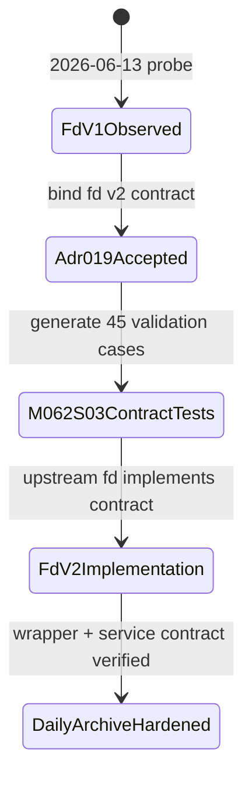
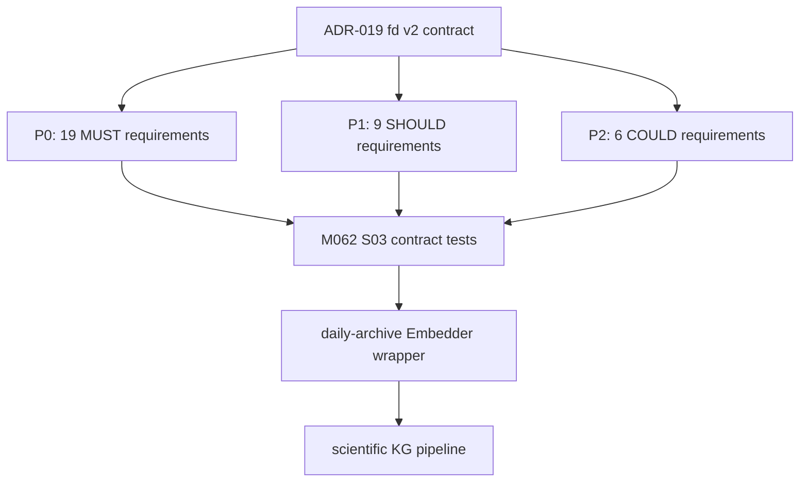

# ADR-019: M062 fd Embedding Service Contract

**Status:** Accepted (binding)  
**Date:** 2026-06-14  
**Deciders:** agent  
**Milestone:** M065-vq0do4 S02 for M062 fd production hardening  
**Scope:** fd / embedding-service / OpenAI-compatible embeddings / health / metrics / error-contract / daily-archive embedder  
**Binding Level:** binding authoritative spec for daily-archive fd integration; fd v2 contract adopted from `/root/fd-v2.md`  
**Revisable:** yes, only by a later accepted binding ADR after fd v2 implementation evidence and M062 S03 contract-test results

## 0. One-line Decision

> daily-archive adopts `/root/fd-v2.md` as the authoritative fd v2 embedding service contract, binding fd integration to explicit endpoints, OpenAI-compatible request/response shape, health/metrics behavior, response headers, machine-readable errors, and the 45-case acceptance suite.

ADR-019 is binding: yes. The prose and tables below are authoritative. Mermaid diagrams are navigation aids only.

## 1. Context

M062 hardens the daily-archive `fd` embedding integration for production-scale scientific corpus processing. M062 S01 completed the local daily-archive wrapper hardening in `src/arxiv_archive/embedder.py`: unified async `Embedder`, retry/backoff, circuit breaker, graceful degradation, explicit metrics, 127.0.0.1 default endpoint, and five safety defaults that remain `False`.

The fd service itself is a separate upstream local HTTP embedding service. fd v1 was observed on 2026-06-13 at `http://127.0.0.1:8000`; it currently supports the OpenAI-compatible `/v1/embeddings` happy path but lacks the production contract daily-archive needs for caller safety, observability, diagnostics, and contract testing.

Safety boundary for this ADR:

- `graph_writes_authorized` is not authorized.
- `production_import_authorized` is not authorized.
- `fact_promotion_authorized` is not authorized.
- `external_network_authorized` is disabled unless an explicit network override is recorded by the relevant workflow.
- `llm_calls_authorized` is disabled for this contract decision.

## 2. Decision

daily-archive adopts `/root/fd-v2.md` as the authoritative fd v2 service contract for all fd integration work after M062 S02. The accessible mirror used while writing this ADR was `/root/fd/docs/fd-v2.md`; future agents must prefer `/root/fd-v2.md` when it exists and treat any mirror as a read-only copy, not a new source of truth.

The contract is binding on:

- fd request/response semantics for `/v1/embeddings`.
- Health and readiness endpoints used by operators and automated checks.
- Prometheus-compatible metrics names and labels.
- Response headers that allow daily-archive to attribute model, dimensions, cache behavior, retry posture, and request identity.
- Error codes and HTTP status mapping that daily-archive can classify without string parsing.
- The 45 acceptance test cases in fd v2 section 5.



## 3. fd v1 State

fd v1 state is summarized here to explain why a binding contract is required. The source contract records 12 missing/incorrect endpoints, 12 probe bugs, and 30+ requirements across P0/P1/P2.

### 1. Текущее состояние fd (наблюдаемое, 2026-06-13)

#### 1.1 Работающие endpoints

| Method | Path | Status | Behavior |
|---|---|---|---|
| GET | `/health` | 200 | `{"status":"ok","time":"2026-06-13T16:33:15Z"}` — shallow check, не проверяет model load |
| POST | `/v1/embeddings` (OpenAI shape) | 200 | Возвращает embeddings, model `deepvk/USER-bge-m3`, dims 1024/512 |

#### 1.2 OpenAI shape (единственная рабочая)

```http
POST /v1/embeddings
Content-Type: application/json

{
  "input": ["text 1", "text 2", ...],  // required, non-empty array of strings
  "dimensions": 1024                    // optional, must be 1024 or 512
}
```

Response (200):
```json
{
  "object": "list",
  "data": [
    {"object": "embedding", "embedding": [0.003, ...], "index": 0, "dimensions": 1024}
  ],
  "model": "deepvk/USER-bge-m3",
  "usage": {"prompt_tokens": 1, "total_tokens": 1}
}
```

#### 1.3 НЕ работающие/отсутствующие endpoints

| Method | Path | Status | Issue |
|---|---|---|---|
| GET | `/version` | 404 | Нет version info |
| GET | `/info` или `/v1/models` | 404 | Нет списка моделей |
| GET | `/metrics` | 404 | Нет Prometheus metrics |
| GET | `/v1/healthcheck` | 404 | Нет alias для /health |
| GET | `/ready` | 404 | Нет Kubernetes readiness probe |
| GET | `/live` | 404 | Нет Kubernetes liveness probe |
| GET | `/docs` | 404 | Нет Swagger UI |
| GET | `/openapi.json` | 404 | Нет OpenAPI schema |
| POST | `/embed` (TEI shape) | 404 | Не поддерживает TEI shape |
| POST | `/v1/batch` | 404 | Нет dedicated batch endpoint |

#### 1.4 Наблюдаемые баги (12 probe tests)

| # | Сценарий | Response | Status | Severity |
|---|---|---|---|---|
| B1 | `{"input":[]}` | `{"error":"input is required"}` | 400 | OK (валидно) |
| B2 | `{"input":["test"],"dimensions":99999}` | `{"error":"dimensions must be 1024 or 512"}` | 400 | OK |
| B3 | `{"input":["test"],"dimensions":0}` | `{"error":"dimensions must be 1024 or 512"}` | 400 | OK |
| **B4** | **1MB текст в input** | **TIMEOUT 10s (нет error response)** | — | **P0 silent hang** |
| B5 | `{"input":[123]}` (non-string) | `{"error":"json: cannot unmarshal array into Go value of type string"}` | 400 | P1 — leaky Go-isms |
| B6 | malformed JSON `{bad json` | `{"error":"invalid character 'b' looking for beginning of object key string"}` | 400 | P1 — leaky parser error |
| **B7** | `{}` (missing input) | `{"error":"unexpected end of JSON input"}` | 400 | **P1 — misleading** |
| **B8** | **10 inputs (warm model)** | **TIMEOUT 10s (должно быть < 1s)** | — | **P0 performance** |
| **B9** | **100 inputs** | **500 Internal Server Error (silent)** | 500 | **P0 silent failure** |
| B10 | GET `/v1/embeddings` | `404 page not found` | 404 | P1 — should be 405 |
| B11 | Response headers | **empty** (no Server, no X-*, no Cache-*, no ETag) | — | P1 — no observability |
| B12 | Successful response headers | **только `Date`, `Content-Length`** | 200 | P1 — no X-Request-Id, no X-Cache |

#### 1.5 Отсутствующие response headers (на всех responses)

- `Server: fd/<version>` — server identification
- `X-Request-Id` — caller-passed или server-generated
- `X-Model-Id` — какая модель использовалась
- `X-Dimensions` — actual dims
- `X-Cache: HIT|MISS` — cache status (если есть cache)
- `X-RateLimit-Limit/Remaining/Reset` — rate limit status
- `Retry-After` — на 429/503
- `Connection: keep-alive` — connection reuse
- `ETag`, `Cache-Control` — response caching

#### 1.6 Отсутствующая OpenAPI schema

Нет `/openapi.json`, нет `/docs`. Caller не может:
- Узнать полный список endpoints
- Узнать точный request/response shape
- Узнать error response shape
- Узнать headers
- Узнать rate limits

---

## 4. fd v2 Contract

The fd v2 contract contains P0/P1/P2 requirements copied from fd v2 section 2. Counts are binding for planning and verification:

| Priority | Count | Binding meaning |
|---|---:|---|
| P0 | 19 | Required for fd v2 correctness, observability, headers, and machine-readable error behavior. |
| P1 | 9 | Required before production rollout unless explicitly deferred by a later ADR or M062 S03 evidence. |
| P2 | 6 | Useful hardening items; may be staged after P0/P1 if the acceptance suite documents gaps. |



### 2. Требования (по приоритету)

#### 2.1 P0 — функциональные баги (MUST FIX)

**R-P0-1**: Input length validation
- Если `len(input[i]) > MAX_INPUT_LENGTH_TOKENS` (для BGE-M3 = 512 tokens, ~2048 chars), вернуть **413 Payload Too Large** с OpenAI-style error:
  ```json
  {"error": {"code": "input_too_long", "type": "invalid_request_error", "param": "input", "message": "input[0] exceeds max length 512 tokens (got ~8192 tokens)"}}
  ```
- Валидация ДО отправки в model (не silent timeout).

**R-P0-2**: Batch size validation
- Если `len(input) > MAX_BATCH_SIZE` (recommend 32, настраивается), вернуть **413**:
  ```json
  {"error": {"code": "batch_too_large", "type": "invalid_request_error", "param": "input", "message": "batch size 100 exceeds max 32; split into smaller batches"}}
  ```
- Валидация ДО отправки в model (не silent 500).

**R-P0-3**: 500 → 503 для model not loaded / overloaded
- Если model не загружен или overload, вернуть **503 Service Unavailable** + `Retry-After: 5`.
- Не 500 (это "server bug"), а 503 (это "temporary unavailable").

**R-P0-4**: Warmup + readiness
- При старте fd: pre-warm model (1 dummy inference) ДО accepting requests.
- Endpoint `GET /ready` возвращает 200 только после pre-warm done.
- Endpoint `GET /live` возвращает 200 пока process alive (cheap, без model touch).
- Endpoint `GET /health` делает DEEP check: model loaded, GPU available, warmup done.

**R-P0-5**: Graceful shutdown
- На SIGTERM: stop accepting new requests (вернуть 503), finish in-flight (макс 30s), затем exit.
- Caller получает 503 с `Retry-After: 30` если послал после SIGTERM.

**R-P0-6**: Performance baseline
- На warm service with cache prefilled for the measured payloads: 1 input < 50ms p95, 10 inputs < 200ms p95, 32 inputs (max batch) < 1000ms p95.
- Real cache-miss inference latency is recorded as diagnostic evidence only for the current TEI CPU backend; it is not a launch blocker for this milestone unless backend remediation is explicitly in scope.

#### 2.2 P0 — observability endpoints (MUST ADD)

**R-P0-7**: `GET /version`
```json
{
  "service": "fd",
  "version": "2.0.0",          // semver fd
  "model": "deepvk/USER-bge-m3",
  "model_version": "v1.0",     // model-specific version
  "build_hash": "abc1234",     // git commit hash
  "build_date": "2026-06-13T00:00:00Z",
  "started_at": "2026-06-13T16:30:00Z",
  "uptime_seconds": 3600
}
```

**R-P0-8**: `GET /info` или `GET /v1/models`
```json
{
  "models": [
    {
      "id": "deepvk/USER-bge-m3",
      "dimensions": [512, 1024],
      "max_input_length_tokens": 512,
      "max_batch_size": 32,
      "loaded": true,
      "warmup_done": true,
      "device": "cuda:0"
    }
  ]
}
```

**R-P0-9**: `GET /metrics` (Prometheus text format)
```
# HELP fd_requests_total Total embedding requests
# TYPE fd_requests_total counter
fd_requests_total{status="success"} 1234
fd_requests_total{status="error"} 5
fd_requests_total{status="timeout"} 2

# HELP fd_request_duration_seconds Request latency
# TYPE fd_request_duration_seconds histogram
fd_request_duration_seconds_bucket{le="0.05"} 800
fd_request_duration_seconds_bucket{le="0.1"} 1000
fd_request_duration_seconds_bucket{le="0.5"} 1200
fd_request_duration_seconds_bucket{le="1.0"} 1230
fd_request_duration_seconds_bucket{le="+Inf"} 1239

# HELP fd_batch_size Request batch size
# TYPE fd_batch_size histogram
fd_batch_size_bucket{le="1"} 500
fd_batch_size_bucket{le="10"} 1000
fd_batch_size_bucket{le="32"} 1230
fd_batch_size_bucket{le="+Inf"} 1239

# HELP fd_cache_hits_total Cache hits/misses
# TYPE fd_cache_hits_total counter
fd_cache_hits_total{result="hit"} 800
fd_cache_hits_total{result="miss"} 439

# HELP fd_errors_total Errors by type
# TYPE fd_errors_total counter
fd_errors_total{code="input_too_long"} 3
fd_errors_total{code="batch_too_large"} 1
fd_errors_total{code="model_overloaded"} 1

# HELP fd_model_loaded Model load status (1=loaded, 0=not)
# TYPE fd_model_loaded gauge
fd_model_loaded 1
```

**R-P0-10**: `GET /v1/healthcheck` (alias для /health)

#### 2.3 P0 — response headers (MUST ADD)

Каждый response должен иметь:

**R-P0-11**: `X-Request-Id`
- Если caller передал `X-Request-Id` header, echo его.
- Иначе server генерирует UUIDv4.

**R-P0-12**: `Server: fd/<version>` (где version из R-P0-7)

**R-P0-13**: `X-Model-Id: <model_id>` (на /v1/embeddings responses)

**R-P0-14**: `X-Dimensions: <actual_dims>` (на /v1/embeddings responses)

**R-P0-15**: `X-Cache: HIT|MISS` (если есть cache, см. R-P1-3)

**R-P0-16**: На 429/503 — `Retry-After: <seconds>` header

**R-P0-17**: `Connection: keep-alive` (по умолчанию)

#### 2.4 P0 — error format (MUST CHANGE)

**R-P0-18**: OpenAI-style error envelope (вместо текущего `{"error": "..."}`):
```json
{
  "error": {
    "code": "input_too_long",
    "type": "invalid_request_error",
    "param": "input",
    "message": "input[0] exceeds max length 512 tokens (got ~8192 tokens)"
  }
}
```

`type` enum:
- `invalid_request_error` — 400 (caller bug)
- `authentication_error` — 401
- `permission_error` — 403
- `not_found_error` — 404
- `rate_limit_error` — 429
- `overloaded_error` — 503
- `internal_error` — 500 (server bug)

`code` enum (canonical, machine-readable):
- `input_too_long`
- `batch_too_large`
- `input_required`
- `dimensions_invalid` (not 512/1024)
- `dimensions_required`
- `dimensions_mismatch` (model doesn't support requested)
- `model_not_loaded`
- `model_overloaded`
- `rate_limit_exceeded`
- `request_timeout`
- `payload_too_large`
- `internal_error`

**R-P0-19**: HTTP status code mapping (machine-readable):
- 200 success
- 400 invalid_request_error (caller bug)
- 401 authentication_error
- 403 permission_error
- 404 not_found_error (path)
- 405 method_not_allowed
- 413 payload_too_large (input_too_long, batch_too_large)
- 429 rate_limit_error
- 500 internal_error (server bug)
- 503 overloaded_error (model not loaded, overloaded, shutting down)
- 504 gateway_timeout (request_timeout)

#### 2.5 P1 — health checks (SHOULD ADD)

**R-P1-1**: `GET /health` — deep check
- Проверяет: model loaded, GPU available, warmup done, last inference < 60s ago.
- Response:
```json
{
  "status": "ok",  // "ok" | "degraded" | "down"
  "time": "2026-06-13T16:33:15Z",
  "model_loaded": true,
  "warmup_done": true,
  "device": "cuda:0",
  "last_inference_at": "2026-06-13T16:33:00Z",
  "in_flight_requests": 3
}
```
- 200 если `status="ok"`, 503 если `status="degraded"` или `"down"`.

**R-P1-2**: `GET /warmup` — warmup status
- `{"status": "warming_up"|"ready", "progress": 0.5}`

**R-P1-3**: `POST /warmup` — trigger warmup on demand
- Если не warm — загружает model, делает 1 dummy inference.
- 200 если уже warm, 202 если warming.

#### 2.6 P1 — features (SHOULD ADD)

**R-P1-4**: Cache с X-Cache header
- LRU cache на (input_text, dimensions) → embedding.
- Cache size: 10000 (настраивается).
- TTL: 24h (настраивается).
- HIT на cache → skip model inference, return cached.
- `X-Cache: HIT|MISS` в response.
- Metrics: `fd_cache_hits_total{result="hit"|"miss"}`.

**R-P1-5**: `encoding_format` option (OpenAI v2 compat)
- `encoding_format: "float"` (default) — array of floats
- `encoding_format: "base64"` — base64-encoded float32 array (экономит ~30% bandwidth)

**R-P1-6**: `user` field (OpenAI v2 compat)
- `user: "caller-id-123"` — для abuse tracking и per-user rate limits.

**R-P1-7**: `priority` option
- `priority: "low"|"normal"|"high"` — caller помечает приоритет (для routing/queue).

**R-P1-8**: API key auth (env var `FD_API_KEY`)
- Если env var set, требует header `Authorization: Bearer <key>`.
- 401 если отсутствует/wrong.

**R-P1-9**: CORS headers (для web clients)
- `Access-Control-Allow-Origin: *` (или из config)
- `Access-Control-Allow-Methods: GET, POST, OPTIONS`
- `Access-Control-Allow-Headers: Content-Type, Authorization, X-Request-Id`

#### 2.7 P2 — nice-to-have (COULD ADD)

**R-P2-1**: OpenAPI schema at `/openapi.json`
- Полная OpenAPI 3.1 spec.
- Swagger UI at `/docs`.

**R-P2-2**: ETag + Cache-Control
- `ETag: "<hash-of-input>"`
- `Cache-Control: public, max-age=86400`

**R-P2-3**: `/v1/batch` separate endpoint
- Для caller-ов которые хотят explicit batch semantics.
- Принимает `{"batches": [[...], [...], ...]}`.
- Возвращает `{"batches": [[...], [...], ...]}`.

**R-P2-4**: Streaming response (SSE)
- Для large responses > 1MB.

**R-P2-5**: Rate limiting
- Per-IP: 100 req/min
- Per-user (если R-P1-6 используется): 1000 req/min
- Headers: `X-RateLimit-Limit/Remaining/Reset`

**R-P2-6**: `/v1/traces` (debugging)
- Recent N requests с latency, status, model_id, request_id.
- Useful для debugging caller-side issues.

---

## 4.5 Configuration: env-driven

Per M062 S01v2 user feedback (2026-06-14), all FD service configuration MUST be env-driven, not hardcoded in source code.

| Env var | Default | Description |
|---|---|---|
| FD_EMBEDDINGS_ENDPOINT | http://127.0.0.1:8000/v1/embeddings | Full URL to embeddings endpoint |
| FD_EMBEDDINGS_ENDPOINT_BASE | http://127.0.0.1:8000 | Base URL (used by scripts) |
| FD_MODEL_NAME | deepvk/USER-bge-m3 | Model identifier (in error messages, X-Model-Id) |
| FD_DIMENSIONS | 1024 | Embedding dimensions (1024 or 512) |
| FD_BATCH_SIZE | 32 | Max batch size |
| FD_REQUEST_TIMEOUT_SECONDS | 30 | Per-request timeout |
| FD_MAX_RETRIES | 3 | Max retry attempts |
| FD_RETRY_BACKOFF_SECONDS | 1,5,15,60,300 | Retry backoff schedule (comma-separated seconds) |
| FD_CIRCUIT_FAILURE_THRESHOLD | 3 | Failures before circuit opens |
| FD_CIRCUIT_OPEN_SECONDS | 60 | Circuit open duration |

See `.env.example` for defaults and `src/arxiv_archive/embedder.py` for the implementation.

M068 S03 confirms the fd v2 env surface used by the integration path:

| Env var | Role in fd v2 integration |
|---|---|
| FD_API_KEY | Bearer token for protected fd v2 requests; never persisted in artifacts |
| MODEL_ID | Primary model identifier sent in embedding requests |
| TEI_URL | Base fd v2 URL used to derive `/v1/embeddings` |
| REDIS_HOST | Queue/cache host for the M064 integration path |
| REDIS_PORT | Queue/cache port for the M064 integration path |

**Rationale**: hardcoded values (endpoint, model name, dimensions) prevent deployment to different environments (CI, staging, production). Env-driven config is the standard 12-factor app pattern.

---

## 5. Error Catalog

The fd v2 error catalog is machine-readable and binding. Callers must classify failures by `error.code`, `error.type`, and HTTP status, not by free-form message text. There are exactly 16 canonical error codes.

### 3. Error catalog (machine-readable)

| HTTP | code | type | Когда | Message template |
|---|---|---|---|---|
| 400 | `input_required` | `invalid_request_error` | `input` field missing | `input is required` |
| 400 | `input_too_long` | `invalid_request_error` | input[i] > 512 tokens | `input[0] exceeds max length 512 tokens (got ~{N} tokens)` |
| 400 | `batch_too_large` | `invalid_request_error` | `len(input)` > 32 | `batch size {N} exceeds max 32; split into smaller batches` |
| 400 | `dimensions_invalid` | `invalid_request_error` | `dimensions` not 512/1024 | `dimensions must be 1024 or 512, got {N}` |
| 400 | `dimensions_required` | `invalid_request_error` | `dimensions` missing AND required | `dimensions is required` |
| 400 | `invalid_json` | `invalid_request_error` | body malformed | `invalid JSON: {parser_error}` |
| 401 | `unauthorized` | `authentication_error` | `Authorization` missing/wrong (если R-P1-8) | `missing or invalid API key` |
| 404 | `not_found` | `not_found_error` | unknown path | `path {path} not found` |
| 405 | `method_not_allowed` | (no error envelope) | wrong HTTP method | (HTTP status only, no body) |
| 413 | `payload_too_large` | `invalid_request_error` | body size > MAX_BODY_SIZE (e.g., 10MB) | `request body {N} bytes exceeds max {MAX_BODY_SIZE} bytes` |
| 429 | `rate_limit_exceeded` | `rate_limit_error` | rate limit hit | `rate limit exceeded; retry after {seconds}s` |
| 500 | `internal_error` | `internal_error` | unexpected server bug | `internal server error; request_id={X-Request-Id}` |
| 503 | `model_not_loaded` | `overloaded_error` | model not loaded yet | `model not loaded; retry after {seconds}s` |
| 503 | `model_overloaded` | `overloaded_error` | model overloaded | `model overloaded; retry after {seconds}s` |
| 503 | `shutting_down` | `overloaded_error` | SIGTERM received | `service shutting down; retry after {seconds}s` |
| 504 | `request_timeout` | `overloaded_error` | inference > REQUEST_TIMEOUT | `request timed out after {seconds}s` |

---

## 6. OpenAPI 3.1 Sketch

The OpenAPI sketch below is copied from fd v2 section 4 and is the minimum contract shape for implementation and contract tests. It must be kept consistent with sections 4, 5, 7, and 8 of this ADR.

### 4. OpenAPI 3.1 spec (sketch)

```yaml
openapi: 3.1.0
info:
  title: fd Embedding Service
  version: 2.0.0
  description: Local HTTP embedding service for daily-archive scientific KG pipeline.
servers:
  - url: http://127.0.0.1:8000
    description: Local dev
paths:
  /health:
    get:
      summary: Deep health check (model loaded, warmup done, GPU available)
      responses:
        '200': {description: ok}
        '503': {description: degraded or down}
  /live:
    get:
      summary: Liveness probe (cheap, no model touch)
      responses:
        '200': {description: alive}
  /ready:
    get:
      summary: Readiness probe (returns 200 only after warmup done)
      responses:
        '200': {description: ready}
        '503': {description: not ready}
  /warmup:
    get:
      summary: Warmup status
      responses:
        '200': {description: ok}
    post:
      summary: Trigger warmup on demand
      responses:
        '200': {description: already warm}
        '202': {description: warming up}
  /version:
    get:
      summary: Service version info
      responses:
        '200': {description: ok}
  /info:
    get:
      summary: Model info (loaded models, dimensions, limits)
      responses:
        '200': {description: ok}
  /metrics:
    get:
      summary: Prometheus metrics
      responses:
        '200':
          description: ok
          content:
            text/plain: {}
  /v1/embeddings:
    post:
      summary: Generate embeddings
      requestBody:
        required: true
        content:
          application/json:
            schema:
              type: object
              required: [input]
              properties:
                input:
                  type: array
                  minItems: 1
                  maxItems: 32
                  items:
                    type: string
                    maxLength: 2048
                dimensions:
                  type: integer
                  enum: [512, 1024]
                  default: 1024
                encoding_format:
                  type: string
                  enum: [float, base64]
                  default: float
                user:
                  type: string
                priority:
                  type: string
                  enum: [low, normal, high]
                  default: normal
      responses:
        '200': {description: ok}
        '400': {description: invalid_request_error}
        '413': {description: payload_too_large}
        '429': {description: rate_limit_error}
        '503': {description: overloaded_error}
        '504': {description: request_timeout}
components:
  securitySchemes:
    bearerAuth:
      type: http
      scheme: bearer
security:
  - bearerAuth: []
```

---

## 7. Health and Metrics Spec

fd v2 must provide `/health`, `/live`, `/ready`, `/version`, and `/metrics` so daily-archive agents can distinguish process liveness, model readiness, deploy identity, request behavior, and failure class without inspecting logs.

#### 2.2 P0 — observability endpoints (MUST ADD)

**R-P0-7**: `GET /version`
```json
{
  "service": "fd",
  "version": "2.0.0",          // semver fd
  "model": "deepvk/USER-bge-m3",
  "model_version": "v1.0",     // model-specific version
  "build_hash": "abc1234",     // git commit hash
  "build_date": "2026-06-13T00:00:00Z",
  "started_at": "2026-06-13T16:30:00Z",
  "uptime_seconds": 3600
}
```

**R-P0-8**: `GET /info` или `GET /v1/models`
```json
{
  "models": [
    {
      "id": "deepvk/USER-bge-m3",
      "dimensions": [512, 1024],
      "max_input_length_tokens": 512,
      "max_batch_size": 32,
      "loaded": true,
      "warmup_done": true,
      "device": "cuda:0"
    }
  ]
}
```

**R-P0-9**: `GET /metrics` (Prometheus text format)
```
# HELP fd_requests_total Total embedding requests
# TYPE fd_requests_total counter
fd_requests_total{status="success"} 1234
fd_requests_total{status="error"} 5
fd_requests_total{status="timeout"} 2

# HELP fd_request_duration_seconds Request latency
# TYPE fd_request_duration_seconds histogram
fd_request_duration_seconds_bucket{le="0.05"} 800
fd_request_duration_seconds_bucket{le="0.1"} 1000
fd_request_duration_seconds_bucket{le="0.5"} 1200
fd_request_duration_seconds_bucket{le="1.0"} 1230
fd_request_duration_seconds_bucket{le="+Inf"} 1239

# HELP fd_batch_size Request batch size
# TYPE fd_batch_size histogram
fd_batch_size_bucket{le="1"} 500
fd_batch_size_bucket{le="10"} 1000
fd_batch_size_bucket{le="32"} 1230
fd_batch_size_bucket{le="+Inf"} 1239

# HELP fd_cache_hits_total Cache hits/misses
# TYPE fd_cache_hits_total counter
fd_cache_hits_total{result="hit"} 800
fd_cache_hits_total{result="miss"} 439

# HELP fd_errors_total Errors by type
# TYPE fd_errors_total counter
fd_errors_total{code="input_too_long"} 3
fd_errors_total{code="batch_too_large"} 1
fd_errors_total{code="model_overloaded"} 1

# HELP fd_model_loaded Model load status (1=loaded, 0=not)
# TYPE fd_model_loaded gauge
fd_model_loaded 1
```

**R-P0-10**: `GET /v1/healthcheck` (alias для /health)

Operational interpretation:

- `/live` answers whether the process is alive.
- `/ready` answers whether the model is loaded and warmup is complete.
- `/health` returns structured service/model state.
- `/metrics` returns Prometheus text exposition with request, duration, batch, token, error, cache, and model-loaded metrics.
- `/version` identifies implementation version, build, model, dimensions, backend, and device.

## 8. Response Headers

Response headers are part of the fd v2 contract. They are required on success and, where applicable, on retryable or diagnostic failures.

#### 2.3 P0 — response headers (MUST ADD)

Каждый response должен иметь:

**R-P0-11**: `X-Request-Id`
- Если caller передал `X-Request-Id` header, echo его.
- Иначе server генерирует UUIDv4.

**R-P0-12**: `Server: fd/<version>` (где version из R-P0-7)

**R-P0-13**: `X-Model-Id: <model_id>` (на /v1/embeddings responses)

**R-P0-14**: `X-Dimensions: <actual_dims>` (на /v1/embeddings responses)

**R-P0-15**: `X-Cache: HIT|MISS` (если есть cache, см. R-P1-3)

**R-P0-16**: На 429/503 — `Retry-After: <seconds>` header

**R-P0-17**: `Connection: keep-alive` (по умолчанию)

Binding header semantics:

| Header | Required on | Meaning |
|---|---|---|
| `X-Request-Id` | all responses | Caller-provided or generated request correlation id. |
| `X-Model-Id` | successful embedding responses and health/version responses | Model identity, expected `deepvk/USER-bge-m3` unless a later ADR changes it. |
| `X-Dimensions` | successful embedding responses | Actual embedding dimensionality, `1024` or `512`. |
| `X-Cache` | embedding responses when cache exists | `HIT`, `MISS`, or `BYPASS`. |
| `Retry-After` | 503/429 retryable responses | Caller retry delay in seconds. |

## 9. Migration Path

The migration path preserves current daily-archive callers while moving fd from v1 observed behavior to fd v2 contract behavior.

1. Keep `/v1/embeddings` backward-compatible for the existing OpenAI-compatible happy path.
2. Add fd v2 validation and explicit error responses before changing daily-archive retry classification.
3. Add `/live`, `/ready`, `/health`, `/version`, and `/metrics` without requiring daily-archive pipeline callers to change request bodies.
4. Add response headers on all new code paths; daily-archive may consume them opportunistically first, then assert them in M062 S03.
5. Run M062 S03 contract tests against fd v1 to document gaps, then against fd v2 once implemented.
6. Roll out fd v2 behind the same 127.0.0.1 service address only after P0 acceptance tests pass.
7. Treat P1/P2 gaps as documented contract debt; do not silently relax P0 behavior.

Caller compatibility obligations:

- The daily-archive `Embedder` may continue sending OpenAI-compatible payloads to `/v1/embeddings`.
- Existing callers that omit optional P1/P2 request fields must remain valid.
- Safety defaults remain `False`; graph writes, production import, fact promotion, external network use, and LLM calls are not authorized by this ADR.

## 10. Acceptance Criteria

Acceptance is defined by the 45 fd v2 validation cases from `/root/fd-v2.md` section 5. M062 S03 must turn these into executable contract tests or document any unimplemented case as a named gap.

### 5. Test cases (validation against actual fd)

Каждый test имеет: input, expected HTTP status, expected error code, expected headers.

#### 5.1 Happy path (10 tests)

```
T-H-1: POST /v1/embeddings {"input":["hello"]} → 200, dimensions=1024 in response
T-H-2: POST /v1/embeddings {"input":["hello"],"dimensions":512} → 200, dimensions=512
T-H-3: POST /v1/embeddings {"input":["a","b","c"]} → 200, 3 embeddings
T-H-4: POST /v1/embeddings {"input":["a"]*32} → 200, 32 embeddings (max batch)
T-H-5: POST /v1/embeddings {"input":["a"],"encoding_format":"base64"} → 200, base64 string
T-H-6: POST /v1/embeddings {"input":["a"],"priority":"high"} → 200
T-H-7: GET /health → 200, body contains model_loaded: true
T-H-8: GET /live → 200
T-H-9: GET /ready → 200 (after warmup)
T-H-10: GET /version → 200, body contains version field
```

#### 5.2 Error path (15 tests)

```
T-E-1: POST /v1/embeddings {} → 400, code=input_required
T-E-2: POST /v1/embeddings {"input":[]} → 400, code=input_required
T-E-3: POST /v1/embeddings {"input":["a"],"dimensions":99999} → 400, code=dimensions_invalid
T-E-4: POST /v1/embeddings {"input":[123]} → 400, code=invalid_request_error, NOT "json: cannot unmarshal"
T-E-5: POST /v1/embeddings {malformed → 400, code=invalid_json
T-E-6: POST /v1/embeddings {"input":["a"]*100} → 413, code=batch_too_large
T-E-7: POST /v1/embeddings {"input":["x"*10000]} → 413, code=input_too_long
T-E-8: GET /v1/embeddings → 405, NOT 404
T-E-9: POST /v1/embeddings {"input":["a"]} (no auth, если R-P1-8) → 401, code=unauthorized
T-E-10: GET /v9999 → 404, code=not_found
T-E-11: POST /v1/embeddings (during shutdown) → 503, code=shutting_down, Retry-After: 30
T-E-12: POST /v1/embeddings (model not loaded) → 503, code=model_not_loaded, Retry-After: 5
T-E-13: POST /v1/embeddings (rate limit hit) → 429, code=rate_limit_exceeded, Retry-After: 60
T-E-14: POST /v1/embeddings (oversized body 50MB) → 413, code=payload_too_large
T-E-15: 500 scenario (force internal error) → 500, code=internal_error, X-Request-Id in body
```

#### 5.3 Headers (10 tests)

```
T-HDR-1: любой response → Server: fd/2.0.0
T-HDR-2: caller passes X-Request-Id: my-id → response echoes my-id
T-HDR-3: caller doesn't pass X-Request-Id → response has X-Request-Id: <uuid>
T-HDR-4: POST /v1/embeddings response → X-Model-Id: deepvk/USER-bge-m3
T-HDR-5: POST /v1/embeddings response → X-Dimensions: 1024 (or 512)
T-HDR-6: repeat same input → X-Cache: HIT (если R-P1-4)
T-HDR-7: first request → X-Cache: MISS
T-HDR-8: 429/503 response → Retry-After: <seconds>
T-HDR-9: любой response → Connection: keep-alive
T-HDR-10: cache hit response → ETag: <hash>
```

#### 5.4 Performance (5 tests)

```
T-P-1: 1 input (warm service, cache-hot measured payload) → p95 < 50ms and X-Cache: HIT
T-P-2: 10 inputs (warm service, cache-hot measured payload) → p95 < 200ms and X-Cache: HIT
T-P-3: 32 inputs (warm service, cache-hot measured payload) → p95 < 1000ms and X-Cache: HIT
T-P-4: 100 sequential cache-hot requests → 0 errors, 0 timeouts, X-Cache: HIT
T-P-5: concurrent 4 callers × 8 cache-hot inputs each → all succeed, total time < 2s, X-Cache: HIT
```

#### 5.5 Endpoints existence (5 tests)

```
T-E-1: GET /version → 200 (NOT 404)
T-E-2: GET /info → 200 (NOT 404)
T-E-3: GET /metrics → 200 (NOT 404), Content-Type: text/plain
T-E-4: GET /openapi.json → 200 (NOT 404)
T-E-5: GET /docs → 200 (NOT 404)
```

---

## 11. Risks

| Risk | Impact | Mitigation |
|---|---|---|
| Caller compatibility drift | Existing scripts may rely on permissive fd v1 behavior. | Preserve `/v1/embeddings` happy path and validate optional fields conservatively. |
| fd deploy delay | daily-archive wrapper hardening may ship before fd v2 exists. | M062 S03 should record contract-test gaps separately from wrapper health. |
| Contract drift | fd implementation, OpenAPI sketch, and tests can diverge. | Treat ADR-019 as binding source and sync changes through a later ADR, not ad hoc edits. |
| Error semantics mismatch | Retry/circuit logic may misclassify failures if status/code mapping changes. | Use the 16-code catalog and HTTP mapping as machine-readable contract. |
| Observability partial rollout | Operators may see `/live` pass while `/ready` fails. | Keep endpoint semantics distinct and test them independently. |

## 12. Alternatives

| Alternative | Decision | Why rejected |
|---|---|---|
| Do not adopt fd v2 contract | Rejected | Keeps fd v1 ambiguous: missing endpoints, string-parsed errors, unclear retryability, and no acceptance suite. |
| OpenAI-only contract | Rejected | OpenAI shape covers embeddings but not local service readiness, model loading, cache, dimensions, metrics, or fd operational failure modes. |
| Custom daily-archive-only wrapper contract | Rejected | Would harden callers while leaving fd behavior underspecified; upstream fd still needs explicit API, errors, and observability. |

## 13. References

- `/root/fd-v2.md` — authoritative fd v2 contract adopted by this ADR.
- `/root/fd/docs/fd-v2.md` — readable mirror used for this ADR because `/root/fd-v2.md` was not present in this execution environment.
- `src/arxiv_archive/embedder.py` — M062 S01 unified Embedder wrapper with retry, circuit breaker, graceful degradation, metrics, and safety defaults.
- `tests/test_m062_s01.py` — M062 S01 regression tests for wrapper hardening.
- M062 S03 — planned contract validation suite against fd service behavior.
- `doc/adr/ADR-014-minimax-judge-m3-multimodal.md` — binding model/tooling ADR referenced by M062 dependency chain.

## Amendment Log

| Date | Author | Change | Rationale |
|---|---|---|---|
| 2026-06-14 | user feedback (executor-01) | Added section 4.5 (env-driven configuration). 10 FD_* env vars added to .env.example. Embedder (src/arxiv_archive/embedder.py) + 4 scripts (scripts/m057_*, scripts/m058_*) updated to read from os.environ via _env_str/_env_int/_env_float/_env_bool/_env_list helpers. | User explicit feedback: 'all FD service config should be env-driven, not hardcoded'. 12-factor app pattern. Backward compatible: same defaults if env not set. |
| 2026-06-15 | M068 S03 (executor) | Recorded fd v2 env config for `FD_API_KEY`, `MODEL_ID`, `TEI_URL`, `REDIS_HOST`, and `REDIS_PORT`; tied the config to the 150-paper integration evidence in `artifacts/m068-fd-v2-integration-test/`. | M068 S01-S03 proved daily-archive can select the M061 150-paper corpus, authenticate via env-only Bearer config, and skip safely when the protected fd v2 service is not authorized in the current environment. |

## 14. LLM Reading Notes

This section is intentionally explicit for future agents.

- Binding decision:
  - ADR-019 binds daily-archive fd integration to `/root/fd-v2.md` as the authoritative fd v2 service contract.
  - The contract includes P0/P1/P2 requirements, the 16-code machine-readable error catalog, OpenAPI 3.1 sketch, health/metrics endpoints, response headers, and 45 acceptance cases.
- Navigation:
  - Read section 4 for requirements, section 5 for errors, section 6 for OpenAPI, section 7 for health/metrics, section 8 for response headers, and section 10 for acceptance tests.
  - Use `tests/test_m062_s02.py` for documentary validation of this ADR and sync status.
- Gotchas:
  - Do not infer that fd v2 is implemented by daily-archive. fd is a separate upstream repo.
  - Do not change `/root/fd-v2.md` from daily-archive tasks; reference it read-only.
  - Use `127.0.0.1` in source code or contract examples.
  - Keep the five safety defaults `False`; graph writes, production import, fact promotion, external network use, and LLM calls are not authorized by this ADR.
- Cross-references:
  - M062 S01 supplies the hardened daily-archive wrapper.
  - M062 S03 should convert the 45 cases into executable fd contract tests.
  - ADR-014 remains relevant to the M062 dependency chain but does not change fd service behavior.
- Safe next action:
  - Generate or run M062 S03 fd contract tests against `http://127.0.0.1:8000` when fd is available.
- Blocked until:
  - Upstream fd implementation exposes fd v2 endpoints and response semantics, or M062 S03 records current fd v1 gaps explicitly.
