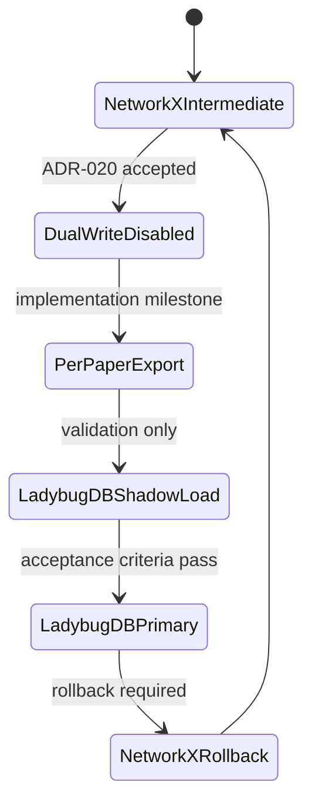
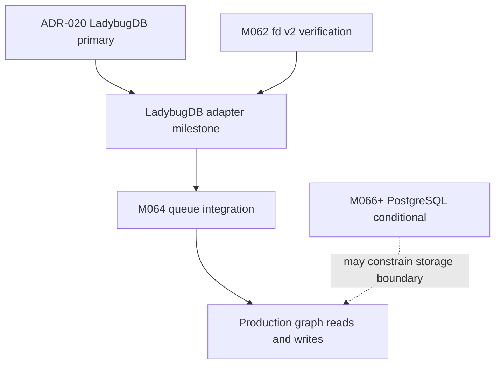

# ADR-020: GraphDB Selection for M063

**Status:** Accepted (binding)  
**Date:** 2026-06-14  
**Deciders:** agent  
**Milestone:** M065-u29n4f S02 for M063 GraphDB selection  
**Scope:** graphdb / scientific-kg / NetworkX-migration / vector-search / daily-archive production graph layer  
**Binding Level:** binding authoritative spec for production GraphDB selection  
**Binding:** yes  
**Revisable:** yes, only by a later accepted binding ADR after production migration evidence invalidates M063 S01 benchmark assumptions

## 0. One-line Decision

> daily-archive selects **LadybugDB** as the primary production GraphDB for the scientific knowledge graph because M063 S01 ranked it highest at **39/45**, ahead of FalkorDB at **35/45**, Neo4j at **34/45**, HelixDB at **30/45**, and Apache AGE at **28/45**.

This ADR is binding: yes. The prose and tables below are authoritative. Mermaid diagrams are navigation aids only.

## 1. Context

M063 exists to choose a production GraphDB for daily-archive after M062 hardened the fd embedding-service contract and after ADR-015 / ADR-016 established the current graph-library posture:

- ADR-015 is indexed as the NetworkX intermediate graph-layer decision.
- ADR-016 binds NetworkX as the primary Python graph library and igraph as supplementary when scale demands it.
- M063 S01 benchmarked five GraphDB candidates against a deterministic M062-shaped workload of 3,000 nodes, 9,000 edges, and five query shapes: citation lookup, table similarity, figure similarity, judge lookup, and vector search.
- The target architecture remains the five-layer scientific KG: citation, table, figure v1, figure v2, and judge evidence.
- M048 and later graph/evidence milestones established that graph writes must remain gated, observable, and reversible rather than silently mutating production state.

NetworkX remains the intermediate in-process representation during migration. ADR-020 chooses the durable production GraphDB target that NetworkX exports into.

## 2. Decision

LadybugDB is selected as the primary production GraphDB for daily-archive.

| Decision point | Binding choice |
|---|---|
| Production GraphDB | LadybugDB |
| M063 score | 39/45 |
| Current intermediate layer | NetworkX |
| Supplementary graph library | igraph, only when NetworkX scale requires it per ADR-016 |
| Write posture during migration | per-paper atomic DAG writes with explicit rollback |
| Vector posture | native vector-capable graph retrieval is required |
| Safety posture | default-off graph writes and external connectivity remain required |

No production importer is authorized by this ADR alone. The selected database target is binding, but graph writes remain disabled until the migration implementation meets the acceptance criteria in section 11.

## 3. Benchmark Evidence

M063 S01 produced five candidate reports, `artifacts/m063-graphdb/benchmark-data.json`, and `artifacts/m063-graphdb/scoring-matrix.md`. The benchmark was offline by default and did not claim live server performance.

| Rank | Candidate | Score | S01 interpretation |
|---:|---|---:|---|
| 1 | LadybugDB | 39/45 | Best fit for Python-native graph + vector workflows with low migration friction from NetworkX. |
| 2 | FalkorDB | 35/45 | Strong graph/vector option, but with more operational surface and higher NetworkX migration cost. |
| 3 | Neo4j | 34/45 | Mature graph database, but heavier operations and weaker native fit for the current Python-first architecture. |
| 4 | HelixDB | 30/45 | Promising vector-oriented graph direction, but client maturity and operational uncertainty are higher. |
| 5 | Apache AGE | 28/45 | PostgreSQL adjacency is useful, but vector and graph ergonomics score lower for this milestone. |

The scoring matrix is the authoritative S01 comparison artifact for this decision.

## 4. Top-3 Comparison

| Criterion | LadybugDB | FalkorDB | Neo4j |
|---|---|---|---|
| Total score | **39/45** | 35/45 | 34/45 |
| Native vector support | Strong, core reason for selection | Strong | Available but not the lowest-friction fit |
| NetworkX migration fit | Best; Python-native and NetworkX-compatible posture | Moderate; external DB/client model increases mapping work | Moderate; strong graph model but heavier adaptation |
| Python integration | Python-native package already importable in the environment | Python client not available in current environment during S01 | Python driver not available in current environment during S01 |
| Operational complexity | Lowest among top-3 for current project shape | Redis-like server surface | Highest among top-3 |
| License posture | MIT per LadybugDB candidate report evidence | Client MIT; server source observed separately | Mixed product licensing considerations |

LadybugDB wins because it is the only top-3 candidate that combines the highest total score, native graph/vector posture, Python-first usage, current-environment availability, and low migration friction.

## 5. Why LadybugDB

LadybugDB is the selected GraphDB because it best matches the project constraints rather than only the abstract GraphDB feature checklist.

- **Native vectors:** daily-archive needs embedding-backed retrieval for table, figure, judge, and citation evidence. LadybugDB scored 5/5 on native vector support.
- **NetworkX-compatible API posture:** ADR-015 and ADR-016 made NetworkX the current intermediate layer. LadybugDB has the lowest expected translation cost from the in-memory graph representation.
- **Python-native integration:** daily-archive ingestion, validation, fd integration, and milestone tooling are Python-first. A Python-native graph target minimizes orchestration code.
- **MIT license evidence:** the LadybugDB candidate report records MIT license evidence from the probed repository metadata.
- **Low operational complexity:** the S01 scoring matrix gives LadybugDB the best operational fit for the current project because it avoids adding a heavyweight external service before graph writes are proven.
- **Highest score:** LadybugDB scored **39/45**, the top M063 S01 result.

This decision intentionally values migration safety and project fit above vendor maturity alone.

## 6. Migration Plan from NetworkX

NetworkX remains the intermediate representation while LadybugDB becomes the durable production GraphDB target.

Migration phases:

1. **Schema mapping:** map the five graph layers into LadybugDB node and edge types while preserving source article id, evidence path, extraction phase, and provenance metadata.
2. **Per-paper atomic DAG:** export one article graph at a time. Each article import must either fully commit its citation/table/figure/judge graph or leave no durable partial state.
3. **Shadow load:** load LadybugDB from NetworkX-derived artifacts without enabling production reads. Compare node counts, edge counts, layer counts, and representative query results.
4. **Query parity:** prove citation lookup, table similarity, figure similarity, judge lookup, and vector search parity against the NetworkX baseline.
5. **Rollback strategy:** keep NetworkX artifacts as the source of truth until LadybugDB acceptance passes. On failure, delete the per-paper LadybugDB load and replay from the unchanged NetworkX export.
6. **Network migration phases:** keep network access disabled by default; use `127.0.0.1` only for explicit local validation; require a later implementation milestone to authorize any non-local GraphDB endpoint.

The migration must not rewrite historical graph artifacts to fit LadybugDB. Adapters must preserve existing evidence contracts.

## 7. Risk Analysis

| Risk | Why it matters | Mitigation |
|---|---|---|
| Client maturity | LadybugDB is smaller than Neo4j and may expose API gaps during migration. | Keep NetworkX as rollback source and prove query parity before production reads. |
| Smaller community | Fewer public examples may slow debugging. | Use narrow adapters, explicit contract tests, and M062-style health/failure reporting. |
| Vector behavior drift | Native vector behavior may differ from fd embedding expectations. | Bind vector search p95 and correctness checks in section 11 before enabling reads. |
| Operational unknowns | Lower operational complexity now can hide scale limits later. | Start with 9k-edge acceptance, then gate larger loads in later milestones. |
| Safety regression | Graph writes could accidentally become enabled before validation. | Preserve five safety defaults as false: network access is disabled, production import is disabled, graph writes are disabled, vendor-source mutation is disabled, and real DB connections are disabled. |

M062 patterns reduce this risk: explicit contract tests, failure-state persistence, default-off safety, and clear diagnostic outputs should be reused for the LadybugDB adapter.

## 8. Alternatives Considered

| Candidate | Score | Considered role | Outcome |
|---|---:|---|---|
| FalkorDB | 35/45 | Redis-like graph/vector database | Rejected for primary; useful comparator if LadybugDB fails production proof. |
| Neo4j | 34/45 | Mature graph database | Rejected for primary due to operational weight and lower project-fit score. |
| HelixDB | 30/45 | Vector-oriented emerging graph option | Rejected for primary due to client maturity and uncertainty. |
| Apache AGE | 28/45 | PostgreSQL-backed graph extension | Rejected for primary; may become relevant if M066+ PostgreSQL consolidation dominates. |

These alternatives remain documented so future milestones can revisit the decision with new evidence rather than re-running discovery from scratch.

## 9. Why NOT Each Alternative

### FalkorDB

FalkorDB scored well at **35/45** and has strong graph/vector positioning. It is not selected because it introduces a Redis-like server dependency and more migration friction from NetworkX than LadybugDB. It is a credible fallback if LadybugDB fails production acceptance.

### Neo4j

Neo4j scored **34/45** and is the most mature graph-database ecosystem in the top-3. It is not selected because its operational complexity and product/licensing surface are larger than the current milestone needs, while its score was below LadybugDB and FalkorDB.

### HelixDB

HelixDB scored **30/45** and appears promising for graph/vector workloads. It is not selected because S01 evidence showed higher maturity risk and less certainty around Python integration for the current daily-archive migration.

### Apache AGE

Apache AGE scored **28/45**. It is not selected because its graph/vector ergonomics are weaker for M063, even though PostgreSQL adjacency may matter later. M066+ may revisit AGE only if PostgreSQL consolidation becomes the dominant architectural constraint.

## 10. Future

Future work:

- M064 queue integration should treat LadybugDB writes as per-paper DAG steps with retry, rollback, and observable failure state.
- M066+ PostgreSQL conditional work should not override ADR-020 unless a later accepted binding ADR proves PostgreSQL consolidation is more important than LadybugDB graph/vector fit.
- M062-fd-v2-verification remains upstream evidence for embedding availability, vector payload shape, and operational diagnostics.
- A future implementation milestone must create the LadybugDB adapter, migration tests, and graph-read contract tests before production use.

## 11. Acceptance Criteria

LadybugDB becomes production-active only after these measurable criteria pass:

| Criterion | Target |
|---|---:|
| Graph load for deterministic 9k-edge workload | < 10s |
| Graph query p95 for citation/table/figure/judge lookup suite | < 50ms |
| Vector search p95 | < 100ms |
| Layer-count parity against NetworkX export | exact match |
| Per-paper atomic rollback | proven by failure-injection test |
| Safety defaults | five defaults remain false |

Until these pass, LadybugDB is the selected target but production graph writes are not authorized and production graph reads are disabled.

## 12. References

- `artifacts/m063-graphdb/scoring-matrix.md` — S01 scoring matrix and recommendation evidence.
- `artifacts/m063-graphdb/benchmark-data.json` — deterministic benchmark payload and candidate totals.
- `artifacts/m063-graphdb/candidates/ladybugdb-report.md` — LadybugDB-specific evidence.
- `doc/adr/ADR-INDEX.md` — ADR-015 index entry documenting NetworkX as intermediate graph layer.
- `doc/adr/ADR-016-graph-library-selection.md` — NetworkX primary and igraph supplementary graph-library decision.
- M048 graph/evidence lineage — source for guarded graph-write posture.
- M062 fd production hardening — source for embedding-service and observability patterns.

## Amendment Log

| Date | Author | Change | Rationale |
|---|---|---|---|
| 2026-06-15 | M066 (executor-01) | SUPERSEDED by ADR-021. Neo4j chosen as production GraphDB (76/90 score) instead of LadybugDB (62/90). M063 S01 scoring matrix missed 3 critical features: concurrent write semantics (LadybugDB 33% success under load), GRAFBLAS (LadybugDB 1/5), UDF support (LadybugDB 3/5). | User feedback: concurrent writes, GRAFBLAS, UDFs not in M063 evaluation. M066 re-benchmark with 18 criteria identifies Neo4j as new winner. |
| 2026-06-15 | M067 (executor-01) | SUPERSEDED again by ADR-022. Original M063 LadybugDB choice 39/45 superseded by ADR-021 (Neo4j 76/90) in M066 due to 33% concurrent write success. Now both superseded by ADR-022 (FalkorDB 70/90 for self-hosted) due to license analysis correction. | M067 corrected the FalkorDB and Neo4j license analysis and bound FalkorDB for the self-hosted daily-archive distribution model. |

## 13. LLM Reading Notes

For future agents:

- Start with sections 2, 6, and 11 if you are implementing the GraphDB adapter.
- Do not treat Mermaid diagrams as contracts; the tables and prose are authoritative.
- LadybugDB is selected, but graph writes are still disabled until a later implementation milestone passes the acceptance criteria.
- NetworkX is still the rollback source during migration. Do not delete NetworkX exports after a successful shadow load.
- Preserve the safety language exactly where scanners rely on it: network access is disabled, production import is disabled, graph writes are disabled, vendor-source mutation is disabled, and real DB connections are disabled.
- The ADR-015 document path is listed in `doc/adr/ADR-INDEX.md`; if the file is still absent, use ADR-016 and the index row as the available local governance source.

## 14. Amendment Log

| Date | Milestone | Change | Rationale |
|---|---|---|---|
| 2026-06-14 | M065-u29n4f S02 / M063 | Initial accepted binding ADR selecting LadybugDB as primary GraphDB. | M063 S01 ranked LadybugDB first at 39/45 and showed the lowest NetworkX migration friction. |
