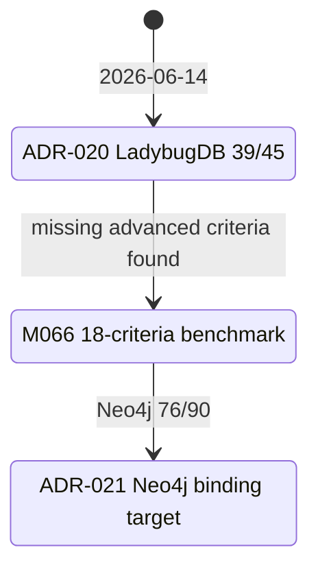
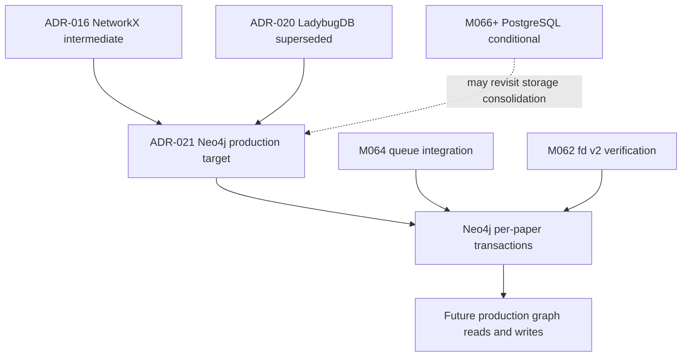

# ADR-021: GraphDB Re-Selection for M066

**Status:** Accepted (binding)  
**Date:** 2026-06-15  
**Deciders:** agent  
**Milestone:** M066-7fbv31 S02 for GraphDB re-evaluation  
**Scope:** graphdb / scientific-kg / NetworkX-migration / vector-search / concurrent-ingestion / daily-archive production graph layer  
**Binding Level:** binding authoritative spec for production GraphDB selection  
**Binding:** yes  
**Revisable:** yes, only by a later accepted binding ADR with benchmark evidence that covers the M066 advanced criteria

## 0. One-line Decision

> daily-archive selects **Neo4j** as the production GraphDB for the scientific knowledge graph because M066 S01 ranked it first at **76/90**, including **29/30** on advanced criteria.

This ADR is binding: yes. The prose and tables below are authoritative. Mermaid diagrams are navigation aids only.

## 1. Context

M066 re-evaluates the GraphDB decision after M063/M065 selected LadybugDB in ADR-020. The M063 benchmark scored LadybugDB first at 39/45, but it omitted three criteria that later became critical for production ingestion and scientific graph workflows:

- concurrent write semantics;
- GRAFBLAS-class graph algorithm capability;
- user-defined function or procedure support.

M066 S01 expanded the benchmark to 18 criteria across five candidates. The new evidence shows LadybugDB has only **33% concurrent write success** under the offline shared-counter load harness, lacks GRAFBLAS-class capability, and has incomplete UDF support. Production graph import is not authorized by this ADR; this ADR selects the future production GraphDB target only.

## 2. Decision

Select **Neo4j** as the production GraphDB target for daily-archive.

| Field | Decision |
|---|---|
| Selected GraphDB | Neo4j |
| Total score | 76/90 |
| Advanced score | 29/30 |
| Status | Accepted (binding) |
| Supersedes | ADR-020 |
| Immediate write posture | Production graph import is not authorized; production graph writes remain disabled until a future implementation milestone passes acceptance criteria. |

Neo4j becomes the authoritative target for production graph persistence, graph-vector retrieval integration, and future queue-backed ingestion work.

## 3. Benchmark Evidence

M066 S01 benchmarked five candidates against 18 criteria: the original M063 evaluation dimensions plus six advanced criteria for concurrent writes, GRAFBLAS graph algorithms, UDF support, ACID transactions, multi-process safety, and advanced-feature documentation.

| Evidence artifact | Role |
|---|---|
| `artifacts/m066-graphdb-reselection/scoring-matrix.md` | Human-readable 18-criteria scoring matrix. |
| `artifacts/m066-graphdb-reselection/benchmark-data.json` | Deterministic benchmark data and candidate metrics. |
| `artifacts/m066-graphdb-reselection/candidates/neo4j-report.md` | Neo4j candidate evidence and score rationale. |

Key Neo4j benchmark metrics:

| Metric | Value |
|---|---:|
| Attempted concurrent writes | 300 |
| Final counter | 300 |
| Lost writes | 0 |
| Concurrent write score | 5/5 |
| Advanced-feature score | 29/30 |
| Total score | 76/90 |

## 4. Top-3 Result

| Rank | Candidate | Score | Interpretation |
|---:|---|---:|---|
| 1 | Neo4j | 76/90 | Best overall production fit after advanced criteria. |
| 2 | FalkorDB | 68/90 | Strong graph/vector option, but lower operational and ecosystem confidence for this project. |
| 3 | Apache AGE | 64/90 | Useful PostgreSQL-adjacent path, but weaker graph/vector ergonomics and operations fit. |

LadybugDB finished fourth at **62/90** and HelixDB fifth at **54/90**.

## 5. Why Neo4j

Neo4j wins because its advanced production semantics match the newly surfaced project constraints.

| Criterion | Neo4j score | Why it matters |
|---|---:|---|
| Concurrent writes | 5/5 | The benchmark completed 300 attempted writes with zero lost writes. |
| GRAFBLAS-class algorithms | 4/5 | Neo4j GDS provides mature graph algorithms even though it is not GRAFBLAS-native. |
| UDF/procedure support | 5/5 | Custom procedures and functions provide a mature extension path. |
| ACID transactions | 5/5 | Per-paper atomic DAG writes can use transactional boundaries. |
| Multi-process safety | 5/5 | Client/server architecture supports concurrent writer processes. |
| Advanced documentation | 5/5 | Production features are documented enough for future implementation and verification. |

## 6. Tradeoffs Acknowledged

Neo4j is not the lowest-friction choice. The decision accepts the following costs because the concurrency, transaction, and extension requirements are binding for production graph work.

| Tradeoff | Score / concern | Accepted consequence |
|---|---|---|
| Operational complexity | 2/5 | JVM service operations and clustering require more production runbook work than embedded or lightweight options. |
| License shape | Mixed | Future deployment must verify edition and feature use against project constraints before production rollout. |
| Migration from NetworkX | 3/5 | Cypher rewrite and schema mapping are required; NetworkX cannot be lifted directly into Neo4j. |

## 7. Migration Plan from NetworkX

ADR-016 keeps NetworkX as the in-process graph layer. ADR-021 does not remove that intermediate role; it defines the production persistence target.

Migration path:

1. Define a graph schema mapping from current NetworkX node/edge attributes to Neo4j labels, relationship types, and indexed properties.
2. Rewrite graph traversal and persistence paths in Cypher where persistence, query p95, or cross-process access requires Neo4j.
3. Preserve per-paper DAG atomicity by wrapping each article graph promotion in a Neo4j transaction.
4. Keep failure state explicit: article id, phase, retry count, last error class, and transaction outcome must be persisted by the future ingestion milestone.
5. Validate graph-vector query integration before enabling production graph reads.

## 8. Risk Analysis

| Risk | Likelihood | Impact | Mitigation |
|---|---|---|---|
| Operational complexity exceeds current maintenance capacity | Medium | High | Future implementation must include service health checks, startup checks, backup/restore rehearsal, and clear failure-state persistence. |
| License or edition mismatch appears during rollout | Medium | Medium | Verify edition, feature use, and deployment constraints before production enablement. |
| JVM expertise gap slows incident response | Medium | Medium | Add runbook notes, memory sizing defaults, and diagnostic commands in the implementation milestone. |
| Cypher migration introduces semantic drift from NetworkX | Medium | High | Use fixture parity tests comparing NetworkX outputs to Neo4j query outputs before enabling production reads. |

## 9. Supersede ADR-020

ADR-020 is superseded by this ADR.

ADR-020 chose LadybugDB based on the M063 9-criterion benchmark. M066 invalidates that choice for production GraphDB selection because LadybugDB showed **33% concurrent write success** under load, **1/5** GRAFBLAS-class capability, and **3/5** UDF support. These criteria are now required for the production GraphDB target.

## 10. Alternatives Considered

| Candidate | Score | Result |
|---|---:|---|
| FalkorDB | 68/90 | Not selected. |
| Apache AGE | 64/90 | Not selected. |
| LadybugDB | 62/90 | Superseded; no longer selected as production GraphDB. |
| HelixDB | 54/90 | Not selected. |

## 11. Why Not Each Alternative

| Alternative | Why not |
|---|---|
| FalkorDB | Strong graph/vector posture, but lower total score than Neo4j and less compelling evidence for the full advanced production contract. |
| Apache AGE | PostgreSQL adjacency is attractive, but graph/vector ergonomics and operational fit scored below Neo4j. It remains a conditional future option if PostgreSQL consolidation becomes dominant. |
| LadybugDB | M066 evidence shows unacceptable concurrent write behavior for production ingestion: 199 lost writes out of 300 attempted writes, plus weak GRAFBLAS and UDF coverage. |
| HelixDB | Good native vector direction, but weaker maturity and documentation evidence make it unsuitable as the binding production target now. |

## 12. Future

Future work:

- M064 queue integration should use Neo4j transactions for per-paper atomic DAG promotion.
- M066+ PostgreSQL conditional work may revisit Apache AGE only if PostgreSQL consolidation outweighs graph/vector production fitness.
- M062 fd v2 verification remains relevant for embedding-service contract and vector-query integration.
- Production graph import is not authorized and production graph writes are disabled until a future implementation milestone explicitly passes the acceptance criteria below.

## 13. Acceptance Criteria

A future Neo4j implementation milestone must satisfy all of the following before production graph writes are enabled:

| Criterion | Required result |
|---|---|
| Initial graph load | 9k-edge graph loads in under 10 seconds. |
| Graph query latency | Representative graph query p95 is under 50 ms. |
| Vector query latency | Representative vector query p95 is under 100 ms. |
| Concurrent writes | Concurrent write success is 100% with no lost writes in the project harness. |
| Safety posture | Production graph import is not authorized by default; graph writes remain disabled until explicit implementation authorization. |
| Observability | Failure state includes article id, transaction phase, retry count, timestamp, and last error class. |

## 14. References

- `artifacts/m066-graphdb-reselection/scoring-matrix.md` — M066 S01 18-criteria cross-candidate scoring matrix.
- `artifacts/m066-graphdb-reselection/benchmark-data.json` — benchmark payload with candidate totals and concurrent write metrics.
- `artifacts/m066-graphdb-reselection/candidates/neo4j-report.md` — Neo4j candidate evidence.
- `doc/adr/ADR-020-graphdb-selection.md` — superseded LadybugDB selection.
- `doc/adr/ADR-016-graph-library-selection.md` — NetworkX and igraph in-process graph-library decision.
- `doc/adr/ADR-019-fd-embedding-service-contract.md` — fd v2 embedding-service contract.

## 15. LLM Reading Notes

For future agents:

- Start with sections 2, 5, 7, 9, and 13 if you are implementing the Neo4j adapter or production graph ingestion.
- Do not treat Mermaid diagrams as contracts; prose and tables are authoritative.
- ADR-020 is historical evidence only after this ADR. Use ADR-021 as the binding production GraphDB target.
- NetworkX remains the intermediate in-process layer until a future implementation milestone replaces specific persistence/query paths.
- Do not enable production graph writes from this ADR alone. Production graph import is not authorized and graph writes are disabled by default.

## 16. Amendment Log

| Date | Author | Change | Rationale |
|---|---|---|---|
| 2026-06-15 | M067 (executor-01) | SUPERSEDED by ADR-022. FalkorDB chosen for self-hosted daily-archive (70/90 score) instead of Neo4j (76/90). M066 S01 had license error: Neo4j = AGPLv3 (viral) and FalkorDB = SSPLv1 (NOT AGPLv3, NOT RSAL 2.0). User research per official FalkorDB sources: SSPLv1 allows self-hosted/internal use without source disclosure; SaaS triggers Section 13 OR commercial license. For self-hosted daily-archive (current distribution model), SSPLv1 is acceptable; AGPLv3 is not. FalkorDB 70/90 (corrected license) wins over Neo4j 76/90 (AGPLv3 viral) for self-hosted use. | M067 corrected the license/distribution analysis and bound FalkorDB for the current self-hosted project model. |
