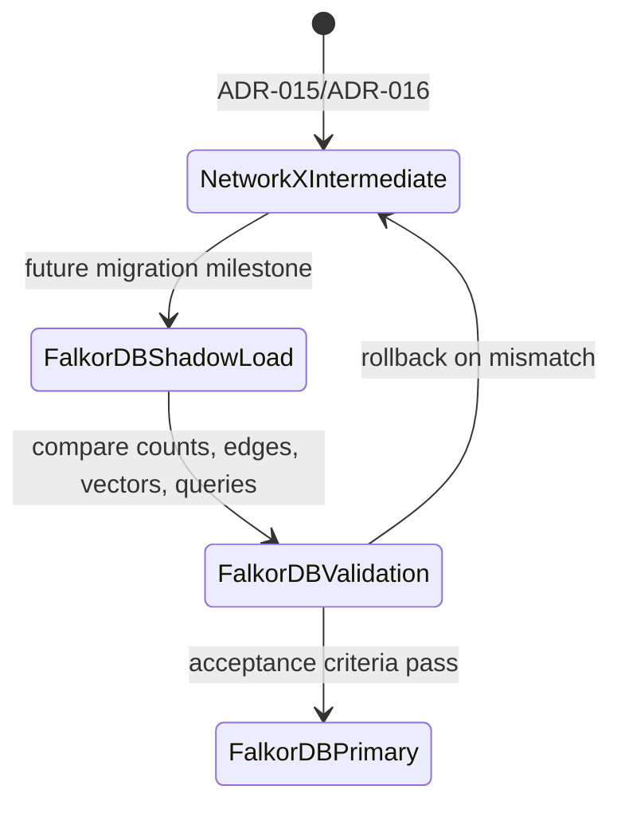
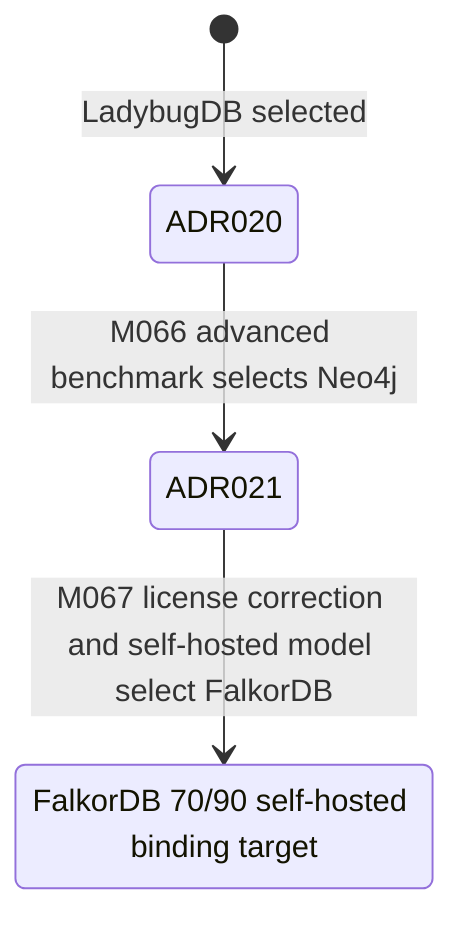
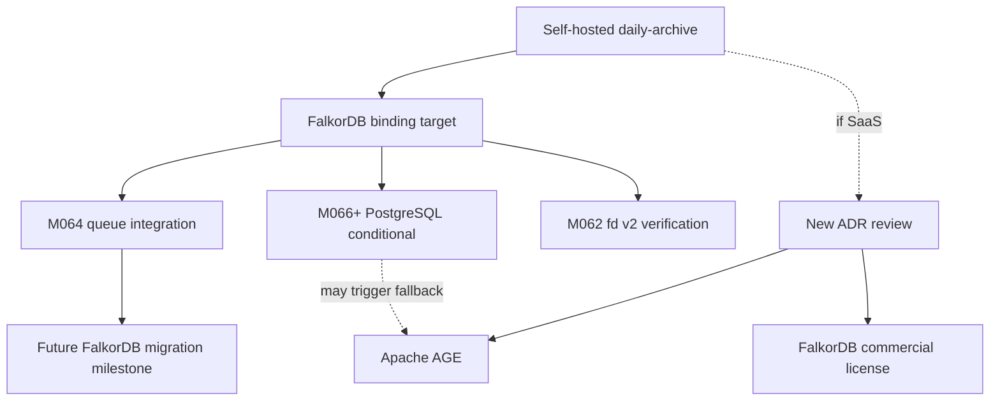

# ADR-022: GraphDB Re-Selection Self-Hosted

**Status:** Accepted (binding)  
**Date:** 2026-06-15  
**Deciders:** human  
**Milestone:** M067-oqsavh S02 for corrected self-hosted GraphDB selection  
**Scope:** graphdb / scientific-kg / NetworkX-migration / vector-search / concurrent-ingestion / self-hosted daily-archive production graph layer  
**Binding Level:** binding authoritative spec for self-hosted production GraphDB selection  
**Binding:** yes  
**Revisable:** yes, only by a later accepted binding ADR that changes the daily-archive distribution model, invalidates the M067 benchmark evidence, or proves a better migration target under the same self-hosted constraints

## 0. One-line Decision

> daily-archive selects **FalkorDB** as the self-hosted production GraphDB for the scientific knowledge graph because M067 corrected the license analysis and ranked FalkorDB first for the self-hosted distribution model at **70/90**.

This ADR is binding: yes. The prose and tables below are authoritative. Mermaid diagrams are navigation aids only.

## 1. Context

M067 re-selects the production GraphDB after M063/M065 selected LadybugDB in ADR-020 and M066 selected Neo4j in ADR-021. M066 expanded the benchmark from 9 to 18 criteria and found Neo4j highest overall at **76/90**, but M067 corrected the licensing interpretation and distribution model used for the final project decision.

daily-archive is currently a self-hosted research project: a local scientific knowledge graph for article ingestion, graph-vector retrieval, and single-user analysis. It is not offered as a hosted database service to third parties. Under that assumption, FalkorDB's **SSPLv1** license is viable for self-hosted and internal use, while a hosted third-party database service would trigger SSPL Section 13 obligations or require a commercial FalkorDB license.

The M066 S01 license notes incorrectly treated FalkorDB as AGPLv3/RSAL-like. M067 corrects this: FalkorDB is **SSPLv1**, not AGPLv3 and not RSAL 2.0. Neo4j is treated as **AGPLv3** for this decision and is not selected for daily-archive's self-hosted production graph target.

## 2. Decision

daily-archive will use **FalkorDB** as the binding self-hosted production GraphDB target. The selected score is **70/90** under the corrected M067 scoring matrix.

Non-decisions:

- This ADR does not authorize production graph import.
- This ADR does not enable graph writes by default.
- This ADR does not remove NetworkX as the intermediate in-process graph layer before a future implementation milestone proves migration acceptance criteria.
- This ADR does not authorize a hosted third-party FalkorDB service. If daily-archive becomes a hosted service, this decision must be revisited.

## 3. Benchmark Evidence

M067 reuses the M066 18-criteria benchmark and applies the corrected FalkorDB license interpretation. FalkorDB increases from the earlier M066 total to **70/90** and becomes the self-hosted winner.

| Evidence | Finding | Source |
|---|---|---|
| Total score | FalkorDB **70/90** | `artifacts/m066-graphdb-reselection/scoring-matrix.md` |
| Advanced score | FalkorDB **22/30** | `artifacts/m066-graphdb-reselection/candidates/falkordb-report.md` |
| Concurrent writes | 300/300 final counter, 0 lost writes, 100% success in the project harness | `artifacts/m066-graphdb-reselection/scoring-matrix.md` |
| License correction | FalkorDB is SSPLv1; self-hosted/internal use is acceptable under the M067 model | `artifacts/m066-graphdb-reselection/distribution-model.md` |
| Distribution assumption | daily-archive is self-hosted research KG, not hosted third-party database service | `artifacts/m066-graphdb-reselection/distribution-model.md` |

## 4. Top Candidates for Self-Hosted daily-archive

| Rank | Candidate | M067 self-hosted score | Result |
|---:|---|---:|---|
| 1 | FalkorDB | **70/90** | Selected binding target. |
| 2 | Apache AGE | 64/90 | Permissive fallback if distribution model changes or PostgreSQL consolidation dominates. |
| 3 | LadybugDB | 62/90 | Superseded; write-concurrency evidence is too weak for production graph target. |
| 4 | HelixDB | 54/90 | Not selected; lower maturity and fit. |

Neo4j remains the highest raw feature scorer at **76/90**, but it is not the self-hosted winner because licensing risk dominates the final selection under the daily-archive constraints.

## 5. Why FalkorDB for Self-Hosted daily-archive

FalkorDB is the best fit under the explicit self-hosted model because it combines acceptable licensing, strong graph-vector fit, and practical operational shape for daily-archive.

| Factor | Why it matters |
|---|---|
| SSPLv1 acceptable for current use | Self-hosted and internal use do not require source disclosure when FalkorDB is not exposed as a hosted third-party database service. |
| Advanced score **22/30** | Covers concurrent writes, GraphBLAS lineage, UDF-related extension paths, transaction semantics, multi-process safety, and advanced documentation. |
| FLEX UDFs and extension paths | Provides a practical route for custom graph operations even though query-level UDF ergonomics are weaker than Neo4j. |
| GRAFBLAS-like capability | RedisGraph/FalkorDB lineage gives strong sparse-matrix graph algorithm foundations. |
| Redis-based deployment | Aligns with a small self-hosted service model and gives familiar operational primitives. |
| 100% concurrent-write harness result | Project evidence found no lost writes in the 3-writer benchmark harness. |

## 6. Tradeoffs Acknowledged

This decision is intentionally narrower than ADR-021. Neo4j scored higher at **76/90**, but FalkorDB wins for the actual daily-archive distribution model.

| Tradeoff | Accepted consequence |
|---|---|
| SSPLv1 SaaS scenario | If daily-archive becomes a hosted third-party database service, the project must migrate to Apache AGE or obtain a FalkorDB commercial license before launch. |
| FalkorDB Cloud is paid | Cloud operation is not assumed by this ADR; the selected path is self-hosted. |
| FalkorDB **70/90** vs Neo4j **76/90** | daily-archive gives licensing/distribution fit priority over the six-point raw score advantage. |
| UDF ergonomics lower than Neo4j | Implementation must keep custom graph logic small, tested, and observable. |
| Redis dependency | Production planning must account for Redis/FalkorDB lifecycle, backups, monitoring, and local failure modes. |

## 7. Migration Plan from NetworkX

NetworkX remains the intermediate graph layer until a future implementation milestone proves a safe FalkorDB migration.

Migration steps:

1. Preserve NetworkX exports as rollback input.
2. Define schema mapping for article, claim, evidence, citation, and embedding-reference nodes.
3. Load FalkorDB through Cypher-compatible queries using idempotent batch boundaries.
4. Use Redis/FalkorDB transaction primitives for per-paper graph promotion and retry-safe checkpoints.
5. Compare graph counts, key relationships, and query results against NetworkX before making FalkorDB primary.
6. Keep graph writes disabled by default until the future implementation milestone passes acceptance criteria.

## 8. Risk Analysis

| Risk | Impact | Mitigation |
|---|---|---|
| SSPLv1 SaaS trigger | Hosted third-party database service could require source disclosure obligations or commercial licensing. | Keep current self-hosted assumption explicit; revisit before any hosted-service launch. |
| Redis/FalkorDB dependency | Operational failure in Redis/FalkorDB could block graph queries or writes. | Add health checks, backups, restore drills, and last-error state in the implementation milestone. |
| Smaller community than Neo4j | Fewer examples and integrations may slow debugging. | Keep migration seams narrow and preserve NetworkX fallback artifacts. |
| UDF ergonomics | Custom graph logic may be less direct than Neo4j procedures. | Prefer Cypher and built-in graph operations; isolate custom extensions behind tested adapters. |
| Distribution model drift | Future collaboration or service packaging may invalidate this ADR. | Add a release gate: SaaS or external service packaging must trigger ADR review. |

## 9. Supersession

ADR-022 supersedes both prior GraphDB selection ADRs.

| Prior ADR | Previous choice | Superseded by | Rationale |
|---|---|---|---|
| ADR-021 | Neo4j, **76/90** | ADR-022 | Neo4j's raw feature score remains higher, but the corrected license/distribution analysis makes FalkorDB the binding self-hosted choice. |
| ADR-020 | LadybugDB, originally **39/45** and later **62/90** | ADR-022 | LadybugDB remains weaker on concurrent-write evidence and is no longer the selected production GraphDB target. |

## 10. Alternatives Considered

| Candidate | Score | License/distribution fit | Result |
|---|---:|---|---|
| Neo4j | 76/90 | AGPLv3 risk for this project decision | Not selected. |
| Apache AGE | 64/90 | Apache 2.0 | Not selected; viable fallback. |
| LadybugDB | 62/90 | MIT | Not selected; superseded. |
| HelixDB | 54/90 | Lower maturity for this project scope | Not selected. |

## 11. Why Not Each Alternative

- **Neo4j:** Best raw benchmark score at **76/90** and strongest advanced score, but licensing risk is unacceptable for the self-hosted production GraphDB decision. Neo4j remains useful evidence, not the selected target.
- **Apache AGE:** Strong permissive fallback at **64/90** and attractive if PostgreSQL consolidation becomes the dominant requirement, but weaker graph/vector production fit than FalkorDB for the current self-hosted path.
- **LadybugDB:** MIT license and low migration friction are attractive, but the M066 harness found **33% concurrent write success** and weaker advanced features. ADR-020 remains historical only.
- **HelixDB:** Interesting graph-vector direction, but lower score, lower maturity, and weaker project evidence make it unsuitable as the primary production target.

## 12. Future Work

Future work:

- M064 queue integration should target FalkorDB-compatible graph promotion semantics once the queue work resumes.
- M066+ PostgreSQL conditional work may still revisit Apache AGE if PostgreSQL consolidation becomes more important than graph/vector fit.
- M062-fd-v2-verification remains relevant for embedding-service and vector-query integration.
- If daily-archive becomes SaaS or offers FalkorDB as a hosted third-party database service, migrate to Apache AGE or obtain a FalkorDB commercial license before launch.

## 13. Acceptance Criteria

A future FalkorDB implementation milestone must satisfy all of the following before FalkorDB becomes the live primary graph store:

| Criterion | Required result |
|---|---|
| Load performance | Representative graph load completes in **< 10s**. |
| Graph query latency | Core graph query p95 is **< 50ms**. |
| Vector query latency | Vector query p95 is **< 100ms**. |
| Concurrent writes | Concurrent write success is **100%** with no lost writes in the project harness. |
| Safety posture | Production graph import is not authorized by default; graph writes remain disabled until explicit implementation authorization. |
| Observability | Failure state includes article id, transaction phase, retry count, timestamp, and last error class. |

## 14. References

- `artifacts/m066-graphdb-reselection/scoring-matrix.md` — corrected M067 self-hosted ranking and 18-criteria benchmark matrix.
- `artifacts/m066-graphdb-reselection/distribution-model.md` — explicit self-hosted distribution model and SSPLv1 interpretation.
- `artifacts/m066-graphdb-reselection/candidates/falkordb-report.md` — FalkorDB candidate report with **70/90** score.
- `doc/adr/ADR-021-graphdb-reselection.md` — superseded Neo4j GraphDB selection.
- `doc/adr/ADR-020-graphdb-selection.md` — superseded LadybugDB GraphDB selection.
- `doc/adr/ADR-016-graph-library-selection.md` — NetworkX/igraph graph-library context.
- `doc/adr/ADR-019-fd-embedding-service-contract.md` — fd v2 embedding-service contract relevant to vector integration.

## 15. LLM Reading Notes

For future agents:

- Start with sections 2, 5, 7, 9, and 13 before implementing the FalkorDB adapter or graph migration.
- Treat ADR-022 as the binding GraphDB target for **self-hosted** daily-archive only.
- Do not treat Mermaid diagrams as contracts; prose and tables are authoritative.
- ADR-021 and ADR-020 are historical evidence after this ADR. Do not implement Neo4j or LadybugDB as the primary target unless a later binding ADR supersedes ADR-022.
- Keep NetworkX as the intermediate rollback layer until a future implementation milestone proves the FalkorDB acceptance criteria.
- Production graph import is not authorized and graph writes are disabled by default.
- If SaaS or hosted third-party database-service distribution appears in requirements, stop and require a new ADR before using SSPLv1 FalkorDB.

## 16. Amendment Log

| Date | Author | Change | Rationale |
|---|---|---|---|
