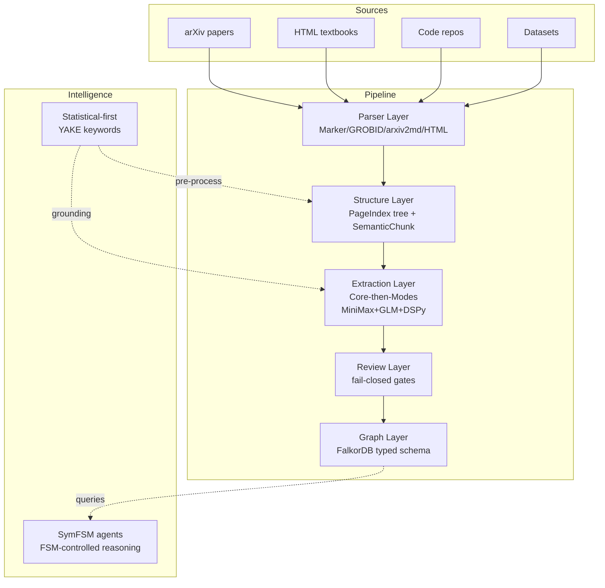

# ADR-023: Architecture Vision and Layered Knowledge Pipeline

**Status:** Accepted  
**Date:** 2026-06-18  
**Deciders:** collaborative  
**Milestone:** M101-f5jip0 S01  
**Scope:** universal-kb / graphdb / evidence-pipeline / extraction / agents / llm  
**Binding Level:** binding  
**Revisable:** yes, only by a later accepted binding ADR after implementation evidence invalidates assumptions

## 0. One-line Decision

> daily-archive will implement a **7-layer typed knowledge pipeline** (Source → Parser → Structure → Extraction → Graph → Review → Agents) using FalkorDB (ADR-022) as production graph store, MiniMax-M3 + GLM-5.2 as multi-provider LLM, DSPy for extraction optimization, statistical-first data preparation (YAKE), and SymFSM-inspired control structures for future agent orchestration.
>
> We will not adopt quant-mind runtime (ADR m034/007), Agents-K1 GRPO training (no GPU), or Headroom compression without evaluation evidence.

This ADR is binding: yes. The prose and tables below are authoritative.

## 1. Context

daily-archive completed full package migration (M099: arxiv_archive → research_graph, 110 modules) and architecture cleanup (M100). The project has 22 binding ADRs, 89 completed milestones, and 835+ passing tests.

Three external architectures were analyzed:

| Source | Key patterns adopted | Runtime adopted? |
|---|---|---|
| **Agents-K1** (M069) | Typed entity/relation schema (Modules A-E, 25 relations), Core-then-Modes factorization, tri-source retrieval, graph operators O1-O6 | No — GRPO needs GPU; we use DSPy + API instead |
| **quant-mind** (M033, ADR m034/007) | TreeKnowledge hierarchy, PaperKnowledgeCard, typed SourceRef/ExtractionRef, fetch-format-flow separation, bounded batch | No — runtime depends on OpenAI Agents; placeholder storage |
| **ActiveGraph** (M048) | Event-sourced reactive graph, behaviors, replay, fork/diff | No — Postgres dependency; patterns adopted for agent design |
| **SymFSM** | FSM-controlled reasoning, cognitive map, repair engine, structural verifier, experience store | Patterns only — not a dependency; inspires agent layer design |

### Context Map



## 2. Decision

### 2.1 Seven-Layer Architecture

| Layer | Name | What it does | Current modules | Gap |
|---|---|---|---|---|
| 0 | **Source** | Register and fetch any knowledge source | `corpus/sources/` | Add HTML/code/dataset sources |
| 1 | **Parser** | Convert raw source → ParsedArticle | `corpus/ingestion/`, `corpus/parsing/` | Add HTML/code parsers |
| 2 | **Structure** | Build TreeKnowledge + SemanticChunks + KnowledgeCards | `papers/indexing/`, `papers/chunking/` | Add summary fields, KnowledgeCard |
| 3 | **Extraction** | Typed entity/relation extraction (Core-then-Modes) | `evaluation/` | **KEY GAP**: no real extraction pipeline |
| 4 | **Graph** | FalkorDB typed schema + graph operators | `graph/` (LadybugDB → FalkorDB migration) | **KEY GAP**: LadybugDB → FalkorDB |
| 5 | **Review** | Fail-closed safety gates | `workflows/validation/`, `workflows/universal_kb/` | Upgrade for typed entities |
| 6 | **Agents** | SymFSM-controlled agent orchestration | `workflows/rlm/` (prototype) | **DEFERRED**: after pipeline + graph |

### 2.2 Statistical-First Principle

Before any LLM call, maximize use of deterministic/statistical algorithms:

| Task | Statistical method | LLM role (after statistics) |
|---|---|---|
| Keyword extraction | **YAKE** (already in `retrieval/keyword_extractor.py`) | Typed entity classification |
| Page/section summaries | TF-IDF extractive summarization | Abstract entity extraction (Module C) |
| Citation clustering | Graph community detection (NetworkX) | Citation relation classification |
| Entity dedup | SHA256 hash + canonical ID (already in `identity/`) | Entity merging with LLM judgment |
| Document similarity | BGE-M3 embeddings (already in `retrieval/embedder.py`) | Semantic relation extraction |
| Grounding pre-filter | Per-page keyword statistics for query routing | LLM reasoning over grounded context |

**Rule**: Every extraction stage MUST produce statistical pre-processing output before invoking LLM. The LLM receives both the chunk text AND the statistical context (keyword frequencies, section position, citation graph structure).

### 2.3 Multi-Provider LLM with Per-Provider Rate Limits

| Provider | Model | Context | Role | Rate limit mechanism |
|---|---|---|---|---|
| MiniMax | M3-512k | 512K | Primary extraction + judge | `minimax_usage.py` checks token_plan/remains endpoint |
| GLM/Z.ai | GLM-5.2 | — | Secondary/fallback | 5-hour rolling limit; provider config tracks usage |
| (future) | Any | — | Hot-pluggable | `provider_config.py` abstraction |

**Architecture principle**: The LLM module (`llm/`) MUST:
1. Accept new providers/models via config only (no code changes)
2. Check per-provider rate limits BEFORE making API calls
3. Fall back to secondary provider when primary is rate-limited
4. Track token usage per provider in a durable queue
5. Expose `can_make_request(provider) -> bool` interface

### 2.4 SymFSM-Inspired Agent Control

Future agents (Layer 6) will use FSM-controlled reasoning, NOT free LLM generation:

```text
User Query
   → Task Interpreter (type classification)
   → Cognitive Map Builder (graph query + evidence gathering)
   → Structural Verifier (is the answer reachable from known facts?)
   → Repair Engine (if gaps found: clarify, decompose, or reframe)
   → LLM Generator (fills structured template, NOT free generation)
   → Output Verifier (check against cognitive map + safety flags)
   → Experience Store (save successful reasoning patterns)
```

**Key SymFSM patterns adopted**:
- **Cognitive map** = subgraph of FalkorDB relevant to the query
- **Repair engine** = graph operators O5 (gap detection) + O6 (novelty grounding)
- **Structural verifier** = typed relation path checking in FalkorDB
- **Experience store** = case-based process memory (not model fine-tuning)

**Key SymFSM patterns NOT adopted**:
- 30D State Inspector (over-engineered for our scope)
- Proprietary cognitive kernel runtime

### 2.5 Quant-Mind Pattern Adoption

| Pattern | Implementation in daily-archive | Status |
|---|---|---|
| **TreeKnowledge** | PageIndexNode + summary field → navigable hierarchy | Extend existing |
| **PaperKnowledgeCard** | KnowledgeCard dataclass: summary, methodology, key_findings, limitations | New |
| **FlattenKnowledge** | Universal summary card for any source type | New |
| **SourceRef** | Extend for non-paper: kind=textbook/code/dataset/manual | Extend existing |
| **ExtractionRef** | flow + model + prompt_hash + timestamp per extraction | New |
| **Citation** | Extend SourceSpan with quote (max 500), tree_id, node_id | Extend existing |
| **Fetch-format-flow** | Already separated: corpus/ingestion vs corpus/parsing vs evaluation | ✅ Done |
| **Bounded batch** | Queue with per-provider rate limit awareness | Extend queue |
| **Typed resolver** | Extend identity/canonicalization for typed entities | Extend existing |

## 3. Applies To

- Universal knowledge base architecture
- Scientific paper domain implementation (primary)
- Future non-paper domain ingestion (textbooks, code, datasets)
- Extraction pipeline design
- Graph schema and migration
- Agent orchestration (deferred)
- LLM provider management
- Statistical pre-processing

## 4. Requirements and Decisions Impacted

### Requirements

| Requirement | Impact | Notes |
|---|---|---|
| R024 | supports | Staged validation (10→20→week) requires typed extraction first |
| R027 | supports | Graph-readiness quality contract needs typed entities |
| R019 | supports | Hybrid retrieval needs typed relations for knowledge network traversal |
| R022 | supports | RLM workflow needs graph operators with typed edges |

### Decisions

| Decision | Impact | Notes |
|---|---|---|
| ADR-022 | consistent | FalkorDB remains binding production GraphDB |
| ADR-016 | consistent | NetworkX remains intermediate layer |
| ADR-014 | consistent | MiniMax-M3 remains primary LLM |
| ADR-017 | consistent | Queue deferred until pipeline end-to-end |
| ADR m034/007 | consistent | quant-mind patterns only, not runtime |

## 5. Information Flow

```text
Source → [Layer 0] fetch (bounded, SHA256 dedup)
    → [Layer 1] parse (Marker/GROBID/HTML/code → ParsedArticle)
    → [Layer 2] structure (PageIndex tree + SemanticChunks + KnowledgeCard)
        ↕ statistical pre-processing (YAKE keywords, TF-IDF, embeddings)
    → [Layer 3] extract (Core: typed entities + binary relations)
        → Projection (deterministic views, 0 LLM)
        → Upgrade (causal/citation/abstract, 1 LLM each)
    → [Layer 5] review (CandidatePacket → ReviewPacket → Import Gate)
    → [Layer 4] graph (FalkorDB write: typed edges, vector indexes)
        ↕ graph operators (O1-O6: seed, lineage, baseline, multimodal, gap, novelty)
    → [Layer 6] agents (SymFSM-controlled, DEFERRED)
```

## 6. Sequencing

```
Phase 1 (M101): Architecture crystallization ← CURRENT
Phase 2: Typed schema + extraction prototype (5 papers)
Phase 3: FalkorDB migration + graph operators
Phase 4: Staged validation (R024: 10→20→week)
Phase 5: Universal ingestion (textbook, code, dataset)
Phase 6: Agent integration (SymFSM-controlled)
```

## 7. Safety Boundaries

1. **Fail-closed**: no graph writes without explicit authorization
2. **Statistical-first**: deterministic pre-processing before every LLM call
3. **Rate-limit-aware**: per-provider quota checking before API calls
4. **Agent safety**: SymFSM control structure prevents free-form LLM actions
5. **Staged validation**: no scale claims before 10/20/week validation (R024)

## 8. LLM Reading Notes

- **Binding**: This ADR defines the 7-layer architecture, statistical-first principle, multi-provider rate limits, and SymFSM agent direction.
- **Not authorized**: Graph writes, production imports, GRPO training, Headroom adoption, quant-mind runtime.
- **FalkorDB** is the binding production GraphDB (ADR-022). NetworkX is intermediate (ADR-016).
- **MiniMax-M3** is primary LLM. **GLM-5.2** is secondary. New providers via config only.
- **Agents are deferred** until pipeline + queue + graph are operational.
- **Statistical-first**: YAKE/TF-IDF/embeddings before LLM. Every extraction stage receives statistical context.
