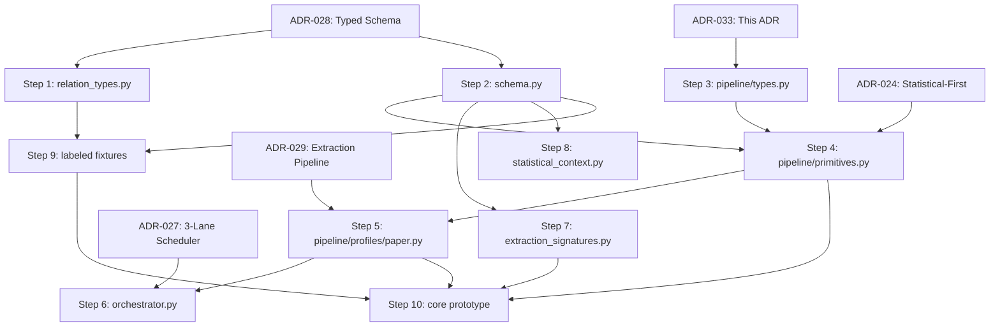

# ADR-033: Modular Pipeline Architecture with Typed Schema Evolution

**Status:** Accepted (binding)  
**Date:** 2026-06-18  
**Deciders:** collaborative  
**Milestone:** M101-f5jip0  
**Scope:** pipeline / schema / extraction / type-system  
**Binding Level:** binding  
**Revisable:** yes, with implementation evidence

## 0. One-line Decision

> daily-archive will implement a **modular typed pipeline** with 4 abstraction levels (universal primitives → specialized building blocks → domain profiles → orchestration), using **schema evolution** (not duplication) to upgrade existing `ScientificEntity`/`ScientificRelation`/`ExtractionPatch` into typed versions via `schema_version`, **Adaptix** exclusively for LLM JSON→dataclass mapping at extraction boundaries, and **stdlib dataclasses** (not Pydantic) for all internal pipeline types.

## 1. Context

ADR-028 defines typed schema (27 relations, 5 modules). ADR-029 defines Core-then-Modes extraction pipeline. The question is **how** to implement this without duplicating code or creating parallel type hierarchies.

Existing code in `evaluation/scientific_extraction.py` has:
- `ScientificEntity` with untyped `entity_type: str`
- `ScientificRelation` with `SUPPORTED_RELATION_TYPES = frozenset({"supports", "contradicts", "mentions", "uses", "extends"})`
- `ExtractionPatch` bundling claims + entities + relations

Adaptix is already installed and was used in M033 for OpenDataLoader JSON→typed adapter mapping. Pydantic v2.13 is installed but only used by external dependencies (marker, surya).

### Conflict Check with Existing ADRs

| Existing ADR | Potential conflict | Resolution |
|---|---|---|
| ADR-024 (statistical-first) | No conflict — pipeline primitives include statistical pre-processing | Consistent |
| ADR-025 (multi-provider LLM) | No conflict — pipeline uses LLMProviderInterface from ADR-025 | Consistent |
| ADR-027 (3-lane scheduler) | No conflict — orchestrator integrates with scheduler | Consistent |
| ADR-028 (typed schema) | **This ADR implements ADR-028** — typed entities/relations in code | Extends |
| ADR-029 (extraction pipeline) | **This ADR structures the implementation** of Core-then-Modes | Extends |
| ADR-017 (queue deferred) | No conflict — pipeline works without queue (synchronous mode); orchestrator adds queue when activated | Compatible |
| M033 Adaptix usage | Consistent — same Adaptix pattern (JSON→typed), now formalized as pipeline boundary | Consistent |

**No conflicts found.** This ADR is consistent with all existing binding decisions.

## 2. Decision

### 2.1 Four Abstraction Levels

| Level | What | Examples | Reused across domains? |
|---|---|---|---|
| **1. Universal primitives** | Domain-agnostic pipeline infrastructure | PipelineContext, PipelineStage, StageManifest | Yes, all domains |
| **2. Specialized building blocks** | Reusable processing stages | StatisticalPreProcessor, CoreEntityExtractor, EvidenceLinker | Yes, configured per domain |
| **3. Domain profiles** | Pipeline configurations per domain type | paper, textbook, code_repo, dataset, tech_doc | No, domain-specific |
| **4. Orchestration** | Scheduler + queue integration | PipelineOrchestrator | Yes, single orchestrator |

### 2.2 Schema Evolution (Not Duplication)

Existing types **evolve**, not duplicate:

```python
# evaluation/schema.py

SCHEMA_VERSION = "typed.v1"  # was: "scientific-extraction.v1"

@dataclass(frozen=True)
class TypedEntity:
    """Evolved from ScientificEntity. schema_version tracks the evolution."""
    entity_id: str              # was: id
    source_id: str              # was: paper_id (now universal)
    entity_type: str            # now constrained to CURRENT_SCHEMA.entity_types
    canonical_name: str         # was: label
    confidence: float
    evidence_path_id: str | None
    schema_version: str = SCHEMA_VERSION
    extractor_ref: ExtractionRef | None = None  # NEW
    safety_flags: dict[str, bool] = field(default_factory=lambda: {"import_eligible": False})
```

**Rule**: `scientific_extraction.py` imports from `schema.py` and provides backward-compatible aliases. Old test assertions updated to new types. No adapter/converter layer needed — the types ARE the new types.

### 2.3 Adaptix: LLM Boundary Only

Adaptix used **exclusively** at the boundary where LLM JSON output enters typed pipeline:

```python
# At extraction boundary ONLY
retort = Retort()
entities = [retort.load(item, LLMEntityOutput) for item in json.loads(response)["entities"]]
```

**Not used** for:
- Internal pipeline type passing (dataclasses, direct)
- Manifest serialization (json.dumps)
- Schema validation (validator functions)
- Configuration loading (env vars / pyproject.toml)

**Rationale**: Adaptix handles naming conventions, type coercion (string→float), optional fields, and nested structures — exactly the messiness of LLM JSON output. Internal code is clean dataclasses.

### 2.4 No Pydantic for Pipeline Types

Pipeline types use **stdlib dataclasses** (`@dataclass(frozen=True)`). Pydantic remains only where external dependencies require it (marker, surya).

**Rationale**:
- `frozen=True` provides immutability contract
- 2x faster than Pydantic for simple instantiation
- Fewer dependencies, simpler mental model
- Contract validation via explicit validator functions, not runtime type checking on every assignment
- Pydantic's `model_config`, `model_validate`, `model_dump` API adds complexity without proportional value for our frozen dataclass contracts

### 2.5 Implementation Sequencing (Cross-ADR Timeline)

| Step | ADR reference | Deliverable | Depends on |
|---|---|---|---|
| 1 | ADR-028 | `evaluation/relation_types.py` — 27 constants | — |
| 2 | ADR-028 + this | `evaluation/schema.py` — typed entities/relations/abstracts/cards + SCHEMA_VERSION | Step 1 |
| 3 | This ADR | `pipeline/types.py` — PipelineContext, PipelineStage, StageManifest | Step 2 |
| 4 | ADR-024 + this | `pipeline/primitives.py` — StatisticalPreProcessor, CoreEntityExtractor (Adaptix), etc. | Steps 2,3 |
| 5 | ADR-029 + this | `pipeline/profiles/paper.py` — build_paper_pipeline() | Steps 2,3,4 |
| 6 | ADR-027 + this | `pipeline/orchestrator.py` — scheduler integration | Steps 3,4,5 |
| 7 | ADR-029 | `evaluation/extraction_signatures.py` — DSPy signatures (typed dataclasses) | Step 2 |
| 8 | ADR-024 | `evaluation/statistical_context.py` — StatisticalContext | Step 2 |
| 9 | ADR-029 | Labeled fixtures (5-10 chunks from M056 corpus) | Steps 1,2 |
| 10 | ADR-029 | Core extraction prototype on 1 paper via MiniMax | Steps 4,5,7,9 |

**Phase 2 timeline**: Steps 1-5 are foundation (no LLM calls). Steps 6-10 are prototype (LLM calls begin). Steps 1-5 can be completed first, then 6-10.

**Cross-ADR dependencies**:



### 2.6 Package Structure

```text
src/research_graph/
├── pipeline/                         NEW
│   ├── __init__.py
│   ├── types.py                      Level 1: PipelineContext, PipelineStage, StageManifest
│   ├── primitives.py                 Level 2: StatisticalPreProcessor, CoreEntityExtractor, etc.
│   ├── orchestrator.py               Level 4: PipelineOrchestrator + scheduler
│   └── profiles/                     Level 3: domain configurations
│       ├── __init__.py
│       ├── paper.py                  build_paper_pipeline()
│       ├── textbook.py               build_textbook_pipeline()
│       ├── code_repo.py              build_code_repo_pipeline()
│       ├── dataset.py                build_dataset_pipeline()
│       └── tech_doc.py               build_tech_doc_pipeline()
├── evaluation/
│   ├── schema.py                     NEW: TypedEntity, TypedRelation, AbstractEntity, KnowledgeCard, ExtractionPatch (evolved)
│   ├── relation_types.py             NEW: 27 constants in 5 groups
│   ├── statistical_context.py        NEW: StatisticalContext dataclass
│   ├── extraction_signatures.py      NEW: DSPy signatures as typed dataclasses
│   ├── scientific_extraction.py      EVOLVED: delegates to schema.py, provides backward compat
│   ├── dspy_extraction.py            EXISTS: DSPy boundary (no hard dspy dependency)
│   ├── metrics.py                    EXISTS: evaluation metrics
│   ├── extraction_benchmark.py       EXISTS: benchmark
│   ├── scoring.py                    EXISTS: arXiv scoring
│   └── analytics.py                  EXISTS: graph analytics
```

## 3. Applies To

- Phase 2 implementation (typed schema + extraction prototype)
- All subsequent pipeline stages (FalkorDB migration, universal ingestion)
- Agent integration (Phase 6 — agents call pipeline stages)

## 4. Requirements and Decisions Impacted

| Requirement | Impact | Notes |
|---|---|---|
| R067 | implements | 7-layer pipeline architecture via modular pipeline framework |
| R068 | implements | Statistical-first pre-processing as pipeline primitive |
| R071 | implements | Typed schema (27 relations) in evaluation/schema.py |

| Decision | Impact | Notes |
|---|---|---|
| ADR-028 | extends | Implements typed schema in code |
| ADR-029 | extends | Structures Core-then-Modes as pipeline building blocks |
| ADR-024 | consistent | Statistical pre-processing is Level 2 primitive |
| ADR-027 | consistent | Orchestrator integrates with 3-lane scheduler |
| ADR-017 | compatible | Pipeline works synchronously; orchestrator adds queue when activated |

## 5. Safety

- All pipeline outputs carry `safety_flags` (always false)
- Pipeline stages cannot bypass review gates
- Adaptix is used ONLY at LLM boundary, not for safety-critical type enforcement
- Schema versioning enables rollback if extraction quality is insufficient
- No graph writes from pipeline stages

## 6. LLM Reading Notes

- **Binding**: Modular pipeline with 4 levels, schema evolution (not duplication), Adaptix at LLM boundary only, stdlib dataclasses for internal types.
- **Schema evolution**: Existing types upgrade in-place via `schema_version`, not parallel classes.
- **Adaptix scope**: LLM JSON → typed dataclass ONLY. Not for internal types.
- **Pydantic**: NOT used for pipeline types. External deps (marker) keep their Pydantic.
- **Implementation**: Steps 1-5 (foundation, no LLM) first, then Steps 6-10 (prototype with LLM).
- **No conflicts** with existing ADRs (017, 024, 027, 028, 029).
- **Not authorized**: graph writes, production imports, DSPy hard dependency.
