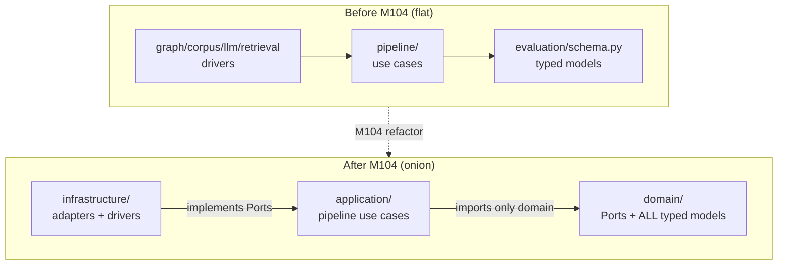
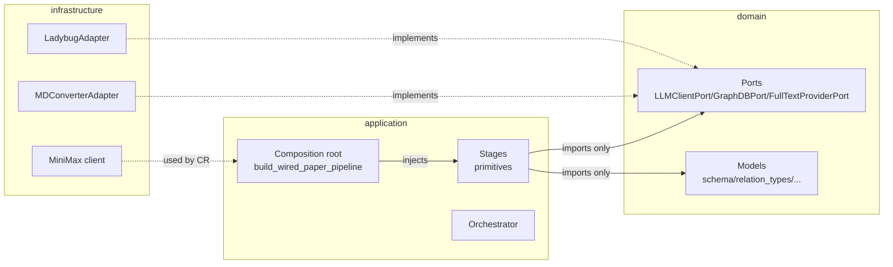
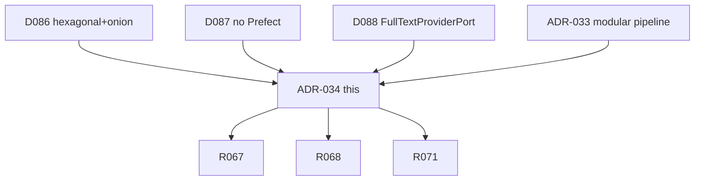
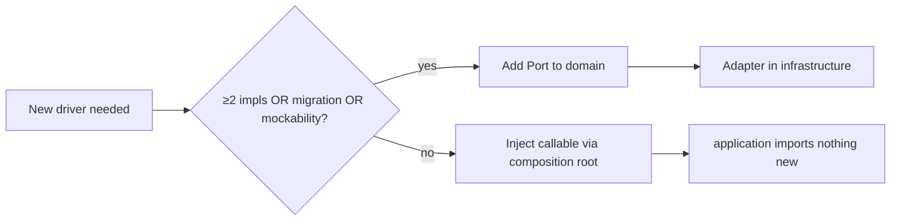
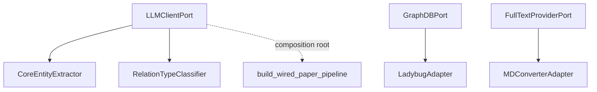

# ADR-034: Hexagonal + Onion Architecture Overlay

**Status:** Accepted (binding)  
**Date:** 2026-06-21  
**Deciders:** collaborative  
**Milestone:** M104-q9tft1  
**Scope:** architecture / layering / ports-adapters / domain-application-infrastructure  
**Binding Level:** binding  
**Revisable:** yes, with implementation evidence

## 0. One-line Decision

> `research_graph` adopts a **hexagonal (Ports/Adapters) + onion (domain ← application ← infrastructure)** layering overlay: typed models and `typing.Protocol` Ports live in `domain/` (the pure Core), the extraction pipeline lives in `application/`, concrete drivers live in `infrastructure/`. A Port is added **only** when at least one of (≥2 implementations, a planned migration, test mockability) holds — the Ponytail Port rule. A multi-layer AST guard (`scripts/verify_onion_layering.py`) and ruff `flake8-tidy-imports` enforce that `domain` and `application` never import infrastructure.

## 1. Context

### Context Map



Before M104 the codebase was **flat**: `evaluation/schema.py` held typed models, `pipeline/` held use cases, and `graph/`/`corpus/`/`llm`/`retrieval` held drivers — with no enforced layering. GitNexus reconnaissance during M104 planning found **zero** Port/Adapter/Protocol classes, no DI container, and direct `application → infrastructure` imports (e.g. `primitives.py` imported `KeywordExtractor` from `retrieval`).

### Conflict Check with Existing ADRs

| Existing ADR | Potential conflict | Resolution |
|---|---|---|
| ADR-033 (modular pipeline) | This ADR relocates ADR-033's `pipeline/` into `application/` and its models into `domain/` | Extends — `application/` IS the ADR-033 pipeline, just physically layered |
| ADR-022 (FalkorDB binding) | Graph migration needs a seam | Compatible — `GraphDBPort` + `LadybugAdapter` make Phase 3 FalkorDB a new Adapter |
| ADR-025 (multi-provider LLM) | LLM needs a seam | Compatible — `LLMClientPort` (MiniMax primary + GLM fallback) |
| ADR-008/009 (hybrid parser) | Full-text providers need a seam | Compatible — `FullTextProviderPort` + `MDConverterAdapter` (D088) |
| ADR-027 (3-lane scheduler) | Orchestrator integration | Compatible — `DispatchProtocol` seam preserved in `application/orchestrator` |
| ADR-017 (queue deferred) | Sync vs queue | Compatible — `SyncDispatch` default, `QueueDispatch` adapter |

**No conflicts.** This ADR layers the existing decisions without changing their substance.

## 2. Decision

### 2.1 Three physical layers

| Layer | Physical packages | Rule |
|---|---|---|
| **domain (Core)** | `domain/` (Ports + `schema`, `relation_types`, `statistical_context`, `extraction_signatures`, `semantic_chunks`, `navigation`) | Depends only on stdlib + itself. NEVER imports application or infrastructure. |
| **application** | `application/` (`types`, `primitives`, `orchestrator`, `profiles`) | Depends on domain + stdlib (+ Adaptix at the LLM JSON boundary). NEVER imports infrastructure. |
| **infrastructure** | `graph/`, `corpus/`, `llm/`, `retrieval/`, `identity/`, `papers/` (logic), `quality/`, `repair/`, `staging/`, `ops/`, `infrastructure/` (adapters) | May import application + domain. Implements Ports. |
| **entry / wiring** | `cli/`, `workflows/`, `scripts/`, `application/profiles` (composition root) | The ONE place infrastructure reaches the application — via injected Ports/callables. |

### 2.2 Ports = `typing.Protocol` in domain

```python
# domain/ports.py
@runtime_checkable
class GraphDBPort(Protocol):
    def init_schema(self) -> None: ...
    def upsert_scientific_kg(self, document, chunks, evidence_paths, patch) -> None: ...

@runtime_checkable
class LLMClientPort(Protocol):
    def extract(self, prompt: str, kind: str, *, context=None) -> dict: ...

@runtime_checkable
class FullTextProviderPort(Protocol):
    def convert_sync(self, arxiv_id: str) -> ConversionResult: ...
```

### 2.3 Port rule (Ponytail override)

A Port is added **only** when at least one holds:
1. ≥2 implementations exist or are planned this milestone, OR
2. a migration is planned (e.g. LadybugDB → FalkorDB), OR
3. mockability is required by the test contract.

Otherwise: concrete-first. **Never add a Port "for symmetry."**

| Port | Justification | Status |
|---|---|---|
| `LLMClientPort` | MiniMax primary + GLM fallback (ADR-025) | ✓ 2 implementations |
| `GraphDBPort` | LadybugDB → FalkorDB migration (Phase 3, ADR-022) | ✓ planned migration |
| `FullTextProviderPort` | MDConverter: arxiv2md/marker/docling backends + fallback (D088) | ✓ 2+ implementations |

### 2.4 Adapters in infrastructure

Adapters implement Ports by delegating to existing driver code (thin wrappers, Ponytail):
- `LadybugAdapter` (infrastructure/graph) → `GraphDBPort`, delegates to `ladybug_client`.
- `MDConverterAdapter` (infrastructure/sources) → `FullTextProviderPort`, delegates to `MDConverter`.

### 2.5 Composition root

`application/profiles/paper.py::build_wired_paper_pipeline(llm_provider, keyword_extractor)` is the single wiring point: it adapts the domain `LLMClientPort` and the infrastructure `KeywordExtractorFn` callable into the application stages via injection. The application stages never import infrastructure — they receive it through this function.

### 2.6 Enforcement

- **`scripts/verify_onion_layering.py`** — AST guard scanning `domain/` and `application/`, failing (exit 1) on any forbidden infrastructure import. Multi-layer: domain must not import application/infra; application must not import infra.
- **ruff `flake8-tidy-imports` (TID)** — selected in `pyproject.toml` for tidy-import checks. (Per-layer `banned-api` is global in ruff and creates false positives on legitimate infrastructure self-imports, so the authoritative layer guard is the AST script.)

## 3. Applies To

- All `research_graph` source code (Phase 2 onward).
- Phase 3 (FalkorDB migration) — adds a `FalkorDBAdapter` implementing `GraphDBPort`, no caller changes.
- Phase 4 (scheduler activation) — `QueueDispatch` already implements `DispatchProtocol`.
- Phase 5+ (universal ingestion, agents) — new domain profiles under `application/profiles`.

### Applicability Diagram



## 4. Requirements and Decisions Impacted

### Requirements

| Requirement | Impact | Notes |
|---|---|---|
| R067 (7-layer pipeline) | implements | `application/` is the pipeline framework |
| R068 (statistical-first) | implements | `application/primitives` StatisticalPreProcessor (keyword_extractor injected) |
| R071 (typed schema) | implements | `domain/schema.py` (moved from evaluation) |

### Decisions

| Decision | Impact | Notes |
|---|---|---|
| D086 | this ADR crystallizes | Hexagonal + Onion + Ponytail |
| D087 | referenced | Prefect rejected, DispatchProtocol seam kept |
| D088 | referenced | PDFParserPort → FullTextProviderPort pivot |
| ADR-033 | extended | pipeline → application, models → domain |
| ADR-022 | seam for | GraphDBPort prepares FalkorDB migration |
| ADR-025 | seam for | LLMClientPort (MiniMax + GLM) |

### R/D Relationship Map



## 5. Options Considered

### Option A — Hexagonal + Onion (chosen)

Physical `domain/`/`application/`/`infrastructure/` packages with Protocol Ports and AST enforcement.

### Option B — Concrete-first (no Ports, no layers)

Keep the flat structure; no Ports, no layering rules.

**Rejected:** FalkorDB migration (Phase 3) would require rewriting call sites; LLM provider swaps would leak through; test mockability requires heavy monkeypatching.

### Option C — Prefect central orchestrator (D087 rejected)

Introduce Prefect as the Central Flow Orchestrator with its own dispatch.

**Rejected (D087):** heavy dependency (server, UI, Dask) duplicating the existing `UniversalKBQueue`; the `DispatchProtocol`/`SyncDispatch`/`QueueDispatch` seam already covers Phase 2 (sync) and Phase 4 (queue). Prefect can be added later as a `PrefectDispatch` adapter without rewriting the Core.

### Option Comparison Snapshot

| Criterion | A: Hexagonal+Onion | B: Concrete-first | C: Prefect |
|---|---|---|---|
| FalkorDB migration cost | New Adapter | Rewrite call sites | Rewrite call sites |
| Test mockability | Inject Fake | Monkeypatch | Mock Prefect |
| New dependency | None | None | Prefect (heavy) |
| Layer enforcement | AST guard + ruff | None | Prefect's own |

## 6. Trade-off Analysis

### Trade-off Summary

| Trade-off | Resolution |
|---|---|
| More files (layers) vs flat | Accepted — the layers make the dependency direction explicit and machine-checkable |
| Back-compat shims (evaluation/__init__, papers/indexing/navigation) | Accepted temporarily — 37+ legacy imports kept green; new code imports from domain |
| Adaptix only at LLM boundary | Preserved (ADR-033 §2.3) — domain uses stdlib dataclasses |
| Port rule overhead | Mitigated by Ponytail — Ports only where justified, not for symmetry |

## 7. Consequences

### Positive

- FalkorDB migration (Phase 3) = new Adapter, not a rewrite.
- LLM provider swaps (MiniMax → GLM) behind `LLMClientPort`.
- Test mockability via Port fakes (FakeGraphDB, FakeLLM, FakeFullTextProvider).
- Architectural drift caught automatically (AST guard in CI).

### Negative

- More packages to navigate (mitigated by `doc/onion-layers.md`).
- Back-compat shims add indirection until legacy imports migrate.

### New obligations

- Every new infrastructure driver must be reachable only through a Port (or injected callable) for the application to use it.
- The AST guard must run in CI/pre-commit.

### What becomes harder

- Adding a quick infrastructure dependency from application is now blocked (intentionally — forces the Port/injection discipline).

### Consequence Flow



## 8. Safety and Non-Authorization

### Safety Gate

This ADR is a **structural overlay** — it changes where code lives and how dependencies point, not what the code authorizes. All §6.3 invariants are preserved unchanged:

1. **Statistical-first** — every LLM stage is preceded by deterministic statistics (the `keyword_extractor` is now injected, not imported, but the stage ordering is unchanged).
2. **Fail-closed** — `safety_flags.import_eligible = False` everywhere; no graph writes without review.
3. **Stable IDs** — unchanged.
4. **No direct extractor → graph write** — unchanged; `LadybugAdapter` still routes through `ladybug_client.upsert_scientific_kg`.
5. **Staged validation** — unchanged.
6. **Schema evolution, not duplication** — `ConversionResult`/`StatisticalContext`/`EvidencePath` moved to domain as canonical home with back-compat re-export shims (no parallel hierarchies).
7. **Adaptix only at LLM boundary** — unchanged.

**Non-authorization:** this ADR does not authorize graph imports, production writes, or fact promotion. The 5 fail-closed flags remain false by default.

## 9. Contract Impact

### Contract Relationship Map



New contracts (Ports): `LLMClientPort.extract(prompt, kind, context)`, `GraphDBPort.init_schema()/upsert_scientific_kg(...)`, `FullTextProviderPort.convert_sync(arxiv_id)`. Existing typed models (`TypedEntity`, `ExtractionPatch`, `EvidencePath`, `PageIndexDocument`) are unchanged in shape — only their import path moved to `domain`.

## 10. Validation / Evidence Required

### Validation Path

| Check | Tool | Status |
|---|---|---|
| domain zero infra imports | `verify_onion_layering.py` AST | ✓ exit 0 (8 files) |
| application zero infra imports | `verify_onion_layering.py` AST | ✓ exit 0 (6 files) |
| Port substitutability | `tests/test_ladybug_adapter_port.py` (9), `tests/test_fulltext_provider_port.py` (10) | ✓ green |
| Pipeline through Ports | `tests/test_onion_layering.py` (6), `tests/test_pipeline_framework.py` (23) | ✓ green |
| Composition root wiring | `build_wired_paper_pipeline(llm_provider, keyword_extractor)` | ✓ green |
| ruff TID clean | `uv run ruff check` | ✓ clean |
| No regression | 99 relevant tests green | ✓ |

## 11. Open Questions

1. When does a 4th Port arrive? (e.g. `EmbedderPort` if a second embedding backend beyond fd/TEI is needed — Phase 4+).
2. When are the back-compat shims (`evaluation/__init__`, `papers/indexing/navigation`) removed? (After all 37+ legacy imports migrate to `domain` — a separate cleanup task, not blocking.)
3. Should the AST guard also check `infrastructure → infrastructure` cycles? (Currently out of scope; infrastructure may freely import other infrastructure.)

## 12. Follow-up Actions

- [x] M104 S01 — Ports + LadybugAdapter
- [x] M104 S02 — FullTextProviderPort pivot (D088) + MDConverterAdapter
- [x] M104 S03 — physical onion refactor (models → domain, pipeline → application, KeywordExtractor injection)
- [x] M104 S04 — this ADR + trajectory guardrail
- [ ] Phase 3 — `FalkorDBAdapter` implementing `GraphDBPort` (new Adapter, no caller changes)
- [ ] Phase 4 — `QueueDispatch` activation (already implements `DispatchProtocol`)
- [ ] Cleanup — remove back-compat shims after legacy imports migrate

## 13. Supersedes / Superseded By

### Supersedes

None. This ADR **supplements** ADR-033 (modular pipeline) by adding the layering overlay; it does not change ADR-033's typed-schema or Adaptix decisions.

### Superseded By

None yet.

## 14. LLM Reading Notes

- **Binding:** Hexagonal (Ports/Adapters) + onion (domain ← application ← infrastructure) as **physical packages**, enforced by AST guard + ruff TID.
- **Port rule (Ponytail override):** add a Port only when ≥2 implementations / planned migration / mockability. All 3 current Ports meet the bar.
- **Layers:** `domain/` (Ports + typed models, pure Core), `application/` (pipeline, imports only domain), `infrastructure/` (adapters + drivers). Entry/wiring (`application/profiles` composition root) is the one place infra reaches the app.
- **D088 pivot:** `PDFParserPort` was removed (single `parse_article` impl — Ponytail rule); replaced by `FullTextProviderPort` (MDConverter, ≥2 backends).
- **D087:** Prefect rejected; `DispatchProtocol`/`SyncDispatch`/`QueueDispatch` seam kept.
- **Enforcement:** `scripts/verify_onion_layering.py` (multi-layer AST, domain+application clean) + ruff `flake8-tidy-imports`.
- **No conflicts** with existing ADRs; extends ADR-033, prepares ADR-022 (FalkorDB) and ADR-025 (LLM) seams.
- **Not authorized:** graph imports, production writes, fact promotion (5 fail-closed flags unchanged).
- **Back-compat:** evaluation/ + papers/indexing shims re-export from domain until legacy imports migrate.
