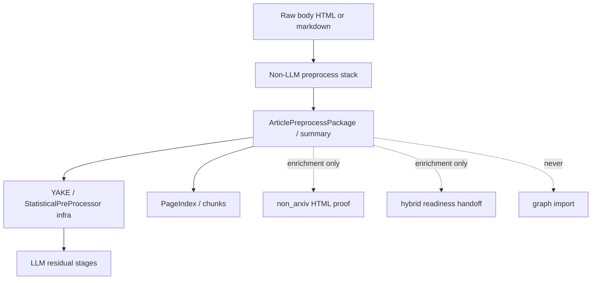

# ADR-036: Non-LLM Article Preprocess Stack

**Status:** Accepted (binding)  
**Date:** 2026-07-23  
**Deciders:** collaborative  
**Milestone:** M229-3ugna8 (implementation M224–M228)  
**Scope:** evidence-pipeline / data-preparation / safety  
**Binding Level:** binding  
**Revisable:** yes, with implementation evidence and onion guard green

## 0. One-line Decision

> We will enrich article skeleton context with a **deterministic non-LLM preprocess stack** (body clean, profile-scoped quality, HTML main-content, language, outline, content fingerprint, keyword spans, term-dense evidence windows) before YAKE/LLM residual stages.  
> We will **not** authorize graph import, hybrid TEI scholarly claims, or placing YAKE inside the application onion ring.

## 1. Context

ADR-024 requires statistical-first pre-processing before every LLM extraction stage. After M213–M223 the operator path had hybrid body gates, scholarly TEI ETL, multi-source catalog, and import-blocked readiness — but **body text still entered YAKE/PageIndex with little deterministic hygiene** (unicode noise, HTML nav boilerplate, no language/outline/fingerprint/local evidence window).

Vendor study (quant-mind clean/outline, yago body hygiene/quality, xberg keyword positions) showed high-value **patterns**, not runtimes to copy. M224–M228 implemented those patterns as pure application modules plus composition enrichment.

### Context Map

## 2. Decision

### We will

1. Maintain a **pure application-layer** preprocess stack under `research_graph.application.corpus` that never imports infrastructure.
2. Build a fail-closed **`ArticlePreprocessPackage`** (`m225-article-preprocess.v1`) and a shared **`preprocess_summary_for_body`** dict for composition.
3. Apply **profile-scoped** body quality: `web` stricter; `scholarly` soft-signals short abstracts (never hard-drop scholarly short text solely for length).
4. Prefer **HTML main-content** extraction (article/main; skip nav/footer/aside) for HTML sources only; do not strip hybrid PDF body via that path.
5. Attach **language**, **outline signals**, **content fingerprint (SHA256)**, **token-frequency content keywords**, **keyword char spans**, and **term-dense evidence windows** as diagnostics.
6. Wire summaries into **non_arxiv HTML proof** (`profile=web`) and **hybrid readiness handoff** (`profile=scholarly` on found `*.hybrid.body.md`) as **enrichment only**.

### We will not

1. Set `import_eligible=true` or `graph_writes_allowed=true` on any preprocess artifact.
2. Let preprocess quality scores change `proof_pass` / `handoff_verdict` (enrichment only).
3. Claim `hybrid_claimed_success` from preprocess or non_arxiv HTML paths.
4. Import **YAKE** or other retrieval drivers into `application/` (YAKE stays in `infrastructure.retrieval`; keywords for spans may be injected or derived via stdlib frequency).
5. Copy quant-mind library sink, yago crawl/search product, or xberg as hybrid replacement.

### This decision authorizes

- Deterministic CPU preprocess modules and composition enrichment fields.
- Schema version bumps on packages/handoffs when fields are additive.

### This decision does not authorize

- Graph import, production FalkorDB writes, fact promotion, or soft-opening SafetyFlags.
- Replacing ADR-008/009 hybrid TEI scholarly path.

## 3. Module Map (binding inventory)

| Stage | Module | Notes |
| --- | --- | --- |
| Body clean | `application/corpus/body_text_clean.py` | unicode/ligatures, whitespace, consecutive line dedupe |
| Quality | `application/corpus/body_quality.py` | profiles `web` \| `scholarly` |
| HTML main-content | `application/corpus/html_main_content.py` | stdlib HTMLParser |
| Package | `application/corpus/article_preprocess.py` | compose clean+quality+language+outline |
| Language | `application/corpus/language_detect.py` | script + stopword heuristic |
| Outline | `application/corpus/outline_signals.py` | ATX + numbered headings |
| Fingerprint | `application/corpus/content_fingerprint.py` | SHA256 custody identity |
| Keyword spans | `application/corpus/keyword_spans.py` | casefold char offsets |
| Term-dense window | `application/corpus/term_dense_window.py` | local evidence snippet |
| Summary | `application/corpus/preprocess_summary.py` | composition JSON summary |
| HTML wire | `workflows/composition/non_arxiv_html_source_proof.py` | enrichment only |
| Hybrid wire | `workflows/composition/hybrid_readiness_handoff.py` | `preprocess_bodies` enrichment only |

## 4. Safety and Layering

- **Onion (ADR-034):** `application` must not import `infrastructure`. Preprocess helpers are pure; YAKE remains infra.
- **Fail-closed:** every package/result type rejects `import_eligible=True` in `__post_init__`.
- **Custody ≠ commitment:** fingerprint and catalog presence are not graph truth.
- **GSD wording:** avoid the word `chrome` in demo/success criteria text (false browser-evidence gate).

## 5. Consequences

- LLM stages receive cleaner body and measurable diagnostics without new LLM cost.
- Multi-source HTML and hybrid scholarly paths share one summary helper with different profiles.
- Future YAKE integration must stay at composition/infra boundary (inject keywords into span locator), not application imports.
- ADR-024 remains binding; this ADR **extends** statistical-first with an earlier non-LLM hygiene layer.

## 6. Action Items

1. Keep preprocess enrichment optional and non-gating for operator verdicts.
2. Prefer additive summary fields over breaking package constructors.
3. Re-run onion guard and targeted preprocess tests on any stack change.
4. Optional later: inject YAKE keyword lists at composition root into `locate_keyword_spans`.

## LLM Reading Notes

- **Binding:** non-LLM preprocess stack exists; import always false; YAKE not in application.
- **Non-authorization:** no graph import; no hybrid TEI claim from preprocess; verdicts not driven by quality scores.
- **Primary code:** `research_graph.application.corpus.*` + two composition wires listed above.
- **Related ADRs:** ADR-024 (statistical-first), ADR-034 (onion), ADR-008/009 (hybrid parser).
