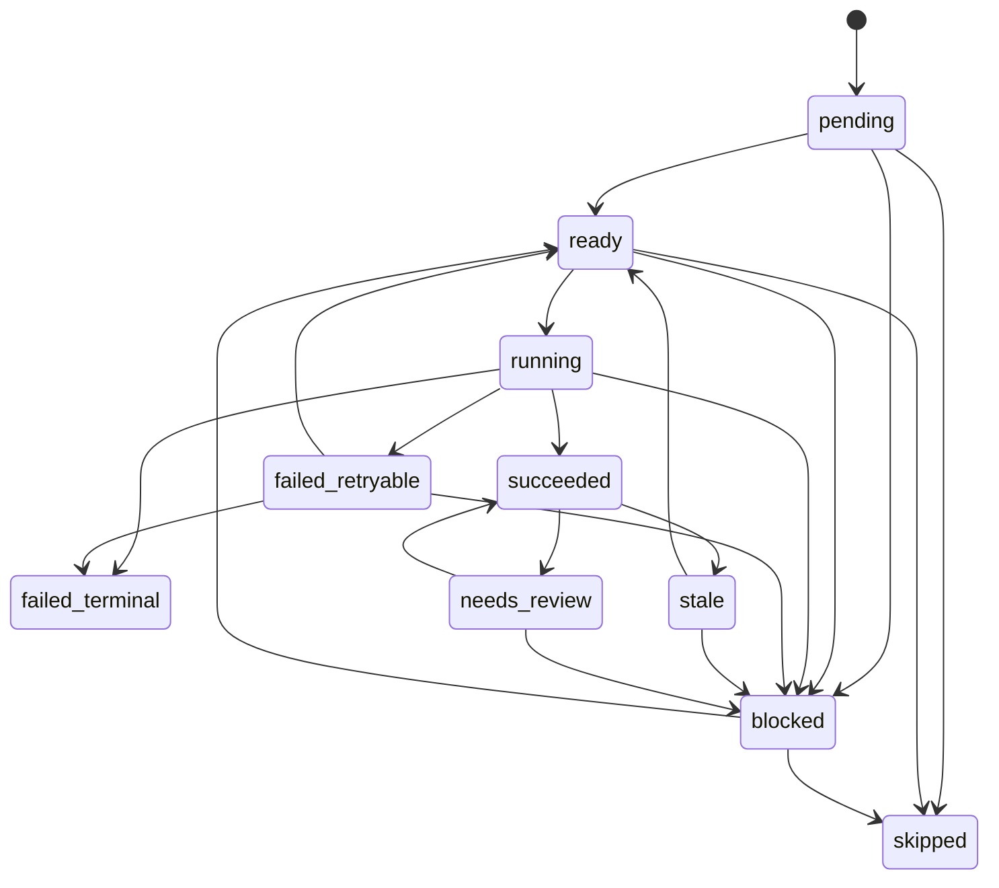

# M034/M035 Universal KB Status Matrix

This file defines the local SQLite durable queue contract for M035. It is a prototype state machine for persisted, inspectable evidence processing state. It is **not** a distributed production queue contract and does not authorize GraphDB writes, LadybugDB writes, production imports, or fact promotion.

## Boundary

- Queue substrate: local SQLite database file.
- Scope: local-first durable prototype for evidence jobs.
- Non-goals: distributed worker orchestration, multi-host shared queueing, production KG import, production GraphDB writes, or LLM/agent approval authority.
- Required SQLite initialization: `PRAGMA journal_mode = WAL`, `PRAGMA foreign_keys = ON`, and `PRAGMA busy_timeout = <configured-ms>`.
- Transaction rule: DB transactions must be short. Claim, heartbeat, complete, fail, block, stale, and event writes occur inside transactions; sidecar execution, model calls, filesystem conversion, and artifact generation occur outside transactions.

## Core Tables

### `jobs`

| Column | Purpose |
|---|---|
| `job_id` | Stable logical job id or idempotency key. |
| `stage` | Pipeline stage, e.g. sidecar candidate, review assistance, or no-write rehearsal. |
| `status` | Current persisted status from the vocabulary below. |
| `priority` | Optional deterministic ordering; higher priority claims first. |
| `attempt_count` | Number of attempts already claimed. |
| `max_attempts` | Maximum attempts before terminal failure. |
| `retry_after` | Earliest timestamp a retryable job may be claimed again. |
| `lease_owner` | Worker/process identity that currently leases the job. Empty unless running. |
| `lease_until` | Timestamp after which the running lease may be reclaimed. |
| `heartbeat_at` | Last timestamp the lease owner reported liveness. |
| `input_refs` | JSON list of safe input artifact references; no raw text or payload values. |
| `input_hash` | Hash of queue-relevant inputs. Drift makes prior output stale. |
| `tool_version` | Version of the tool/adapter/sidecar responsible for the job. Drift makes prior output stale. |
| `contract_version` | Version of the executable contract/schema used by the job. Drift makes prior output stale. |
| `output_paths` | JSON list of expected or produced safe artifact paths. |
| `last_error_code` | Typed failure code; no payload values. |
| `last_error_message` | Redacted diagnostic message; no raw text, secrets, embeddings, or model payloads. |
| `created_at` | Creation timestamp from injected clock. |
| `updated_at` | Last mutation timestamp from injected clock. |

### `job_dependencies`

| Column | Purpose |
|---|---|
| `job_id` | Dependent job. |
| `depends_on_job_id` | Required upstream job. |
| `depends_on_artifact_ref` | Required upstream artifact reference, when dependency is artifact-based. |
| `expected_hash` | Expected upstream hash for stale detection. |
| `required_status` | Status required to unblock the dependent job, usually `succeeded`. |

### `job_events`

`job_events` is required for agent-first observability. Future agents must be able to explain why a job moved, failed, retried, blocked, or was reclaimed without scraping logs.

| Column | Purpose |
|---|---|
| `event_id` | Stable event id. |
| `job_id` | Job affected by the event. |
| `event_type` | `enqueue`, `claim`, `heartbeat`, `complete`, `fail_retryable`, `fail_terminal`, `block`, `unblock`, `stale_input`, `stale_tool`, `stale_contract`, `lease_expired`, `reclaim`, `skip`. |
| `old_status` | Previous status, nullable for enqueue. |
| `new_status` | New status after transition. |
| `reason` | Short redacted reason. |
| `worker_id` | Worker/process identity, when applicable. |
| `error_code` | Typed failure/stale code, when applicable. |
| `created_at` | Event timestamp from injected clock. |

## Status Vocabulary

| Status | Meaning | Allowed next states |
|---|---|---|
| `pending` | Job exists but dependencies have not been satisfied or evaluated. | `ready`, `blocked`, `skipped` |
| `ready` | Dependencies are satisfied and retry gates have opened; worker may claim. | `running`, `blocked`, `skipped` |
| `running` | A worker has a lease. `lease_owner`, `lease_until`, and `heartbeat_at` must be set. | `succeeded`, `failed_retryable`, `failed_terminal`, `blocked` |
| `succeeded` | Output paths were persisted and verified as safe artifacts. | `stale`, `needs_review` |
| `failed_retryable` | Failure can retry after `retry_after`. | `ready`, `failed_terminal`, `blocked` |
| `failed_terminal` | Failure exhausted `max_attempts` or was unrecoverable. | `blocked` |
| `blocked` | Requires missing dependency, user decision, external repair, or upstream completion. | `ready`, `skipped` |
| `stale` | Persisted output is invalid because input/tool/contract drifted. | `ready`, `blocked` |
| `needs_review` | Candidate or review artifact awaits non-agentic review. | `succeeded`, `blocked` |
| `skipped` | Explicitly bypassed with reason. | none |

## Derived Conditions

Some conditions are computed before being persisted as events or transitions.

| Derived condition | Detection | Recovery action |
|---|---|---|
| Expired running lease | `status = running AND lease_until < now` | Emit `lease_expired`; reclaim to `ready` or fail terminal if attempts are exhausted. |
| Missing heartbeat | `status = running AND heartbeat_at` older than policy threshold | Emit diagnostic event; do not assume success. |
| Input drift | Stored `input_hash` differs from current input hash. | Emit `stale_input`; transition `succeeded`/`ready` output to `stale` or enqueue replacement. |
| Tool drift | Stored `tool_version` differs from current tool version. | Emit `stale_tool`; transition to `stale` or replacement job. |
| Contract drift | Stored `contract_version` differs from current contract version. | Emit `stale_contract`; transition to `stale` or replacement job. |
| Retry gate closed | `retry_after > now` | Job is not claimable. |
| Attempts exhausted | `attempt_count >= max_attempts` | Next failure becomes `failed_terminal`. |

## State Diagram

## Required Operations

| Operation | Required behavior |
|---|---|
| `initialize` | Create tables and indexes; apply WAL, foreign keys, and `busy_timeout`. |
| `enqueue` | Idempotently insert or refresh a logical job using `job_id`, `input_hash`, `tool_version`, and `contract_version`; emit `enqueue`. |
| `claim` | Atomically move one claimable job to `running`, set `lease_owner`, `lease_until`, `heartbeat_at`, increment `attempt_count`, and emit `claim`. |
| `heartbeat` | Extend `lease_until`, update `heartbeat_at`, require matching `lease_owner`, and emit `heartbeat`. |
| `complete` | Persist safe output paths, move to `succeeded`, clear lease fields, and emit `complete`. |
| `fail_retryable` | Persist redacted failure fields, set `retry_after`, clear lease fields, move to `failed_retryable`, and emit `fail_retryable`. |
| `fail_terminal` | Persist redacted failure fields, clear lease fields, move to `failed_terminal`, and emit `fail_terminal`. |
| `block` | Move to `blocked` with a typed reason and emit `block`. |
| `unblock` | Re-evaluate dependencies/retry gates, move to `ready` when safe, and emit `unblock`. |
| `reclaim_expired_leases` | Find expired running leases, emit `lease_expired`, then move to `ready`/`failed_terminal` according to attempts and policy; emit `reclaim`. |
| `mark_stale` | Detect input/tool/contract drift, move affected jobs/artifacts to `stale`, and emit one of `stale_input`, `stale_tool`, or `stale_contract`. |
| `inspect` | Return job rows plus event history without raw payloads or secrets. |

## Indexes and Constraints

- Primary key on `jobs(job_id)`.
- Foreign keys from `job_dependencies.job_id` and `job_events.job_id` to `jobs(job_id)`.
- Index on claimable jobs: `(status, retry_after, priority, created_at)`.
- Index on lease recovery: `(status, lease_until)`.
- Index on stale detection keys: `(input_hash, tool_version, contract_version)`.
- Event ordering index: `(job_id, created_at)`.
- Status values must be constrained to the vocabulary above.

## Safety Invariants

- No operation may set `graph_import_allowed`, `production_import_attempted`, `graphdb_written`, or `ladybugdb_written` to true.
- No queue operation may write to GraphDB, LadybugDB, or a production import surface.
- `output_paths` are references to safe artifacts, not payload dumps.
- `last_error_message` and event `reason` must be redacted diagnostics only.
- LLM/tool helper traces may be persisted only as sanitized diagnostic evidence and never as approval, import, or promotion authority.
- The queue can mark evidence as ready for local review steps, but it cannot promote candidates to trusted KG facts.

## Verification Contract

S03 must prove this matrix with unit tests that use injected timestamps rather than sleeps:

- duplicate enqueue is idempotent;
- claim is exclusive;
- heartbeat extends a matching lease and rejects a mismatched owner;
- expired leases are reclaimed deterministically;
- retry_after gates claimability;
- max_attempts causes terminal failure;
- blocked dependencies prevent claim;
- input_hash, tool_version, and contract_version drift produce stale transitions/events;
- event history explains each transition;
- no GraphDB/import/write authorization appears in queue rows, events, or serialized inspections.
